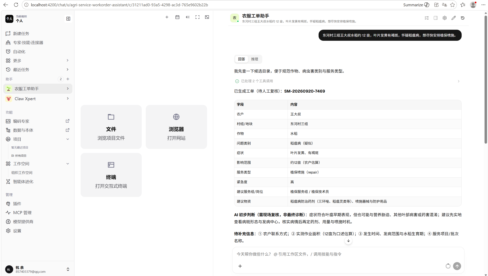
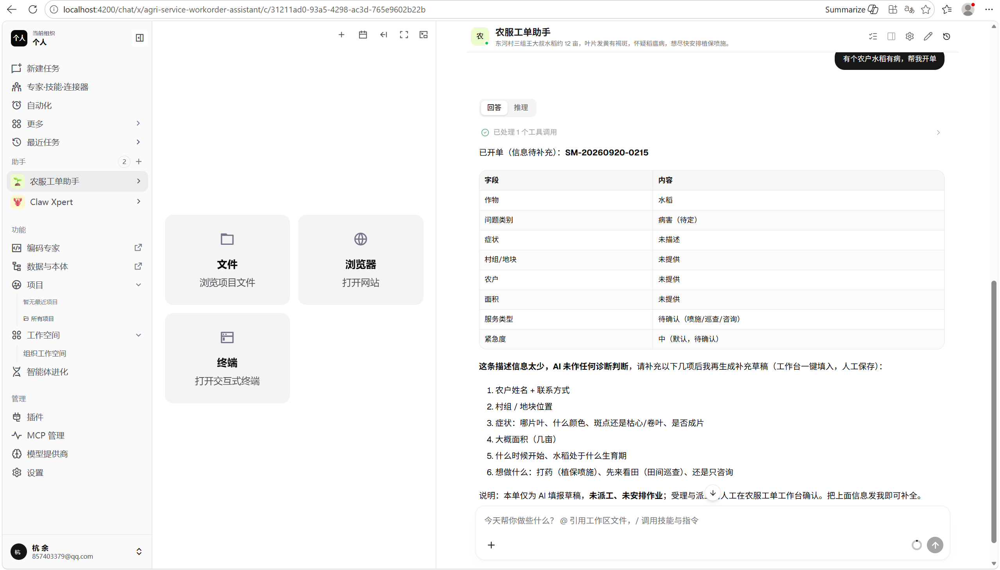

# 农服工单智能填报

Xpert Agentic App 插件：把农户电话/微信里的农服需求转成可复核的结构化工单。

包名：`@xpert-ai/plugin-agri-service-workorder`  
功能分支：`feat/workorder-agentic-app`

## 产品说明

| 项 | 内容 |
| --- | --- |
| 目标用户 | 乡镇农技员、农服调度文员 |
| 原有方式 | 听完口述后手工在系统填作物、地块、病虫害、服务类型等字段，慢且易漏 |
| 业务流程 | 自然语言描述 → AI 提取并保存待确认工单 → 对话/工作台查看结果 → 缺信息待补充并可继续补全 → 人工确认后持久化 |
| 关键页面 | ① 助手对话输入农服需求 ② AI 回传结构化工单表 ③ 待补充提示与重试补全 |
| AI 作用 | 字段抽取、完整度提示、派单/物资建议；确认/结案/驳回保留给人 |
| 功能取舍 | 不做真实派工系统对接、农户门户、附件上传、复杂权限与多智能体 |

更细材料见 [docs/product.md](docs/product.md)。

## 架构与实现

参考 `community/apps/smart-maintenance` 的 Agentic App 分层，改为农服语义与独立包名：

- Agent middleware tools：保存 / 查询 / 补充工单
- View provider + remote iframe：农服工作台（本地 Chat 宿主下工作台激活仍有平台限制，见已知限制）
- TypeORM：工单与操作日志
- Assistant template：`农服工单助手`

字段仍使用通用工单列（如 `customerName`、`deviceType`），在助手提示与界面文案中映射为农户、作物、病虫害等。

### 工具

- `agri_service_save_generated_work_order`
- `agri_service_get_catalog`
- `agri_service_search_work_orders`
- `agri_service_get_work_order_detail`
- `agri_service_prepare_supplement_draft`
- `agri_service_import_service_data`（可选）

## 运行说明

### 环境要求

- 本地 Xpert 开源版（source-hybrid），Postgres + Redis/Memurai
- Node.js / pnpm 以各仓库配置为准
- 已配置可用 LLM（本项目实测 DeepSeek）
- `.env` 中允许本地插件工作区，例如：

```env
PLUGIN_WORKSPACE_ROOTS=D:/project/xpert;D:/project/xpert-plugins/community
```

凭证只放平台「模型提供商」配置，**不要**写入仓库。

### 构建与测试

在 `community/`：

```sh
pnpm install
pnpm --filter @xpert-ai/plugin-agri-service-workorder build
pnpm --filter @xpert-ai/plugin-agri-service-workorder test
```

### 安装与使用

1. 在 Xpert「插件」→「从本地工作区安装」
2. 包名：`@xpert-ai/plugin-agri-service-workorder`
3. 路径：`<本仓库>/community/apps/agri-service-workorder`
4. 安装后点「初始化」，用模板创建并发布「农服工单助手」
5. 对话中发送农服需求，确认生成工单；再发一句不完整需求验证待补充

也可用宿主：

```sh
corepack pnpm plugin:deploy:local \
  --plugin-dir <本仓库>/community/apps/agri-service-workorder \
  --scope organization --org-id <组织ID> --api-url http://localhost:3000
```

## 运行截图

### 1. 用户输入完整需求 → AI 生成待确认工单

自然语言描述经真实 DeepSeek 调用后，工具保存工单 `SM-20260920-7469`（待人工复核），并展示结构化字段。



### 2. 信息不完整 → 待补充（失败/重试场景）

仅说「有个农户水稻有病，帮我开单」时，生成待补充工单 `SM-20260920-0215`，并列出需补字段，可继续对话补全后重试。



## 验证结果

| 检查 | 结果 |
| --- | --- |
| `pnpm build` / `pnpm test`（tsc） | 通过 |
| 本地安装插件并初始化 | 通过 |
| 模板创建「农服工单助手」并发布 | 通过 |
| 真实 DeepSeek 生成待确认工单 | 通过（见截图 1） |
| 缺信息待补充 / 可继续补全 | 通过（见截图 2） |
| 刷新后可按工单号在对话历史中找回 | 通过 |
| 工作台 iframe 人工点选保存 | 未完全验收（Chat 宿主下 `agri_service__workbench` 曾 404；对话链路已覆盖查看结果） |

详见 [docs/validation.md](docs/validation.md)。

## AI 协作说明

开发使用 Cursor（Composer）辅助：从 JD/选题 → 本地平台 → 基于 `smart-maintenance` 改造农服插件 → 安装验证。代表性决策包括：用农服语义映射复用成熟工单骨架以控制 2–6 小时范围；工作台激活失败时优先保证对话闭环可演示。详见 [docs/ai-collaboration.md](docs/ai-collaboration.md)。

## 基线与测试版本

| 仓库 | 基线 / 测试 SHA |
| --- | --- |
| `xpert-ai/xpert`（本地测试） | `2b5756576af0f5aa9faa8e404e153fb4cd50482a` |
| `xpert-ai/xpert-plugins` upstream main（分支起点） | `569512a2a316631b19e1933fff9561b470b8b2d1` |

## 已知限制

- 未对接真实农服派工 / ERP
- 主数据导入为演示级
- Chat 宿主下固定工作台视图激活不稳定（已尽量放开 `requiredFeatures`；人工确认主要在对话结果上完成）
- 字段物理列名仍为通用工单命名，靠提示词与 UI 文案承载农服语义

## 许可与复用

- License: AGPL-3.0
- 结构参考：`community/apps/smart-maintenance`（官方示例）；已改为农服业务、独立包名与助手模板
