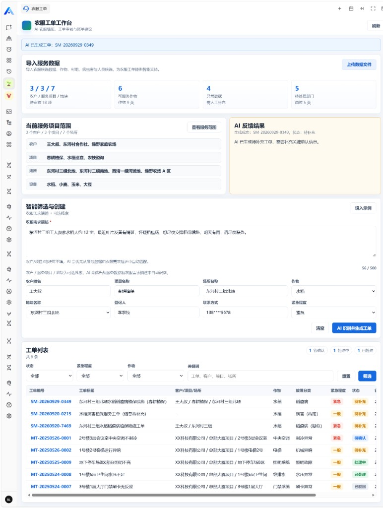
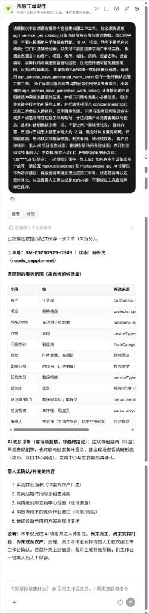
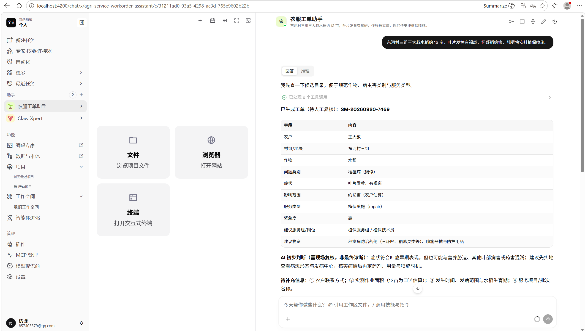
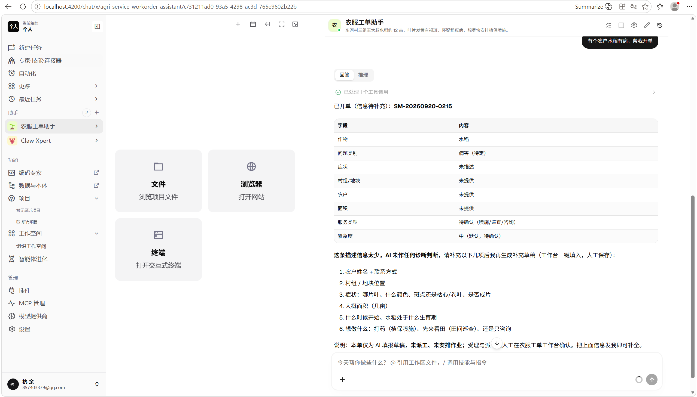

# 农服工单智能填报

Xpert Agentic App：把农户电话/微信里的农服需求转成可复核的结构化工单。

包名：`@xpert-ai/plugin-agri-service-workorder`  
PR：https://github.com/xpert-ai/xpert-plugins/pull/681

## 面试材料（任务书交付项）

| 内容 | 文档 |
| --- | --- |
| 用户、痛点、业务流程、关键页面与功能取舍 | [产品说明](docs/interview/01-product.md) |
| 环境、构建、安装、配置与操作 | [运行说明](docs/interview/02-runbook.md) |
| 验证与未验收部分 | [验证记录](docs/interview/03-validation.md) |
| AI 工具协作与取舍 | [AI 协作说明](docs/interview/04-ai-collaboration.md) |
| 基线 SHA、许可、复用与 Git | [来源与交付](docs/interview/05-sources.md) |
| 任务书对照、已知限制与演示顺序 | [交付缺口](docs/interview/06-gaps-and-pr.md) |

部署登录环境变量示例（无真实密钥）：[deploy.env.example](docs/interview/deploy.env.example)

## 实际运行截图

以下为本地 Xpert + DeepSeek 真实运行截图（相对路径）。含绑定助手的 **插件工作台视图** 与对话路径。

### 1. 工作台全貌（关键页面 / 用户输入 / 工单列表）

`?view=agri_service__workbench`：导入与候选范围、农服需求填报、AI 反馈，以及下方工单列表同屏。



### 2. AI 结果与待补充（异常场景）

助手对话中真实调用工具后生成工单 `SM-20260929-0349`，状态「待补充」，含结构字段、初步诊断与需人工确认项。



### 3. 对话路径补充（早期验证）

完整需求 → 待确认；缺信息 → 待补充并可继续补全：





## 架构摘要

参考 `smart-maintenance` 分层，改为农服语义：Agent middleware tools、TypeORM 工单表、Assistant 模板、Workbench remote component（`agri_service__workbench`）。

主要工具：`agri_service_save_generated_work_order`、`agri_service_get_catalog`、`agri_service_search_work_orders`、`agri_service_get_work_order_detail`、`agri_service_prepare_supplement_draft` 等。

打开工作台：`/chat/x/agri-service-workorder-assistant?view=agri_service__workbench`

## 快速构建

```sh
cd community
pnpm install
pnpm --filter @xpert-ai/plugin-agri-service-workorder build
pnpm --filter @xpert-ai/plugin-agri-service-workorder test
```

完整安装与六步核对见 [运行说明](docs/interview/02-runbook.md)。

## 许可与复用

- License: AGPL-3.0  
- 结构参考：`community/apps/smart-maintenance`；已改为农服业务与独立包名（见 [来源](docs/interview/05-sources.md)）
