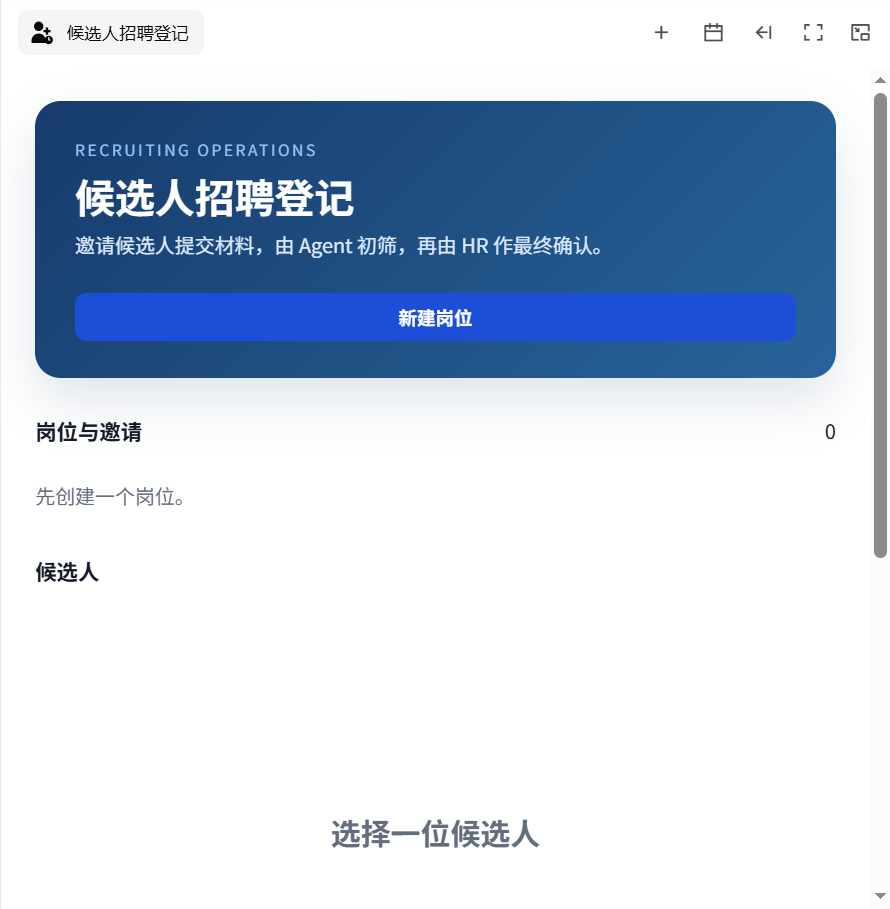
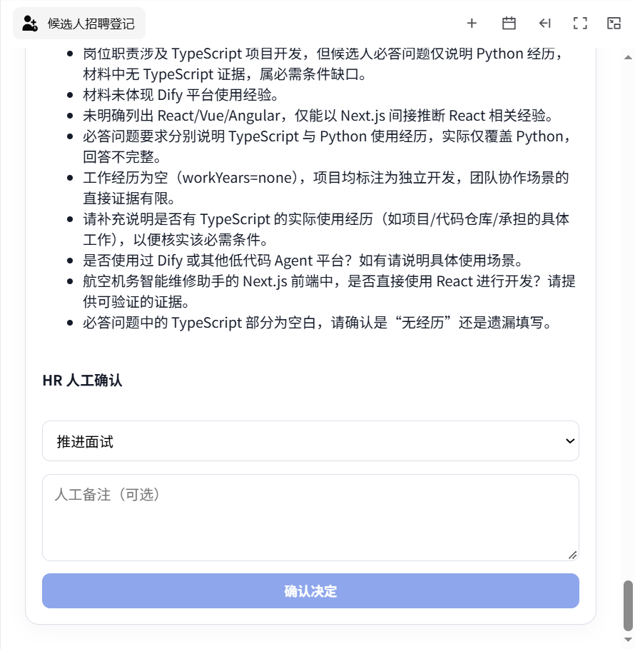
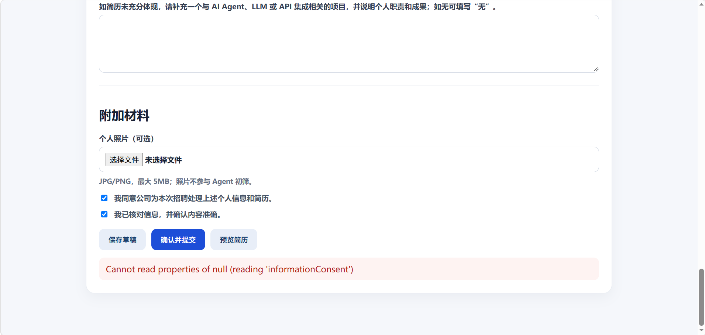

# Candidate Intake Agentic App

Candidate Intake 是面向 HR 的 Xpert 招聘业务应用，用统一工作台连接岗位创建、候选人材料登记、AI 证据化初筛和人工决策。它解决了简历信息重复录入、筛选依据难以追溯、模型结论越权替代人工判断等问题。

## 核心流程

1. HR 创建岗位，配置候选人可见介绍、内部必需条件、加分条件和补充问题。
2. 系统生成具有有效期的候选人邀请链接；数据库只保存令牌的 SHA-256 摘要。
3. 候选人优先上传文字型 PDF 简历，系统提取可识别信息并预填表单，候选人核对后提交。
4. Xpert Assistant 通过受控工具读取岗位条件与候选人材料，逐条生成带证据的结构化初筛结果。
5. HR 查看证据并选择“推进面试”“待补充信息”或“暂不推进”。AI 只提供建议，不作最终录用决定。



## 功能与工作量

- 7 个候选人业务接口，覆盖岗位、邀请、材料登记、提交、筛选和人工确认。
- 5 个 HR 工作台动作和 3 个 Agent 工具，形成 UI、服务、模型与数据库的完整调用链。
- 9 种申请状态，覆盖草稿恢复、链接过期、PDF 解析失败、AI 初筛失败与重试、人工确认及重新开放。
- 文字型 PDF 解析与候选人信息预填；候选人可以核对和修正全部结构化字段。
- PostgreSQL 持久化与组织/租户隔离，支持页面刷新及服务重启后的状态恢复。
- 23 项自动化断言覆盖核心服务流程、表单顺序、异步提交安全和筛选失败重试。

| 岗位配置 | HR 审核与决策 |
| --- | --- |
|  |  |

系统将可恢复故障保留为明确状态，HR 可以重试，无需重建岗位或要求候选人重新提交。



## 安全与隐私

- 邀请令牌使用 256 位随机值，数据库仅保存 SHA-256 摘要和诊断用短提示。
- 候选人公共接口不会返回内部筛选条件、Agent 初筛结果或 HR 决定。
- 简历限制为 10 MiB 以内的有效 PDF；照片仅接受 5 MiB 以内的 JPG/PNG。
- 照片为可选材料，不进入 Agent 上下文，也不参与初筛。
- 提交后的申请默认锁定，只有 HR 明确重新开放后才能继续修改。
- 初筛提示要求缺少证据时标记为 `not_evidenced`，禁止猜测，并排除照片及受保护个人特征。

数据处理范围、保留与部署方责任见 [隐私说明](docs/privacy.md)。架构、状态机和验收步骤见 [技术说明](docs/overview.md)。

## 本地构建

要求 Node.js 20、pnpm、PostgreSQL，以及可运行的 Xpert 平台。插件本身不需要制作独立 Docker 镜像；完整平台联调可沿用 Xpert 仓库的 Docker 基础设施。

在 `xpert-plugins` 根目录执行：

```bash
pnpm install
pnpm --filter @xpert-ai/plugin-candidate-intake build
pnpm --filter @xpert-ai/plugin-candidate-intake test
pnpm --filter @xpert-ai/plugin-candidate-intake verify:dist
pnpm check:plugin-entity-tables
node plugin-dev-harness/dist/index.js --workspace ./community --plugin @xpert-ai/plugin-candidate-intake
```

远程组件可以通过仓库预览器单独检查：

```bash
node tools/remote-view-preview/cli.mjs \
  --config community/apps/candidate-intake/src/lib/remote-components/candidate_intake__hr_workbench/preview.config.mjs \
  --port 4421
```

浏览器访问 `http://127.0.0.1:4421/`。完整业务验证仍需运行 Xpert、PostgreSQL，并为组织配置主模型。

## 验证记录

已在本地 Xpert 环境完成以下验证：

- 岗位创建、邀请生成、PDF 上传、候选人提交、Agent 初筛和 HR 决策的端到端流程。
- 真实主模型推理调用、严格结构化结果保存，以及页面刷新后的状态恢复。
- 初筛工具参数异常后的 `screening_failed` 状态和人工重试恢复。
- 服务 smoke test（23 项断言）、远程组件 TypeScript 类型检查和远程组件独立构建。
- `verify:dist` 产物完整性检查和插件实体表命名检查。
- `plugin-dev-harness` 生命周期验证，包括插件加载、Nest 容器初始化和正常关闭。

当前受限 Windows 执行环境使用 Node.js 24，Node 调用 `esbuild` 子进程会被系统以 `spawn EPERM` 拒绝，服务端全量 TypeScript 检查也存在异常耗时。最终 PR 提交前仍应在干净的 Node.js 20 环境执行上方完整 `build` 与 `test`，并以命令退出码作为发布验收依据。

## 模型配置

插件不保存模型名称、供应商密钥或固定模型 ID。Xpert 在应用初始化时要求选择组织主模型，招聘 Assistant 使用该模型执行初筛，因此更换兼容供应商无需修改插件代码。

## AI 协作说明

开发过程中使用 AI 辅助需求拆解、界面文案、测试场景整理和代码审查。业务边界、数据结构、工具契约、错误恢复路径与最终代码均经过人工核对；核心流程使用真实 Xpert 环境、数据库和模型调用验证。AI 未用于生成或伪造候选人判断依据。

## 已知限制

- 仅支持含可提取文字的 PDF；扫描件需要额外 OCR 服务。
- 简历预填采用确定性文本提取，复杂双栏或非常规排版可能需要候选人修正。
- AI 初筛质量取决于组织主模型、岗位条件清晰度和候选人材料完整性。
- 当前不包含邮件/短信发送、面试日程和 ATS 外部同步。
- Windows 本地构建可能受 Node 子进程权限或路径差异影响，建议以 Node.js 20 的标准 PowerShell、WSL 或 Linux CI 作为最终构建环境。

## 基线与许可

- Xpert 平台：`182f2f4a7d05d968016a9ec20a93833687c4394f`
- xpert-plugins：`03de3fefa289fb32e9f53c967a1427ba07f1be0e`
- 源码仓库：[xpert-ai/xpert-plugins](https://github.com/xpert-ai/xpert-plugins/tree/main/community/apps/candidate-intake)
- 许可：AGPL-3.0，与仓库许可保持一致。
