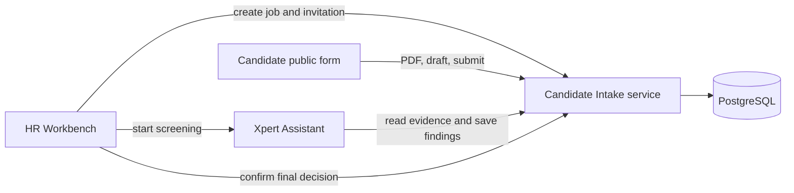

## Architecture

The system-level plugin registers two TypeORM entities, public token-scoped candidate routes, an authenticated HR Workbench View, Agent middleware tools, and an Assistant template.



The PDF prefill path is deterministic extraction and remains editable. The Agent path is the AI part of the application: it receives the candidate text and hidden criteria through scoped tools, evaluates each criterion, and saves structured evidence. The configured Xpert primary model is used; the plugin contains no model API key or fixed model identifier.

## Security boundaries

- Invitation tokens contain 256 bits of randomness. Only a SHA-256 token hash and an eight-character diagnostic hint are stored.
- Candidate routes are scoped only by a valid, unexpired token and never return required criteria, preferred criteria, screening output, or HR decisions.
- HR and Agent operations use the tenant and organization scope from the authenticated Xpert host context.
- Resume and photo bytes use `select: false`. Agent context includes resume text but excludes photo metadata and bytes.
- Uploaded resumes must have PDF MIME type, `.pdf` extension, and a `%PDF-` header. The limit is 10 MiB.
- Candidate photos accept JPG or PNG only and are limited to 5 MiB.
- Submitted records are locked. HR can explicitly reopen a record when corrections are required.

## State flow

```text
invited → draft → submitted → screening → pending_review → confirmed
            ↘ parse_failed       ↘ screening_failed ── retry ──┘
invited/draft/parse_failed → expired
confirmed/pending_review → draft (HR reopens)
```

Screening uses `met`, `partially_met`, and `not_evidenced`. Missing information must remain `not_evidenced`; the Agent prompt explicitly prohibits guessing and excludes candidate photos and protected personal traits.

## Platform acceptance

1. Build the plugin and run `verify:dist`.
2. Run the service smoke test, remote TypeScript check, entity table-name check, and plugin lifecycle harness.
3. Install the plugin in the Xpert platform at the recorded platform SHA.
4. Configure an organization primary model and initialize the Candidate Intake app.
5. Create a job and invitation. Confirm that internal criteria do not appear on the candidate page.
6. Test a valid text PDF, a non-PDF upload, an image-only PDF, draft recovery, an expired link, and a successful submit.
7. Run Agent screening, verify evidence for each criterion, force one recoverable Agent failure, retry, and record each HR decision option.
8. Restart the platform and verify that the job, application, screening result, and HR decision persist.
9. Capture screenshots of the installed HR workbench, candidate form, screening result, final decision, and recoverable error state.

Docker is required for the repository's installed-platform stack. Local remote-component preview validates the bridge and View independently but does not replace the installed-platform acceptance steps.
