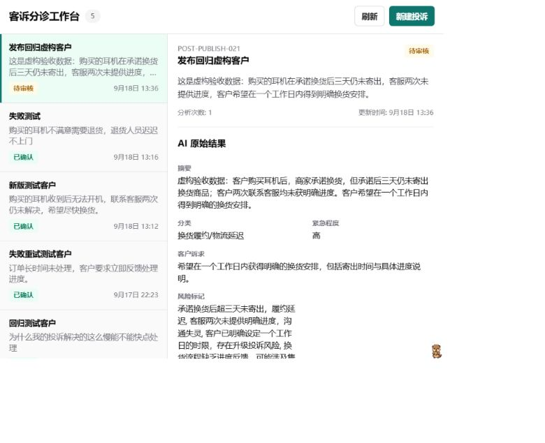
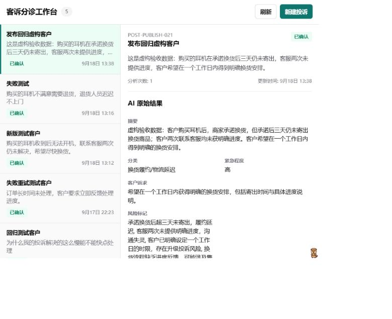
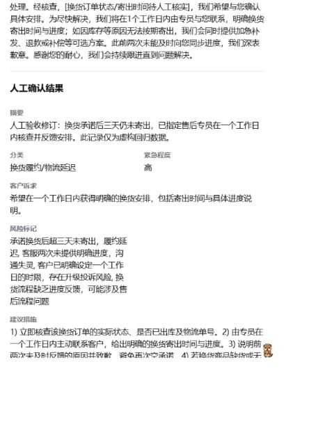
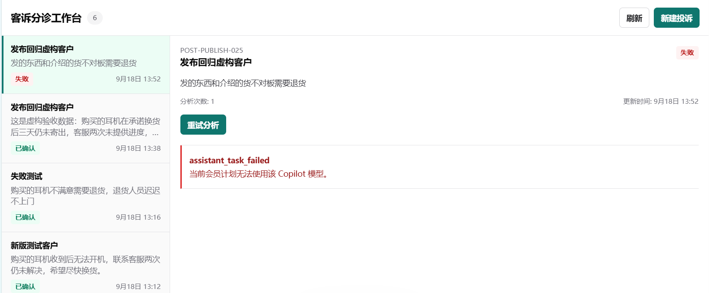

# Complaint Triage Workbench

An independent Xpert Agentic App for customer-service specialists and complaint supervisors. It persists a `ComplaintCase`, asks the host Xpert Assistant to produce structured triage recommendations, and keeps the final business decision under human control.

Customer-service staff otherwise read complaint narratives, summarize the issue, decide urgency, draft a reply, and record a disposition manually. This MVP collects those steps around one saved case: AI proposes a consistent seven-field review, while a person edits and confirms the business result. These are intended workflow benefits, not measured customer outcomes.

See [product scope and page wireframes](docs/product.md), [AI collaboration](docs/ai-collaboration.md), and [reference sources and reuse](docs/source-reuse.md). Source: [the submission branch](https://github.com/Darlingair1/xpert-plugins/tree/feat/complaint-triage-workbench/community/apps/complaint-triage-workbench).

## Business workflow

```text
Create complaint
-> DRAFT
-> Analyze with AI
-> PROCESSING
-> PENDING_REVIEW
-> edit and confirm
-> CONFIRMED
```

If model execution or structured result submission fails, the same case moves to `FAILED`. `Retry` creates a new attempt on that existing case; it does not create a second business record. Stale attempt results are rejected.

The AI result contains:

- `summary`
- `category`
- `urgency`
- `customerIntent`
- `riskFlags`
- `suggestedAction`
- `replyDraft`

`aiOriginalResult`, `humanDraftResult`, and `humanConfirmedResult` are stored separately so human edits never overwrite the original AI recommendation.

## Architecture

- `ComplaintCaseEntity`: TypeORM persistence using the plugin artifact namespace.
- `ComplaintCaseService`: scoped CRUD and atomic state transitions.
- `ComplaintAssistantTaskService`: starts and reconciles host Assistant tasks.
- `ComplaintTriageTools`: validates structured AI output and writes it to the current analysis attempt.
- `ComplaintTriageViewProvider`: exposes Workbench data and business actions.
- Remote Component: list, empty state, create, analyze, review, confirm, failure, Retry, and reload UI.
- Assistant Template: binds the `complaint_triage` middleware and the fixed Workbench view.

Business records are isolated by tenant and, when present, organization. The UI reloads records through the host bridge and does not use Web Storage as persistence.

## Real Xpert screenshots

These are real-platform captures using fictitious complaint data, not Remote View Preview mocks. Account surroundings were cropped; business values were not changed. Live acceptance used the locally patched Windows host described below. [Screenshot provenance](docs/evidence/README.md) and [the acceptance record](docs/acceptance.md) distinguish user confirmation, browser observations and automated checks.

### Complaint input and AI triage

The saved POST-PUBLISH-021 complaint and its AI original are visible in PENDING_REVIEW. All seven fields were inspected live; not all fit in this crop.



### Human confirmation and recovery

After saving a human edit, confirming and refreshing, the same case is CONFIRMED and its AI original remains unchanged.



The continuation below shows the separately stored human final result, including the edited summary. Its case reference is above the viewport; read it with the preceding capture and execution record.



### Failure and Retry control

The user-provided POST-PUBLISH-025 capture shows FAILED, one attempt, a readable host Copilot-plan error and Retry. It does not prove recovery for this case. Original-case Retry acceptance was separately user-confirmed for RETRY-021; these are not one case's before/after sequence.



## Local verification

Run from the `xpert-plugins` checkout root. The community workspace uses pnpm `8.15.8` through Corepack. Node, Corepack, and workspace dependencies must already be available.

The Complaint filtered install/build/test path was verified in a fresh community source copy; see [workspace-verification.md](docs/workspace-verification.md). This is not a full-workspace or unmodified-host acceptance result. The separate standalone dependency-isolation check is in [clean-install.md](docs/clean-install.md). App packageExtensions apply to standalone installation, not workspace-root configuration; the verified workspace resolves missing SDK/contracts imports through existing root dependencies.

```powershell
Set-Location community
corepack pnpm install --filter @xpert-ai/plugin-complaint-triage-workbench --ignore-scripts
corepack pnpm --filter @xpert-ai/plugin-complaint-triage-workbench build
corepack pnpm --filter @xpert-ai/plugin-complaint-triage-workbench test

node scripts/check-entity-names.mjs
Set-Location ..
node plugin-dev-harness\dist\index.js --workspace .\community --plugin @xpert-ai/plugin-complaint-triage-workbench
```

The lifecycle Harness uses host mocks. A successful Harness run proves that the built plugin registers, starts, stops, and resolves its NestJS dependencies; it does not prove real model execution, PostgreSQL persistence, or the end-to-end Xpert UI flow.

`build` includes TypeScript checking. The package has no separate lint script. On this Windows workspace, the existing dependencies require adding the sibling Xpert `node_modules/.bin` directory to `PATH` for `tsc`; this is a local fallback, not proof of a clean dependency installation.

## Validation status

Baselines: Xpert `main` at `182f2f4a7d05d968016a9ec20a93833687c4394f`; plugins local `upstream/main` at `759e5a547d39f53dbafc7c58642936ebb104f121`. Plugin implementation commit: `4a115e6f398a1e6f16494c895ec0f8b0493293be`, on `feat/complaint-triage-workbench`. Its exact committed source/build inputs were rebuilt and passed 27 tests plus mock-backed Harness. Subsequent delivery-doc commits do not change business code. The local platform contains separate Windows compatibility changes; verification must not be described as an unmodified upstream-main run.

- Direct TypeScript build and asset copy: passed for the local hardening revision `0.2.1` on 2026-09-18.
- Automated tests: 27 passed. Coverage includes scoped reads/writes, missing identity, concurrent analyze/Retry, stale and repeated Tool writes, invalid output, repeated confirmation, task failure/interruption, immediate and persisted error redaction, internal-only Tool registration, built UI assets, cross-organization state writes, View input/scope validation, and empty state.
- Plugin lifecycle Harness: passed for `0.2.1` with mocks enabled.
- Plugin Entity table-name check: passed.
- Package dry run: passed; includes runtime JS/types, UI JS/CSS, Assistant YAML, README, and acceptance documentation. No archive was generated or published.
- Scoped audit: no trailing whitespace, JWT/long `sk-` shaped secrets in source/docs, or absolute developer paths in build output were found. This pattern scan is not a comprehensive security review.
- Remote View Preview: create, analyze, edit, confirm, failed-case Retry, and reload were exercised; the case count stayed constant across Retry, and the 375 px layout had no horizontal overflow.
- Real Xpert plugin load: host API confirmed `0.2.1`, `loaded`, `system:global`, source `code`.
- Real platform business workflow: user confirmed creation, real AI structured writeback, human editing/confirmation, refresh recovery, and failure/Retry without duplicate cases for `0.2.1`. Live inspection additionally showed confirmed `RETRY-021` with two attempts. After prompt publication, an agent-operated browser regression created the fictitious `POST-PUBLISH-021`, received all seven AI fields in PENDING_REVIEW, saved a changed human summary, refreshed the review draft, confirmed, and refreshed again with both original AI and human final values preserved. This intentionally added one case (four -> five); existing cases were not modified. These are real-platform browser/manual results, not an automated PostgreSQL/model integration suite.
- Ordinary-chat prompt regression: passed on a new real-model conversation after the existing Assistant's main prompt was synchronized and published. The reply points to the workbench, supplies no business confirmation, and explicitly says internal identifiers are automatic. Model, middleware, Workbench, and Assistant identity were preserved; template upgrades alone do not update published Assistants.
- Workspace-wide App storage check: failed on unrelated Drawio and Story Studio files. The complaint UI's scoped no-Web-Storage check passed; no unrelated plugin was changed.
- Clean single-package dependency-isolation check: after Dockyard-aligned metadata correction and user installation, isolated build, all 27 tests and mock-backed lifecycle Harness passed on 2026-09-18. Own TypeScript/runtime dependencies were used, without sibling bin fallbacks. Earlier import failures remain recorded. Upstream ChatKit/Core peer mismatch and workspace-root extension scope remain disclosed; this is not a clean entire-workspace/platform installation or new real-model/database test. See [isolated verification record](docs/clean-install.md). Live dependencies were preserved; generated locks remain outside the repository.
- Fresh community source-copy Complaint verification: user installation, filtered build, 27/27 tests, mock-backed Harness and asset checks passed. Own workspace TypeScript 5.9.2/runtime dependencies were used. No root metadata changes were needed; upstream workspace peer warnings remain. No other workspace package or unmodified host was built/tested here. See [workspace-verification.md](docs/workspace-verification.md).

See [acceptance and delivery record](docs/acceptance.md) for the 18 P0 scenarios and remaining evidence gaps, and [screenshot provenance](docs/evidence/README.md) for the redacted evidence.

The user supplied a supplemental POST-PUBLISH-025 failure screenshot: FAILED, one attempt, total six, readable Copilot-plan error, and Retry control. This is separate from the verified POST-PUBLISH-021 normal flow and user-confirmed RETRY-021 recovery; no POST-PUBLISH-025 recovery is claimed.

Build success, Harness success, plugin load success, and business-flow success are separate acceptance results and must be reported separately.

## Local Xpert installation

Keep local platform settings in `community/.env`; never commit credentials. This plugin is system-level, so local installation requires a valid `SUPER_ADMIN` platform login JWT. The exact install flow must follow the host repository version in use. After reinstalling a changed plugin, restart the API only when the install response reports `restartRequired: true`, then verify the descriptor version and `loadStatus` before testing the business UI.

Example local connection settings (placeholders only, not model credentials):

```dotenv
XPERT_API_URL=http://localhost:3000
XPERT_TOKEN=<SUPER_ADMIN_PLATFORM_LOGIN_JWT>
XPERT_INSTALL_SCOPE=global
```

Set model-provider credentials in the host's model configuration and enable a tool-calling Primary Copilot in the demo organization. Do not commit that configuration or real credentials. The system/global installation does not use an organization-id header; the business App is initialized separately in its organization.

At the recorded host SHA, `PluginController.installPlugin` accepts `POST /api/plugin` with this body (replace the absolute directory for your checkout):

```json
{
  "pluginName": "@xpert-ai/plugin-complaint-triage-workbench",
  "source": "code",
  "sourceConfig": { "workspacePath": "<absolute-plugin-directory>" }
}
```

Use a normalized `Authorization: Bearer <login-JWT>`, `x-scope-level: tenant`, and no `organization-id` header for the system/global install. Do not pass `global` as a UUID organization ID. Do not uninstall a working instance as a routine test step. An existing code installation can be refreshed through `POST /api/plugin/refresh` with `{"pluginName":"@xpert-ai/plugin-complaint-triage-workbench"}`; management permission and the response's restart requirement still apply.

### Host prerequisites and business use

1. Start the real open-source Xpert API/UI with PostgreSQL and Redis available. Verify API readiness independently from the plugin Harness.
2. In the target organization, configure and enable Primary Copilot with an actual LLM model and valid provider credentials. The model must support tool calling; a plain chat reply alone does not validate result submission.
3. Verify the plugin descriptor reports the expected version and `loadStatus: loaded`.
4. Switch to the organization using the host sidebar and refresh before initializing the App. Create the Assistant from this App's template, verify `complaint_triage` middleware and the fixed Workbench, then publish.
5. Open Complaint triage, create/select a case, and click Analyze with AI. The workbench supplies case/attempt identifiers automatically; no manually copied UUID is required.
6. Review/edit the structured fields, save the review draft, and confirm. Refresh and verify the same case, final result, and status.

For an existing published Assistant, synchronize the revised prompt through the platform editor and publish again, preserving middleware and Workbench options. Do not delete existing complaints or reinitialize the App solely to update a prompt. The template assertion in unit tests is not proof of actual model obedience.

### Stable failure and Retry verification

In an isolated local demo organization, temporarily disable Primary Copilot, analyze a new draft, and verify `FAILED` and a readable error. Restore the same Primary configuration, Retry that case, and verify its ID and total case count stay unchanged while the attempt count increments. Confirm the successful result and refresh. Restore configuration even if the test fails; do not delete credentials to induce a failure.

## Known limitations

- The MVP supports one tenant/organization-scoped complaint workflow; it does not provide complex RBAC, cross-organization administration, channel integrations, automatic customer replies, analytics, attachments, or RAG.
- A case cannot be re-analyzed after confirmation.
- Model credentials and provider availability are owned by the host Xpert environment.
- The Remote Component is intentionally framework-free to keep the plugin build and runtime surface small.
- Common bearer/key/token error formats are redacted and messages are capped at 500 characters. This is defensive filtering, not a guarantee that arbitrary provider messages cannot contain personal data or an unknown secret format.
- The host component page may show zero MCP tools or an MCP indicator for this provider. The business Tool is middleware-only (`mcp: false`); do not expose it externally to fix that display. Evidence: host `plugin.controller.ts` `runtimeToolProviderComponent` filters MCP tools, while the SDK descriptor and the plugin tests confirm the internal middleware Tool.
- The host setup page's organization-switch shortcut may not actually change active scope. Use the sidebar and refresh. Model preflight may see a visible LLM even when Primary Copilot is not enabled or assigned; complete the Primary setup explicitly.
- Automated persistence/concurrency tests use an in-memory repository, not PostgreSQL integration or a database load test. No durable background timeout watchdog or automatic recovery after a host crash is promised.
- The current UI loads the first 30 cases and has no search/pagination controls; the service supports pagination, but browsing older cases at larger volumes is outside this demo UI. Human changes must be saved before refresh or navigation; unsaved input is not durable.

## Delivery boundaries

Submit plugin source, README, acceptance record, baseline SHAs, AI collaboration disclosure, known limitations, and redacted screenshots through the requested upstream-main PR after review. See [PR draft](docs/pull-request.md) and [delivery checklist](docs/delivery.md). Source commit and committed-source verification are complete. The user successfully pushed the Fork branch; GitHub comparison independently showed two commits and 41 App files at the previously verified delivery-doc HEAD 3c9f6a8ed949b692dd1d21fdb88c4fe1b129daf4. The earlier credential-store/approval failure is historical. The PR form has been prepared, but no PR has been created. This documentation follow-up does not change executable inputs; its submission SHA must be recorded after commit. No npm publication or Skills-repository PR was performed. The repository and this package declare AGPL-3.0.

Final source review, host compatibility disclosures and the interview demo runbook are in [submission-review.md](docs/submission-review.md).

## AI-assisted development

Codex assistance was used for source reconnaissance, implementation, test drafting and delivery. [Representative collaboration decisions](docs/ai-collaboration.md) cover failure propagation, dependency isolation and evidence review. Exact coding-model/provider-model identifiers were not archived and remain a candidate confirmation item; no model name is inferred from a successful reply. The acceptance evidence remains the repository diff, automated checks, lifecycle Harness result, and the separately recorded real-platform validation; generated code or an AI statement is not treated as proof of runtime success.
