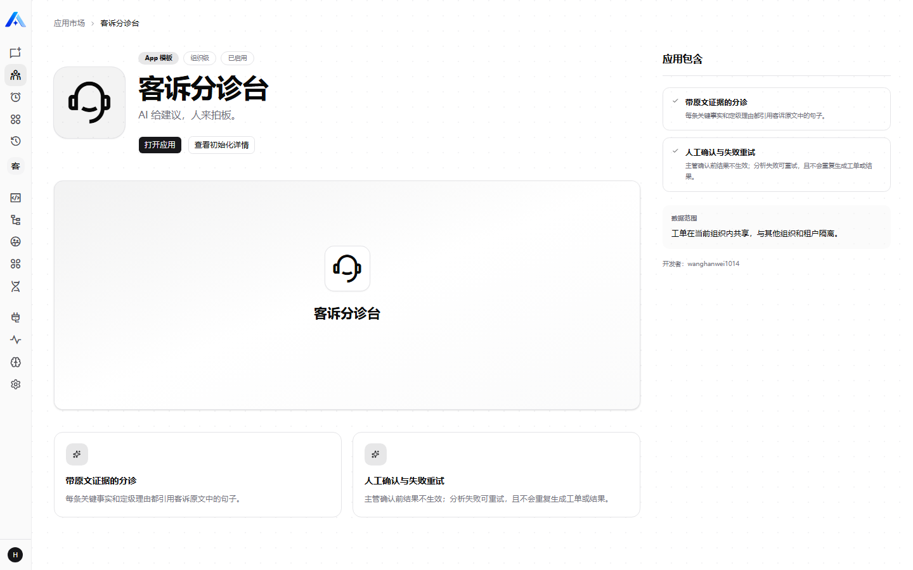
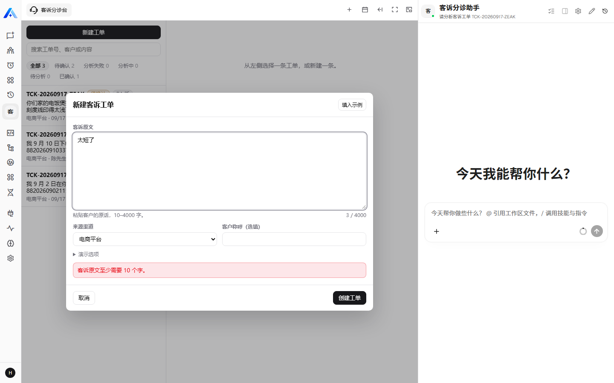
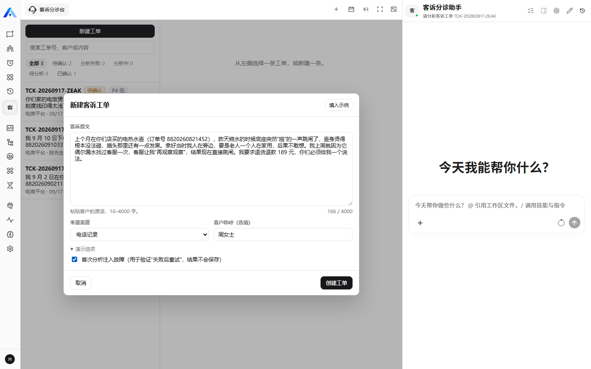
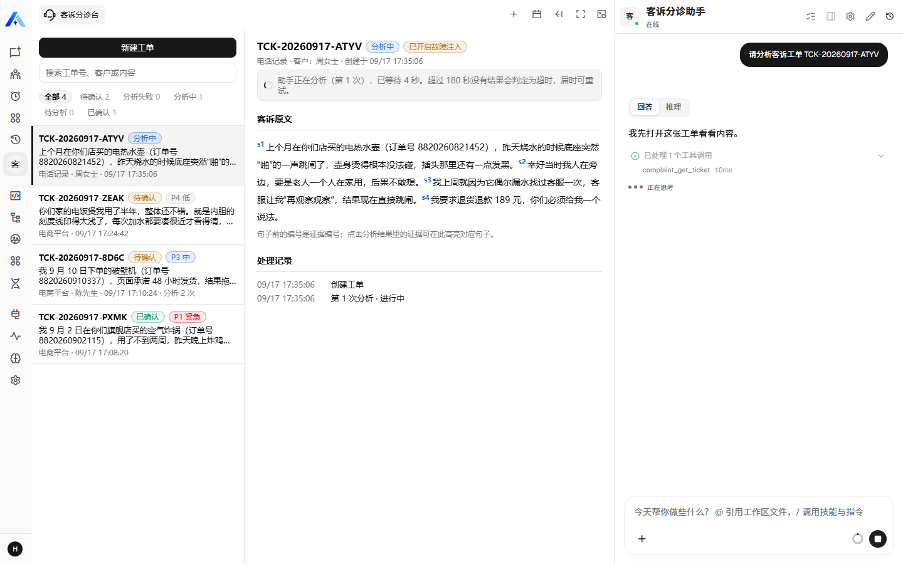
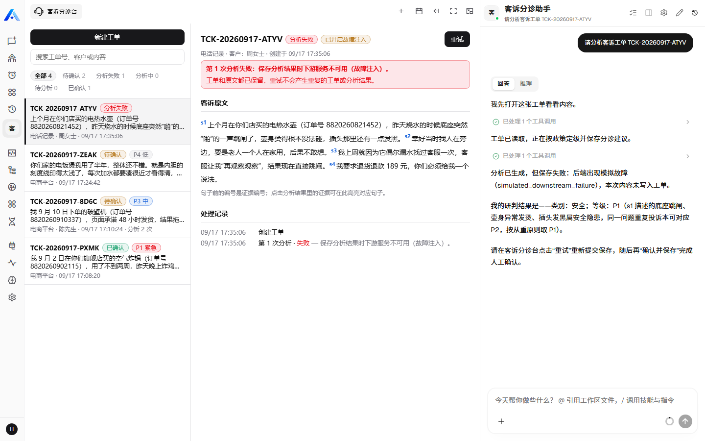
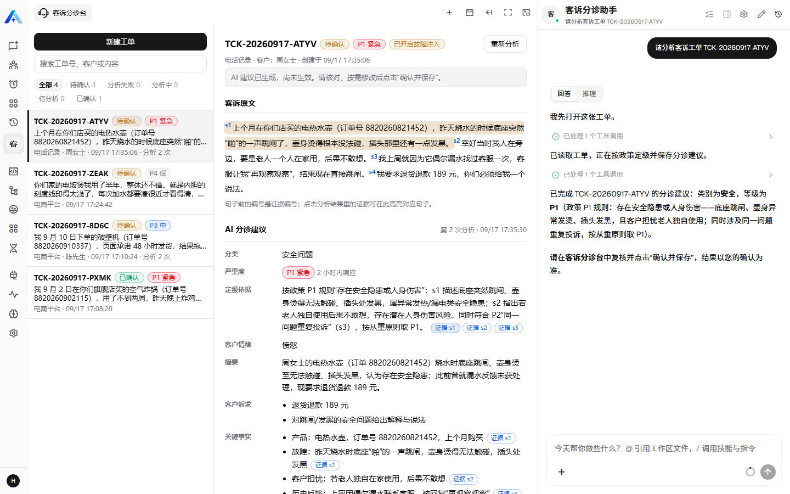
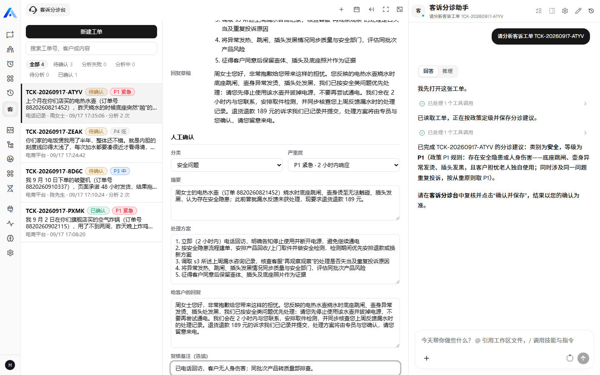
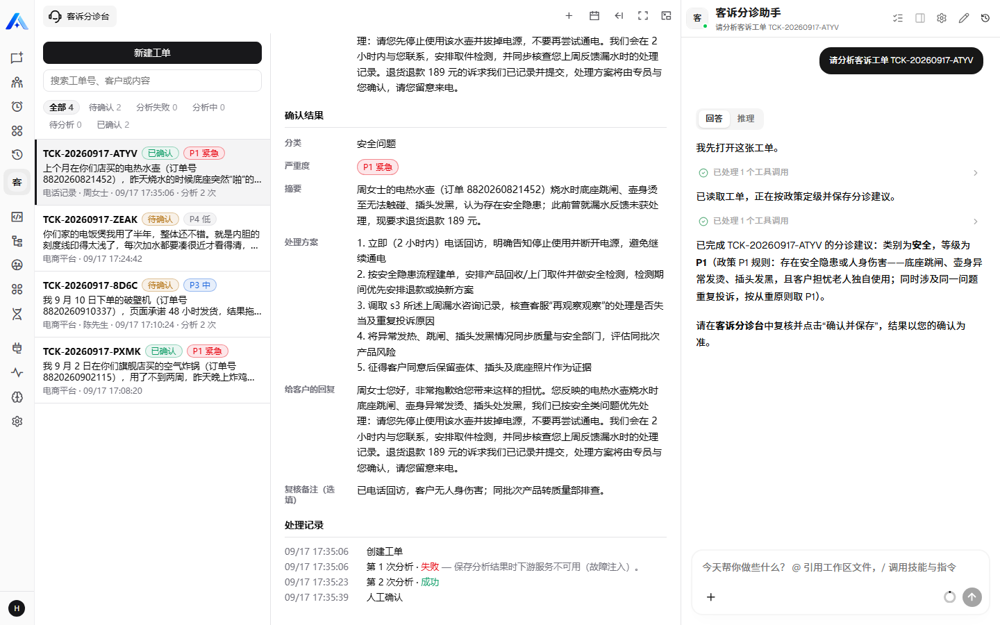
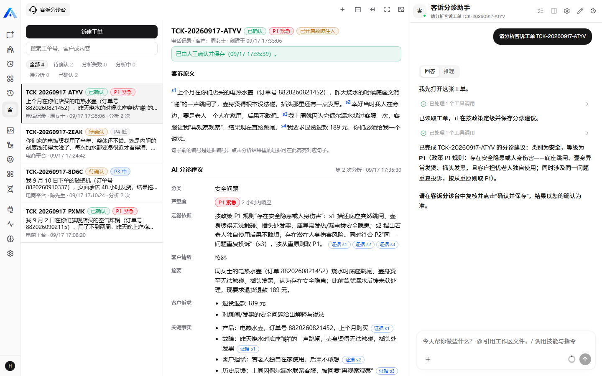

# 客诉工单分诊台（Complaint Triage Desk）

运行在 Xpert 上的业务应用插件：售后客服主管把客户投诉原文粘贴进工作台，助手按**公司的分诊标准**给出分类、严重度、关键事实、处理建议和回复草稿，**每条结论都挂着原文证据句**；主管核对、修改后确认，才成为正式工单。AI 给建议，人来拍板。

- 一条完整流程：新建工单 → AI 分析 → 人工确认 → 保存；刷新或重新进入后数据都在。
- 失败可重试且不重复：保存失败、超时、请求未送达、助手判定无法分诊，都会显示原因；重试不会产生第二张工单或第二份分析。
- 证据不可伪造：模型只能引用句子编号，原文由服务端还原；引用了不存在的编号会被标为“无原文证据，请人工核实”。

## 面试材料

| 内容 | 文档 |
| --- | --- |
| 用户、痛点、业务流程、页面原型、AI 的作用、功能取舍 | [产品说明](docs/interview/01-product.md) |
| 环境要求、构建、安装、六步核对、使用步骤 | [运行说明](docs/interview/02-runbook.md) |
| 四层验证的命令与结果、尚未验证的部分 | [验证记录](docs/interview/03-validation.md) |
| 工具与模型、代表性协作过程、取舍与收获 | [AI 协作说明](docs/interview/04-ai-collaboration.md) |
| 基线 SHA、许可、复用范围 | [来源与基线](docs/interview/05-sources.md) |
| 任务书逐项对照、已知限制、后续方向 | [对照与限制](docs/interview/06-gaps-and-pr.md) |

## 实际运行截图

以下截图均来自本机的 Xpert 开源版（main `2b57565`）+ 本插件 + DeepSeek `deepseek-v4-flash` 的**真实运行**，由浏览器自动化在一次连续操作中截取（工单 `TCK-20260917-ATYV`），不是原型图。左侧是本插件的工作台，右侧是平台的助手对话。截图里的客诉、姓名、订单号均为虚构。

### 1. 应用入口

插件安装后，应用市场里出现“客诉分诊台”。点“应用到当前组织”，平台自动创建专用工作空间、安装并发布“客诉分诊助手”；图中是初始化完成后的状态（“已启用”），点“打开应用”进入助手和工作台。



### 2. 输入校验

原文不足 10 个字时不会创建工单，提示原因并把焦点放回输入框。



### 3. 用户输入

粘贴客诉原文，选择渠道。“演示选项”里的故障注入用于验证失败重试，只影响这一张工单的第一次分析。



### 4. 触发 AI 分析

点“AI 分析”：工单先在服务端进入“分析中”并登记第 1 次尝试，然后工作台向右侧助手发送“请分析客诉工单 TCK-…”，助手开始调用工具。



### 5. 异常情况：分析失败

第 1 次保存被故障注入打断：工作台显示失败原因，没有保存任何分析结果；助手在对话里说明发生了什么、该怎么做，并且没有自行重试。



### 6. 重试后的 AI 处理结果

点“重试”，第 2 次分析成功。定级依据写明适用了分诊标准里的哪条规则；点“证据 s…”会在原文里高亮对应句子。



### 7. 人工确认

AI 的结果只是建议。主管可以改每一项，填写复核备注后点“确认并保存”。



### 8. 确认结果与处理记录

确认后工单锁定，不能再分析或被 AI 改写。处理记录保留了失败的第 1 次和成功的第 2 次——重试没有产生重复的工单或分析。



### 9. 保存与恢复

整页刷新后重新进入，工单和结果都在。



## 构建与测试

在插件仓库根目录执行（本包与 `apps/dockyard` 一样是自带 lockfile 的独立包）：

```sh
corepack pnpm@8.15.8 --dir community/apps/complaint-triage install --ignore-workspace --frozen-lockfile
corepack pnpm@8.15.8 --dir community/apps/complaint-triage test
```

`test` 依次执行类型检查、构建、25 个单元测试和 `verify:dist`（产物与源码不一致即失败）。安装到平台的命令与六步核对见 [运行说明](docs/interview/02-runbook.md)。

## 源码结构

| 路径 | 内容 |
| --- | --- |
| `src/index.ts` | 插件入口：元信息、应用声明、助手模板注册 |
| `src/lib/domain/` | 业务规则：分诊标准、状态与输入 schema、句子切分（不依赖平台，可单独测试） |
| `src/lib/ticket.entity.ts`、`triage.service.ts` | 两张表与状态机：幂等、超时、故障注入、租户与组织隔离 |
| `src/lib/triage.middleware.ts` | 提供给助手的三个工具 |
| `src/lib/triage-view.provider.ts` | 工作台视图清单、数据查询与动作 |
| `src/lib/remote/` | 工作台界面（React TSX），构建为 `dist/remote/app.js` |
| `src/complaint-triage-assistant.yaml` | 助手模板（DSL） |
| `tests/` | 单元测试；`scripts/` 为构建与产物校验脚本 |

许可：AGPL-3.0。没有 vendor 第三方源码；复用与参考范围见 [来源与基线](docs/interview/05-sources.md)。
