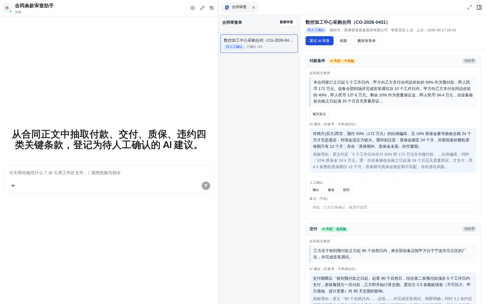
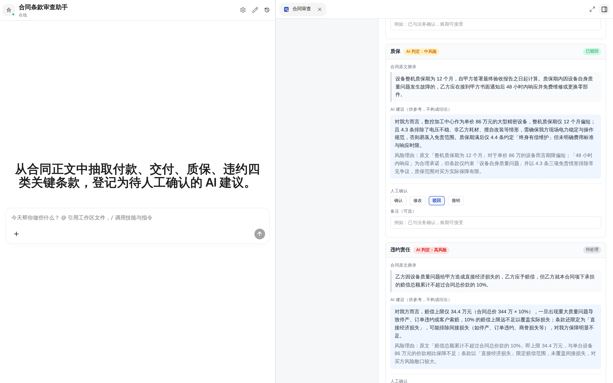
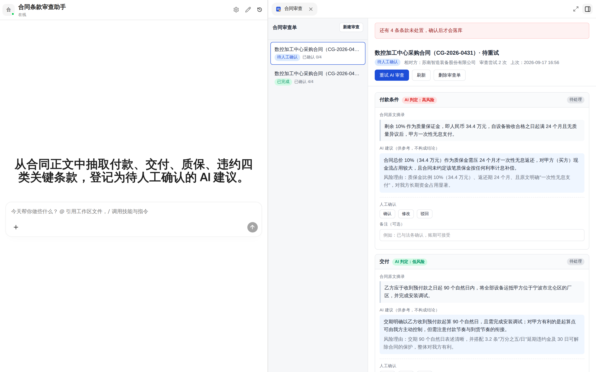
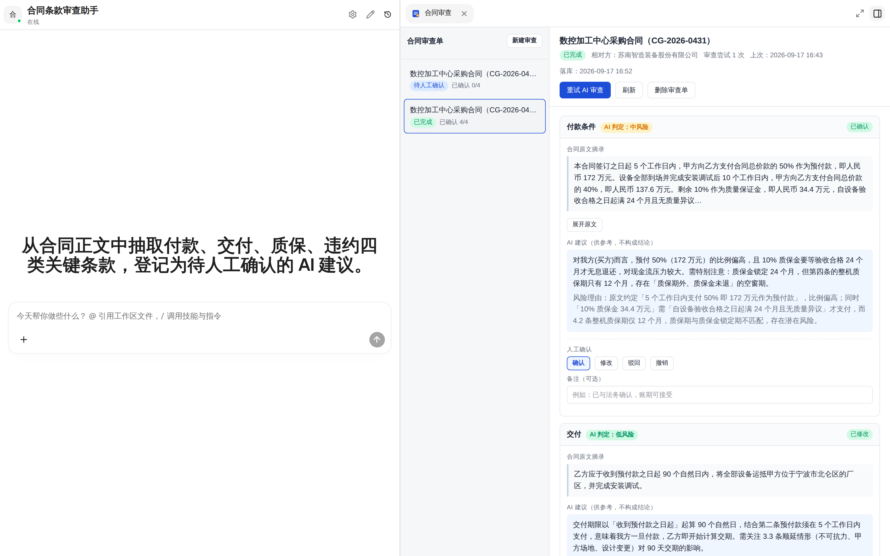
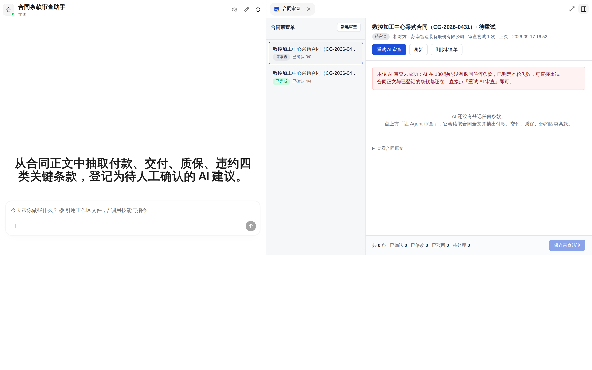

# 合同关键条款审查台 (Contract Review Workbench)

> Xpert 原生业务应用插件 · `@xpert-ai/plugin-contract-review`
> 面向中小企业一线销售/商务：把一份合同交给 Agent 抽取付款、交付、质保、违约四类关键条款，**逐条人工确认后才落库**。

这不是"一个工具"或"一次问答"。它是一条完整的业务链路：

```
① 粘贴合同正文
      ↓
② Agent 抽取四类条款，每条给出 {原文摘录, 抽取结论, 风险等级, 风险理由}
      ↓
③ 人工逐条 确认 / 修改 / 驳回（未处置的条目不进入结论）
      ↓
④ 保存审查结论 → 列表可查、刷新可恢复；AI 原判与人工终判分别留痕
      ↑
⑤ 抽取失败 → 输入不丢，审查单停在原状态，可原地重试
```

## 截图

以下截图全部取自真实运行的平台（真实模型调用，非示意图），素材为
[`docs/interview/assets/sample-contract.txt`](./docs/interview/assets/sample-contract.txt)。

**② Agent 抽取结果**：每条条款都有 AI 判定等级、逐字原文摘录与风险理由。
图中 AI 还发现了一处跨条款不一致——质保金锁定 24 个月，但整机质保期只有 12 个月。



**③ 人工逐条处置**：确认 / 修改 / 驳回，可撤销；图中「质保」已被驳回（绿标 `已驳回`）。



**③ 未处置条款拒绝落库**：4 条都还是 `待处理` 时点保存，前端如实拒绝并说明原因，
而不是静默丢弃或保存一份不完整的结论。



**④ 保存与恢复**：重新载入页面后审查结论仍在——`已完成`、`落库：2026-09-17 16:52`、
`已确认 4/4`，人工终判（`已确认` / `已修改`）与 AI 原判并存。



**⑤ 失败重试**：抽取超时被判失败——状态回到 `待审查`、`审查尝试 1 次` 被保留、
失败原因如实呈现，**合同正文与已登记条款都不丢**，可原地重试
（同图中另一张审查单已是 `已完成 已确认 4/4`）。



逐步复现命令与验证数据见 [`docs/interview/03-validation.md`](./docs/interview/03-validation.md)。

## 为什么人工确认是核心，而不是装饰

合同审查的业务本质是**责任归属**——结论必须由人确认。因此：

- AI 只产出「建议 + 原文依据 + 风险等级 + 理由」，**不产出最终结论**；
- 每条条款必须经人工 **确认 / 修改 / 驳回**；`humanDecision` 为 `pending` 的条目不进入结论，
  且**前端保存会被拒绝**并如实告知还剩几条（不是静默丢弃）；
- 数据库里 `aiConclusion` 与 `humanConclusion` 是**两列**，人工结论永远不覆盖 AI 原判。

## 插件结构

```
src/
├── index.ts                                  # 插件契约：meta / config / templates / register
└── lib/
    ├── contract-review.plugin.ts             # NestJS 模块装配
    ├── contract-review.service.ts            # 领域逻辑（审查单生命周期、幂等写入、超时判失败）
    ├── contract-review.middleware.ts         # Agent 工具（模型调用的那 4 个）
    ├── contract-review-view.provider.ts      # 工作台视图：manifest / data / action / 远程组件入口
    ├── contract-review.templates.ts          # 助手模板
    ├── contract-review.config.ts             # 插件配置 zod schema + 配置表单 + 环境变量默认值
    ├── entities/                             # 两张表
    └── remote-components/contract-review-workbench/
        ├── src/                              # React 源码（iframe 内运行）
        └── app.js / app.css                  # esbuild 打包产物（插件运行时读取）
```

## Agent 工具

插件**不直接调用 LLM**。模型在 Agent 对话里运行，通过下列中间件工具读写审查单：

| 工具 | 作用 |
| --- | --- |
| `contract_review_get_case` | 读取审查单与合同全文（抽取前必读，用于拿到逐字原文） |
| `contract_review_record_clause` | 登记一条抽出的条款（类型、原文摘录、结论、风险等级、理由） |
| `contract_review_mark_extraction` | 宣告本轮抽取结束（成功 / 失败） |
| `contract_review_list_cases` | 列出当前组织的审查单 |

幂等策略：同类型且**人工尚未处置**的条款会被覆盖（避免重试堆出重复项）；
一旦人工已确认/修改/驳回，再次写入**新增一条**，绝不覆盖人工结论。

## 数据表

| 表 | 说明 |
| --- | --- |
| `plugin_contract_review_case` | 审查单：合同正文、状态、抽取次数、超时判定所需的时间戳 |
| `plugin_contract_review_clause` | 条款：AI 列（结论/等级/理由/原文摘录）与人工列（决策/结论/备注）分开存放 |

两表均带 tenant / organization / user 作用域字段，跨组织不可见。

## 插件配置

| 配置项 | 默认 | 作用 |
| --- | --- | --- |
| `enabled` | `true` | 插件开关 |
| `defaultPageSize` | `25` | 审查单列表分页大小 |
| `extractionTimeoutSeconds` | `180` | 抽取在该时长内没有任何条款回写即判本轮失败，可重试 |

也可用环境变量提供默认值：`CONTRACT_REVIEW_ENABLED`、`CONTRACT_REVIEW_DEFAULT_PAGE_SIZE`、
`CONTRACT_REVIEW_EXTRACTION_TIMEOUT_SECONDS`。配置在**每次请求时读取**，改动无需重启宿主。

## 本地运行

见 [`docs/interview/02-runbook.md`](./docs/interview/02-runbook.md)。

## 已知限制

见 [`docs/interview/06-gaps-and-pr.md`](./docs/interview/06-gaps-and-pr.md)。
