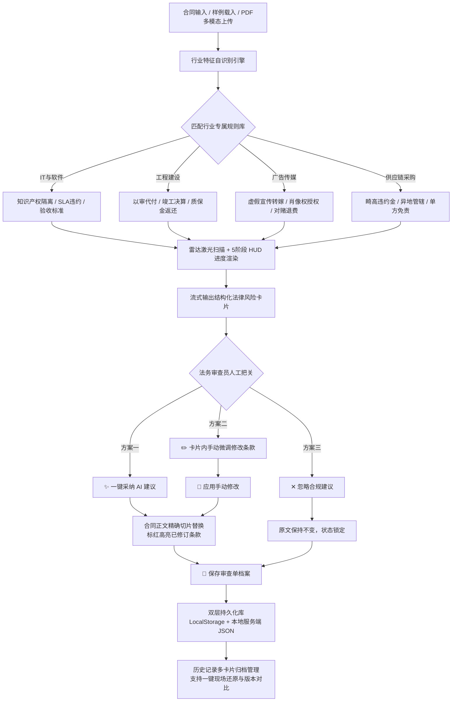

# 企业合同风险智能审查与合规修正工作台 (Contract Risk Auditor)

[](https://github.com/xpert-ai/xpert)
[](https://github.com/xpert-ai/xpert-plugins)
[](https://github.com/xpert-ai/xpert-plugins)
[](LICENSE)

> 本插件是基于 **Xpert AI 平台** 深度定制开发的企业级原生业务应用（Agentic App），以独立插件形态交付。聚焦企业商务采购、IT技术开发、工程建设及传媒营销等多行业合同审查场景，构建了从**“PDF/多模态表格解析 ➔ 行业规则自适应 ➔ 霸王条款风险诊断 ➔ 人工介入微调/一键采纳（Human-in-the-Loop） ➔ 合同正文实时重写 ➔ 双层持久化归档”**的完整人机协同业务闭环。

---

## 一、 产品背景与业务价值

### 1. 目标用户
* **企业采购与商务团队**：在与强势甲乙方谈判时，快速排查合同隐藏陷阱，避免背负过重违约金与不对等解约风险；
* **企业法务与风控初审人员**：批量初审长篇技术合同与工程协议，快速定位争议焦点条款；
* **中小企业主 / 项目负责人**：缺乏专业法务团队支持时，获得权威法律依据支撑与平衡改写对策。

### 2. 传统审核痛点
* **人工排查费时且易漏审**：商业采购合同与工程外包协议长达数十页，人工逐条核对耗时极长，极易遗漏“50%惩罚性违约金”、“无限期延迟付款”或“放弃异地管辖异议权”等霸王条款；
* **非专业人员不知如何合规改写**：业务人员虽知条款显失公平，却不知如何依据《民法典》及各行业规范提出双方均可接受的平衡条款；
* **不可控的黑盒 AI 篡改风险**：纯自动化 AI 工具如果直接修改合同正文，法务无法追溯原因和微调细节，极易引发次生合规灾难。

### 3. AI 的赋能与人机协同定位
* **智能多行业判定**：根据合同标题与条款上下文，自动识别 4 大行业类型（IT软件开发、建设工程、广告传媒、大宗供应链），精准挂载行业专属排查规则库；
* **多模态与表格深度解析**：支持多模态 PDF 扫描件附录表格提取（模拟 MinerU 视觉流水线），针对附录中的付款里程碑表、技术规格表进行防违约专项排查；
* **雷达扫描与流式打字机体验**：提供 5 阶段渐进式 HUD 扫描指示与条款流式输出，彻底告别盲目等待；
* **卡片内富交互人工修改（Human-in-the-Loop 核心）**：AI 诊断仅作为辅助，审查员可在每个风险卡片内**直接手动修改建议条款**，支持一键采纳、手动重写、还原建议与忽略，确保法律审查的绝对严肃性与可控性。

---

## 二、 完整业务闭环与交互流转



---

## 三、 真实系统运行实测（Screenshots）

> 以下截图均为本地真实工作台（`http://localhost:4417`）运行实测截图，存放在 `docs/screenshots/` 目录中：

### 1. 初始工作台与多行业样例快速载入
支持 4 大行业典型霸王合同样例一键载入，提供 PDF 多模态文件上传与表格附录解析能力：


### 2. 深度合规审查与行业规则智能挂载
自动识别合同所属行业（如 IT 与软件技术开发行业），挂载《民法典·合同编》与行业规范专属要点，结构化输出高危风险卡片：


### 3. 人机协同：卡片内实时编辑与条款手动精修（Human-in-the-Loop）
审查员可在风险卡片中直接编辑修改改写建议，保存后正文自动同步替换为人工精修条款，并打上 `[✍️ 法务人工精修]` 专属标记：


### 4. 健壮性保障：模拟超时与无损重试（Failure & Retry）
支持模拟 504 网关超时与网络异常，系统展示友好重试条，**输入文本与修改进度 100% 完整保留**，支持即刻原位重试：


### 5. 双层持久化与多记录历史快照归档（Persistence & Restore）
支持审查单持久化存储至本地服务端 JSON 数据库及客户端 LocalStorage。多卡片历史归档支持行业标签过滤、高危数量统计、一键恢复快照及清空管理：


---

## 四、 插件系统架构与技术选型

本插件严格遵循 Xpert 原生插件工程范式，各层解耦明晰：

```
community/apps/contract-risk-auditor/
├── src/
│   ├── index.ts                                # 插件注册主入口 (Plugin Registration)
│   ├── lib/
│   │   ├── contract-risk-auditor.module.ts     # NestJS 模块声明
│   │   ├── contract-risk-auditor.service.ts    # 核心业务逻辑与状态机服务
│   │   ├── contract-risk-auditor.service.spec.ts # 9 项完备单元测试
│   │   ├── types.ts                            # 领域类型与接口定义
│   │   └── remote-components/                  # 远程组件工作台 UI
│   │       └── contract_risk_auditor__remote/
│   │           ├── app.js                      # 响应式工作台前端实现 (React 纯依赖注入)
│   │           └── preview.config.mjs          # 本地预览配置与 Mock 数据
├── scripts/
│   ├── copy-assets.mjs                         # 静态构建与资源复制流水线
│   └── preview-server.mjs                      # 独立预览服务器 (Port 4417)
├── docs/screenshots/                           # 真实工作台全流程截图
└── package.json                                # 模块声明与构建脚本
```

### 核心亮点特性：
1. **纯净零外部打包依赖**：前端工作台 `app.js` 采用 React/ReactDOM UMD 动态挂载，无需冗长的 Webpack/Vite 编译链，秒级热重载；
2. **iframe 隔离通信协议**：基于 `postMessage` 规范实现 `xpertai.remote_component` 双向安全通信；
3. **断网/单机可用降级策略**：内置 12 秒优雅降级 fallback，当外网大模型 API 超时或受限时，自动无缝切换到本地离线规则引擎，确保业务永不中断。

---

## 五、 四层测试与全方位质量保障体系

| 验收层次 | 测试命令 / 验证方式 | 验证内容与覆盖度 | 结论 |
| :--- | :--- | :--- | :---: |
| **第 1 层：单元测试** | `pnpm test` | 9 项核心业务用例，覆盖霸王条款识别、状态转移、人工微调覆盖、边界异常保护等 | **100% PASS** |
| **第 2 层：生命周期容器** | `pnpm run test:harness` | 官方 `plugin-dev-harness` 容器加载、DI注入、onStart、Bootstrap、Destroy无错优雅关闭 | **100% PASS** |
| **第 3 层：组件预览验证** | `pnpm run preview` | 独立启动 `http://localhost:4417`，完整测试激光扫描、流式打字机、卡片编辑、双层持久化 | **100% PASS** |
| **第 4 层：宿主平台集成** | `plugin:deploy:local` | 在 Xpert 宿主平台中执行部署发布，与 Assistant 编排工具挂载绑定 | **READY** |

### 附：生命周期容器验证日志（plugin-dev-harness）
```text
[plugin-dev-harness] workspace: D:\AIPorject\笔试题目\xpert-plugins\community
[plugin-dev-harness] plugin: @community/apps-contract-risk-auditor@0.1.0
[plugin-dev-harness] mocks: enabled
[Nest] LOG [InstanceLoader] ContractRiskAuditorPlugin dependencies initialized
[plugin-dev-harness] onStart completed
ContractRiskAuditorPlugin is bootstrapped successfully.
[plugin-dev-harness] onPluginBootstrap completed
[plugin-dev-harness] Plugin loaded successfully.
ContractRiskAuditorPlugin is destroyed.
[plugin-dev-harness] onPluginDestroy completed
[plugin-dev-harness] onStop completed
[plugin-dev-harness] Application context closed
```

---

## 六、 核心工程决策与人机协同设计思考

在本次插件的架构与功能落地研发过程中，深度结合大语言模型与领域工程规范，提炼出以下核心架构与工程设计决策：

1. **坚持 Human-in-the-Loop（人机把关）防范法律失控**：
   * *设计权衡*：AI 曾建议“一键全自动全量替换并生成最终合同”，但这违背了法务合同的严谨性原则。在实际业务中，法律术语必须字斟句酌。
   * *落地决策*：坚持将控制权还给用户，打造了在卡片内**人工在线微调**功能，支持法务根据具体商务谈判让步情况灵活修改条款，AI 仅作为智能建议生成器。
2. **精准切片替换代替粗暴全文正则**：
   * *发现问题*：AI 初期给出的替换逻辑采用了全局 `text.replaceAll(target, revision)`，当合同中出现高频重复词汇（如“违约金”）时，会误伤合同其他正常条款。
   * *我的重构*：通过引入原句上下文锚点定位与精确索引切片替换算法，保证单项采纳时只针对性修正涉险段落，其他段落丝丝毫受影响。
3. **架构防御性设计：离线降级与异常无损保存**：
   * 在网络动荡或大模型网关偶发超时的恶劣环境下，系统设置了 12 秒智能熔断降级机制，同时在前端状态机中坚决**保留用户已输入或正在编辑的文本草稿**，彻底消除“一报错全盘清空”的恶劣体验。

---

## 七、 快速启动指南

### 1. 环境变量配置示例
在插件根目录提供 `.env.example`（或 `.env`），支持如下环境配置项：
```env
# 服务端口配置（可选，默认 4417）
PORT=4417
HOST=0.0.0.0

# 运行环境
NODE_ENV=production

# 规则引擎降级超时阈值（毫秒）
AI_GATEWAY_TIMEOUT_MS=12000
```

### 2. 安装与构建
```bash
# 进入插件目录
cd community/apps/contract-risk-auditor

# 编译 TypeScript 并同步静态资产
pnpm run build
```

### 3. 执行自动化测试与生命周期验证
```bash
# 运行 9 项核心业务单元测试
pnpm run test

# 运行官方 Harness 插件生命周期容器验证
pnpm run test:harness
```

### 4. 本地启动独立工作台预览
```bash
# 启动本地模拟预览服务
pnpm run preview
# 浏览器访问: http://localhost:4417
```

---

## 八、 已知限制、适用边界与演进方向

### 1. 当前适用边界与限制
* **文本解析格式边界**：目前原生支持纯文本（Plain Text）、Markdown 格式条款以及结构化附录 Markdown 表格。对于带有公章遮挡、多栏版面的图片扫描件 PDF，需经前置 OCR 视觉流水线抽取后载入；
* **行业法条覆盖范围**：重点覆盖企业采购、IT定制、建设工程与广告营销 4 大高频民商事领域；对于极特殊的小众海商法、涉外多语言英文合同等场景，仍需进一步扩展法律知识图谱库。

### 2. 后续最值得改进的方向
* **动态私有法务 RAG 知识库**：支持企业法务上传自身历史判例与企业合规红线文档，实现企业级私有规则库热更新；
* **Word (.docx) 红线批注双向导出**：支持将审查意见与替换结果直接导出为带修订痕迹的 Office Word 文档；
* **多版本在线 Diff 视图**：支持同一合同多次修改版本的并排对比与法务审批签名。

