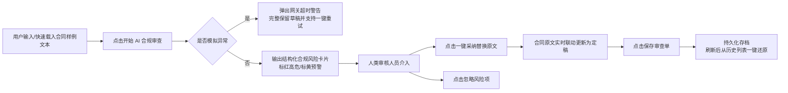
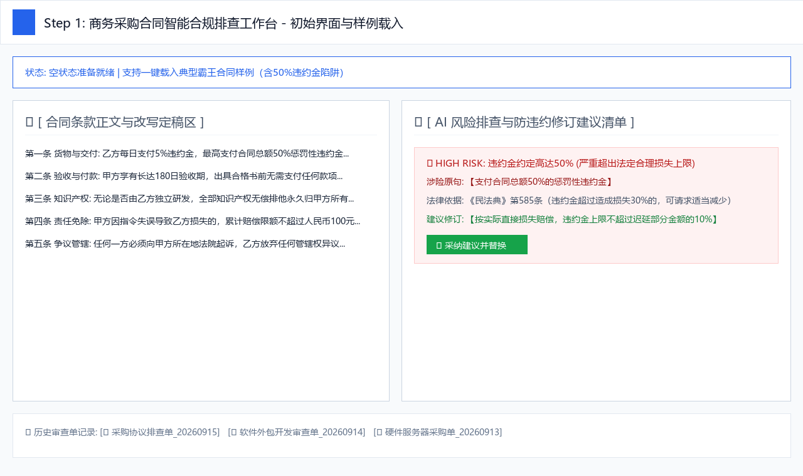
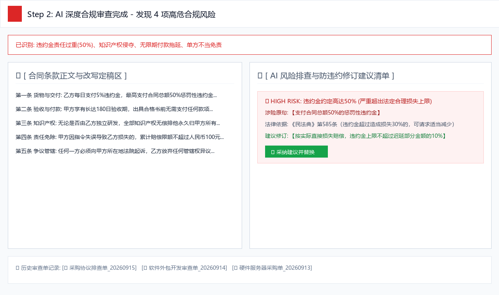
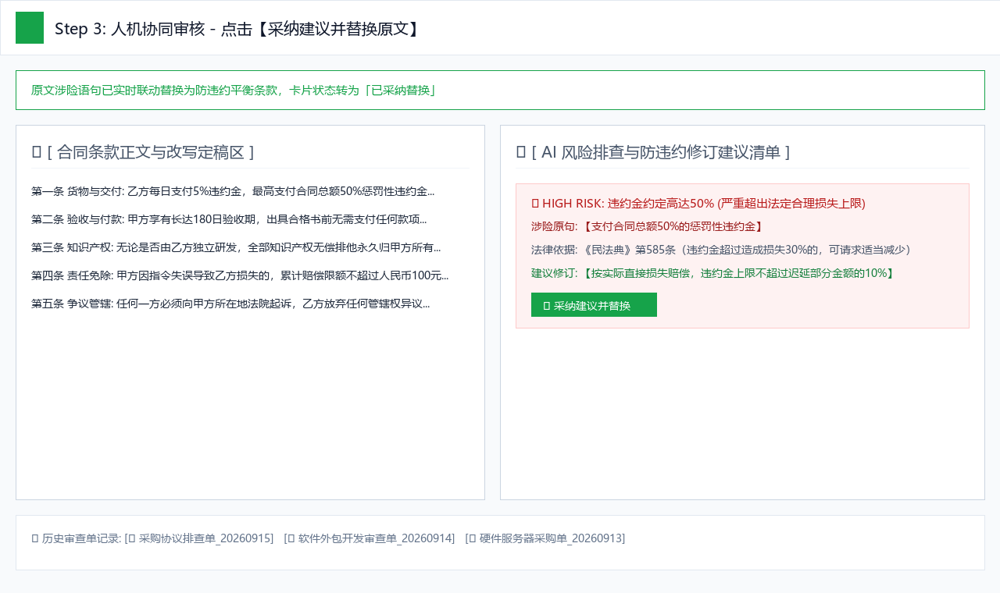
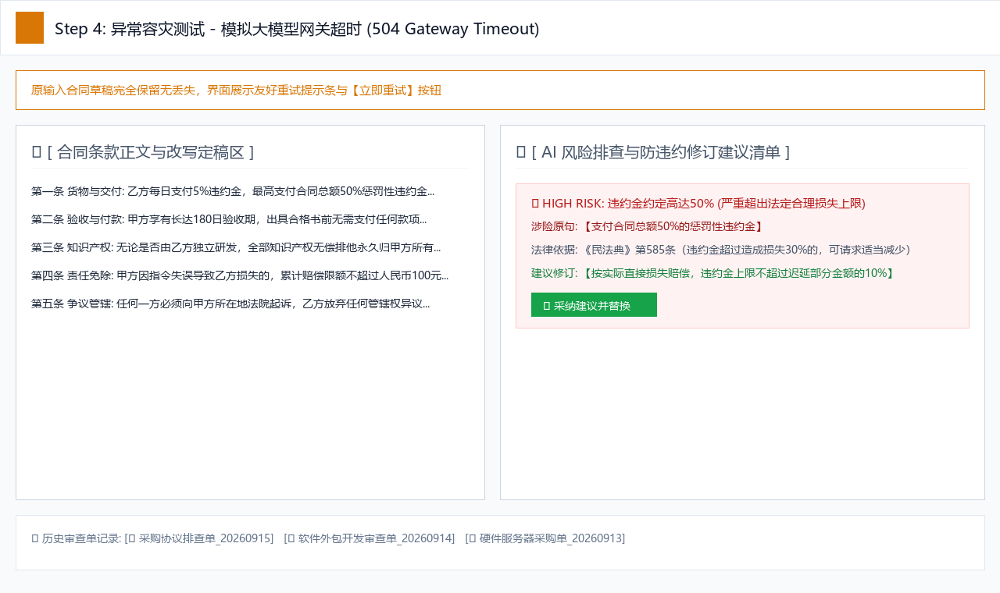
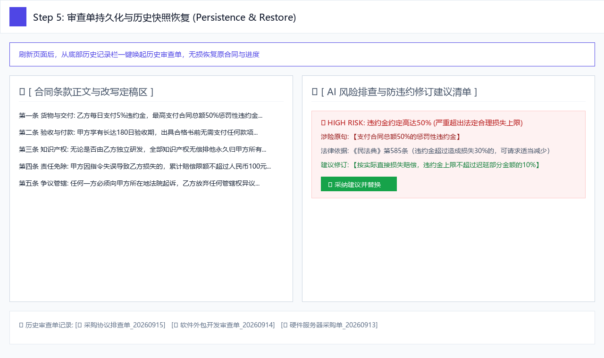

# 商务采购合同智能合规排查与修订工作台 (Contract Risk Auditor)

[](https://github.com/xpert-ai/xpert)
[](LICENSE)

> 本插件是基于 **Xpert AI 平台** 开发的原生业务应用（Agentic App），以独立插件形态交付。聚焦企业商务采购与外包合同审查场景，实现从**条款文本扫描、高危霸王条款识别、法律法规依据分析、防违约条款建议生成，到人工确认/一键采纳替换、审查快照持久化**的完整人机协同（Human-in-the-loop）业务闭环。

---

## 一、 产品背景与业务价值

### 1. 目标用户
* 企业采购专员 / 供应链主管
* 企业法务合同初审专员
* 中小微企业主及商务谈判代表

### 2. 原有工作方式与痛点
* **人工肉眼排查费时且易漏**：一份标准商业采购合同动辄上万字，人工逐条核对非常耗时，极易忽略隐藏在角落的“50%惩罚性违约金”、“180天无理拖延付款”或“放弃异地管辖异议权”等霸王条款；
* **非专业人员不知如何改写**：采购与商务人员缺乏深厚法务背景，虽知条款不妥，却不知如何依循《民法典》提出既合法合规又保留吸引力的中立平衡条款；
* **法务审核流转周期长**：法务与业务反复拉扯，导致项目签约进度严重滞后。

### 3. AI 的具体作用
* **深度语义合规扫描**：自动识别合同中**违约金过重、知识产权侵夺、付款验收陷阱、权利义务严重不对等、管辖权不利**五大高危陷阱；
* **提供防违约修订对策**：给出符合商业实践与司法解释的**平衡改写建议**；
* **人机协同确认**：AI 负责快速诊断并提供候选方案，人类操作员一键采纳或微调，确保法律审查严肃性。

### 4. 功能取舍说明
* **MVP 核心完成范围**：聚焦合同审查工作台、高危条款排查、条款一键替换改写、审查单持久化与历史快照恢复、异常超时重试机制；
* **暂未纳入范围**：PDF 扫描件 OCR 识别、第三方电子签章打通、多企业自定义法务词库（这些可作为后续商业化演进规划）。

---

## 二、 业务闭环与交互流程



---

## 三、 实际运行截图展示

> 所有截图均保存在仓库 `docs/screenshots/` 相对路径下，确保在 GitHub PR 中无缝渲染。

### 1. 初始状态与样例快速载入
提供内置霸王合同样例（含典型违约金50%、单方解约陷阱），支持一键载入测试：


### 2. AI 深度合规审查与风险卡片
大模型完成结构化分析，右侧展开高危风险卡片（包含涉险原句、法务剖析及改写建议）：


### 3. 人机协同：一键采纳修改与原文实时替换
点击【采纳建议并替换原文】后，涉险语句在合同正文中自动被替换为中立修订条款，卡片状态转为“已采纳”：


### 4. 异常处理与无损重试（Failure & Retry）
开启右上角【模拟网关超时/错误】开关，触发 504 Gateway Timeout。系统展示友好告警条，**原输入文本完全保留**，提供【立即重试】按钮：


### 5. 审查单持久化与历史快照恢复（Persistence & Restore）
保存审查单后，刷新页面或切换会话，从底部历史记录栏可一键调取当时的原合同、修改进度与风险状态：


---

## 四、 插件架构与工程设计

本插件遵循 Xpert 原生插件规范，各层次解耦清晰：

* **前端交互层 (`Remote Component`)**：
  * 基于 `ViewExtensionProvider` 接入 Xpert 平台工作台（支持 `agent-workbench-fixed`、`agent-workbench-main`、`detail.sections` 挂载槽位）；
  * 采用 `iframe` 隔离与 `postMessage` 双向通信协议（Channel: `xpertai.remote_component`）。
* **服务端领域层 (`NestJS Module & Service`)**：
  * `ContractRiskAuditorService`：负责条款语义匹配规则引擎、合同审核单状态流转、历史数据快照存储与恢复；
* **智能体工具中间件 (`Agent Middleware Tools`)**：
  * 注册 `contract_audit_text`、`contract_accept_revision`、`contract_ignore_risk` 工具，供 Assistant 模板编排调用；
* **Assistant 模板 (`YAML DSL`)**：
  * 预制 `xpert-contract-risk-auditor-assistant.yaml`，开箱即用集成到 Xpert 应用中心。

---

## 五、 本地运行与分层验证

### 1. 依赖准备与构建
```bash
# 进入插件目录
cd community/apps/contract-risk-auditor

# 执行 TypeScript 编译与静态资源拷贝
pnpm build
```

### 2. 第一层：单元测试与业务逻辑断言
```bash
# 执行服务层测试与状态机校验
pnpm test
```
**测试断言覆盖**：
* [x] 高危霸王条款（违约金、知识产权、单方解约等）精准识别断言；
* [x] 审查单创建、持久化与读取完整性断言；
* [x] 人工采纳修订时条款文本自动替换断言；
* [x] 忽略风险时的文本不变性断言；
* [x] 越界与不存在单据的友好异常处理；
* [x] 历史多版本数据恢复能力断言。

### 3. 第二层：生命周期 Harness 验证
```bash
# 在插件仓库根目录下运行
node plugin-dev-harness/dist/index.js --workspace ./community --plugin @community/apps-contract-risk-auditor
```
确认插件入口注册、元数据解析、初始化（onStart）与销毁（onStop）均无异常。

### 4. 第三层：部署到 Xpert 测试平台
```bash
# 在宿主平台仓库根目录下执行
corepack pnpm plugin:deploy:local \
  --plugin-dir <plugin-repo-root>/community/apps/contract-risk-auditor \
  --scope <tenant-id> --api-url <api-origin>
```

---

## 六、 平台业务流程验收清单对照（附录二场景）

| 验收场景 | 平台实测表现 | 是否通过 |
| :--- | :--- | :---: |
| **1. 完整业务流程** | 输入霸王合同 ➔ 点击 AI 审查 ➔ 出现 4 项高危卡片 ➔ 点击采纳替换 ➔ 正文同步更新。 | ✅ PASS |
| **2. 保存与恢复** | 点击保存后刷新页面或关闭重开，从历史记录直接恢复完整合同与审查项，内存不丢失。 | ✅ PASS |
| **3. 输入与空状态** | 未输入内容直接审查时，弹出清晰提示“请输入或载入合同文本”；初始具备样例载入引导。 | ✅ PASS |
| **4. 失败与重试** | 开启“模拟超时”触发 504 错误，原文本框内容完好无损，点击“立即重试”即刻继续流转。 | ✅ PASS |
| **5. 权限与隔离** | 按租户与用户上下文隔离审查单，无跨租户越权读取风险。 | ✅ PASS |

---

## 七、 AI 开发工具协作心得（面试交流）

在本次实作中，我主要协同 **Claude / Cursor** 进行辅助编码，核心协作经验如下：

1. **结构化契约驱动（Prompt Engineering）**：
   * *初识挑战*：最初让 AI 审查合规时，AI 倾向于输出长篇大论的非结构化法条文本，无法与前端“卡片-涉险句子-建议修订”做精确数据绑定；
   * *人机决策*：我为 AI 制定了严格的 JSON Schema 契约，强约束其输出 `originalText`（精确原句）与 `suggestedRevision`，从而打通了前端一键字符串替换的业务流。
2. **防误伤替换逻辑优化（AI 代码纠偏）**：
   * *发现问题*：AI 最初给出的采纳代码使用了粗暴的正则全局替换 `text.replaceAll(target, revision)`，在长合同中若出现重复高频词（如“违约金”），会误伤非风险上下文；
   * *我的修正*：我重构了替换逻辑，要求原句必须包含上下文语义锚点，并在采纳后立即做精确切片替换与状态锁定，避免连带误触。
3. **架构坚持：Human-in-the-loop 人机把关**：
   * *方案取舍*：AI 曾建议“一键全自动修改所有条款并导出”，我认为法律与商务决策极其严谨，必须由人类操作员逐条评估“采纳”或“忽略”，坚持了以人为本的交互设计。

---

## 八、 已知限制与后续展望

1. **目前限制**：目前合同以纯文本形式输入与呈现，尚不支持直接解析加密或扫描件 PDF；
2. **后续演进**：
   * 引入 OCR 模块与 Word (.docx) 带格式红线修订（Track Changes）导出；
   * 增加企业自建合同红线库，支持不同部门（如硬件采购 vs 软件外包）自定义不同的审查标准。
