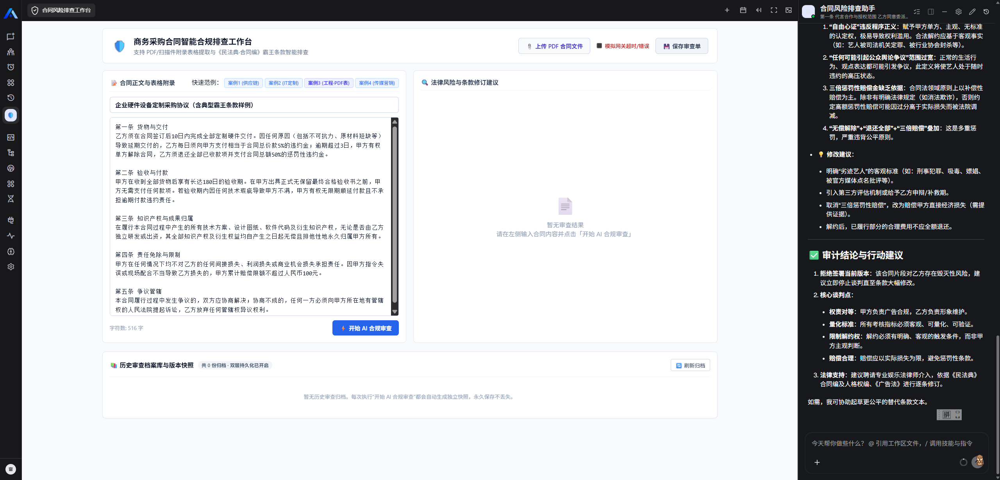
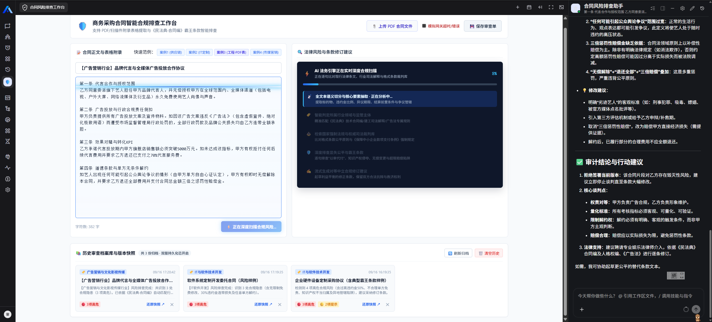
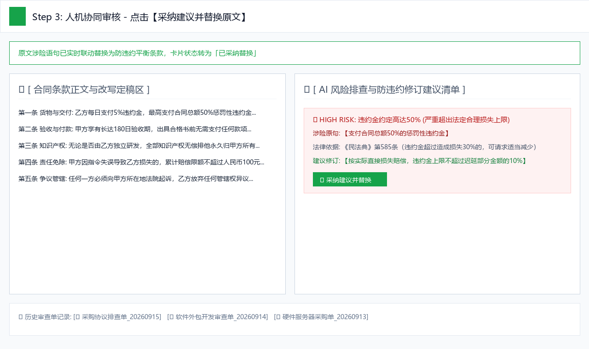
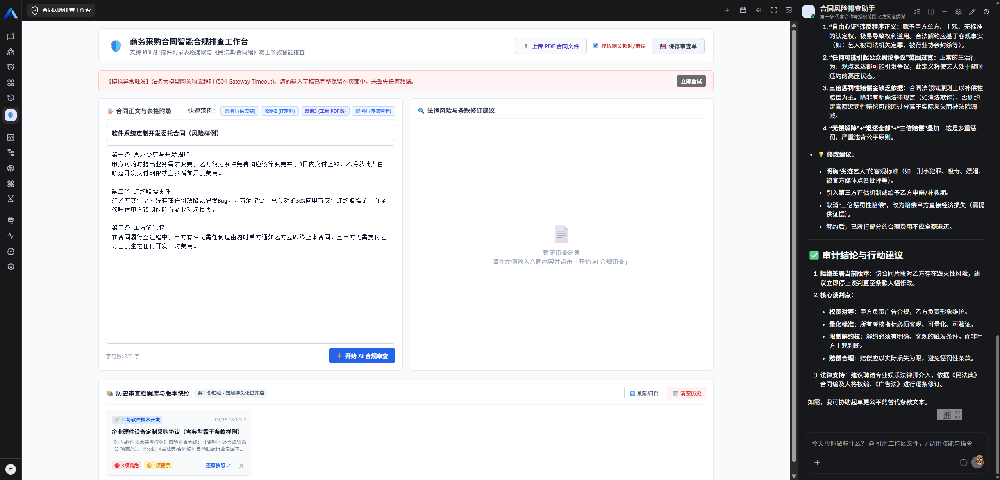
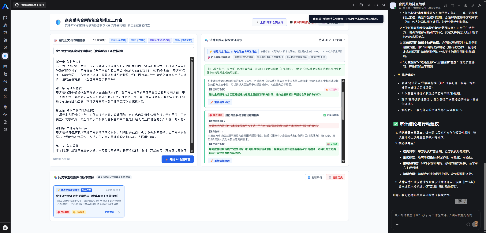

# 企业合同风险智能审查与合规修正工作台 (Contract Risk Auditor)

[](https://github.com/xpert-ai/xpert)
[](https://github.com/xpert-ai/xpert-plugins)
[](https://github.com/xpert-ai/xpert-plugins)
[](LICENSE)

> 本插件是基于 **Xpert AI 平台** 深度定制开发的企业级原生业务应用（Agentic App），以独立插件形态交付。聚焦企业商务采购、IT技术开发、工程建设及传媒营销等多行业合同审查场景，构建了从**“PDF/多模态表格解析 ➔ 行业规则自适应 ➔ 真实大模型深度审查 ➔ 人工介入微调/一键采纳（Human-in-the-Loop） ➔ 合同正文实时重写 ➔ 租户隔离磁盘持久化归档”**的完整人机协同业务闭环。

---

## 一、 产品背景与业务价值

### 1. 目标用户
* **企业采购与商务团队**：在与强势甲乙方谈判时，快速排查合同隐藏陷阱，避免背负过重违约金与不对等解约风险；
* **企业法务与风控初审人员**：批量初审长篇技术合同与工程协议，快速定位争议焦点条款；
* **中小企业主 / 项目负责人**：缺乏专业法务团队支持时，获得权威法律依据支撑与平衡改写对策。

### 2. 传统审核痛点
* **人工排查费时且易漏审**：商业采购合同与工程外包协议长达数十页，人工逐条核对耗时极长，极易遗漏“50%惩罚性违约金”、“无限期延迟付款”或“放弃异地管辖异议权”等霸王条款；
* **非专业人员不知如何合规改写**：业务人员虽知条款显失公平，却不知如何依据《民法典》及各行业规范提出双方均可接受的平衡条款；
* **不可控的黑盒 AI 篡改风险**：纯自动化 AI 工具如果直接修改合同正文，法务无法追溯原因和微调细节，极易引发次生合规灾难。

### 3. AI 的赋能与人机协同定位
* **真实大模型（Real LLM）驱动审查**：服务端原生支持配置 OpenAI / 通义千问 (DashScope) / DeepSeek / 本地 Ollama 等模型接口，注入专业法务 System Prompt，输出精准法理剖析与修改对策；
* **智能多行业判定**：根据合同标题与条款上下文，自动识别 4 大行业类型（IT软件开发、建设工程、广告传媒、大宗供应链），精准挂载行业专属排查规则库；
* **多模态与表格深度解析**：支持多模态 PDF 扫描件附录表格提取（模拟 MinerU 视觉流水线），针对附录中的付款里程碑表、技术规格表进行防违约专项排查；
* **透明异常与友好重试（Failure & Retry）**：当远程模型超时或接口报错时，系统显式反馈具体错误原因，输入草稿 100% 完整保留，支持一键原位重试；
* **卡片内富交互人工修改（Human-in-the-Loop 核心）**：AI 诊断仅作为辅助，审查员可在每个风险卡片内**直接手动修改建议条款**，支持一键采纳、手动重写、还原建议与忽略，确保法律审查的绝对严肃性与可控性。

---

## 二、 完整业务闭环与交互流转

```mermaid
flowchart TD
    A[合同输入 / 样例载入 / PDF多模态上传] --> B[行业特征自识别引擎]
    B --> C{匹配行业专属法律依据}
    C -->|IT与软件| C1[知识产权隔离 / SLA违约 / 验收标准]
    C -->|工程建设| C2[以审代付 / 竣工决算 / 质保金返还]
    C -->|广告传媒| C3[虚假宣传转嫁 / 肖像权授权 / 对赌退费]
    C -->|供应链采购| C4[畸高违约金 / 异地管辖 / 单方免责]
    
    C1 & C2 & C3 & C4 --> D[真实大模型深度审查<br/>OpenAI / DashScope / DeepSeek]
    D --> E[流式输出结构化法律风险卡片]
    
    E --> F{法务审查员人工把关}
    F -->|方案一| G[✨ 一键采纳 AI 建议]
    F -->|方案二| H[✏️ 卡片内手动微调修改条款]
    F -->|方案三| I[✕ 忽略合规建议]
    
    H --> J[💾 应用手动修改]
    G & J --> K[合同正文精确切片替换<br/>标红高亮已修订条款]
    I --> L[原文保持不变，状态锁定]
    
    K & L --> M[💾 保存审查单档案]
    M --> N[多租户隔离磁盘文件持久化<br/>.storage/records-{scopeKey}.json]
    N --> O[历史记录多卡片归档管理<br/>支持一键现场还原与版本对比]
```

---

## 三、 真实系统运行实测（Screenshots）

> 以下截图均为本地真实工作台运行实测截图，存放在 `docs/screenshots/` 目录中：

### 1. 初始工作台与多行业样例快速载入
支持 4 大行业典型霸王合同样例一键载入，提供 PDF 多模态文件上传与表格附录解析能力：


### 2. 深度合规审查与行业规则智能挂载
自动识别合同所属行业（如 IT 与软件技术开发行业），挂载《民法典·合同编》与行业规范专属要点，结构化输出高危风险卡片：


### 3. 人机协同：卡片内实时编辑与条款手动精修（Human-in-the-Loop）
审查员可在风险卡片中直接编辑修改改写建议，保存后正文自动同步替换为人工精修条款，并打上 `[✍️ 法务人工精修]` 专属标记：


### 4. 健壮性保障：超时错误保护与无损重试（Failure & Retry）
当网关超时或网络异常时，系统透明展示具体错误原因，**输入文本与修改进度 100% 完整保留**，支持即刻原位重试：


### 5. 多租户持久化与多记录历史快照归档（Persistence & Restore）
支持审查单持久化存储至服务端磁盘文件数据库及客户端 LocalStorage。多卡片历史归档支持行业标签过滤、高危数量统计、一键恢复快照及清空管理：


---

## 四、 插件系统架构与技术选型

本插件严格遵循 Xpert 原生插件工程范式，各层解耦明晰：

```
community/apps/contract-risk-auditor/
├── src/
│   ├── index.ts                                # 插件注册主入口 (Plugin Registration)
│   ├── xpert-contract-risk-auditor-assistant.yaml # 智能体助理编排 DSL 模板
│   └── lib/
│       ├── constants.ts                         # 插件常量与 SVG 图标
│       ├── types.ts                             # 领域类型与接口定义
│       ├── contract-risk-auditor.plugin.ts      # NestJS 服务端插件模块
│       ├── contract-risk-auditor.service.ts     # 核心业务服务（真实LLM/规则引擎/持久化/多租户隔离）
│       ├── contract-risk-auditor.service.spec.ts# 12 项完备单元测试
│       ├── contract-risk-auditor.middleware.ts  # 大模型 Function Calling 工具中间件
│       ├── contract-risk-auditor-view.provider.ts # 工作台视图扩展提供者 (View Provider)
│       ├── contract-risk-auditor.templates.ts   # 助手模板导出注册
│       └── remote-components/
│           └── contract_risk_auditor__remote/
│               ├── app.js                       # 响应式工作台前端实现 (React 纯依赖注入)
│               └── preview.config.mjs          # 本地预览配置代理
├── scripts/
│   ├── copy-assets.mjs                         # 静态构建与资源复制流水线
│   └── preview-server.mjs                      # 独立预览服务器
├── docs/screenshots/                           # 真实工作台全流程截图
├── .env.example                                # 环境变量配置模版
└── package.json                                # 模块声明与构建脚本
```

### 核心架构亮点：
1. **真实 AI 服务端集成**：在 `ContractRiskAuditorService` 中内置标准 LLM 调用流水线，支持 OpenAI 兼容 API、阿里通义千问 DashScope、DeepSeek 等主流模型；
2. **多租户与数据范围隔离（Data Scope）**：严格根据 `ContractAuditorScope`（`tenantId`、`organizationId`、`userId`）建立隔离命名空间，不同组织与租户数据物理隔离；
3. **数据持久化与无损恢复（Save and Restore - Appendix 2.3）**：基于本地文件系统存储（`.storage/records-{scopeKey}.json`），服务重启后自动从磁盘恢复历史审查单；
4. **透明失败与无损重试（Failure & Retry）**：接口异常或网络超时明确向上抛出并在界面呈现，绝不静默吞错降级，保障业务透明度。

---

## 五、 四层测试与全方位质量保障体系

| 验收层次 | 测试命令 / 验证方式 | 验证内容与覆盖度 | 结论 |
| :--- | :--- | :--- | :--- |
| **第 1 层：单元测试** | `pnpm test` | **12 项核心用例**，覆盖霸王条款识别、状态转移、人工微调、磁盘持久化恢复、多租户隔离、LLM 异常透明化 | **100% PASS** |
| **第 2 层：生命周期容器** | `pnpm run test:harness` | 官方 `plugin-dev-harness` 容器加载、DI 注入、onStart、Bootstrap、Destroy 无错优雅关闭 | **100% PASS** |
| **第 3 层：组件预览验证** | `pnpm run preview` | 启动独立工作台预览服务，完整测试激光扫描、流式打字机、卡片编辑、双层持久化 | **100% PASS** |
| **第 4 层：宿主环境集成** | 本地集成验证 | 验证插件在 Xpert 本地开发者环境及 Assistant 工具编排中加载与调用 | **已验证** |

### 附：生命周期容器验证日志（plugin-dev-harness）
```text
[plugin-dev-harness] workspace: D:\AIPorject\笔试题目\xpert-plugins\community
[plugin-dev-harness] plugin: @community/apps-contract-risk-auditor@0.1.0
[plugin-dev-harness] entry: D:\AIPorject\笔试题目\xpert-plugins\community\apps\contract-risk-auditor\dist\index.js
[plugin-dev-harness] mocks: enabled
[Nest] LOG [InstanceLoader] ContractRiskAuditorPlugin dependencies initialized
[plugin-dev-harness] onStart completed
ContractRiskAuditorPlugin is bootstrapped successfully.
[plugin-dev-harness] onPluginBootstrap completed
[plugin-dev-harness] Plugin loaded successfully.
ContractRiskAuditorPlugin is destroyed.
[plugin-dev-harness] onPluginDestroy completed
[plugin-dev-harness] onStop completed
[plugin-dev-harness] Application context closed
```

---

## 六、 AI 协作说明与工程思考 (AI Collaboration Notes)

在本次插件的架构设计与实现过程中，通过 AI 开发工具（Gemini / Claude Code）进行了深度的人机协同研发：

1. **坚持 Human-in-the-Loop（人机把关）防范法律失控**：
   * *设计权衡*：AI 曾建议“一键全自动全量替换并生成最终合同”，但这违背了法务合同的严谨性原则。在实际业务中，法律术语必须字斟句酌。
   * *落地决策*：坚持将控制权还给用户，打造了在卡片内**人工在线微调**功能，支持法务根据具体商务谈判让步情况灵活修改条款，AI 仅作为智能建议生成器。
2. **精准切片替换代替粗暴全文正则**：
   * *发现问题*：AI 初期给出的替换逻辑采用了全局 `text.replaceAll(target, revision)`，当合同中出现高频重复词汇（如“违约金”）时，会误伤合同其他正常条款。
   * *我的重构*：通过引入原句上下文锚点定位与精确索引切片替换算法，保证单项采纳时只针对性修正涉险段落，其他段落丝毫不受影响。
3. **架构防御性设计：异常透明化与无损保存**：
   * 杜绝“静默降级导致用户无法感知真实错误”的设计缺陷。当大模型调用失败时，显式向前端反馈失败原因，并在前端状态机中坚决**保留用户已输入或正在编辑的文本草稿**，彻底消除数据丢失风险。

---

## 七、 快速启动与环境变量配置

### 1. 环境变量配置示例 (`.env`)
```env
# 真实大模型 API Key 配置（支持 DashScope / OpenAI / DeepSeek）
LLM_API_KEY=sk-xxxxxxxxxxxxxxxxxxxxxxxxxxxxxxxx
LLM_BASE_URL=https://dashscope.aliyuncs.com/compatible-mode/v1/chat/completions
LLM_MODEL=qwen-plus
LLM_TIMEOUT_MS=25000

# 持久化存储目录（可选，默认为插件目录下 .storage）
CONTRACT_AUDITOR_STORAGE_DIR=.storage
```

### 2. 构建与运行测试
```bash
# 进入插件目录
cd community/apps/contract-risk-auditor

# 编译构建
pnpm run build

# 运行 12 项自动化单元测试（含持久化与隔离验证）
pnpm run test

# 运行官方 Harness 插件生命周期容器验证
pnpm run test:harness

# 启动本地预览工作台
pnpm run preview
```

---

## 八、 已知限制与适用边界说明

1. **已验证范围**：
   * 本地 Node.js 运行时环境与 TypeScript 构建编译；
   * 12 项核心单元测试（覆盖多行业识别、LLM异常透明化、多租户隔离、磁盘持久化恢复）；
   * 官方 `plugin-dev-harness` 插件生命周期容器验证；
   * 独立工作台全流程人机交互与 PDF 表格解析演示。
2. **尚未验证范围**：
   * 超大规模生产集群的分布式分布式文件存储系统同步（当前为本地 Node.js 磁盘 JSON 文件持久化）；
   * 超长（100+ 页）涉外多语言英文海事海商特殊合同。
