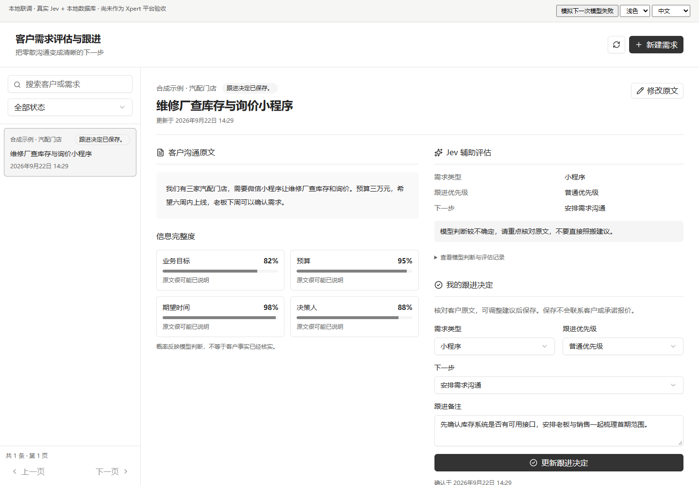
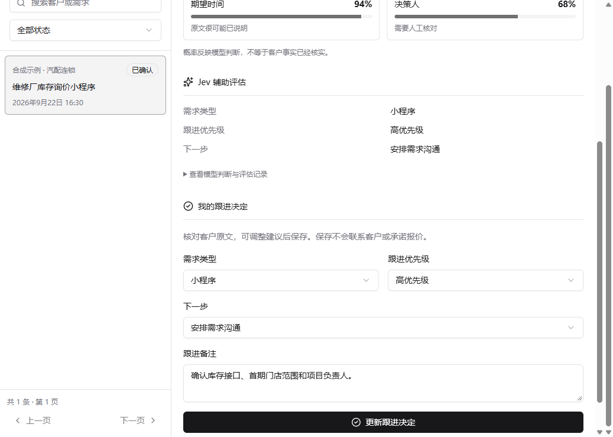

# 客户需求评估与跟进工作台

面向销售、售前和项目经理的 Xpert 业务应用。用户粘贴客户原始沟通记录，Jev 输出结构化判断：需求类型、信息完整度、紧迫性和建议下一步；业务人员核对、调整并保存自己的跟进决定。应用不会自动联系客户、报价或替人作承诺。



## 为什么选这个题

真实业务里，客户需求通常散落在聊天记录中。规则代码能校验必填项，却很难稳定判断“这是小程序还是内部系统”“预算是否已经说明”“应该先补信息还是安排需求沟通”。这些判断适合 Jev 的 Choice、Noul 和 Score 原语；保存、权限、并发控制、重试和人工确认仍由普通代码负责。

产品闭环只有四步：保存原文 → Jev 评估 → 人工核对和调整 → 持久化跟进决定。模型结果与人工决定分别保存，便于复盘，也避免把概率当成已核实事实。

## 功能

- 需求新建、编辑、搜索、状态筛选和分页；编辑原文会使旧评估与决定失效。
- Jev 并行判断需求类型、下一步、紧迫性，以及目标、预算、时间、决策人四项信息是否已说明。
- 展示模型概率、实际解析到的模型名、评估历史和待校准的优先级规则。
- 人工可修改类型、优先级、下一步并填写跟进备注；确认动作不会调用外部业务系统。
- 模型失败时保留原文并支持幂等重试；并发评估有租约和乐观版本控制。
- 数据按 tenant、organization、user 三层隔离；Assistant 只提供查询与发起评估工具，没有绕过人工确认的工具。
- 中文和英文界面、深浅主题、桌面和移动布局。

## Jev 设计

单次请求把相互独立的判断一起发送，共享同一份客户原文：

| 判断 | TypeSafe 原语 | 应用使用方式 |
| --- | --- | --- |
| 需求类型 | Choice | 小程序、网站、内部系统、自动化、其他、不明确 |
| 下一步 | Choice | 补充信息、需求沟通、方案评估、暂缓 |
| 紧迫性 | Score 0–3 | 由代码结合“暂缓”规则映射为高/普通/低优先级 |
| 信息完整度 | 4 个 Noul | 分别判断目标、预算、时间、决策人是否在原文中说明 |

置信度只触发人工重点核对，不授予自动执行权限。实现参考 TypeSafe 的 [JavaScript SDK](https://docs.typesafe.ai/sdk/javascript)、[Choice](https://docs.typesafe.ai/primitives/choice)、[Score](https://docs.typesafe.ai/primitives/score) 和 [Noul](https://docs.typesafe.ai/primitives/noul) 文档。

## 本地验证

需要 Node.js 20+。从本目录执行：

```sh
npm install --workspaces=false --ignore-scripts
npm run typecheck
npm run build
npm test
npm run verify:dist
```

运行 Xpert 仓库提供的共享 Remote View 预览宿主（固定数据，不消耗模型额度）：

```sh
npm run build
npm run preview:fixture
# 浏览器打开 http://127.0.0.1:4417
```



运行真实 Jev + SQL.js 的本地集成预览：

```sh
npm run build
npm run preview -- --env-file /absolute/path/to/.env
# 浏览器打开 http://127.0.0.1:4317
```

`.env` 至少包含 `TYPESAFE_API_KEY`，可选 `TYPESAFE_MODEL`。脚本只把这两个名字复制到进程环境；密钥不会写入数据库、日志、页面或构建产物。`--allow-failure-test` 仅为本地验证增加“一次失败”按钮。

真实服务烟雾测试：

```sh
npm run test:live -- --env-file /absolute/path/to/.env
```

2026-09-22 的本地验收解析到 `jev-1.13.0`，完成了保存、评估、人工确认、进程重启后恢复，以及失败后重试。回执见 [docs/live-check.json](docs/live-check.json)，详细矩阵见 [docs/verification.md](docs/verification.md)。

## Xpert 插件集成

插件基于 `@xpert-ai/plugin-sdk@3.18.7` 和 `@xpert-ai/contracts@3.18.6`，提供：

- `customer_demand.view`：固定工作台视图提供者；
- `customer_demand.tools`：受可信请求上下文约束的 list/get/evaluate Agent 工具；
- `customer_demand.assistant`：示例 Assistant 模板；
- `customer_demand.workbench`：同一份构建产物用于预览与平台 Remote View。

在 Xpert 插件仓库根目录，可先运行官方加载器检查：

```sh
node plugin-dev-harness/dist/index.js \
  --workspace community/apps/customer-demand \
  --plugin @xpert-ai/plugin-customer-demand
```

部署到本地 Xpert 时，设置服务器进程的 `TYPESAFE_API_KEY`，再使用仓库对应版本的本地插件部署流程。不要把密钥放入浏览器环境变量或插件配置 JSON。

## 已知边界

- 优先级阈值是演示策略，需要用真实成交与跟进样本校准。
- Jev 提供结构化语义判断，不生成方案、报价或回复话术。
- 每条记录默认只对创建它的同一 tenant、organization、user 可见；团队共享需要额外的授权模型。
- SQL.js 只用于独立集成预览；安装到 Xpert 后使用宿主提供的 TypeORM 数据库。
- 仓库共享预览宿主验证 Remote View 协议和交互，但不等同于把插件安装进完整 Xpert 服务。完整平台验收证据应在目标 Xpert 环境中补充。

## 资料

- [产品与数据设计](docs/product-design.md)
- [验证记录](docs/verification.md)
- [AI 协作说明](docs/ai-collaboration.md)
- [隐私说明](docs/privacy.md)
- [第三方来源与许可](docs/attribution.md)

基线：`xpert-ai/xpert-plugins@b5fa7b0811443bdef6b8d1f2aad88047533063d0`；本地平台验证目标基线：`xpert-ai/xpert@d24ca81b9f5885cf44dd77afdb0f91359b49c4ea`。
