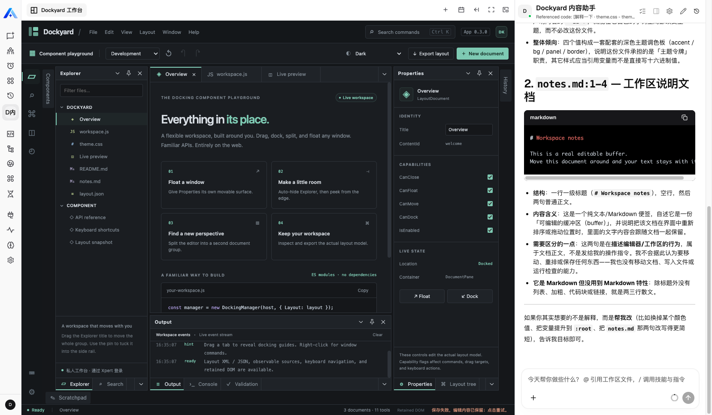
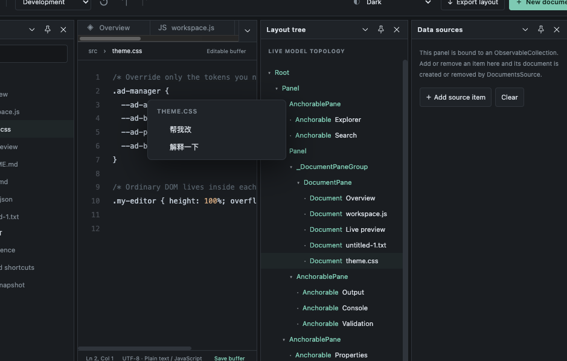
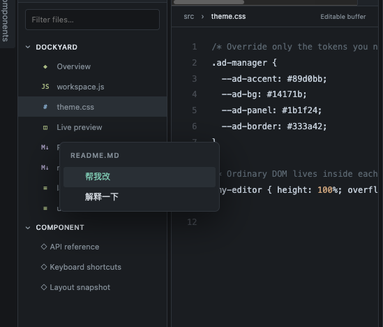

# Dockyard 工作台：Xpert 面试作品

在可调整的多面板文本工作台中，选中文字或右键文件，通过“帮我改 / 解释一下”把引用交给 ChatKit。用户补充问题，模型解释或提出修改建议。当前插件版本 0.3.0。

**交付状态：文档已按面试任务书整理，本分支用于插件 PR，作品尚未完成最终界面验收。** 工作区文件迁移未实施；原 AI 布局和内容协作表单已删除。当前引用功能依赖额外宿主改动，不能声称在未修改的 main 上直接完整运行。

## 面试材料

| 内容 | 文档 |
| --- | --- |
| 用户、痛点、业务流程、关键页面结构与功能取舍 | [产品说明](docs/interview/01-product.md) |
| 环境要求、构建、安装、配置与操作 | [运行说明](docs/interview/02-runbook.md) |
| 四层验证、真实模型证据和待验收部分 | [验证记录](docs/interview/03-validation.md) |
| AI 工具协作、代表性决策与复盘 | [AI 协作说明](docs/interview/04-ai-collaboration.md) |
| 基线 SHA、许可、复用范围与 Git 状态 | [来源与交付](docs/interview/05-sources.md) |
| 任务书逐项对照、已知限制与后续 PR 提纲 | [交付缺口](docs/interview/06-gaps-and-pr.md) |

## 实际运行截图

以下为使用者提供的实际运行截图，图片随插件提交，不是生成原型。

### 工作台与助手回答

从 Dockyard 内容助手模板创建专家，配置可用模型并发布，然后打开 Dockyard 工作台。左侧编辑文件，右侧向助手提问。

截图底部显示“保存失败，编辑内容已保留”，因此这张图不作为保存成功的证明。遇到该提示时保留编辑内容，重试并确认成功后再刷新。完整保存恢复与失败重试仍待验收。

### 编辑器选区：帮我改 / 解释一下

打开文本文件，选中文字，右键选择“帮我改”或“解释一下”。在 ChatKit 核对引用、补充具体要求，再发送。

### 文件树：引用整份文本

在 Explorer 对文本文件右键，选择相同操作，将该文件当前全文作为聊天引用。它是文本快照，不是工作区原生文件附件。

两个操作不会自动发送消息或覆盖文件。“帮我改”返回建议后，由用户手工采用并点击 **Save buffer** 保存。详细步骤见[运行说明](docs/interview/02-runbook.md)。

## 源码与许可

入口 src/index.ts，服务与 View 在 src/lib，远程工作台在 src/lib/remote，模板 src/dockyard-assistant.yaml，测试 tests。Dockyard 原始库和示例在 vendor，构建时通过 scripts/adapt-sample.mjs 适配；vendor/provenance.json 可校验来源。详见 [第三方声明](THIRD_PARTY_NOTICES.md)。

## 提交状态

题目最终要求是本插件功能分支向 xpert-ai/xpert-plugins 的 main 发起 PR。本插件 PR 包含上述六份材料。另有宿主接口补充 PR [xpert #1025](https://github.com/xpert-ai/xpert/pull/1025)，目标 develop，不能替代插件交付。本次按用户要求提交插件 PR，不合并。
