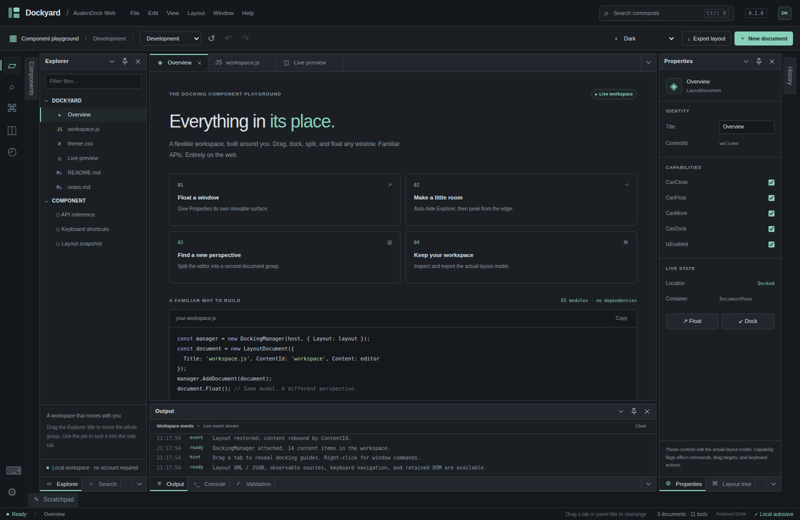

# AvalonDock Web · Dockyard

[](https://github.com/wieslawsoltes/Dockyard/actions/workflows/ci.yml)
[](https://www.npmjs.com/package/@wieslawsoltes/dockyard)
[](https://www.npmjs.com/package/@wieslawsoltes/dockyard)
[](https://github.com/wieslawsoltes/Dockyard/releases/latest)
[](LICENSE)
[](https://wieslawsoltes.github.io/Dockyard/)

**[Open the live Dockyard demo](https://wieslawsoltes.github.io/Dockyard/)** · [Minimal component example](https://wieslawsoltes.github.io/Dockyard/sample/minimal.html) · [Standalone demo](https://wieslawsoltes.github.io/Dockyard/standalone.html)

A reusable, dependency-free JavaScript docking library and interactive sample application. It implements an AvalonDock-style observable layout model, PascalCase APIs, real DOM content hosting, document/tool panes, dock guides, floating windows, auto-hide, commands, and layout serialization.

**This is an independent browser implementation, not a WPF runtime or a complete, drop-in port of every AvalonDock/.NET API.** It does not execute XAML or C# controls. Read [the compatibility table](docs/COMPATIBILITY.md) before migrating an existing application. Native .NET XML interchange has not been jointly validated with a running AvalonDock application.



## Run it

Open **`standalone.html`** for the self-contained Dockyard showcase. It contains the library, styles, and sample code; no installation, build, CDN, server, or account is required. Browser policies can still restrict local files, pop-ups, downloads, or storage. The application handles unavailable storage and blocked pop-ups without destroying the layout.

For the ES-module version, serve the directory:

```sh
python -m http.server 8080 --bind 127.0.0.1
# Open http://localhost:8080/
```

`sample/minimal.html` is a small reusable-component example, separate from the full application shell.

## Integrate the component

Load the CSS, give the host a real height, and import the module:

```html
<link rel="stylesheet" href="./src/avalondock.css">
<div id="workspace" style="height: 650px; min-height: 0"></div>
<script type="module">
  import {
    DockingManager, LayoutRoot, LayoutPanel,
    LayoutDocumentPane, LayoutAnchorablePane,
    LayoutDocument, LayoutAnchorable, XmlLayoutSerializer
  } from './src/index.js';

  const editor = document.createElement('textarea');
  editor.value = 'This is a real, retained editor.';
  editor.style.cssText = 'width:100%;height:100%;box-sizing:border-box';

  const documentModel = new LayoutDocument({
    ContentId: 'editor', Title: 'Editor', Content: editor
  });
  const tool = new LayoutAnchorable({
    ContentId: 'inspector', Title: 'Inspector', Content: 'Your tools here'
  });
  const manager = new DockingManager(document.querySelector('#workspace'), {
    Theme: 'dark',
    Layout: new LayoutRoot({
      RootPanel: new LayoutPanel({
        Orientation: 'Horizontal',
        Children: [
          new LayoutAnchorablePane({DockWidth: 250, Children: [tool]}),
          new LayoutDocumentPane({Children: [documentModel]})
        ]
      })
    })
  });

  documentModel.Float();
  documentModel.Dock();
  tool.ToggleAutoHide();
  manager.DocumentClosing.add((_sender, args) => {
    if (args.Document.IsModified) args.Cancel = true;
  });

  const serializer = new XmlLayoutSerializer(manager);
  const xml = serializer.Serialize();
  serializer.Deserialize(xml);
  // Deserialization/history recreates model wrappers; resolve by stable ContentId.
  manager.Find('editor').Activate();
  // Call manager.Dispose() when your application removes the workspace.
</script>
```

For a classic script, use `dist/avalondock.css` and `dist/avalondock.js`. The global is `AvalonDock`; `Xceed.Wpf.AvalonDock` is a compatibility namespace alias, not an affiliation claim. No bundler is required.

For a package-based application, install the public npm package:

```sh
npm install @wieslawsoltes/dockyard
```

```js
import { DockingManager } from '@wieslawsoltes/dockyard';
import '@wieslawsoltes/dockyard/styles.css';
```

The package uses ES modules and includes TypeScript declarations; `@wieslawsoltes/dockyard/model` exposes the layout model without registering the custom element. The source ZIP contains the complete showcase and tests; the installable component package contains the library, documentation, and minimal example. [Versioned releases](https://github.com/wieslawsoltes/Dockyard/releases) include the npm tarball, browser bundle, showcase archive and SHA-256 checksums. CI verifies installed consumers before publication and downloads the public npm package to verify the same bytes and provenance afterward. See [publishing instructions](docs/publishing.md) for release preparation and safe retries.

### Custom element

Importing `src/index.js` or loading the classic bundle registers `<avalon-dock>`. Assign its `Layout` before attaching it, or declare a layout in HTML:

```html
<avalon-dock theme="dark" style="display:block;height:500px">
  <layout-root>
    <layout-panel orientation="Horizontal">
      <layout-anchorable-pane dock-width="220">
        <layout-anchorable content-id="tools" title="Tools">
          <p>Your tool controls</p>
        </layout-anchorable>
      </layout-anchorable-pane>
      <layout-document-pane>
        <layout-document content-id="notes" title="Notes">
          <textarea aria-label="Notes">Edit this text.</textarea>
        </layout-document>
      </layout-document-pane>
    </layout-panel>
  </layout-root>
</avalon-dock>
```

Read `.manager` after the element is connected, or listen for its `ready` event (`event.detail.manager`). Register before creating elements, or load the script after the completed declarative markup. This is an HTML parser, not a XAML parser.

## Working features

| Area | Included implementation |
|---|---|
| Layout model | Typed observable tree, PascalCase properties, `Children.Add/Remove/Move`, stable content IDs, selection, activation, previous-container restoration, validation and garbage collection |
| Docking | Pointer-driven tab reorder, center/tab docking, four-way split guides, root-edge tool docking, grouped tool movement, mixed-orientation policy, canceled drag rollback |
| Floating | In-page tool/document windows, eight resize grips, move, maximize/restore, dock-back; optional browser pop-outs with blocked-window handling |
| Auto-hide | Four sides, grouped tool pin/unpin, hover/click peek, resizable flyouts, hide/show and previous-location restoration |
| Commands | Close/close-others/close-all, float/dock, tab groups, previous/next group, auto-hide/hide, enabled-state checks, context menus and cancelable events |
| Content | Retained DOM nodes, lazy factories, disposal hooks, content-error boundaries, function templates and source-item projection |
| Persistence | Versioned JSON, AvalonDock-shaped XML, content-rebinding callback, strict bounded parsing, optional local storage, layout undo/redo and synchronous transactions |
| Reuse | ES modules, classic bundle, custom element, headless model, TypeScript declarations, DOM control adapters, separate instances and explicit cross-manager transfer |
| Interaction | Focused tab/splitter keyboard actions, MRU navigator, ARIA roles, focus handling, RTL layout option, light/dark and original alternate themes |

The render layer uses keyed HTML/CSS, not a canvas or GPU imitation of controls. Your editors, forms, iframes, canvases, and accessibility semantics remain ordinary browser content. Rendering is coalesced with animation frames; bodies are created lazily. There is no claim of constant-time layout or a general FPS benchmark.

## Explore Dockyard

The sample includes an editable multi-file workspace; a counter, input, and canvas for state-retention checks; an Explorer/Search group; a live property inspector and layout tree; output, console, validation, history, and source-bound document tools; import/export; four workspace presets; six selectable themes; and a command palette. Its controls invoke actual model operations.

Drag a tab toward a pane to show the docking compass. Drag a tool title to move the group. Hold Control while dragging to suspend docking. Right-click a tab for commands. The Inspector edits real capability flags. The History and Sources tools expose the actual history and collection APIs.

## Build and verify

The generated distribution is already included. Building and running core tests need only Node:

```sh
npm run build
npm test
node scripts/api-surface.mjs
```

Install the locked TypeScript toolchain to check declarations and the actual npm package. Browser tests additionally require Python Playwright and Chromium:

```sh
npm ci
npm run check
npm run test:package
python -m pip install -r requirements-test.txt
python -m playwright install chromium
npm run test:browser
python scripts/verify-site.py
```

Recorded verification: **56 core tests, 34 Chromium browser groups, and the strict TypeScript integration check passed.** Chromium version: **144.0.7559.96**. The browser groups exercise both the classic distribution and the native ES-module entry. See [testing details](docs/TESTING.md) and `test-results/` for the actual environment and unverified areas.

## Project map

`src/` contains the component, model, serializers, CSS and declarations. `dist/` contains the dependency-free browser bundle. `sample/` contains the rich showcase and minimal integration. `tests/` contains executable core, browser and type checks. `scripts/` contains the build and API inventory tools.

Read [API usage](docs/API.md), [compatibility](docs/COMPATIBILITY.md), [architecture](docs/ARCHITECTURE.md), and [testing](docs/TESTING.md). [API-SURFACE.json](docs/API-SURFACE.json) inventories this implementation's 90 named exports and default export; it is not an upstream completeness score.

## License and attribution

The original JavaScript/CSS implementation in this package is provided under the MIT license. No Xceed C# implementation, WPF theme resources, logos, or product artwork is included. AvalonDock's public documentation and source declarations/serialization behavior were inspected for interoperability reference. This was **not** a two-team clean-room process. See [NOTICE.md](NOTICE.md) for source references, upstream-license information, and the unofficial status of this project.
