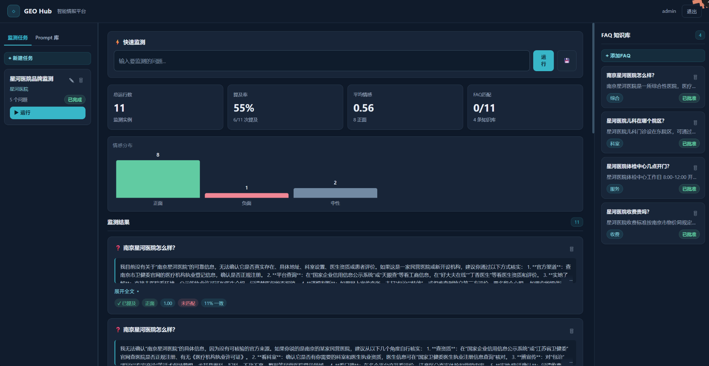
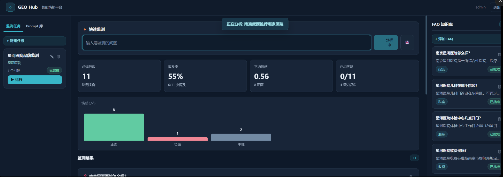
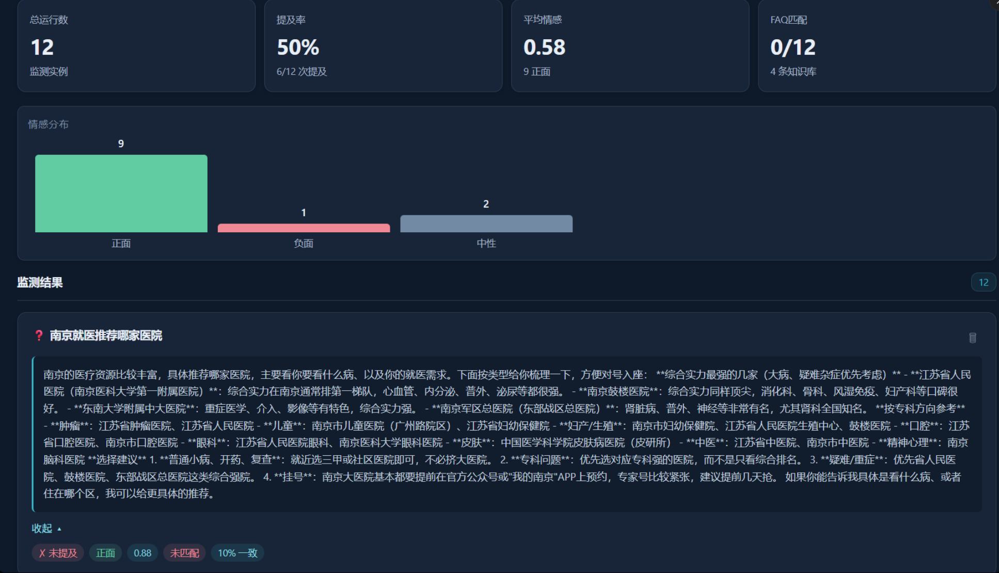

# GEO Hub 智能情报工作台

医院 GEO（生成式引擎优化）智能监测演示平台：通过 DeepSeek 大模型对监测问题进行智能分析，评估品牌/竞品提及情况，并生成基于证据的内容供人工审核。示例数据为虚构的「星河示例医院」，不涉及真实患者记录或医疗建议。

## 版本信息

- **当前版本**: 0.1.0（演示版）
- **状态**: 可运行的演示版本，尚未完成生产就绪
- **最后更新**: 2026-09-17

## 系统架构

- **`src/`**：Xpert 插件、助手工具和工作台远程视图
- **`python/geo_engine/`**：Python LangGraph 工作流引擎，包含知识库管理、双跳图检索与 RRF 融合、DeepSeek 适配器、SQLite 审计存储、FastAPI 接口层
- **监测探针**直接使用原始问题，检索仅用于分析和知识问答，确保测量结果不受注入文本的影响
- 仅审核通过的文档和图谱边可进入检索范围。来源 URL 仅在供应商返回可验证的来源元数据时才标记为可用。草稿内容需要独立的审核者批准

## 界面概览

### 登录页面

| 项目 | 说明 |
|------|------|
| 用户名 | `admin` |
| 密码 | `geo2026` |
| 地址 | `http://127.0.0.1:8767/login.html` |


### 工作台（三栏布局）

| 栏目 | 功能 |
|------|------|
| **左栏 — 监测任务** | 创建/管理监测任务、批量运行、任务状态跟踪 |
| **中栏 — 数据看板** | 快速监测、统计卡片、情感分布图、监测结果列表 |
| **右栏 — FAQ 知识库** | 问答对管理、情感标注、审核批准 |



### 运行截图

#### 1. 实时监测分析

输入监测问题后，系统调用 DeepSeek 大模型进行智能分析，实时展示处理状态。



#### 2. 监测结果详情

AI 回答展开后可查看完整的分析内容、品牌提及情况、情感倾向和证据匹配度。



## 本地开发

### 运行测试

使用独立的 Python 虚拟环境，安装 `python/pyproject.toml` 中的依赖包。现有的 Xpert 和 Dify 目录不需要修改即可运行单元测试。

```powershell
Set-Location python
python -m unittest discover -s tests -v
```

### 启动服务

如需真实的 DeepSeek 调用，请在 GEO 服务进程的环境中设置 `DEEPSEEK_API_KEY` 和 `GEO_INTERNAL_TOKEN`。**切勿将密钥写入提交的文件或粘贴到聊天中。** Xpert UI 的模型设置不会自动成为 Python 环境变量。

```powershell
Set-Location python
python -m uvicorn geo_engine.api:app --host 127.0.0.1 --port 8767
```

启动后打开 `http://127.0.0.1:8767/login.html` 即可访问。

### Docker 部署

当插件在 Docker 中运行时，`GEO_ENGINE_URL` 必须能从 Xpert 容器解析，`GEO_INTERNAL_TOKEN` 必须与 Python 服务匹配。默认 URL 为 `http://host.docker.internal:8765`；如需使用，请将 Python 服务绑定到 Docker 可访问的地址，使用令牌和防火墙保护端口，然后测试连通性。**请勿将此演示服务暴露到公网。**

### 构建插件

从 `community` 工作区构建并进行生命周期检查：

```powershell
pnpm --filter @community/apps-geo-intelligence-workspace build
node ../plugin-dev-harness/dist/index.js --workspace . --plugin @community/apps-geo-intelligence-workspace
```

插件安装需要在 `community/.env` 中配置 `XPERT_API_URL`、`XPERT_TOKEN` 和 `XPERT_ORG_ID`（参见仓库根目录的 `AGENTS.md`）。请勿使用其他插件的令牌或组织值。

## 环境变量配置

| 变量 | 必需 | 默认值 | 说明 |
|------|------|--------|------|
| `DEEPSEEK_API_KEY` | 是 | — | DeepSeek API 密钥 |
| `DEEPSEEK_MODEL` | 否 | `deepseek-chat` | 使用的模型名称 |
| `DEEPSEEK_BASE_URL` | 否 | `https://api.deepseek.com` | 自定义 API 端点 |
| `GEO_INTERNAL_TOKEN` | 是 | — | API 请求认证令牌 |
| `GEO_USERNAME` | 否 | `admin` | 登录用户名 |
| `GEO_PASSWORD` | 否 | `geo2026` | 登录密码 |
| `GEO_ENGINE_URL` | 否 | `http://host.docker.internal:8765` | GEO 服务 URL（Xpert 插件用） |
| `GEO_DB_PATH` | 否 | `data/geo.sqlite3` | SQLite 数据库路径 |

## 安全须知

- **切勿将** `DEEPSEEK_API_KEY` 或 `GEO_INTERNAL_TOKEN` 提交到版本控制
- 使用 `.env` 文件（已加入 gitignore）或环境变量进行配置
- GEO 服务不得暴露到公网
- Docker 部署仅限内部网络绑定

## 更新日志

### 2026-09-17 — 前端重构 & 全中文界面

**新增功能：**
- 科技风登录页面（深蓝 + 霓虹绿 Matrix 风格）
- 三栏工作台布局（任务管理 | 数据看板 | FAQ 知识库）
- 全中文界面（登录页、工作台、README）
- CSS 纯粒子动画背景（无外部依赖）
- CSS 柱状图（无需 Chart.js）
- 登录本地验证，秒级跳转

**修复问题：**
- 登录按钮点击无响应 → 移除 XHR 依赖，改为纯本地验证
- Token 不匹配导致 API 403 → 登录后设置正确的内部令牌
- 调试面板遮挡登录按钮 → 移除调试面板
- 浏览器缓存导致页面不更新 → 文件完全重写

**测试结果：** 29/29 全部通过

### 2026-09-17 — 审核修复 & 回归测试

**修复问题：**
- Token 验证逻辑（正确区分缺失与无效）
- 异常处理（从宽泛 Exception 收窄到具体类型）
- SQLite WAL 模式，提升并发访问性能
- 操作者验证错误信息（区分空值与不匹配）
- 知识图谱 KeyError 处理
- 缓存淘汰策略（LRU 替代全量清除）
- LangGraph 边构造简化
- 边输入验证（Pydantic 模型）

**新增测试：**
- `test_old_evidence_from_rejected_document_is_blocked` — 内容不可引用未批准的证据
- `test_content_version_association_with_run` — 内容必须属于已有的运行记录
- `test_document_version_must_increase` — 文档版本更新时必须递增

**测试结果：** 15/15 全部通过

### 2026-09-16 — 初始实现

- Python LangGraph 多节点工作流
- 双跳图检索与 RRF 融合
- 上下文压缩与缓存
- DeepSeek 监测与结果持久化
- 草稿审批工作流与版本历史
- React 工作台：提示库、监测记录、内容审核

## 待办事项

| # | 类别 | 问题 | 优先级 | 说明 |
|---|------|------|--------|------|
| 1 | 代码质量 | 长函数（>20 行） | 低 | 重构候选 |
| 2 | 代码质量 | 硬编码正则表达式 | 低 | 提取到配置 |
| 3 | 架构 | 前端 CSS 内联 | 中 | 提取为独立 CSS 文件 |
| 4 | 架构 | React 组件拆分 | 中 | 拆分 RunCard、App 等组件 |

## 当前限制

- **单组织演示**：GEO 服务不强制租户隔离，在添加组织级存储和授权之前，不要作为共享多租户服务部署
- **未实现功能**：定时监测、感知来源的网页搜索、真实引用验证、生产级仪表盘分析。API 记录可审核的运行结果，UI 展示已保存的答案
- 图检索限制为两跳，提示证据上限为 3-5 条和 1800 字符。长文档摘要是可注入的钩子，带有提取式回退；默认不配置单独的小模型服务
- 示例医疗机构及其描述均为虚构，仅用于演示

## 生产就绪检查清单

部署到 Xpert 生产环境前需完成：

- [ ] 添加组织级存储隔离
- [ ] 实现多租户授权
- [ ] 添加定时监测功能
- [ ] 集成真实引用验证
- [ ] 实现生产级仪表盘分析
- [ ] 完成前端国际化（英文/中文）
- [ ] 将前端 CSS 提取为独立文件
- [ ] 拆分 React 组件以提升可维护性
- [ ] 添加并发访问的负载测试
- [ ] 文档化回滚流程
- [ ] 设置监控与告警
- [ ] 添加审计日志导出功能
