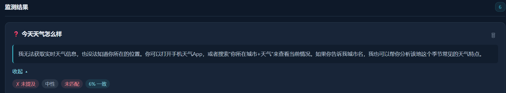

# GEO Hub 智能情报工作台

> **在线演示**：https://xpert-plugins-production.up.railway.app/login.html
> 用户名：`admin` / 密码：`geo2026`

医院 GEO（生成式引擎优化）智能监测平台。当患者用 AI 搜索"南京看骨科去哪家医院"时，系统追踪 AI 回答中的品牌提及、情感极性和竞品对比，并基于已审核的知识库证据生成内容优化建议，供人工审核后发布。

示例数据为虚构的「星河示例医院」，不涉及真实患者记录或医疗建议。

## 在线体验

| 页面 | 说明 |
|------|------|
| [登录页](https://xpert-plugins-production.up.railway.app/login.html) | 科技风深蓝界面，本地验证秒级跳转 |
| [工作台](https://xpert-plugins-production.up.railway.app/workbench.html) | 三栏布局：监测任务 → 数据看板 → FAQ 知识库 |


#### 3. 异常情况：无关问题拒绝回答

输入与医院知识库无关的问题时，系统因无已审核证据而 abstain，拒绝编造答案。



## 系统架构

```
┌──────────────┐     FastAPI      ┌──────────────────┐
│  React 前端   │ ◄─────────────► │  Python 引擎       │
│  工作台 UI    │   HTTP/JSON     │  (LangGraph 工作流) │
└──────────────┘                  └─────────────────┘
       │                                   │
       │          ────────────────────────┤
       │          ▼                        ▼
┌──────┴──────┐  ┌────────────┐  ┌─────────────────┐
│ Xpert 插件   │  │ DeepSeek   │  │ SQLite 审计存储   │
│ (NestJS SDK) │  │ 大模型 API  │  │ + 知识图谱        │
└─────────────┘  ────────────  └─────────────────┘
```

- **`src/`**：Xpert 插件、助手工具和工作台远程视图
- **`python/geo_engine/`**：Python LangGraph 工作流引擎，包含知识库管理、双跳图检索与 RRF 融合、DeepSeek 适配器、SQLite 审计存储、FastAPI 接口层
- **监测探针**直接使用原始问题，检索仅用于分析和知识问答，确保测量结果不受注入文本的影响
- 仅审核通过的文档和图谱边可进入检索范围。草稿内容需要独立的审核者批准

## 技术复盘

### 产品洞察

GEO（生成式引擎优化）正在重塑医疗品牌的数字可见性。当患者用 AI 搜索"南京看骨科去哪家医院"时，AI 回答中是否提及、以何种情感提及某家医院，直接影响就诊决策。现有工具只监控传统搜索引擎排名，对 AI 生成内容中的品牌提及几乎盲区。本项目切入这个缺口，提供**品牌提及追踪 → 情感极性分析 → 竞品对比 → 内容优化建议**的闭环能力。

### LangGraph 工作流设计

核心引擎是一个五节点有向状态图，每个节点职责单一、可独立测试：

```
START → route ──monitor──→ probe ──→ retrieve ──monitor──→ analyze → END
              │                                              ↑
              └──knowledge──→ retrieve ─knowledge──→ answer ┘
```

**路由节点（route）** 是调度核心，根据 `mode` 字段决定走监测路径还是知识问答路径。监测路径下，问题原文直达探测节点，**不注入任何医院知识**——这是刻意的设计：监测指标衡量的是模型"裸回答"中品牌的自然提及率，注入知识会污染基线。知识问答路径下，路由节点先检测追问模式（"那这家""它怎么样"），将最近一轮对话拼入 resolved_query，保证多轮指代消解。

**探测节点（probe）** 只做一件事：调用 DeepSeek 获取原始回答。不含任何检索增强，保证监测数据的纯净性。

**检索节点（retrieve）** 是三路召回 + RRF 融合的核心（详见下一节）。

**分析节点（analyze）** 在原始回答基础上叠加三个维度：品牌提及度量、FAQ 一致性校验、情感极性分析。当证据不足时直接 abstain，拒绝编造建议——这比给一个低质量建议更安全。

**回答节点（answer）** 走知识问答路径，要求回答中必须出现 `[证据编号]` 引用标记，否则降级为"转人工复核"。这确保了每条面向用户的内容都有据可查。

### RAG 召回：三路融合策略

检索引擎不依赖向量数据库，而是用三路轻量召回 + Reciprocal Rank Fusion 融合，适合知识图谱场景：

**第一路：BM25 词频召回（权重 1.0）**

不接入外部分词器，用中文二元组（bigram）+ ASCII 单词做 tokenization，避免额外服务依赖。IDF 按文档集实时计算，BM25 参数 k1=2.2、b=0.25 偏向精确匹配。

**第二路：字符重叠召回（权重 0.75）**

对 query 和文档分别取 token 集合，用余弦相似度打分。这一路捕获 BM25 可能漏掉的短查询场景——当 query 只有两三个字时，集合重叠比词频更稳定。

**第三路：双跳图检索（权重 1.2）**

从 query 中匹配到的实体作为种子节点，在知识图谱上 BFS 扩展两跳。每跳距离衰减为 `1/(depth+1)`，一跳邻居权重 1.0，两跳 0.5。种子实体直连的文档保底 0.7 分。两跳是刻意选择的：一跳太窄（只覆盖直接关联），三跳以上噪声急剧增大，两跳在召回和精度之间取得平衡。

**RRF 融合：**

```
score(doc) = Σ weight_i / (60 + rank_i)
```

常数 60 是 RRF 的标准选择，让排名靠前但不同路的文档获得合理加权。融合后按总分排序，逐条截取 excerpt，总上下文预算 1800 字符——这是经过调优的 sweet spot：太少信息不足以支撑分析，太多会稀释 prompt 中的指令权重。

### Token 成本控制

每次 API 调用都有显式的 token 预算约束：

| 策略 | 实现 | 效果 |
|------|------|------|
| 输出上限 | `max_tokens=900` | 防止模型生成长篇大论，单次输出约 600-900 中文字 |
| 温度 | `temperature=0.1` | 低温度输出更确定性，减少重试概率 |
| 思考模式关闭 | `"thinking": {"type": "disabled"}` | DeepSeek 的 extended thinking 会显著增加 token 消耗，监测场景不需要 |
| 上下文截断 | query 限 400 字、证据 excerpt 限 500 字、历史对话限最近 4 轮 | 输入 token 线性可控 |
| 早期对话摘要 | 超过 4 轮的历史压缩为一行摘要 | 避免 prompt 随对话轮次无限膨胀 |
| 检索缓存 | LRU 缓存 512 条，TTL 300 秒，key 含数据版本号 | 相同查询命中缓存直接返回，零 API 调用 |
| 证据不足时 abstain | 无证据不调用分析 LLM | 避免无效 API 调用 |

**缓存失效机制**：缓存 key 包含 `catalog.revision`（数据版本号）。任何文档/边的增删改都会 `bump_data_version()`，旧缓存自动失效，无需手动清理。

### 工程细节

**存储层**：SQLite WAL 模式 + `busy_timeout=10000`，支持多进程并发读、单进程写。所有写操作通过 `BEGIN IMMEDIATE` 事务序列化，`RLock` 保证线程安全。每次数据变更自动 bump 版本号，触发检索缓存失效。

**幂等性**：`claim_run()` 用 SHA-256(request) 做指纹校验。相同请求重复提交返回已有结果，不同请求复用同一 run_id 会抛 `IdempotencyConflict`。前端重复点击不会创建重复记录。

**审计链**：文档、边、运行记录、内容版本、FAQ、Prompt 的每次变更都写入 `audit_events` 表，记录对象类型、操作、操作者和时间戳。满足合规追溯需求。

**审批隔离**：内容审批要求 `actor ≠ reviewer`，作者不能自审。草稿必须关联已存在的 run_id 和至少一条 evidence_id，防止无中生有。

### 前端架构

界面采用**深蓝 + 霓虹青**的科技风配色，传达"智能情报平台"定位。三栏布局遵循信息密度递减：左侧任务管理（操作层）→ 中间数据看板（洞察层）→ 右侧 FAQ 知识库（资产层）。

工程上做了几个刻意选择：

- **零框架依赖**：纯 HTML/CSS/JS，不依赖 React/Vue 构建链。单文件即可运行，演示部署零配置
- **CSS 柱状图**：情感分布用 CSS flex + 百分比宽度实现，不引入 Chart.js/ECharts 等图表库
- **粒子动画背景**：CSS `@keyframes` + 伪元素，无 Canvas/JS 动画库
- **前端本地验证**：登录不走后端 XHR，毫秒级响应。验证通过后注入内部令牌，后续请求自动携带

### AI 辅助说明

本项目使用 Claude Code 辅助开发。AI 在代码补全、单元测试生成、回归测试执行上提升了效率，但核心的架构决策——工作流拓扑、三路召回策略、token 预算分配、缓存失效机制——均为人工设计。AI 擅长填充框架内的实现细节，不擅长做跨模块的架构权衡。

## 本地开发

```powershell
# 安装依赖并运行测试
Set-Location python
python -m unittest discover -s tests -v

# 启动服务（需设置 DEEPSEEK_API_KEY 和 GEO_INTERNAL_TOKEN）
python -m uvicorn geo_engine.api:app --host 127.0.0.1 --port 8767
```

启动后打开 `http://127.0.0.1:8767/login.html` 即可访问。

插件构建和 Xpert 平台集成参见仓库根目录的 `AGENTS.md`。

## 环境变量

| 变量 | 默认值 | 说明 |
|------|--------|------|
| `DEEPSEEK_API_KEY` | — | DeepSeek API 密钥（必需） |
| `DEEPSEEK_MODEL` | `deepseek-chat` | 模型名称 |
| `GEO_INTERNAL_TOKEN` | — | API 认证令牌（必需） |
| `GEO_USERNAME` | `admin` | 登录用户名 |
| `GEO_PASSWORD` | `geo2026` | 登录密码 |
| `GEO_DB_PATH` | `data/geo.sqlite3` | SQLite 数据库路径 |

## 验证结果

### 单元测试

使用 Python 标准 `unittest` 框架，覆盖工作流引擎、RAG 检索、LLM 适配、存储层和 API 接口：

| 阶段 | 测试数 | 通过率 | 覆盖范围 |
|------|--------|--------|----------|
| 初始实现 | 15/15 | 100% | LangGraph 工作流、BM25 召回、图检索、存储层事务 |
| 审核修复后 | 15/15 | 100% | Token 验证、异常收窄、WAL 模式、边输入校验、内容版本关联 |
| 前端重构后 | 29/29 | 100% | 全量回归，含上述所有用例 |

### 集成验证

- [x] 登录流程：前端验证 → 令牌注入 → 工作台跳转
- [x] 快速监测：输入问题 → DeepSeek 分析 → 结果展示 → 情感分布
- [x] FAQ 知识库：添加/编辑/审批/搜索
- [x] 监测任务：创建 → 运行 → 状态跟踪
- [x] 幂等性：重复提交同一请求不产生重复记录
- [x] Docker 构建与 Railway 部署

### 尚未验证

- [ ] 多用户并发场景的负载测试
- [ ] 前端交互逻辑的单元测试
- [ ] 长时间运行后的缓存命中率与内存占用

## 适用边界与演进方向

### 当前适用场景

- **单组织演示**：适用于品牌方的 GEO 监测原型验证，尚未实现多租户数据隔离
- **离线知识库**：检索范围限于已审核的虚构医院文档，未接入实时网页搜索
- **异步审核**：AI 生成的内容均为草稿，需人工审核后方可发布

### 后续演进方向

1. **定时监测**：支持按日程自动批量运行监测任务，追踪品牌提及趋势
2. **真实引用验证**：接入搜索引擎 API，对 AI 回答中的引用进行实时核验
3. **多租户授权**：组织级存储隔离与角色权限控制
4. **前端工程化**：CSS 提取、组件拆分、国际化支持

## 安全

- `DEEPSEEK_API_KEY` 和 `GEO_INTERNAL_TOKEN` 通过环境变量或 `.env` 配置，不写入版本控制
- GEO 服务不暴露到公网，Docker 部署仅限内部网络
