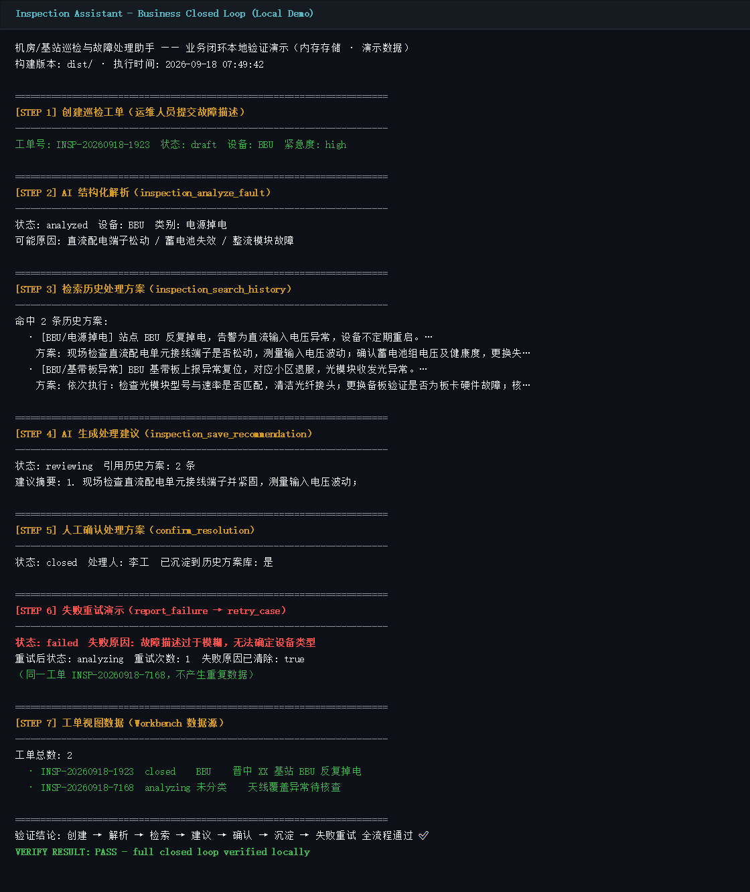
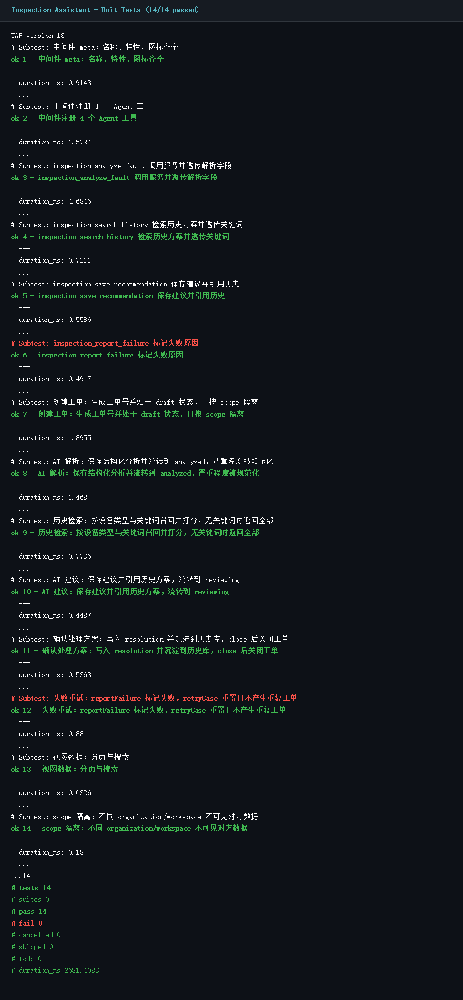
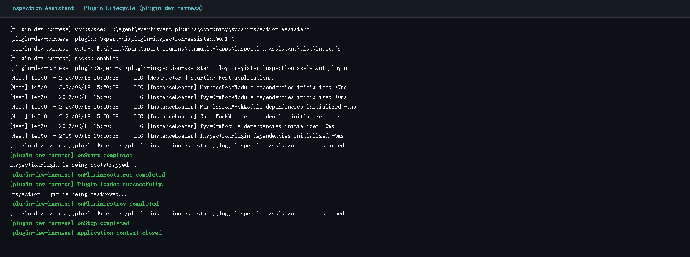

# 机房/基站巡检与故障处理助手（Inspection & Fault Handling Assistant）

面向通信机房/基站的 Agentic 业务应用插件。运维人员在 Workbench 中提交故障描述后，
AI 助手自动完成 **结构化解析 → 紧急程度评估 → 历史处理方案检索 → 处理建议生成**，
运维人员人工确认/修改处理方案并沉淀到历史方案库；AI 分析失败可一键重试，全程数据持久化可恢复。

## 业务场景与核心流程

真实业务场景：通信运营商维护团队每日处理大量站点故障（BBU 掉电、RRU 驻波告警、传输光路中断、
动环高温等），依赖老师傅经验。本应用把故障处置经验数字化：

```
提交故障描述 → AI 结构化解析(设备/类别/紧急度/影响) → 检索历史处理方案(RAG)
→ AI 生成处理建议 → 人工确认/修改 → 保存并沉淀历史 → 失败可重试(不产生重复数据)
```

### 满足任务书验收点

| 验收点 | 实现 |
|---|---|
| 明确用户 | 运营商 O&M 工程师 / 基站维护人员 |
| 一条核心流程 | 故障工单从提交到确认关闭的完整闭环 |
| 可操作界面 | Workbench 远程组件：工单列表、详情、新建、确认、重试 |
| 一次真实 AI 处理 | Assistant 调用 4 个工具完成解析/检索/建议/失败上报 |
| 结果保存恢复 | TypeORM 持久化，工单与历史方案库重启后仍在 |
| 失败重试 | `failed` 状态 + `retryCount`，重试复用同一工单，不重复生成 |

## 插件组成（六件套）

| 部件 | 文件 | 说明 |
|---|---|---|
| 入口元信息 | `src/index.ts` | marketplace 内容、capabilities、runtime providers |
| 服务端模块 | `src/lib/inspection.plugin.ts` | NestJS `@XpertServerPlugin` + TypeORM |
| 数据模型 | `src/lib/entities/` | `InspectionCase`（工单）+ `InspectionHistoryRecord`（历史方案库） |
| Agent 中间件工具 | `src/lib/inspection.middleware.ts` | 4 个 Agent 工具（见下） |
| Workbench 远程组件 | `src/lib/remote-components/inspection__remote/app.js` | React 自包含界面 |
| Assistant 模板 | `src/xpert-inspection-assistant.yaml` | 业务助手 DSL |

### Agent 工具

| 工具 | 作用 |
|---|---|
| `inspection_analyze_fault` | 保存 AI 故障解析（设备类型、故障类别、紧急程度、影响、可能原因） |
| `inspection_search_history` | 按设备类型 + 关键词检索历史处理方案（带打分排序） |
| `inspection_save_recommendation` | 保存 AI 处理建议，引用检索到的历史方案 ID |
| `inspection_report_failure` | AI 无法分析时上报失败原因，进入可重试状态 |

### 数据模型

- `plugin_inspection_case`：工单（工单号、标题、设备类型、故障描述、紧急程度、影响范围、
  状态机、AI 解析 JSON、AI 建议、历史引用、失败原因/重试次数、人工确认方案、处理人/时间）
- `plugin_inspection_history_record`：历史处理方案库（设备类型、故障类别、关键词、描述、
  处理方案、效果、来源工单号）——由内置种子知识 + 已确认工单自动沉淀

状态机：`draft → analyzing → analyzed → reviewing → confirmed → closed`，任意环节可 `failed → analyzing`（重试）。

## 构建与验证

```bash
# 安装（在 community 工作区）
pnpm install --filter @xpert-ai/plugin-inspection-assistant...

# 构建
pnpm --filter @xpert-ai/plugin-inspection-assistant build

# 单元测试（Windows 下用 PowerShell 展开文件列表）
node node_modules/tsx/dist/cli.mjs --test tests/inspection.service.spec.ts tests/inspection.middleware.spec.ts

# 插件生命周期验证（在仓库根）
node plugin-dev-harness/dist/index.js --workspace community/apps/inspection-assistant \
  --plugin "@xpert-ai/plugin-inspection-assistant"
```

验证结果（本分支开发时实测）：
- `tsc` 构建通过，`copy-assets` 产出 dist（含 yaml 与 remote 组件）
- 单元测试 14/14 通过（服务层 8 项 + 中间件 6 项）
- plugin-dev-harness 生命周期：register / Nest 初始化 / onStart / bootstrap / destroy / stop 全部成功

## 运行截图（本地验证）

> 以下截图均为本分支真实运行输出（`scripts/demo.mjs` 调用编译产物 `dist/` 完成业务闭环；
> 测试与生命周期验证使用真实命令执行）。数据为演示数据（内存存储），部署到 Xpert 平台后的
> 在线运行效果待审阅阶段在真实环境中补充。

### 1. 业务闭环演示（创建 → AI 解析 → 历史检索 → AI 建议 → 人工确认 → 沉淀 → 失败重试）



### 2. 单元测试 14/14 通过



### 3. 插件生命周期验证（plugin-dev-harness）



## 演示路径（部署到 data-xpert 后）

1. 在 Workbench 点「+ 新建巡检工单」，填写设备类型与故障描述（如：XX 基站 BBU 反复掉电）
2. 点「发送到 Assistant 分析」→ Assistant 调用工具完成解析、检索、建议，Workbench 自动刷新
3. 查看 AI 解析结果与历史方案引用，在「处理结果」中填写/修改处理方案并确认（可关闭工单）
4. 若分析失败，工单进入失败状态，点「重置并重试」重新分析，同一工单不重复
