# 准入资料核验

小型插件功能验证：业务人员保存资料原文，由助手提取管理层稳定性、股票质押比例及资产负债率，人工核验、保存草稿、服务端试算后确认结果。

适用于需要反复核对资料、复制指标和记录修改依据的业务人员。AI 负责整理候选和原文证据；人工负责最终确认，减少重复录入并保留核验过程。

## 使用流程与架构

1. 在宿主组织内从插件模板创建助手，选择已有的宿主模型并发布。
2. 工作台新建案例，填写评估基准日、名称和资料原文，保存后发起提取。
3. 核对候选和原文证据，填写离职次数、统计窗口、比例报告日及口径核验项；可随时保存未完成的人工草稿。
4. 点击“试算”，查看逐项得分、待补项和独立负面规则。修改输入后旧试算失效，须重新试算；修正候选或已保存完整草稿的人工输入需说明原因。
5. 三项有效后“确认并保存”，服务端重新验证计算并保存快照。刷新、重新进入从服务器恢复；旧确认显示“历史核验记录，未评分”。

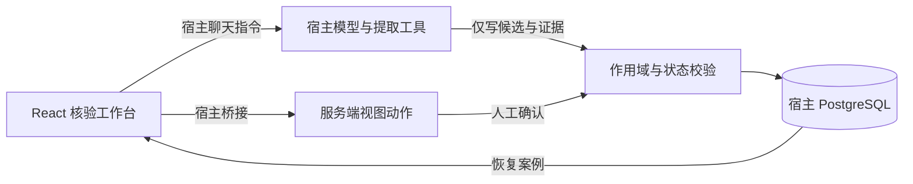

界面由左侧案例列表、右侧原文与指标表单、确认对话框组成。原文、AI 候选、人工确认值和事件分开保存；iframe 不使用浏览器存储。没有插件专用数据库服务或独立后端。

## 当前实现

- 案例列表、原文输入、三项候选及证据、人工草稿、修改原因和评分确认。
- 候选与人工确认分开保存，使用宿主 PostgreSQL 的案例和事件表。
- 重复创建和确认可识别；版本冲突、身份范围和过期提取在服务端检查。
- 固定规则 `admission-three-indicators-v1`，显示“选定指标试算 X/15 分”；资产负债率严格 >80% 命中单条负面规则。
- 缺失/冲突/口径或日期不符时保存草稿但无完整总分；缺少资料应新建补充资料案例。
- 提取失败保留输入，可重试；不添加通用规则引擎、OCR、外部数据或自动训练。

详细边界、合成样例和增量升级见[固定规则与草稿](docs/scoring.mdx)。只处理原文明确披露的百分比，最多四位小数，不做分子分母换算。统一基准日和管理层范围是功能验证约定，不宣称覆盖全部业务政策。

## 构建与安装

在 community 工作区按其 packageManager 使用 Corepack pnpm。推荐在 Docker 中执行，Linux 依赖不可与 Windows 依赖目录混用。

```sh
corepack pnpm --filter @xpert-ai/plugin-lease-admission-review... install
corepack pnpm --filter @xpert-ai/plugin-shadcn-ui build
corepack pnpm --filter @xpert-ai/plugin-lease-admission-review build
corepack pnpm --filter @xpert-ai/plugin-lease-admission-review typecheck
corepack pnpm --filter @xpert-ai/plugin-lease-admission-review test
corepack pnpm --filter @xpert-ai/plugin-lease-admission-review verify:dist
```

遵循根目录 `plugin-dev-harness/README.md` 执行生命周期检查。安装级别为 `system`，命名空间为 `lease_admission_review`，在 Default tenant 使用 tenant scope。安装前配置宿主允许的插件目录，并确保 API 容器能够读取构建产物。

通过宿主 `plugin:deploy:local` 安装，按返回值重启并验证运行；然后从模板创建助手、绑定宿主模型并发布。模型地址、密钥和具体参数不属于插件配置，不得写入源码或模板。

## 验证状态

2026-09-22 在官方 Xpert Docker API/Web、PostgreSQL、Redis 环境完成以下验证，使用合成数据：

| 层次 | 已验证内容 |
| --- | --- |
| 构建 | TypeScript 类型检查、服务端及 React 资源构建 |
| 生命周期 | 官方 plugin-dev-harness 加载、初始化与关闭；基础设施使用 mock |
| 业务 | 5 项测试通过，无跳过；包括真实 PostgreSQL 事务、幂等确认、作用域隔离、失败重试、旧结果保护 |
| 真实宿主 | 模型提取、零值保留、证据、人工修正、缺少原因被拒绝、确认、刷新及重新进入恢复 |
| 可控失败 | 停用隔离环境的宿主模型，原文保留、超时后可重试；恢复启用后同案例真实提取与确认成功 |

上表保留前期提取确认闭环证据。本轮增加10项规则及真实PostgreSQL测试（无跳过），包含阈值、日期、口径、草稿恢复、版本冲突、四维隔离及旧记录兼容。可控模型故障、重启恢复与包检查见[本地验证](docs/setup.mdx)。本插件不表示完整评分系统已完成。

0.2真实宿主已验证：正常案例14分草稿保存/恢复，依据原文修正到15分且确认要求原因；缺失案例只能保存草稿；80.0001%得到7分并命中单条负面规则。三场景均由真实模型写入候选，随后经页面核验，刷新和离开重入恢复。

## 0.2.1 工作台与权限验证

页面按“材料与 AI 候选、人工核验、评分结果”组织；AI 原始候选只读展开，评分逐项显示核验值、命中档位及得分，待补项按指标去重。基准日旁提示所需统计窗口，实际覆盖范围仍须人工核对。底部操作区固定显示保存状态和确认条件，窄视图默认收起案例列表，取消确认框后恢复按钮焦点。

两个通过官方 API 创建的普通 VIEWER 账号已分别完成真实模型提取、草稿保存和刷新恢复。相互请求对方详情、草稿、试算和确认均被拒绝；写动作返回插件的 not_found。撤销测试组中的助手使用权限后，原会话查询和动作收到宿主 HTTP 403，重入不再挂载插件；验收后已恢复测试组权限。只读数据库审计证明越权请求没有增加事件、候选保持独立，正常案例只有一条确认事件。

已检查 1366×768、1920×1080 页面及实际 550px 宽的宿主视图，覆盖列表折叠、固定操作区、键盘试算/确认取消、后台刷新保护和保存失败保留输入。API 重启后，两个普通账号分别从 localhost 与 127.0.0.1 恢复确认或草稿。本轮浏览器权限结论限定同租户、同组织、同助手的不同用户；跨租户/组织/助手继续由真实数据库服务测试覆盖。

操作示例及版本升级见[工作台演示](docs/walkthrough.mdx)。0.2.1 不新增依赖、业务服务、数据表或迁移，不改变固定规则和桥接接口。

### 真实界面

0.2.1 普通笔记本窗口中的确认结果与评分依据：

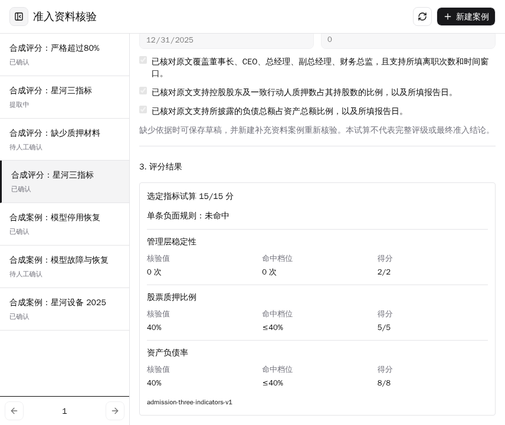

草稿待补项与固定操作区；窄视图可展开或收起案例列表：

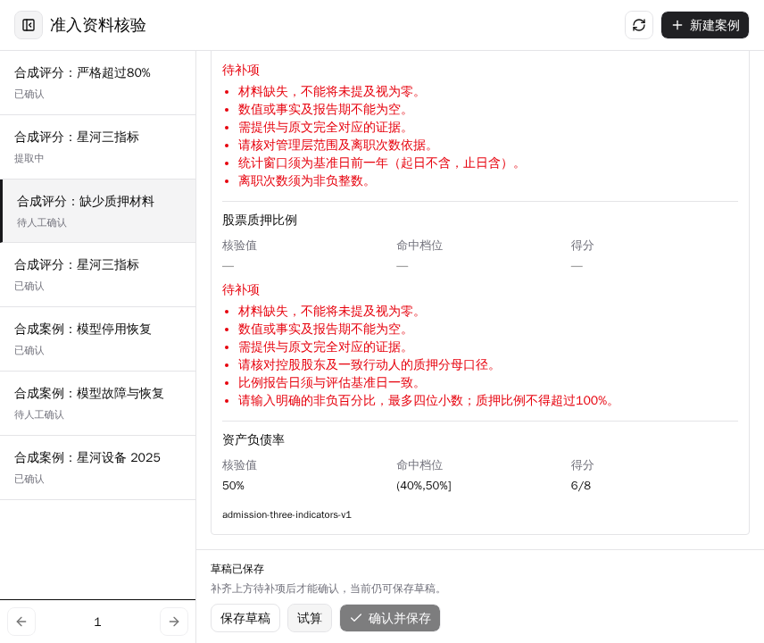
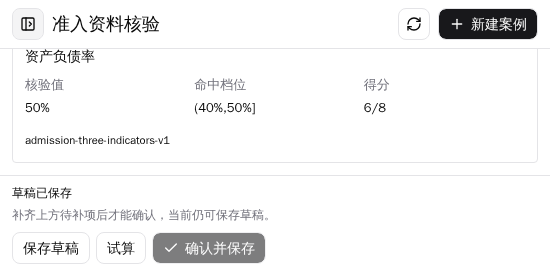

独立普通账号只能看到自己的合成确认案例：

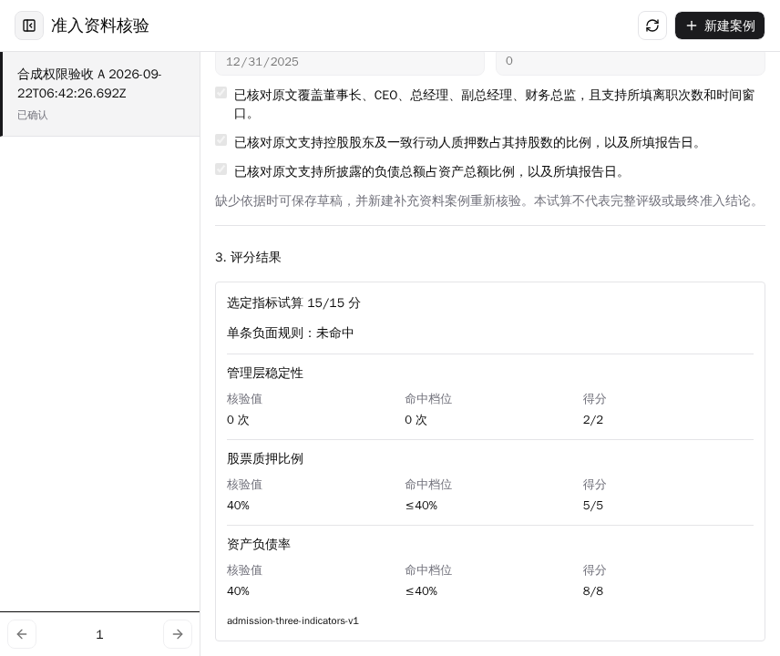

已安装视图的暗色主题协议检查（由实际父页面发送主题消息，随后恢复原主题）：

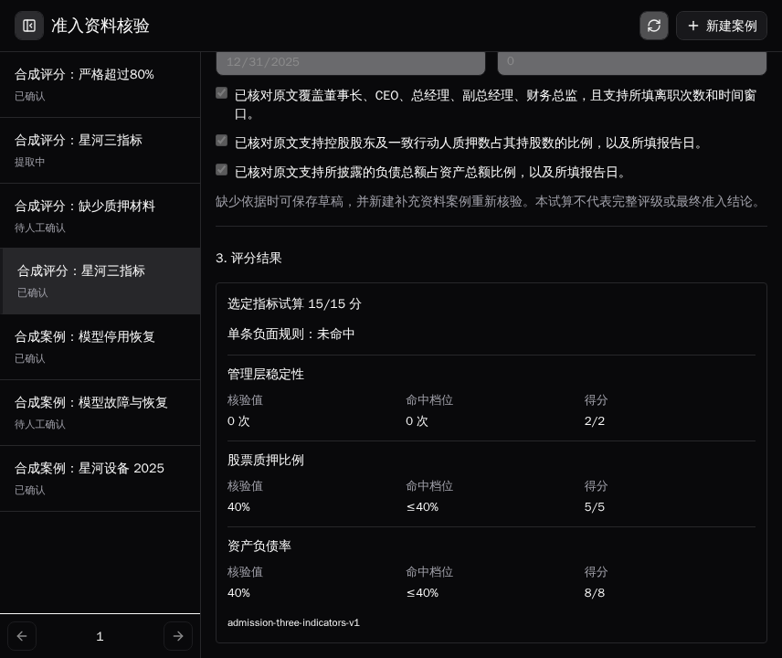

### 0.2 历史流程截图

以下截图均来自真实宿主中的插件工作台，资料为虚构样例。

固定三指标试算、人工评分输入和确认快照：

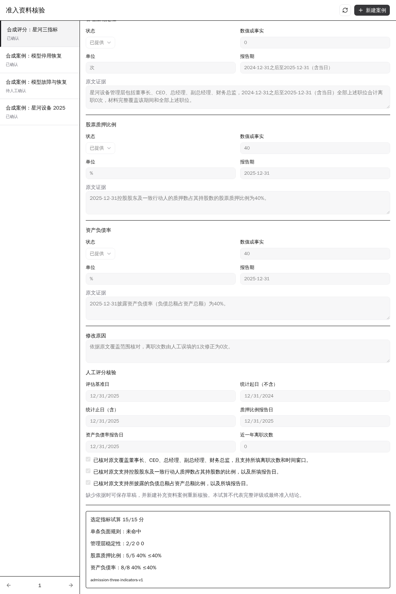

缺失资料允许存草稿，禁止完成评分确认：

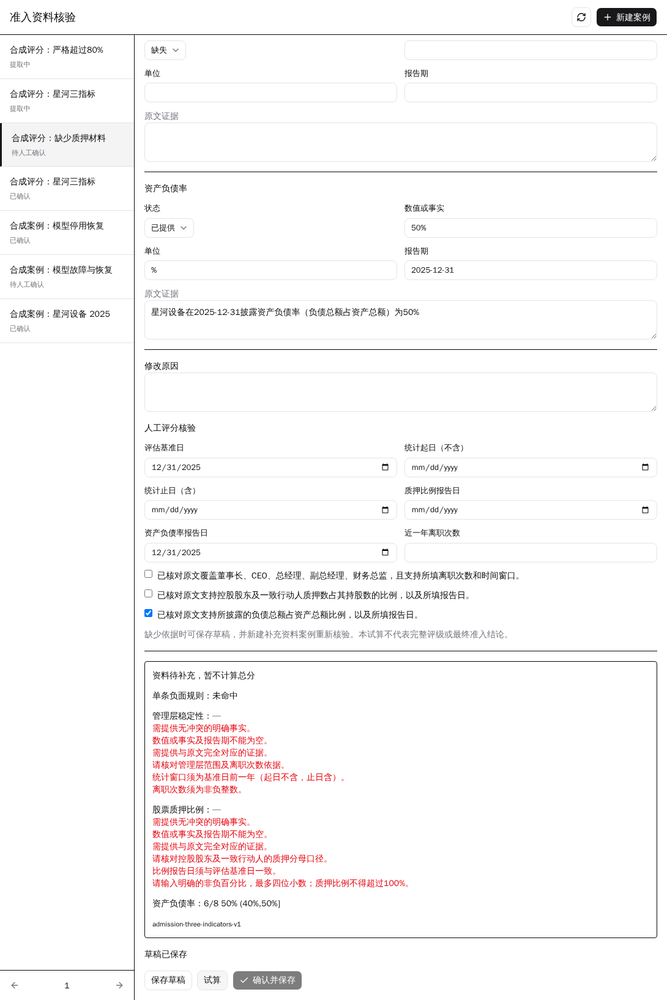

严格超过80%的单条负面规则：

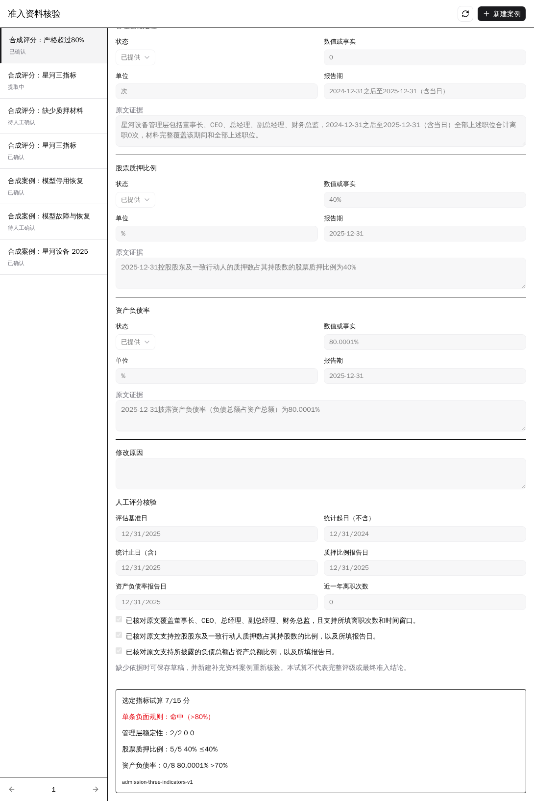

候选、单位、报告期和原文证据：

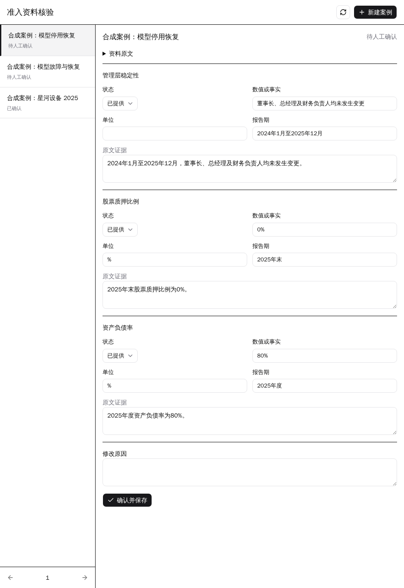

人工修正后的确认结果及修改原因：

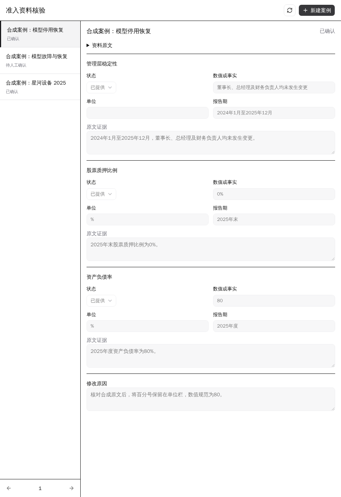

刷新和重新进入后恢复：

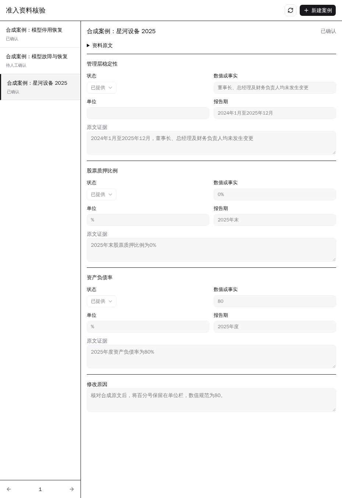

模型停用导致提取失败，原文保留并可以重试（详情超时转换时截图，列表状态下一次刷新同步）：

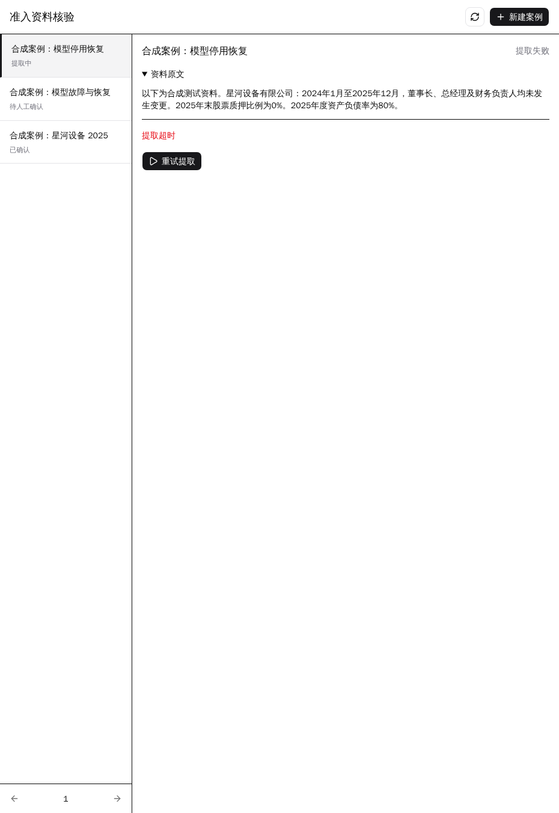

## 复用与限制

复用 Xpert SDK、官方插件服务与工作台模式、当前仓库 shadcn 组件及桥接协议，遵循 AGPL-3.0。代码由 AI 辅助开发，范围、权限边界和结果需通过类型、行为及真实平台验证。

AI 协作用于搭建 SDK 入口、候选 schema、React 表单、事务及验收脚本；人工确定了“只提取、必须人工确认、复用宿主存储”的边界。验证中修正了 CommonJS 导出、iframe 随机 ID、模型运行选项绑定及宿主桥接问题。通过真实调用和 PostgreSQL 行为断言核对结果，未复制真实公司资料。

已完成上述两账号浏览器权限验收，未实现历史案例检索。未保存的人工修改在整页刷新后会丢失；原文、AI候选、已保存人工草稿及确认快照可恢复。原文子串匹配不能自动证明语义正确，人工须核对证据与评分输入的对应关系。模型失败若没有有效工具回执，详情查询会在五分钟后将该次提取标记超时，之后可以重试。

模型只提供候选，不代表事实已核实或最终准入结论。案例保存是业务反馈积累，不代表模型已训练。
