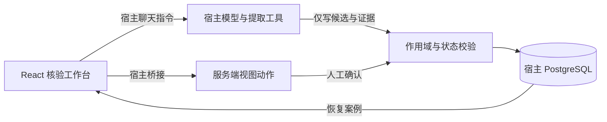

# 准入资料核验

小型插件功能验证：业务人员保存资料原文，由助手提取管理层稳定性、股票质押比例及资产负债率，人工修正确认后保存结果。

适用于需要反复核对资料、复制指标和记录修改依据的业务人员。AI 负责整理候选和原文证据；人工负责最终确认，减少重复录入并保留核验过程。

## 使用流程与架构

1. 在宿主组织内从插件模板创建助手，选择已有的宿主模型并发布。
2. 工作台新建案例，填写名称和资料原文，保存后发起提取。
3. 核对三项候选、报告期、单位和证据；修改字段时填写原因。
4. 点击“确认并保存”，再次确认后生成服务端记录。刷新或重新进入后从服务器恢复。



界面由左侧案例列表、右侧原文与指标表单、确认对话框组成。原文、AI 候选、人工确认值和事件分开保存；iframe 不使用浏览器存储。没有插件专用数据库服务或独立后端。

## 当前实现

- 案例列表、原文输入、三项候选及证据、修改原因和人工确认。
- 候选与人工确认分开保存，使用宿主 PostgreSQL 的案例和事件表。
- 重复创建和确认可识别；版本冲突、身份范围和过期提取在服务端检查。
- 提取失败保留输入，可重试；不添加评分、OCR、外部数据或自动训练。

## 构建与安装

在 community 工作区按其 packageManager 使用 Corepack pnpm。推荐在 Docker 中执行，Linux 依赖不可与 Windows 依赖目录混用。

```sh
corepack pnpm --filter @xpert-ai/plugin-lease-admission-review... install
corepack pnpm --filter @xpert-ai/plugin-shadcn-ui build
corepack pnpm --filter @xpert-ai/plugin-lease-admission-review build
corepack pnpm --filter @xpert-ai/plugin-lease-admission-review typecheck
corepack pnpm --filter @xpert-ai/plugin-lease-admission-review test
corepack pnpm --filter @xpert-ai/plugin-lease-admission-review verify:dist
```

遵循根目录 `plugin-dev-harness/README.md` 执行生命周期检查。安装级别为 `system`，命名空间为 `lease_admission_review`，在 Default tenant 使用 tenant scope。安装前配置宿主允许的插件目录，并确保 API 容器能够读取构建产物。

通过宿主 `plugin:deploy:local` 安装，按返回值重启并验证运行；然后从模板创建助手、绑定宿主模型并发布。模型地址、密钥和具体参数不属于插件配置，不得写入源码或模板。

## 验证状态

2026-09-22 在官方 Xpert Docker API/Web、PostgreSQL、Redis 环境完成以下验证，使用合成数据：

| 层次 | 已验证内容 |
| --- | --- |
| 构建 | TypeScript 类型检查、服务端及 React 资源构建 |
| 生命周期 | 官方 plugin-dev-harness 加载、初始化与关闭；基础设施使用 mock |
| 业务 | 5 项测试通过，无跳过；包括真实 PostgreSQL 事务、幂等确认、作用域隔离、失败重试、旧结果保护 |
| 真实宿主 | 模型提取、零值保留、证据、人工修正、缺少原因被拒绝、确认、刷新及重新进入恢复 |
| 可控失败 | 停用隔离环境的宿主模型，原文保留、超时后可重试；恢复启用后同案例真实提取与确认成功 |

可控模型故障、重启恢复与最终包检查结果见 [本地验证](docs/setup.mdx)。此阶段验证提取确认闭环，不表示完整评分系统已完成。

### 真实界面

以下截图均来自真实宿主中的插件工作台，资料为虚构样例。

候选、单位、报告期和原文证据：


人工修正后的确认结果及修改原因：


刷新和重新进入后恢复：


模型停用导致提取失败，原文保留并可以重试（详情超时转换时截图，列表状态下一次刷新同步）：


## 复用与限制

复用 Xpert SDK、官方插件服务与工作台模式、当前仓库 shadcn 组件及桥接协议，遵循 AGPL-3.0。代码由 AI 辅助开发，范围、权限边界和结果需通过类型、行为及真实平台验证。

AI 协作用于搭建 SDK 入口、候选 schema、React 表单、事务及验收脚本；人工确定了“只提取、必须人工确认、复用宿主存储”的边界。验证中修正了 CommonJS 导出、iframe 随机 ID、模型运行选项绑定及宿主桥接问题。通过真实调用和 PostgreSQL 行为断言核对结果，未复制真实公司资料。

当前没有评分、单独保存人工编辑草稿、多用户浏览器验收或历史案例检索。未提交的人工修改刷新后会丢失；原文、已保存候选及已确认结果可恢复。模型失败若没有有效工具回执，详情查询会在五分钟后将该次提取标记超时，之后可以重试。

模型只提供候选，不代表事实已核实或最终准入结论。案例保存是业务反馈积累，不代表模型已训练。
