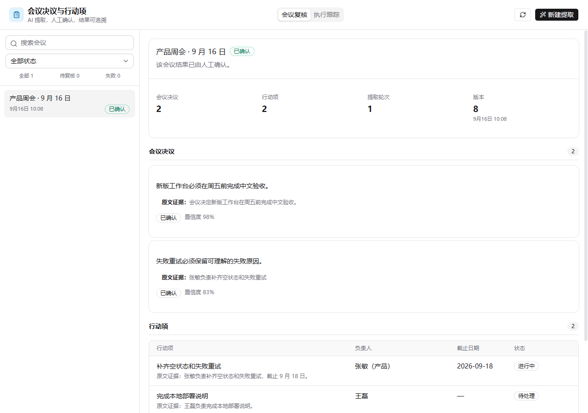
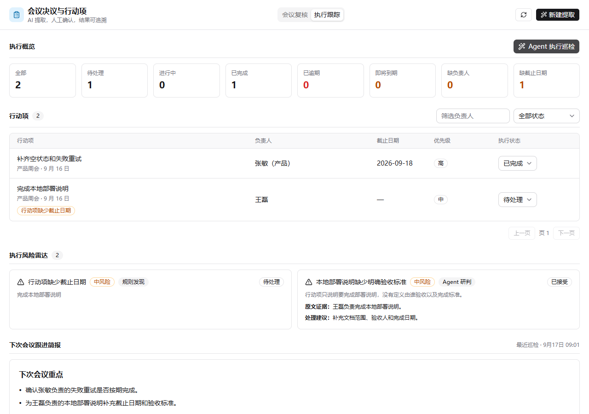
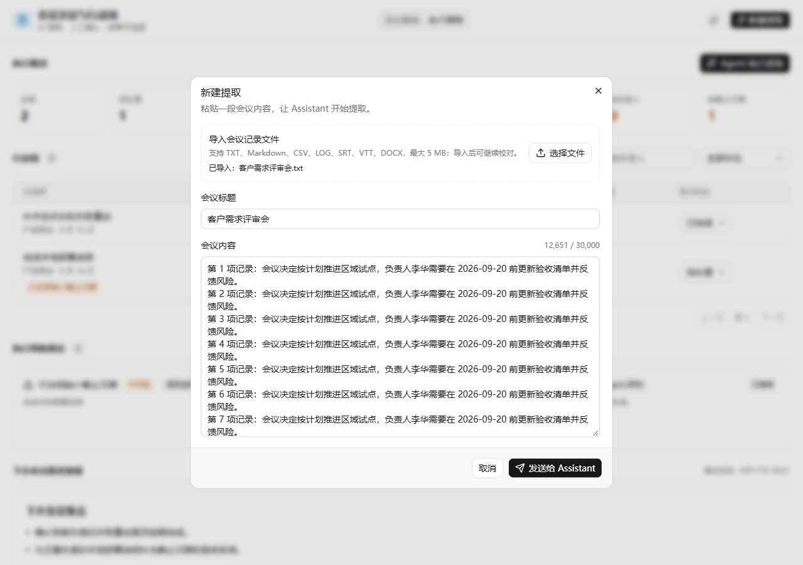

# Meeting Action Workbench

`@xpert-ai/plugin-meeting-action-workbench` 是一个中文 Xpert Agentic App，面向需要把会议结论真正落到执行上的项目负责人、产品负责人和团队负责人。它把“复制会议记录、人工整理、反复追问负责人”的流程收敛为：AI 从原文提取带证据的决议与行动项，用户复核确认后持续更新执行状态，再由确定性规则与 Agent 联合巡检风险并生成下次会议简报。

## 评审快速入口

- [5 分钟演示脚本](./docs/demo.mdx)：从真实模型提取、人工确认到执行巡检的完整讲解顺序。
- [架构与权限边界](./docs/architecture.mdx)：服务端持久化、Agent 工具、Workbench 和人工权限分工。
- [验证记录](./docs/verification.mdx)：自动化测试、插件生命周期与真实 Xpert 平台验收结果。
- [AI 协作说明](./docs/ai-collaboration.mdx)：Codex、DeepSeek 的使用范围、人工决策和问题修复记录。
- [隐私说明](./docs/privacy.mdx)：会议数据、模型传输、存储、日志与删除边界。
- [源码目录](./src)：服务端持久化、Agent 工具、Assistant 模板和 Remote View 实现。

本次最终验证基于 `xpert-ai/xpert-plugins@0df1e2e4a1ff4e7442e8fb4a42307ab59f42814b` 与 `xpert-ai/xpert@182f2f4a7d05d968016a9ec20a93833687c4394f`。应用目录不依赖本机绝对路径或私人包。

## 产品价值与范围

- 原文、AI 结果和人工复核位于同一工作台，减少在聊天窗口与文档之间来回复制。
- 每条决议和行动项保留原文证据、置信度与复核状态；负责人或截止日期无法确定时保留为空，不让模型猜测。
- `operationId`、唯一键和 `revision` 分别处理工具重试、候选项去重和人工并发冲突。
- 已确认行动项拥有独立执行状态；逾期、即将到期、缺负责人和缺截止日期由规则实时计算，含糊承诺、重复任务、决议冲突、依赖和负载集中由 Agent 基于证据研判。
- Agent 只能写入风险草案和跟进简报，不能代替用户修改执行状态、接受风险或确认任务完成。
- 当前版本不包含通知、日历、外部任务系统同步和全文会议纪要生成。

## 业务闭环

1. 用户在工作台新建提取，填写标题并粘贴会议原文，或导入 TXT、Markdown、CSV、LOG、SRT、VTT、DOCX 文件。
2. Assistant 调用 `meeting_begin_extraction` 保存原文并创建提取轮次。
3. AI 通过 `meeting_upsert_decision` 和 `meeting_upsert_action_item` 幂等写入结构化结果。
4. `meeting_finalize_extraction` 将会议推进到“待复核”；失败时使用 `meeting_report_extraction_failure` 保存安全错误信息。
5. 用户对照原文编辑负责人、截止日期、优先级、执行状态和内容，然后“确认全部结果”。
6. 确认后行动项从“待确认”进入“待处理”，刷新或重新进入应用时从数据库恢复。
7. 用户在“执行跟踪”页把行动项更新为待处理、进行中、已完成或已取消；写入仍受 revision 并发保护。
8. 工作台始终展示规则风险；用户可发起 Agent 执行巡检，Agent 只保存有原文证据的语义风险，并生成下一次会议跟进简报。
9. 用户对 Agent 风险执行接受、忽略或标记已处理，所有处置持久化到服务端。

服务端使用独立实体保存会议、决议、行动项、执行巡检、风险信号和操作回执；Remote View 只通过 Xpert iframe bridge 调用插件动作，不把业务数据放入浏览器 Local Storage。更详细的边界和并发策略见 [架构说明](./docs/architecture.mdx)。

## 环境与开发命令

要求 Node.js 22、pnpm 10.24.0、可运行的 Xpert 源码环境及 PostgreSQL。本文使用 Conda 环境 `xpert`：

```powershell
conda run -n xpert corepack pnpm --dir community --filter @xpert-ai/plugin-meeting-action-workbench lint
conda run -n xpert corepack pnpm --dir community --filter @xpert-ai/plugin-meeting-action-workbench build
conda run -n xpert corepack pnpm --dir community --filter @xpert-ai/plugin-meeting-action-workbench test
conda run -n xpert corepack pnpm --dir community --filter @xpert-ai/plugin-meeting-action-workbench verify:dist
```

`build` 会生成服务端入口、Assistant 模板以及 Remote View 的 `app.js`/`app.css`，`verify:dist` 检查这些工件与源码是否一致。

## 本地安装与使用

1. 在平台仓库中使用管理员凭证运行本地部署命令。插件为 system 级，稳定工件命名空间为 `meeting_action_workbench`；凭证应通过平台支持的安全登录或凭证存储提供，不要写入命令历史或仓库。

```powershell
corepack pnpm plugin:deploy:local `
  --plugin-dir <xpert-plugins-root>/community/apps/meeting-action-workbench `
  --scope tenant `
  --api-url http://localhost:3000 `
  --manifest-file <temporary-directory>/meeting-action-workbench-deployment.json
```

2. 若部署回执包含 `restartRequired: true`，重启 Xpert API，并确认 `/api/health/ready` 返回 `ready`，插件描述符的 `loadStatus` 为 `loaded`。
3. 在 Xpert“模型提供商”中配置 DeepSeek。若同时使用租户级 Copilot 和组织级 Assistant，需要分别为租户和目标组织选择主提供商与默认语言模型。API Key 只在本机平台配置中录入，不写入仓库、截图或日志。
4. 首次安装时从模板 `meeting-action-workbench-assistant` 创建并发布 Assistant；升级现有实例时使用 Assistant Settings 中的 “Update from Template”，不要新建替代实例。确认其绑定了本插件工具和“会议行动项” Workbench。
5. 打开 Assistant 的 Workbench，选择“新建提取”。可以直接粘贴内容，也可以导入不超过 5 MB 且提取后不超过 30,000 字符的 TXT、Markdown、CSV、LOG、SRT、VTT 或 DOCX 文件。导入后先在窗口中核对标题和全文，再提交给 Assistant。状态变成“待复核”后检查证据和空值，再编辑或确认。
6. 确认后切换到“执行跟踪”，更新行动项状态；选择“Agent 执行巡检”生成语义风险和下次会议简报，再由人工处置风险。

完整操作和排障说明见 [使用流程](./docs/usage.mdx) 与 [故障排查](./docs/troubleshooting.mdx)。插件自身不要求额外环境变量；模型凭证沿用 Xpert 平台的安全配置。

## 界面预览

下图由生产构建生成的 Remote View `app.js` 在自动化浏览器中运行并截取，不是静态原型；同一构建产物随后在已安装的本地 Xpert iframe 中完成复验。画面覆盖中文列表、已确认结果、证据、空截止日期和行动项状态：



升级后的执行工作台展示状态看板、规则风险、Agent 语义风险、人工处置和跟进简报：



文件导入界面在长记录下保持正文可滚动、底部提交按钮可见：



1024 像素紧凑视图见 [workbench-compact.png](./docs/assets/workbench-compact.png)。

## 异常与恢复示例

- 模型调用或结构化写入失败时，Assistant 调用 `meeting_report_extraction_failure`，会议保留原文并进入失败状态；用户可以对同一会议安全重试，不会创建第二条会议。
- 重复的 Agent 工具写入使用 `operationId` 返回已有回执；候选项还使用稳定 `itemKey` 去重。
- 并发修改触发 `MEETING_REVISION_CONFLICT` 或 `EXECUTION_REVIEW_REVISION_CONFLICT` 时，界面要求刷新最新数据后再提交，不会用陈旧版本覆盖他人结果。
- Remote View 同时检查 HTTP 状态和业务响应的 `success` 字段；业务失败不会被误报为保存成功。

## 已执行验证

2026-09-19 最终提交前复验结果：

- `lint`、`build`、`verify:dist` 全部通过。
- Node 测试 14/14 通过，覆盖 Schema、工件契约、TXT/DOCX 文件提取、文件限制、幂等、状态机、失败重试、执行状态、Agent 风险人工处置和 Remote View E2E。
- 长记录 E2E 自动上传 220 行文本，确认输入区可独立滚动、提交按钮保持可见，且 Assistant 收到的末行内容未被截断。
- `plugin-dev-harness` 在 dist-first、启用框架 mocks 的模式下完整通过 `register`、`onStart`、`onPluginBootstrap`、加载、`onPluginDestroy` 和 `onStop`。
- 本地 Xpert 已刷新并加载插件 0.3.0，API readiness 与 Cloud UI 正常；真实平台文件导入、长记录滚动和固定底部操作区已完成人工复验。第三步 DeepSeek `deepseek-v4-flash` 真实提取曾生成 1 条决议和 2 条行动项，其中无法确定的截止日期保持为空。
- 真实平台确认流程发现并修复了 PostgreSQL UPDATE 别名与 Remote View 业务失败误判两个问题；修复后的自动化回归与人工复验均已通过。数据库确认会议 revision 更新、审核时间落库、1 条决议和 2 条行动项全部确认，刷新后可恢复。
- 在用户明确授权发送合成/脱敏会议数据后，现有 Assistant 已保留身份并同步模板 v4，真实 DeepSeek 巡检依次读取执行上下文、创建巡检、保存 2 条 Agent 风险并生成下次会议简报；真实平台“执行跟踪”页同时展示 2 条规则风险和 2 条 Agent 风险。

详细证据与尚未完成项见 [验证记录](./docs/verification.mdx)。

## AI 协作说明

开发过程中使用 Codex 协助梳理需求、查阅 Xpert SDK 契约、生成实现草稿、运行测试与定位问题；实际产品范围、权限边界、数据模型和取舍由开发者确认。DeepSeek 仅在用户主动发起提取或执行巡检时处理会议上下文，并通过严格工具 Schema 写入候选结果。两者均不能绕过人工确认、租户/组织范围或 revision 并发保护。完整记录见 [AI 协作说明](./docs/ai-collaboration.mdx)。

## 安全、已知限制与后续方向

- 所有查询和写入均限定 `tenantId` 与 `organizationId`；工具输入拒绝未知字段，错误信息不向界面返回内部堆栈。
- 导入文件的二进制内容只用于当前请求中的文本提取，不写入数据库或日志；真正保存的是用户核对并提交后的会议原文。文件大小上限为 5 MB，提取文本上限为 30,000 字符，不会静默截断。
- 当前确认后不再允许修改已确认内容，只能更新行动项执行状态；删除/新增条目仍未实现。
- 规则风险是实时派生信息；Agent 风险和简报是持久化巡检快照。当前没有通知、周期调度、日历和 Jira/Trello 同步。
- 自动化截图覆盖成功、执行治理和失败重试；真实模型成功巡检已有平台级证据，真实模型失败与重试场景仍待补充平台级证据。
- 下一步最有价值的增强是提醒与升级策略、完整审计历史、任务依赖图以及外部任务系统同步。

## 开源复用与许可证

本包位于 [Xpert AI `xpert-plugins`](https://github.com/xpert-ai/xpert-plugins) 工作区，遵循仓库的插件结构、Plugin SDK 合约、共享 shadcn UI 和构建约定；业务实体、会议工具、Assistant 模板、Remote View、状态机与测试为本应用新增实现。包许可证为 `AGPL-3.0`，依赖项继续遵循各自许可证。
