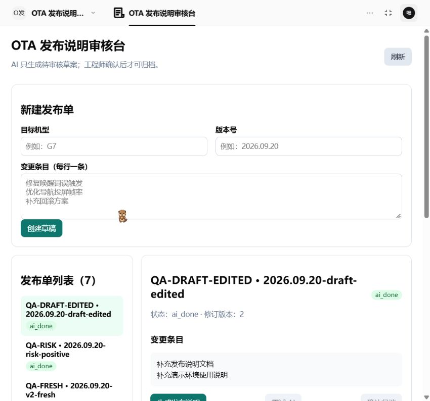
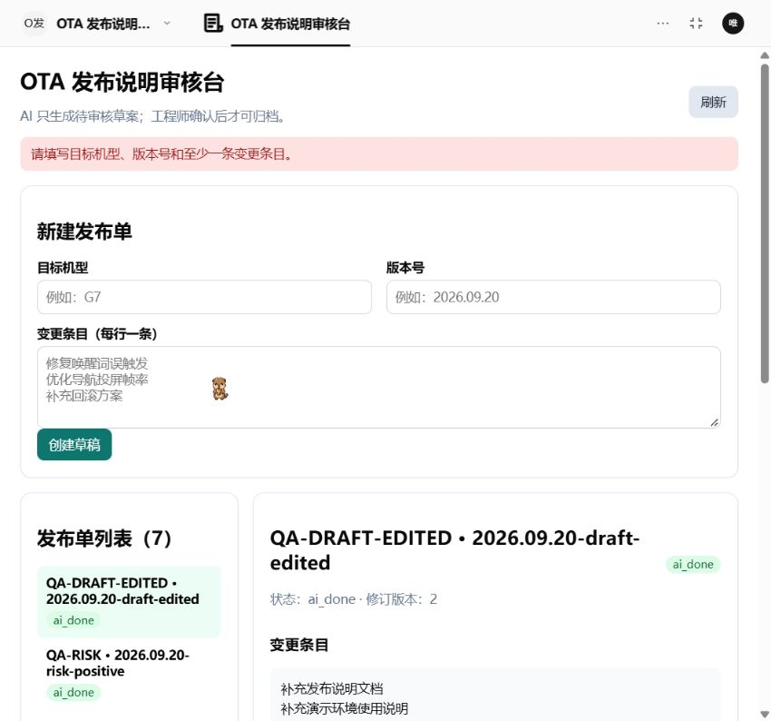
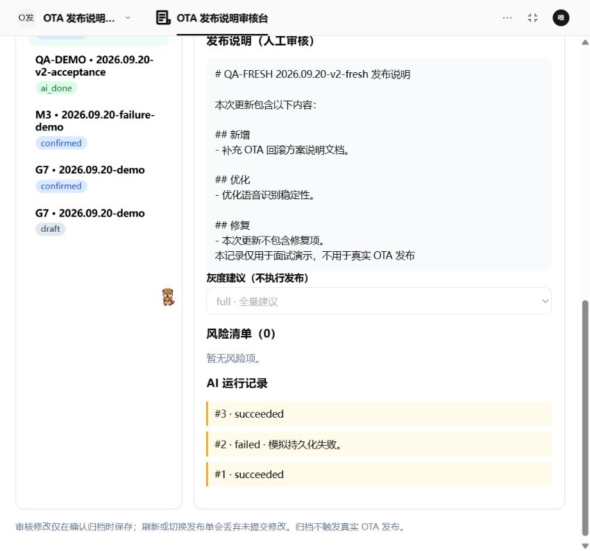
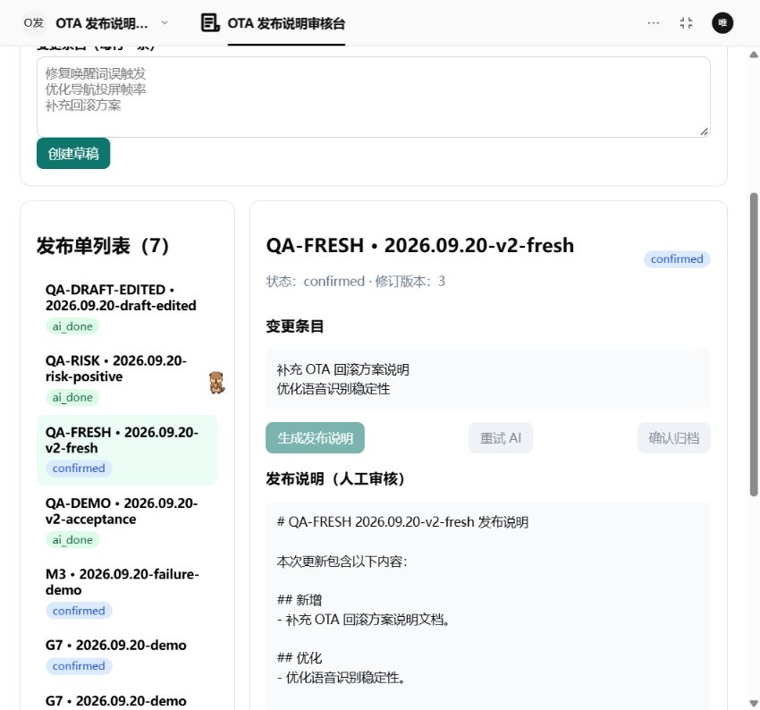
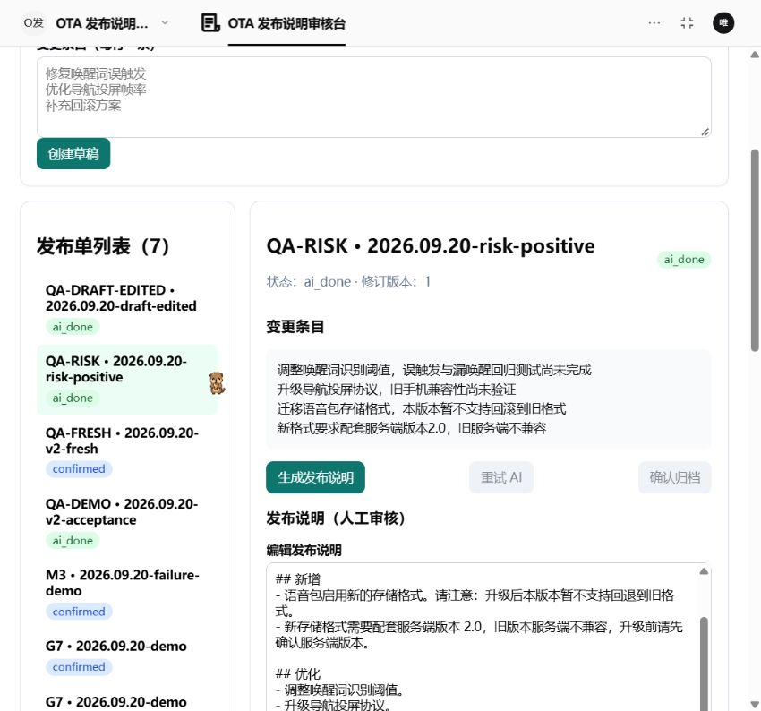
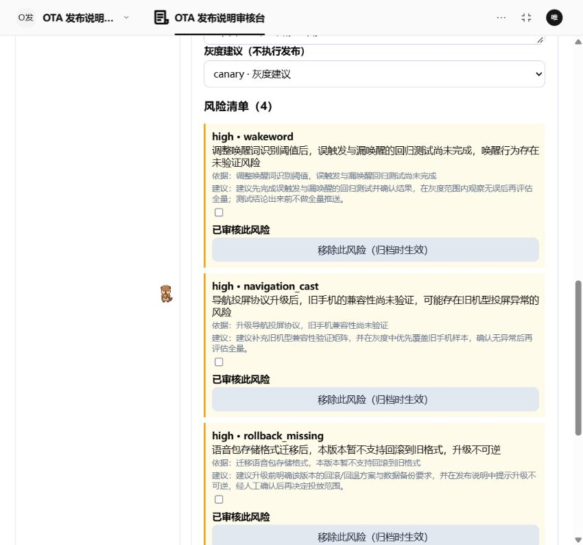

# OTA 发布说明审核台

`@xpert-ai/plugin-release-note-review` 是一个独立的 Xpert Agentic App 插件。它服务于固件/语音包 OTA 发布工程师：工程师粘贴变更条目，助手生成**待人工确认**的发布说明、风险清单和灰度建议，最终由工程师确认归档。

## 目标用户与痛点

- 发布说明通常从 Git log、需求单和测试记录中手工整理，措辞与颗粒度不一致。
- 唤醒词、导航投屏、回滚方案和兼容性等风险靠人工记忆检查，容易遗漏。
- 历史发布说明散落在群消息或表格中，难以追溯当时的 AI 结果与人工确认。

AI 只负责把变更条目改写为草案、提示有依据的风险、给出 `full`/`canary` 建议；**不自动发布 OTA、不替工程师做最终决定、不调用真实 OTA 系统。**

## 固定命名与五件套

本插件严格使用选题规格中固定的名称：

| 项目 | 值 |
| --- | --- |
| 插件目录 / 包名 | `community/apps/release-note-review` / `@xpert-ai/plugin-release-note-review` |
| NestJS 模块 / artifact namespace | `RelnotePlugin` / `relnote` |
| Middleware / Provider | `RelnoteMiddleware` / `relnote` |
| Remote entry / 工作台 key | `relnote-workbench` / `relnote_release_review_workbench` |
| Assistant YAML / templateKey | `src/relnote-assistant.yaml` / `relnote-review-assistant` |
| Capability | `relnote-core` |
| 实体表 | `plugin_relnote_release`、`plugin_relnote_ai_run` |
| 工具 | `relnote_get_draft`、`relnote_save_note`、`relnote_list_releases` |

插件包含以下可独立加载的五件套能力：插件元信息与注册、NestJS 模块与 TypeORM 实体、Agent Middleware 工具定义、Workbench View Provider/iframe 桥接、Assistant 模板与资源复制。

## 当前范围：最小真实业务闭环

已完成：

- TypeORM 的发布单与 AI 运行记录实体，以及 `plugin_` 表名契约；
- 插件 `meta`、data-xpert runtime provider、模板贡献和 `RelnotePlugin` 注册；
- 三个 Assistant 工具的 schema 与中文/英文元信息；
- Workbench manifest、标准 iframe bridge（`ready` / `init` / `requestData` / `executeAction` / `hostEvent` / `resize`）和无数据空状态；
- `failureInjection: none | read | save` 的配置契约；
- 创建草稿、查询草稿、列表筛选、AI 运行留痕、失败状态和同一发布单重试；
- `relnote_save_note` 的 `expectedRevision` 乐观锁校验；
- Workbench 的创建、生成、重试、确认归档动作已接入服务层。
- YAML 与 Remote Component 的构建资源复制。

已实现发布说明编辑、风险移除和逐项审核、灰度建议调整以及带版本条件的确认归档。真实平台已验证模型读取/回写、归档状态刷新恢复；新会话事实约束用例也已通过。风险项暂不支持自由新增或编辑。新版重试按钮的真实失败恢复、用户人工修改后归档及刷新恢复均已在演示单验证；这些结果与单元测试分开记录。详见 `ACCEPTANCE.md`。

## 业务状态机

```text
draft -> ai_running -> ai_done -> confirmed
                 \-> ai_failed -> retry_ai -> ai_running
```

后续实现必须保持：同一 `releaseId` 重试、不新建发布单；每次 AI 请求新增一条 `RelnoteAiRun` 并递增 `attempt`；`relnote_save_note` 验证 `expectedRevision`，冲突时拒绝覆盖。

## 本地验证

在 `/home/wenbin/work/xpert-plugins/community` 中执行：

```bash
corepack pnpm --filter @xpert-ai/plugin-release-note-review build
corepack pnpm --filter @xpert-ai/plugin-release-note-review test
corepack pnpm run check:entity-names
```

在插件仓库根目录执行：

```bash
node plugin-dev-harness/dist/index.js \
  --workspace ./community/apps/release-note-review \
  --plugin @xpert-ai/plugin-release-note-review
node scripts/check-app-view-storage.mjs
```

> 生命周期 Harness 使用的是模拟数据库、缓存和权限服务；它只能证明插件可加载，不能代替真实 PostgreSQL、模型调用和端到端业务验收。

## 已知限制

本插件不对接真实 Git、需求系统或 OTA 发布系统。AI 输出仍需人工审核，单个用例通过不能代表所有生成均可靠。助手模板更新不会自动同步现有助手；修改现有助手并发布后，应在新会话复验，避免历史错误输出影响验证。截图见下方实际运行证据。
## 产品、复现与协作材料

- [产品流程、页面原型、复用许可、限制与AI协作](docs/DESIGN.md)
- [环境、构建、安装、配置与使用说明](docs/RUNBOOK.md)
- [连接配置占位示例](docs/env.example)
- [已执行验收及未验证范围](ACCEPTANCE.md)

草稿编辑已在真实平台验证：编辑机型/版本/变更、必填校验、未保存禁用生成、保存后刷新恢复。实际运行截图见下方；未实测场景仍如实列在验收记录中。

## Xpert 实际运行截图

以下均来自2026-09-20本地Xpert真实页面，使用合成演示数据，没有触发真实OTA。运行历史截图展示已保存历史，不冒充故障发生瞬间；截图不替代测试记录。

### 工作台与必填校验





### 人工修改、失败重试历史与归档

QA-FRESH人工补充的演示标记与三次运行记录保留：#1成功、#2模拟保存失败、#3按钮重试成功。此闭环在保存异常并发修复前已实机通过；修复后实机执行了正常保存回归，异常修复另有自动化回归，不能混为同一验证。



归档状态confirmed、revision3，生成/重试/归档按钮只读。



### AI输入、结果与风险审核





注意：此记录保持待审核。分类、依据与high对应canary的规则已验证，但“升级不可逆”的措辞超出了“暂不支持回滚到旧格式”的输入边界，需人工修正/移除误报，不作为全面内容质量通过的证明。