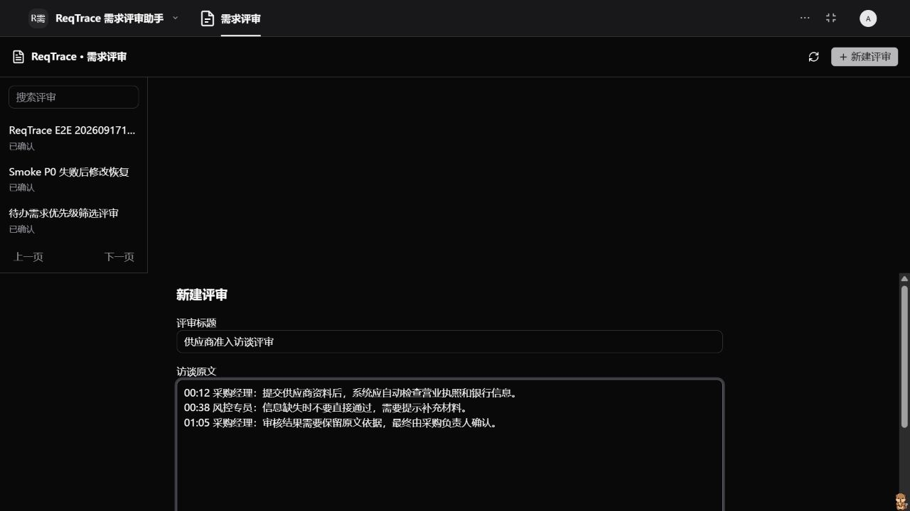
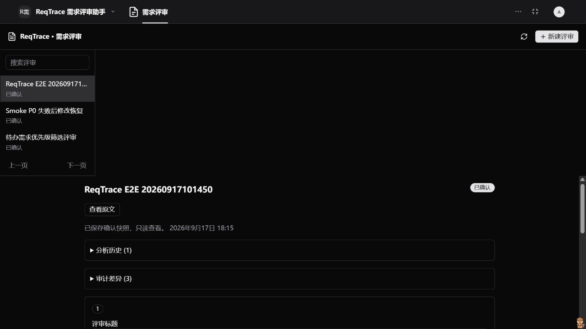
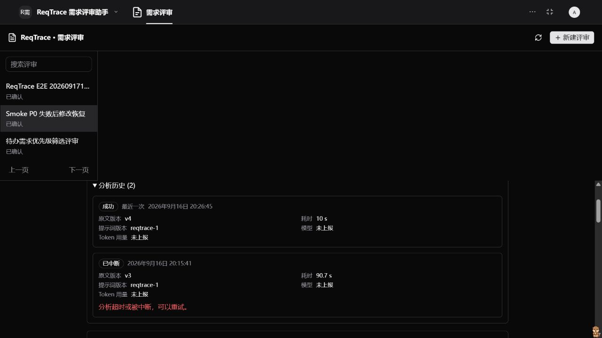

# ReqTrace 需求评审工作台

ReqTrace 面向产品经理，把访谈或需求讨论原文整理成带连续原文证据的需求与验收草稿。AI 负责减少归纳成本，产品经理负责核对、修改、取舍和最终确认；确认结果保存为不可变快照，刷新或重新进入应用后仍可恢复。

## 用户问题与产品取舍

产品经理通常需要在访谈记录、聊天内容和需求文档之间手工整理需求，再补充验收条件并反复核对原意。这个过程耗时，也容易把推断写成事实，或在后续修改中丢失需求与原文的对应关系。

本次实现聚焦一条可验证的小闭环，而不是增加一个通用聊天框：

- AI 只能读取当前评审原文、提交完整草稿或报告失败，不能修改人工草稿，也不能替用户确认。
- 每条证据必须是指定原文分段中的连续摘录；引用、分段、输入版本和分析尝试归属均由服务端验证。
- AI 原始草稿、人工可编辑草稿和确认快照分别保存，既能追踪修改，也避免后续写入改变已确认结果。
- 建议验收条件与“原文明确”的条件分开标记，提醒评审者判断哪些内容来自访谈，哪些内容仍是产品建议。
- 租户、组织、用户和确认身份只取自宿主上下文，iframe 与模型参数不能指定身份或后端地址。

## 核心流程

1. 产品经理新建评审，填写标题并粘贴访谈原文。
2. 工作台启动一次有版本约束的分析尝试，助手读取分段原文并提交证据草稿。
3. 产品经理定位证据，编辑标题、描述、验收条件和待澄清问题，或排除本期不纳入的需求。
4. 保存人工草稿；当至少保留一项需求、纳入项都有验收条件且没有待澄清问题时，允许确认。
5. 确认生成只读快照；刷新页面或重新打开评审后，从 PostgreSQL 恢复相同结果。
6. 分析失败、超时或未发现需求时，可以修改原文并重新分析；陈旧页面的版本会被拒绝，不会覆盖较新的内容。

详细规则见[核心流程](docs/workflow.mdx)，安装、助手初始化和运行边界见[安装说明](docs/setup.mdx)。

## 实际运行截图

以下截图来自本地安装的 Xpert 开源版，示例内容为合成访谈，不包含真实业务数据、凭证或私人信息。

### 输入访谈原文

在 ReqTrace 助手的工作台中新建评审。标题和原文都在宿主视图内输入，iframe 不保存认证信息，也不直接调用后端 URL。



### 核对并确认 AI 草稿

DeepSeek 实际调用读取原文并提交带证据的需求草稿；人工修改描述、清空已解决问题并排除本期未定项后，确认结果保存为只读快照。完整刷新 Xpert 页面后，状态、人工修改和范围取舍仍从数据库恢复。


确认后的评审同时提供分析历史和审计差异入口，用于区分模型提交、人工修改与最终确认，而不向公开 DTO 暴露内部确认人 ID。



### 分析中断与重试恢复

一次真实分析在 90 秒期限内没有返回工具结果，尝试被安全标记为“已中断”。修改原文并再次分析后约 10 秒成功；历史记录同时保留失败和成功尝试，旧结果不能覆盖新版本。



## 实现范围

- 创建、搜索、分页和重新打开评审。
- 标题与原文限制、稳定分段和合法时间戳保留。
- 幂等分析请求、同一评审并发阻断、90 秒超时恢复和迟到结果拒绝。
- 严格 AI 输出、连续原文摘录、输入版本和尝试所有权校验。
- 人工编辑、排除需求、保存草稿、确认阻断和不可变确认快照。
- 失败、空结果和待分析状态下的“修改原文”恢复入口，以及乐观版本冲突刷新。
- 最近 20 次分析尝试历史，包含原文版本、提示词版本、耗时、错误码，以及宿主提供时的脱敏模型名和 token 用量。
- AI 原稿到人工草稿的字段差异，以及确认时的纳入/排除数量、原文版本和时间；公开 DTO 不返回内部用户 ID。
- React Remote Component 工作台，支持宿主主题、中英文、加载、错误、空状态和窄屏布局。

插件为 system 级别，稳定命名空间为 `reqtrace`，持久化表为 `plugin_reqtrace_review` 和 `plugin_reqtrace_analysis_attempt`。

## 构建与验证

在 `community/apps/requirement-review` 中运行：

```powershell
corepack pnpm run typecheck
corepack pnpm run test
node scripts/build.mjs --check
node --env-file=../../../../xpert/.env --test tests/persistence.integration.mjs
```

在插件仓库根目录运行生命周期检查：

```powershell
node plugin-dev-harness/dist/index.js --workspace ./community --plugin @community/apps-requirement-review
```

当前验证结果：

- TypeScript 后端与 TSX 类型检查通过，生产资源一致性检查通过。
- 14 个单元、契约、生产预览状态与已安装 smoke 安全门测试通过。
- 3 个 PostgreSQL 场景通过，覆盖范围隔离、并发、幂等、失败重试、版本冲突、确认恢复和迟到结果。
- plugin-dev-harness 成功加载插件并关闭 Nest 容器；该层使用模拟数据库，不代替真实平台验收。
- 官方 Preview Host 完成失败、空结果、修改原文、陈旧版本拒绝、人工编辑、确认和刷新重开；桌面与 390×844 手机宽度均检查。
- 实际 Xpert 使用 `deepseek-flash` 完成模型工具调用、人工核对、保存确认和完整刷新恢复。
- 已安装平台自动化使用真实模型完成创建、提交 3 条需求、人工编辑和取舍、确认、刷新恢复、分析历史与审计差异共 6 个检查点。

分层验证范围、复现命令和实际结果见[验证记录](docs/verification.mdx)。显式开启的真实模型闭环可用 `corepack pnpm smoke:installed -- run` 重复执行；为避免误用模型额度，脚本要求设置 `REQTRACE_E2E_ALLOW_MODEL=1`，登录态只保存在不提交的 `.xpert-local-environment`。

## 环境基线

- Xpert main：`182f2f4a7d05d968016a9ec20a93833687c4394f`。
- 插件 main：`63a5c222bbaa55921026dbffb858d43e5ec1570f`。
- 宿主 SDK：`3.18.5`，由宿主提供运行时。
- 本地 Windows 运行时：Node `22.23.2`；宿主 pnpm `10.24.0`，community 与 lifecycle harness 使用 pnpm `8.15.8`。

## AI 协作过程

开发主要使用 Codex（GPT-5）辅助理解 Xpert 插件类型、实现代码、生成测试和定位本地运行问题；产品内的真实业务调用使用已配置的 `deepseek-flash`。AI 生成内容始终经过代码审查、分层测试和实际平台操作验证，没有把“生成完成”当作“功能可用”。

几段有代表性的协作过程：

- 开始实现前，先让 Codex 阅读同仓库应用、SDK 类型和插件生命周期约束，再由我确定采用服务端持久化、Assistant 中间件和 Remote Component 工作台组成的结构。没有根据字段名称猜测协议，而是以共享类型和实际宿主行为为准。
- 在恢复体验中，我把“失败后修改原文”和“双页面陈旧版本不得覆盖新内容”定为产品要求；Codex 协助把 `expectedVersion` 贯穿动作契约、服务事务、前端刷新和测试。最终选择冲突时刷新而不是自动合并，因为原文是 AI 证据链的输入，静默覆盖风险更高。
- 真实 DeepSeek 调用曾在两个工具成功后触发递归上限，也出现过一次 90 秒超时。Codex 协助核对工具记录、尝试状态和受限日志；我没有隐藏错误或无限延长等待，而是提高模板递归上限、保留有界超时，并把失败后的修改与重试做成可见流程。
- 分析历史和人工审计最初可以通过新增日志表实现，最终选择从已有 AI 草稿、人工草稿和确认快照确定性生成差异，减少迁移风险，也避免在公开 DTO 中暴露确认人内部 ID。

AI 协作的主要限制是：生成代码和模拟测试不能证明插件真的被宿主加载，也不能证明模型会按工具契约提交结果。因此最终验收同时保留类型/契约测试、随机 schema 的 PostgreSQL 集成测试、Preview Host 状态测试、plugin-dev-harness 和实际 Xpert 真实模型流程。

## 复用与许可

工程注册方式和实体组织参考同仓库 Dockyard，代码遵循仓库的 AGPL-3.0 许可。没有移植 VidSnap、AMOR 或其他业务插件源码；共享的 shadcn UI 组件由同仓库构建并作为前端依赖使用。

## 已知限制与后续方向

- 当前宿主调用路径没有提供可信的模型名和 token 元数据时，历史界面显示“未上报”；不会允许模型通过工具参数补写这些运行信息。
- 评审目前按 owner 隔离，不支持组织共享、评论或多角色审批。
- 暂不支持归档恢复、永久删除、确认结果导出或外部需求系统链接。
- 插件为 system 级别，本地安装需要 Default 租户中的相应管理权限；安装插件后仍需从模板创建并发布助手、绑定模型和工作台。
- 当前真实安装与自动化验证基于记录的 Xpert 和插件仓库基线；向更新的上游 main 发起 PR 前需要重新检查合并结果并重跑验证。
- 本仓库不提供公网演示环境或模型凭证，复现真实模型流程需要在自己的 Xpert 测试实例中配置可用模型。
