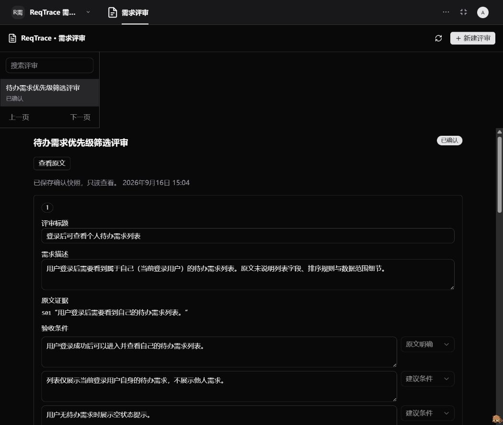

## 已通过

- TypeScript 后端与 TSX 类型检查、生产构建及生成资源一致性检查。
- 14 个单元、契约、生产预览状态与已安装 smoke 安全门测试：输入限制、分段、引用、严格输出、确认阻断、DTO 白名单、修订动作的乐观版本契约、尝试历史 DTO 白名单、人工审计差异与确认人隐藏、生产预览中的失败/空结果恢复和历史展示数据，以及真实模型调用必须显式开启。
- PostgreSQL 集成测试：创建、并发分析、重复请求、无效证据、失败重试、跨租户/组织/用户拒绝、原始草稿保留、乐观版本冲突、确认幂等、服务重新实例化恢复、超时及旧结果拒绝、失败和空结果修改原文，以及失败/成功记录跨原文版本保留。使用随机独立测试 schema，不访问生产评审表。
- plugin-dev-harness 从 dist 加载并关闭 Nest 容器，模拟数据库仅用于生命周期检查。
- 同一生产资源在官方 Preview Host 中完成新建、合成失败、修改原文、陈旧版本拒绝并自动刷新、再次保存恢复待分析、空结果恢复、重试、证据定位、人工编辑、保存、确认及刷新重开。分析历史在失败时自动展开，重试成功后同时显示新旧两次记录、耗时、提示词版本、错误信息、模型和 token 已上报/未上报状态；桌面与 390×844 手机宽度布局均通过检查。

## P1 分析尝试历史

- 服务端仅在当前租户、组织和 owner 范围内，按新到旧返回最近 20 次尝试；保留现有 `attempt` 最新记录兼容字段，并新增 `attempts` 历史列表。
- 公开 DTO 不包含 `requestKey`、租户、组织或内部 owner；模型名去除控制字符并限制长度，token 用量规范为非负整数，耗时由开始和完成时间计算。
- 历史跨原文修订保留，能区分不同 `inputVersion`，失败、中断和成功记录不会被重试覆盖。
- 当前宿主调用链未提供模型和 token 元数据时，两列保持空值，工作台显示“未上报”；没有把模型可控的工具参数当成可信运行元数据。
- 本阶段尚未重新安装到实际 Xpert；实际平台小节仍记录上一已安装版本的验收结果。

## P1 人工审计差异

- 审计数据由已持久化的 AI 原稿、人工草稿和确认快照确定性生成，不新增数据库列，也不依赖可变的应用日志。
- AI 原稿到人工草稿按服务端强制保持的需求位置比较标题、描述、证据、验收条件、待澄清问题和纳入决定；只返回发生变化的字段，不返回内部需求 ID。直接提交重排后的需求 ID 会被拒绝。
- 确认阶段返回纳入/排除数量、确认时间和原文版本；`confirmedBy` 和其他内部用户 ID 不进入公开 DTO。
- 生产 Preview Host 已验证修改描述、清空待澄清问题、保存、确认后的完整差异展示；桌面和 390×844 手机布局通过。
- 本阶段尚未重新安装到实际 Xpert。

## P1 已安装平台自动化

- `smoke:installed` 使用带时间戳的合成原文，自动覆盖创建评审、真实模型提交、保留一项需求、修改描述、清空待澄清问题、保存、确认、完整刷新后重新搜索并恢复确认快照。
- 刷新后同时断言分析历史和审计差异入口存在；人工描述中的唯一标记必须从持久化结果恢复，因此该步骤不是只验证前端内存状态。
- 脚本不会读取或打印 token。登录态由 Playwright 的 cookie/localStorage 文件提供，默认放在工作区 `.xpert-local-environment`，不得提交。
- 为避免误用模型额度，真实运行必须显式设置 `REQTRACE_E2E_ALLOW_MODEL=1`。当前阶段已验证帮助、参数保护和 Playwright 加载路径；重新安装当前插件版本后仍需执行一次完整真实闭环。

## 实际平台

已在本地 Xpert 源码环境完成实际安装和业务验收：

- 从插件模板创建并发布“ReqTrace 需求评审助手”，绑定已配置的 `deepseek-flash` 与 ReqTrace 中间件。
- 使用合成访谈创建真实评审。模型成功调用“读取访谈原文”和“提交需求证据草稿”，生成 4 条带连续原文摘录、验收条件来源和待澄清问题的草稿。
- 人工保留 3 条当前范围内的需求，排除“Excel 导出是否纳入本期”这一未定项，清空已解决问题并修改描述。
- 保存后确认生成只读快照；刷新整个 Xpert 页面并重新打开该评审，状态仍为“已确认”，只恢复 3 条需求，人工修改仍在。
- 首次发布的 v1 在两个工具成功后触发助手递归上限，但草稿已安全提交。v2 将递归上限提高到 40，并作为当前发布版本。
- 重新构建并重启项目 API 后，实际工作台显示新增“修改原文”入口。待分析修订成功把 `inputVersion` 从 1 增至 2；双页面并发编辑时，陈旧页面收到版本冲突提示、自动刷新另一页面已保存的标题与原文，没有覆盖新数据。
- 以修订后的合成原文触发真实 DeepSeek 分析时，首次调用没有在 90 秒期限内返回工具结果。分析尝试被安全转为 `INTERRUPTED`，错误码为 `attempt_expired`，工作台进入“分析失败”并给出重试提示。
- 从上述真实失败状态再次修改原文成功恢复为 `READY`。当时数据库记录 `version=6`、`inputVersion=4`、3 个原文分段，AI 草稿和人工草稿均为空，证明失败恢复会清除旧草稿并增加原文版本。
- 再次触发 DeepSeek 后，模型约 10 秒内成功提交 2 条需求；人工清空待澄清问题、保存并确认，完整刷新页面后仍恢复为已确认。数据库最终记录 `CONFIRMED`、`version=11`、`inputVersion=4`，不可变快照包含 2 条需求。
- 浏览器控制台曾出现 ChatKit 客户端密钥缺失与沙箱服务 401 警告；API 的受限日志没有 ReqTrace 工具调用错误。后续成功调用表明这些警告不是稳定阻断，也不足以单独解释首次超时。



## 复现命令

```bash
corepack pnpm --filter @community/apps-requirement-review test
node plugin-dev-harness/dist/index.js --workspace ./community --plugin @community/apps-requirement-review
```

在插件目录，用本地平台环境启动独立数据库测试，凭据仅由 Node 环境读取，不会打印：

```bash
node --env-file=../../../../xpert/.env --test tests/persistence.integration.mjs
```

预览仅使用合成数据，结果不证明真实模型调用：

```bash
node tools/remote-view-preview/cli.mjs --config community/apps/requirement-review/remote-components/workbench/preview.config.mjs --port 4417
```

已安装平台自动化先捕获一次专用浏览器登录态，再显式运行真实模型闭环。URL 应指向已经绑定 ReqTrace 模板、模型和中间件的 Xpert 对话工作台：

```powershell
$env:REQTRACE_E2E_URL = 'http://localhost:4200/chat/x/<slug>/c/<conversation>?view=reqtrace.review__reqtrace.workbench'
corepack pnpm smoke:installed -- capture-auth
$env:REQTRACE_E2E_ALLOW_MODEL = '1'
corepack pnpm smoke:installed -- run
```

需要观察过程时设置 `REQTRACE_E2E_HEADED=1`；模型较慢时可提高 `REQTRACE_E2E_TIMEOUT_MS`。脚本复用同级 Xpert 工作区安装的 Playwright，不修改插件仓库 lockfile；其他目录布局可通过 `REQTRACE_E2E_PLAYWRIGHT_ROOT` 指向包含 `playwright` 的 Node 项目。
