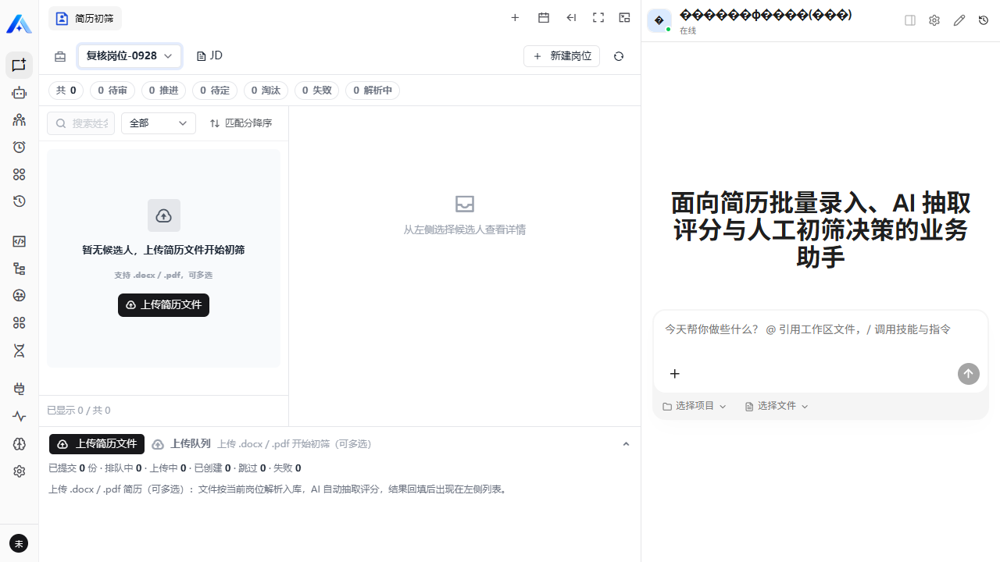
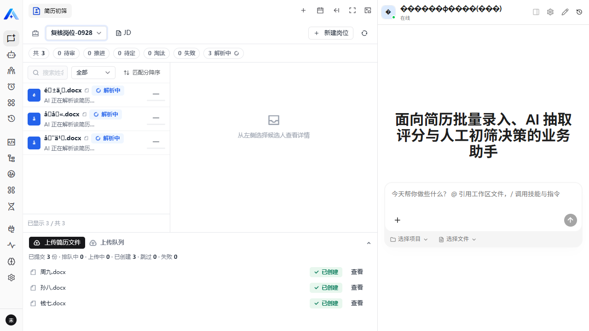
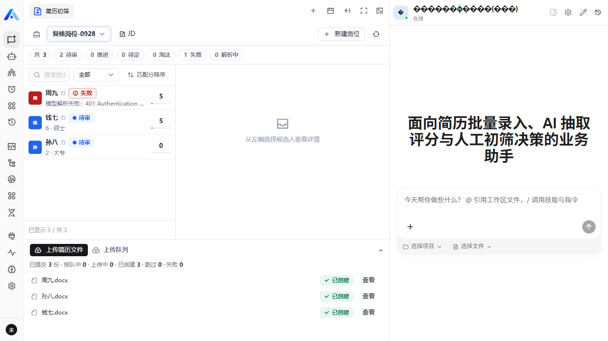

# 简历初筛工作台（resume-screen）

插件包名：`@xpert-ai/plugin-resume-screen` · 上游依据：功能 spec v2.4 / UI 设计蓝图 v4.3（本目录 `doc/`）。

## 产品说明

**一句话**：招聘专员把岗位 JD 和一批简历文件（.docx / .pdf）丢进工作台，AI 在服务端队列里逐份抽取结构化字段并给出与当前岗位的匹配评分（0–100）与理由，人工逐份「推进 / 待定 / 淘汰」，结果落 Postgres，刷新或重进应用仍可恢复。

**目标用户**：招聘专员 / HRBP / 用人经理。

**原工作方式与痛点**：逐份打开简历、对照 JD 手工记笔记，横向对比靠 Excel——标准不一致、重复劳动、慢。

## AI 边界声明

AI **只做**「抽取 + 打分 + 给理由」，**不替人做录用决策**：

- 推进（`accept_candidate`）/ 待定（`hold_candidate`）/ 淘汰（`reject_candidate`）/ 撤回为待审（`reset_candidate`）/ 编辑字段（`update_candidate`）这些**不可逆或裁量性动作不暴露给模型工具面**，只存在于工作台人工侧的 `executeViewAction`。
- 模型可调用且仅可调用三个工具：`resume_screen_save_candidates`（写）、`resume_screen_list_candidates`（读）、`resume_screen_get_candidate_detail`（读）。
- Prompt 硬约束：**一条简历恰好调用一次** save 工具；**绝不虚构**原文没有的姓名/年限/学历/公司/技能，缺失项留空并写进 `riskPoints`；评分必须有可核对的理由。
- 人工修正过的字段（`humanEditedFields`）**永远不被 AI 重新解析覆盖**。

详见 [`doc/ai-collaboration.md`](doc/ai-collaboration.md)。

## 运行说明

### 环境要求

- Xpert 平台完整运行（前端 UI + API 服务 + Postgres + Redis）：数据落 Postgres 实体表（`plugin_resume_screen_job` / `plugin_resume_screen_candidate`），AI 解析主链路走平台 `managed-queue`（Redis），两者缺一不可。
- Node.js + pnpm（插件仓 workspace，依赖 `@xpert-ai/plugin-shadcn-ui` workspace 包，`build` 脚本会先构建它）。
- 模型侧：平台已配置 `deepseek` provider（凭证字段 `api_key`，在平台 Cloud UI 填一次，**加密落库，不进任何 env 文件、不进仓库**）；助手模板选定模型 `deepseek-v4-flash`。

### 构建与测试（插件仓 `community/`）

```bash
pnpm --filter @xpert-ai/plugin-resume-screen build    # remote 组件 typecheck + 打包 + 服务端 tsc + 资源拷贝
pnpm --filter @xpert-ai/plugin-resume-screen test     # 类型检查 + jest（见下文 D6 偏离声明）
pnpm --filter @xpert-ai/plugin-resume-screen test:unit # 只跑 jest
```

### 部署

在平台仓根执行 `pnpm plugin:deploy:local`（deploy 脚本 `deploy-local-plugin.mjs`），所需 env 按其声明配置：`XPERT_API_URL`、`XPERT_TOKEN`（或 `XPERT_USERNAME`/`XPERT_PASSWORD`）、`XPERT_TENANT_ID`、`XPERT_ORG_ID`、`XPERT_SCOPE` 等。

- **`XPERT_SCOPE`**：deploy 脚本认的安装作用域变量，level→scope 映射为 `organization → organization`、`system | tenant → tenant`。注意它与社区安装流程模板的 `XPERT_INSTALL_SCOPE` 是**两个不同的变量**，不要混用。
- **organization 降级**：本插件按 `xpert.plugin.level = "organization"`（package.json）设计；若安装/登录账号没有 organization 权限，可降级按 `tenant` 级安装使用。服务端多租户隔离一律以宿主上下文三元组（`tenantId` / `organizationId` / `assistantId`）注入每条读写，`organizationId` 缺省时按 `null` 参与过滤（等效于租户 + 助手维度隔离），数据不会跨维度串。
- 排查提示：查询视图槽位接口必须带作用域请求头（`X-Scope-Level` / `organization-id` 等，走前端真实链路即可），裸 fetch 缺头时 provider 枚举会落到全局桶、误报空列表。

### 配置（插件级，`.env.example` 只有这两项占位）

| 变量 | 默认 | 说明 |
| --- | --- | --- |
| `RESUME_SCREEN_MAX_RESUMES_PER_BATCH` | `10`（1–20） | 每批最多简历数，约束单次解析负载；服务端上传/批量录入路径强制生效，超限返回中文提示 |
| `RESUME_SCREEN_SCORE_THRESHOLD` | `60`（0–100） | 评分阈值**仅作界面提示**，不参与自动推进——推进决策永远归人 |

两项同时可在平台插件管理 UI 的配置表单里改（zod 校验）；环境变量只是未配置时的兜底默认值。功能启停归平台安装态与 feature activation 通道，插件不另设 `enabled` 开关（S7 审核 F2 裁决：无消费语义即不声明）。

### 打开工作台（运行入口）

1. 按上文部署插件并确认平台加载成功（`plugin-dev-harness` 或平台日志）。
2. 在平台从插件自带的助手模板创建「简历初筛助手」（`xpert-resume-screen-assistant.yaml`，agent 节点 + `ResumeScreenMiddleware` 中间件节点）。
3. 与该助手进入对话，对话工作区出现**固定视图 tab「简历初筛工作台」**——工作台视图注册在 `agent.workbench.fixed` 槽，运行时用户对话只查询该槽并据此开远程组件 tab。同一 manifest 另注册的 `agent.workbench.main` 槽仅供 studio 编辑器（工作流中间件面板）消费，**不是用户使用入口**。
4. 工作台内流程：新建/切换岗位（JD）→ 底部录入区多选上传 .docx/.pdf → 服务端队列逐份解析评分（列表出现「解析中」→ 心跳回填）→ 右详情查看抽取字段/评分理由/命中点/风险点 → 推进 / 待定 / 淘汰 / 撤回，或点「编辑」人工修正。
5. 旁路（可选）：在宿主对话里直接贴简历文本让助手解析、查询候选人列表/详情——三工具链路保留，但上传后的自动解析不依赖对话轮。

## 截图

以下均为真机验收截图（E2E 取证原件，位于 [`doc/assets/e2e/`](doc/assets/e2e/)，全量清单与验收结论见 [`doc/e2e-report.md`](doc/e2e-report.md)）。

**工作台主界面**——左候选人列表（状态徽标/评分条/搜索排序）+ 右详情（抽取字段/评分理由/命中与风险），顶部岗位切换与统计条：



**批量上传队列**——多选文件乐观入队、逐行「排队中→上传中→已创建/跳过/失败」推进，行尾可跳转候选人：



**解析失败态**——详情区红色告示卡呈现服务端透传的可读失败原因，一键重试重新入队：



## 验证结果

| 项 | 结果 |
| --- | --- |
| jest 单元测试 | **116 / 116 通过**（9 个 suite） |
| `build`（remote 组件 typecheck + 打包 + 服务端 tsc + 资源拷贝） | 通过 |
| `check:entity-names`（实体名前缀 `plugin_`） | 通过 |
| `check-plugin-entity-tables`（实体表名） | 通过 |
| `plugin-dev-harness` 生命周期（onStart/bootstrap/onStop） | 通过 |
| M10 真机冒烟四链路（上传队列收敛 / 新建岗位 Dialog / 处置+自动滑条 / 乐观锁冲突+暂存提示） | 4 / 4 通过 |

数字与取证见本地核验记录（`md/` 不进 git，留档在实施会话侧）：`plugins/md/operation/2026-09-28-task22-s5-closeout.md`（全量矩阵与三失败分支预演）、`plugins/md/operation/2026-09-27-m10-ui-smoke.md`（四链路冒烟与修复记录）。E2E 真机验收报告：`doc/e2e-report.md`（Task 24 产出，11/11 通过，证据截图见 `doc/assets/e2e-*.png`；主仓同步件 `docs/spec/resume-screen-e2e-report.md`）。

## 文档索引

- [`doc/product.md`](doc/product.md) —— 产品说明：用户 / 痛点 / 业务流程 / 页面原型指引 / 功能取舍
- [`doc/ai-collaboration.md`](doc/ai-collaboration.md) —— AI 协作说明：三个落点、prompt 约束、人工修正保护、刻意不暴露的工具
- [`doc/ui-design.md`](doc/ui-design.md) —— UI 设计蓝图 v4.3 副本（上游 `docs/spec/resume-screen-ui-design.md`）
- UI「琢」打磨与评审记录：`docs/spec/resume-screen-review-log.md`（平台仓）

## 已知限制

- ❌ 不支持图片简历 / 扫描件 PDF（需 OCR），也不支持 .doc 旧格式——仅 .docx / .pdf 文本层解析；扫描件请先转 Word 或带文本层的 PDF 重传，解析失败时上传队列行内直显服务端失败原因并可清除。
- ⚠️ 上传队列台账为**前端内存态**，刷新页面后队列消失；来源可溯靠候选人行的 `sourceFileName` 字段（详情/Tooltip 可见），跨刷新呈现由候选人列表 + parsing 心跳轮询承接。
- ❌ 简历去重仅做**精确文本幂等**（`dedupeKey = sha256(jobId|原文)`），同名不同人无法区分。
- ❌ 真实面试安排 / 邮件发送 / 对接 ATS。
- ❌ 多用户协作与角色权限细分（只做 tenant/organization 隔离）。
- ❌ 面试评价、offer 流程。
- ❌ i18n 完整化（中文优先，英文文案保留最小集）。
- ⚠️ AC2.1「未选岗位→上传只提示不入队」分支**未做真机 E2E 覆盖**（验收环境组织内恒有岗位且无删除岗位入口，未选态真机不可达）；该行为仅有单元测试与实现证据（provider `Missing jobId` 失败回执 + 前端 notify 提示），见 `doc/e2e-report.md` E2E-05 行标注。

**失败收敛机制（M1 + S7 审核 F3/F4）补充说明**：「模型调用彻底失败/进程崩溃」可能让候选人滞留在 `parsing`，为此有双层兜底——① 队列 worker（attempts=4）末次尝试主动置 `failed` + 可读 `failureReason`；② 服务端 sweep 每 5 分钟捞「`parsing` 滞留超 10 分钟」的行条件抢占重投（崩溃恢复权威），持久化重投代号超尝试上限时不再重投、直接标 `failed` 给可读原因，封死队列反复丢失时的无界重投。对话旁路的 agent 轮结束兜底已删除：链路 B 下 `parsing` 行唯一来源是上传入队/重试，该钩子只剩与在途解析互踩的风险（S7 审核 F4 裁决）。`retry_candidate` 因此同时接受 `failed` 与滞留 `parsing` 行（重试 = 重新入队、同一条记录不重建），前端对 `parsing` 超 10 分钟的行显示超时提示。

## 测试脚本对样板的偏离声明（D6）

样板插件（crm / smart-maintenance）的 `test` 脚本实测**只做类型检查、不跑 jest**。本插件**有意偏离**该样板：`test` = `build:ui` + spec 类型检查 + jest 全量（`test:unit` 单列便于快速迭代），以满足任务书「通过测试确认作品符合预期」的要求。
