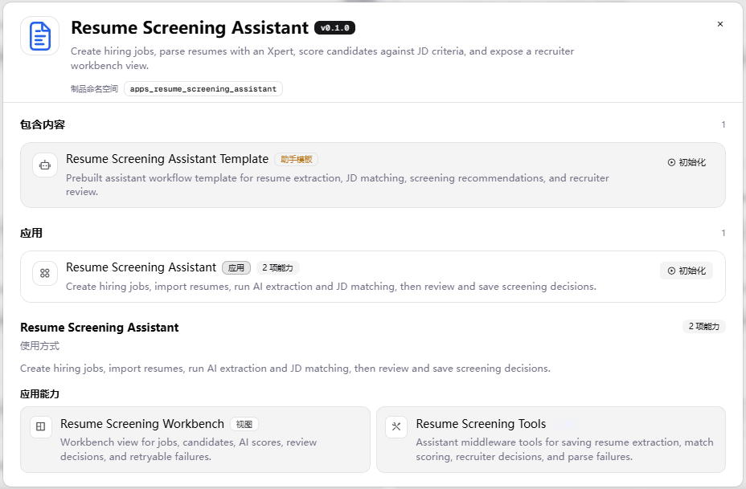
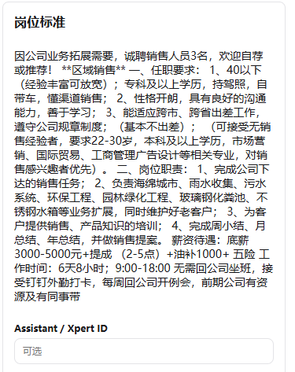
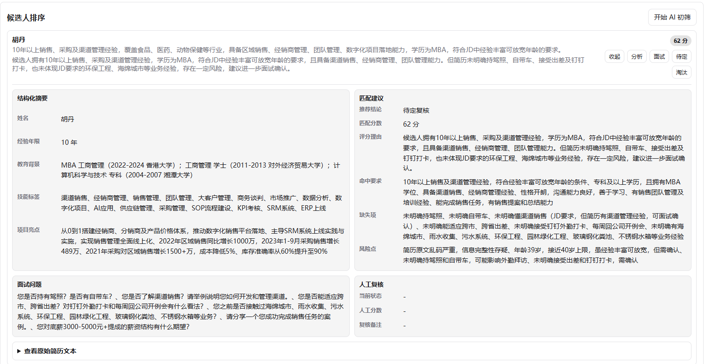
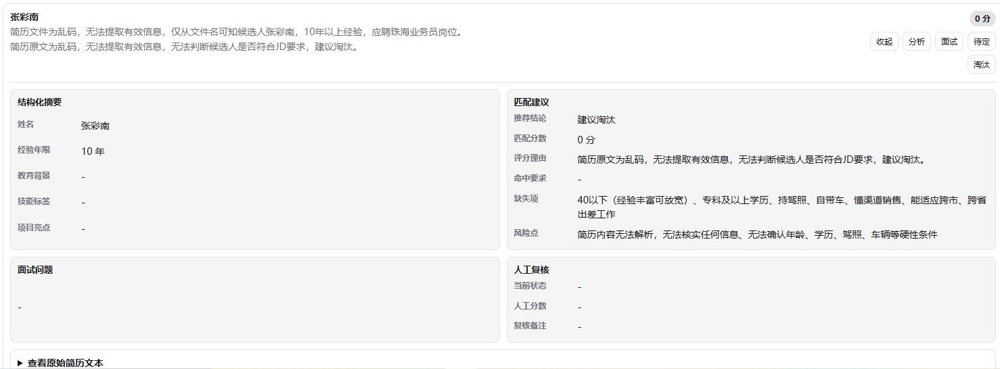

# 简历初筛助手 · Resume Screening Assistant

面向招聘初筛场景的 Xpert 业务应用插件。招聘者建岗位、导入简历，由 AI 完成结构化抽取与
JD 匹配评分，人工复核后保存决策。结果落库，刷新可恢复，失败可重试且不会产生重复记录。

## 产品说明

### 目标用户

中小规模招聘团队的 HR / 招聘负责人。典型场景是每天收到几十份简历，但没有 ATS 系统。

### 原有工作方式与痛点

| 痛点 | 具体表现 |
| --- | --- |
| 信息分散 | JD 在文档里，简历在聊天工具、邮箱和表格里，没有统一的对照标准 |
| 人工饱和 | 逐份通读，一天几十份就到上限，且进度无法累积 |
| 标准漂移 | 同一份简历，不同人、不同时段给出的结论可能不同 |
| 无留痕 | 被淘汰的候选人说不清依据，也无法事后复盘标准是否合理 |
| 异常无出口 | 扫描版 PDF、乱码文件这类解析不了的情况，往往被静默跳过 |

### 业务流程

```
建岗位（JD + 硬性标准）
   ↓
导入简历（每份一条候选人记录）
   ↓
AI 抽取 + 评分（结构化字段 + 可追溯的匹配分）
   ↓
人工复核（调整分数 / 面试-待定-淘汰）
   ↓
保存决策（落库，刷新可恢复；失败可重试）
```

### AI 在其中的作用

AI 做两件事，都不是"聊一句给个结论"：

1. **结构化抽取**：把非结构化简历文本转成可比对的字段（姓名、年限、技能、工作经历、项目）。
   无证据的字段留空并写入 `warnings`，不编造。
2. **JD 匹配评分**：按固定规则给出**可追溯**的分数。每个分数都能回溯到具体维度、证据和扣分项，
   而不是一个不可解释的总分。

评分规则见 [docs/scoring.md](docs/scoring.md)：总分 100 = 硬性要求 40 + 经历相关 25 +
技能能力 20 + 风险完整度 15。硬性要求按项均分、三态判定（满足 / 部分满足 / 不满足），
推荐值在分数之外叠加覆盖规则（硬性要求不满足 2 条及以上一律 reject）。

**分数与推荐值分开设计**：覆盖规则只改推荐值、不改分数。所以会出现"84 分但 reject"——
分数反映综合匹配程度，推荐值反映门槛是否通过，两者回答不同问题。人工复核时看到
"84 分 + reject 的原因"比看到一个被改写成 55 分的分数更有信息量。

### 功能取舍

**做**：一条核心流程跑可靠；可追溯的评分；失败可见、可重试。

**不做**，以及为什么：

| 不做 | 原因 |
| --- | --- |
| OCR（扫描版 / 图片型 PDF） | 提取不出文本时，宁可让这条记录**明确失败**并提示复核原文件，也不假装解析成功给一个假分数 |
| 多智能体协作 | 单条流程的可靠性比角色分工更影响初筛效率 |
| 邮件 / 日程 / offer 流程 | 超出"初筛"边界，复杂度不划算 |
| 多端适配 | 招聘者主要在桌面端操作 |

## 运行截图

### Xpert 平台内：插件已安装并加载


*插件列表：版本 0.1.0，作用域为「全局」，标签含 `VIEW-EXTENSION` 与 `ASSISTANT-TEMPLATE`。*



*插件详情：助手模板（Resume Screening Assistant Template）、业务应用、视图（Resume Screening
Workbench）与中间件工具（Resume Screening Tools）四类组件均被平台识别。*

### 业务流程

> 以下截图取自本地预览（`tools/remote-view-preview`）配合**真实 DeepSeek 模型调用**，
> 用于验证抽取与评分规则的实际效果。
>
> 平台内的端到端流程（基于模板创建智能体、绑定工具与工作台）**未完成**，
> 原因是平台侧的组织初始化失败，详见 [docs/platform-issues.md](docs/platform-issues.md)。

**建岗位：填写 JD 与硬性筛选标准**



**AI 初筛结果：候选人按分数排序，每条附匹配理由与复核操作**


**候选人详情：结构化字段、逐条匹配建议（命中要求 / 缺失项 / 风险点）与面试问题**



**异常情况：简历文本乱码导致解析失败**



*文本乱码时，插件不伪造分数：结构化字段留空，分数记 0，缺失项逐条说明无法核实的原因，
并给出重试入口。这是本应用对「解析失败」的明确处理方式。*

## 主要实现

| 组成 | 位置 | 说明 |
| --- | --- | --- |
| 业务界面 | `src/lib/remote-components/` | Remote Component Workbench，岗位列表、候选人排序、分数明细、复核、重试 |
| 业务对象 | `src/lib/entities/` | `ResumeScreeningJob`、`ResumeCandidate`（TypeORM） |
| 业务逻辑 | `src/lib/resume-screening-assistant.service.ts` | 岗位与候选人增删改查、计数、失败上报、重试复用原记录 |
| Agent 中间件 | `src/lib/resume-screening-assistant.middleware.ts` | 三个工具 + zod 参数校验 |
| Assistant 模板 | `src/lib/resume-screening-assistant.templates.ts`、`src/xpert-resume-screening-assistant.yaml` | 系统提示词与工具绑定 |
| Prompt | `src/lib/prompts/` | 抽取与评分规则独立成模块，见下 |
| 视图注册 | `src/lib/resume-screening-assistant-view.provider.ts` | 视图槽位与动作桥接 |

**中间件工具**

- `resume_screening_save_extraction` — 保存候选人结构化简历
- `resume_screening_save_match_result` — 保存 JD 匹配评分与筛选建议
- `resume_screening_report_failure` — 保存失败原因，供工作台重试

**Prompt 为什么独立成模块**

`src/lib/prompts/` 把抽取规则和评分规则从 service 里拆出来，带来两个好处：

1. **规则只有一份**。`docs/scoring.md` 描述规则，Prompt 实现规则，两者对照可查。
2. **本地脚本能验证线上规则**。`scripts/analyze-resume.mjs` 直接导入编译后的 Prompt 模块
   （`dist/lib/prompts/`），所以脚本跑的就是插件内实际生效的那套规则，不存在"两份 Prompt
   跑歪"的问题。

Prompt 提供两种输出模式，共用同一套规则，只有末尾输出指令不同：

- `tool`：给 Agent 用，要求调用插件 middleware 工具保存结果（插件内运行路径）
- `json`：给本地脚本用，要求直接返回 JSON（验证路径）

## 运行说明

### 环境要求

| 项 | 要求 |
| --- | --- |
| 平台 | Xpert 开源版 `xpert-ai/xpert` main，本文验证版本 `182f2f4a7` |
| Node.js | 与平台仓库配置一致（本文验证 v24.16.0） |
| 包管理器 | corepack pnpm（平台与插件仓库统一用 `corepack pnpm`） |
| 数据库 | 由平台提供（PostgreSQL），插件侧无需单独准备 |

本插件声明 `level: system`，需要 SUPER_ADMIN 用户与全局安装作用域。

### 构建

```sh
cd community
corepack pnpm --filter @community/apps-resume-screening-assistant build
```

产物落在插件目录的 `dist/`，包含服务端入口、界面资源与 Assistant 模板 YAML。

### 测试

```sh
cd community
corepack pnpm --filter @community/apps-resume-screening-assistant test
```

会先做类型检查并编译，再跑 `tests/` 下的单元测试（覆盖 Prompt 规则契约、防注入规则、
两种输出模式）。只跑单测可以执行：

```sh
cd community/apps/resume-screening-assistant
corepack pnpm test:unit
```

### 安装到 Xpert

先在插件仓库的 `community/.env` 里配置平台连接信息（参照 `community/env.example`）：

```
XPERT_API_URL=http://localhost:3000/
XPERT_TOKEN=<SUPER_ADMIN 登录 JWT，从浏览器 /api/ 请求的 Authorization 头复制>
XPERT_INSTALL_SCOPE=global
XPERT_SCOPE=tenant
XPERT_TENANT_ID=<令牌中的 tenantId>
```

然后从平台仓库根目录执行：

```sh
node tools/scripts/install-local-plugin.mjs \
  --plugin-dir <插件仓库>/community/apps/resume-screening-assistant \
  --scope tenant --no-keychain
```

看到 `"success": true` 后**重启平台 API 进程**，插件才会真正加载。
重启后可用 `GET /api/plugin` 确认插件出现在已加载列表中。

### 配置

插件自身没有需要填写的配置项。

模型由**平台侧**配置：插件通过 Assistant 调用平台配置的模型，不在插件里管理凭证。
本地验证脚本用的模型配置是另一套，见下节。

### 使用

1. 打开 Xpert，进入插件提供的业务应用
2. 新建岗位，填写 JD、必备技能、加分技能、最低经验年限
3. 导入候选人简历（纯文本；PDF / DOCX 需先转为文本）
4. 触发 AI 初筛，等待抽取与评分完成
5. 在候选人列表中查看分数与匹配理由，进入详情核对字段证据
6. 给出复核决策（面试 / 待定 / 淘汰），结果落库
7. 解析失败的记录会显示失败原因，可点击重试，**重试复用原候选人记录，不会产生重复条目**

### 本地验证脚本

用真实模型直接跑一遍抽取与评分，不依赖平台：

```sh
cd community/apps/resume-screening-assistant
cp .env.example .env      # 填入 DEEPSEEK_API_KEY
corepack pnpm analyze:resume -- --check          # 只检查 key 与网络连通性
corepack pnpm analyze:resume -- --print-prompt   # 只打印 Prompt，不调用模型
corepack pnpm analyze:resume                     # 跑 demo/ 下的 JD 与简历
```

数据放在 `demo/job.json`（岗位）与 `demo/resumes/`（简历，`.txt` 或 `.md`）。
脚本会校验 `reason` 里的评分明细是否真的等于总分，校验失败会明确报出。

环境变量见 [.env.example](.env.example)。**注意这是本地验证脚本专用的，
插件在平台内运行时不需要，模型由平台配置。**

导出 Prompt 全文（生成 `docs/prompt.md`）：

```sh
corepack pnpm prompts:export
```

## 验证结果

| 项目 | 命令 | 结果 |
| --- | --- | --- |
| 类型检查 | `tsc -p tsconfig.spec.json --noEmit` | 通过 |
| 单元测试 | `pnpm test` | 通过（15 项） |
| 构建 | `pnpm build` | 通过 |
| 实体表名检查 | `node scripts/check-plugin-entity-tables.mjs`（在插件仓库根目录执行） | 通过 |
| 插件安装 | `plugin:install:local --scope tenant` | `success: true`，`currentVersion: 0.1.0` |
| 平台加载 | `GET /api/plugin` | `system:global @community/apps-resume-screening-assistant` |
| 组件注册 | 插件详情页 | 助手模板 / 应用 / 视图 / 中间件工具 四类均被识别 |
| 真实模型评分 | `pnpm analyze:resume` | 通过（DeepSeek） |

**尚未验证**：平台内的端到端流程（创建智能体、绑定工具与工作台、平台内完成一次真实
AI 处理、平台内的保存与恢复、平台内的失败重试）。

阻塞原因是平台侧的组织初始化在 Windows 上失败，导致平台内无法配置任何模型，
与本插件无关。完整排查过程、复现命令与证据见
[docs/platform-issues.md](docs/platform-issues.md)。

## 已知限制

**评分规则**

- 评分是启发式的，规则由人设定，未经标注数据校准
- "相近技术栈"的宽严程度依赖模型判断（例如 Vue 经历应聘 React 岗位算不算部分满足）
- 分数**不能跨岗位比较**：40 分的硬性要求按各岗位自己的必备技能均分
- `reviewerScore` 与 AI 分长期偏离多少，系统不做统计

**输入**

- 扫描版 / 图片型 PDF 提取不出文本，会走失败分支（不伪造分数）
- 表格、多栏排版如果转文本后结构丢失，抽取质量会下降

**权限**

- 目前按租户 / 组织隔离，未实现多用户审批流

**平台依赖**

- 插件声明 `level: system`，安装需要 SUPER_ADMIN 权限
- Windows 上的平台兼容问题见 [docs/platform-issues.md](docs/platform-issues.md)

## 复用来源与许可

- 本项目许可：AGPL-3.0
- 工程结构参照插件仓库 `community/apps/` 下已有业务应用（如 `sales-ontology`、
  `procurement-quote-comparison`），未直接复制其业务代码
- Workbench 使用平台提供的 Remote Component 机制
- 通过平台 Assistant 调用大模型，未在插件内集成模型 SDK
- 开发过程使用了 AI 编程工具辅助，工具选择、判断取舍与问题排查过程见
  [docs/ai-collaboration.md](docs/ai-collaboration.md)

## 目录结构

```
community/apps/resume-screening-assistant/
├── src/
│   ├── index.ts                       插件入口与元信息
│   ├── xpert-resume-screening-assistant.yaml   Assistant 模板
│   └── lib/
│       ├── constants.ts               常量与图标
│       ├── types.ts                   业务类型
│       ├── prompts/                   抽取与评分 Prompt（独立模块）
│       ├── entities/                  TypeORM 实体
│       ├── remote-components/         Workbench 界面
│       └── *.service.ts / *.middleware.ts / *.templates.ts / *-view.provider.ts
├── scripts/
│   ├── analyze-resume.mjs             本地验证：真实模型跑抽取与评分
│   ├── export-prompts.mjs             导出 Prompt 全文到 docs/prompt.md
│   └── copy-assets.mjs                构建后拷贝资源
├── tests/
│   └── prompts.test.mjs               Prompt 规则契约单元测试
├── demo/                              本地验证数据（job.json 与简历）
├── docs/
│   ├── requirements.md                需求说明
│   ├── scoring.md                     评分规则
│   ├── prompt.md                      导出的 Prompt 全文
│   ├── platform-issues.md             平台侧问题的排查记录
│   ├── ai-collaboration.md            AI 协作说明
│   └── images/                        运行截图（README 相对路径引用）
├── .env.example                       本地验证脚本的环境变量示例
└── package.json
```
