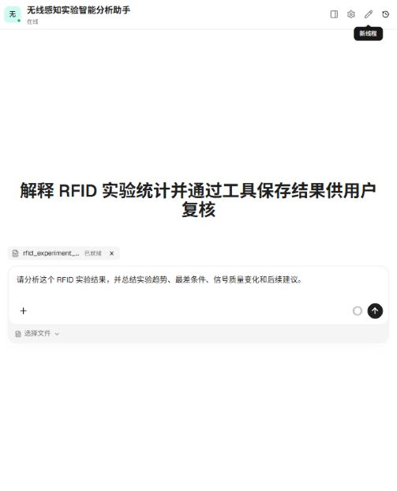
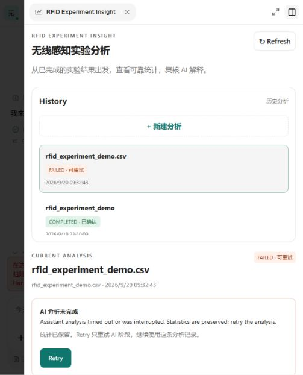
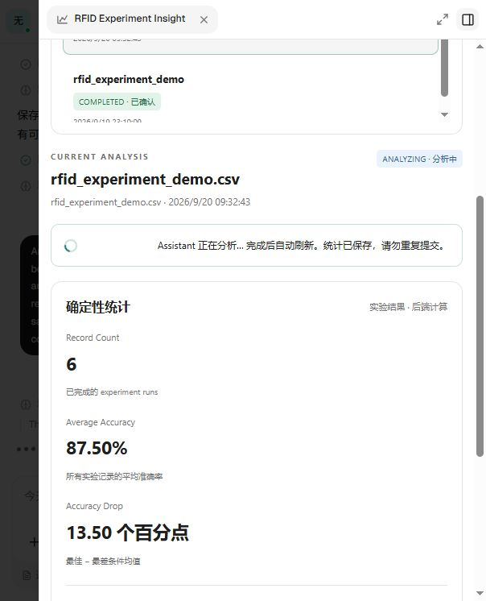
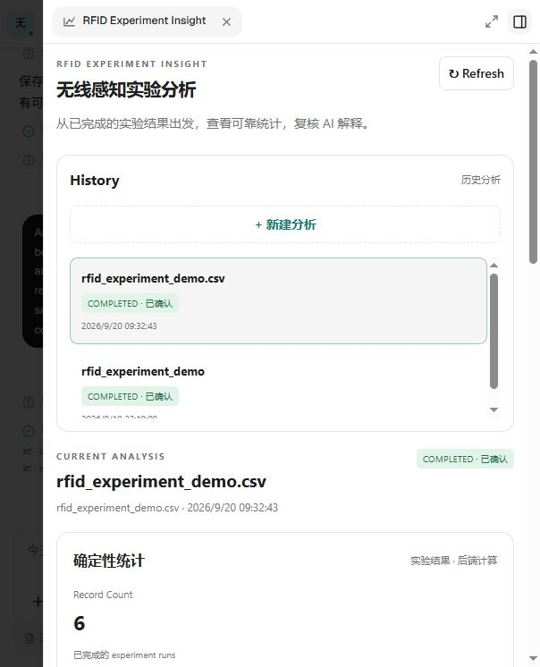
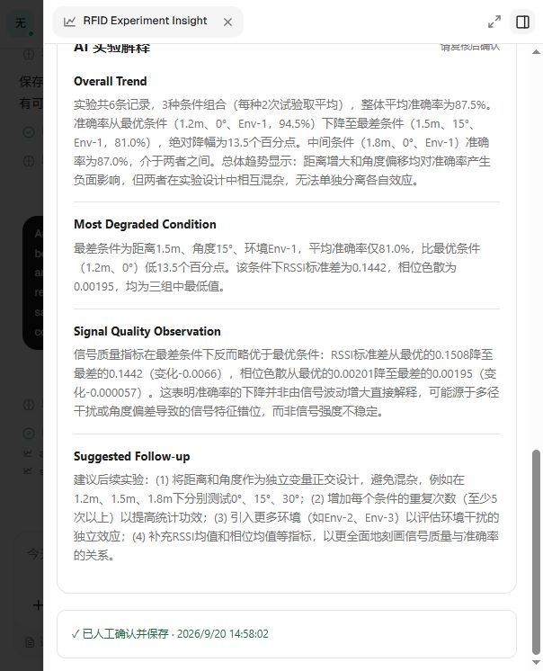

# RFID Experiment Insight

无线感知实验智能分析助手。将实验结果 CSV 转换为确定性统计，由 Xpert Assistant 的真实模型解释，用户复核后确认保存。

## 用户与业务问题

面向已完成 RFID / wireless sensing 实验的算法工程师和研究人员。原工作流是实验结果导出后，在 CSV/Excel、Python/Pandas 和文字报告之间重复统计、比较距离/角度/环境并人工总结。本应用把这些步骤组织成可恢复的分析记录。

这不只是 CSV 加聊天：统计由可测试的 Service 生成并持久化，Assistant 通过严格 Tool contract 读取结果；每轮尝试有身份和状态，失败只重试解释，AI 保存与人工确认是不同动作。History 通过服务端数据库恢复，不依赖浏览器 localStorage。

核心流程：上传结果 CSV → 校验 → 确定性统计 → Assistant 解释 → 人工复核 → Confirm/Save → History 恢复。

## 范围与非目标

输入是已经完成并汇总到 experiment-run 粒度的 CSV。应用负责校验、分组统计、可恢复的 AI 解释和人工确认；不处理原始 RFID 波形，不训练模型，不做 RAG、多智能体、设备接入、论文结论生成或因果诊断。

## 功能与架构

- 一个 `ExperimentAnalysis` 实体，保存数据、统计、AI 解释、状态和人工确认时间。
- CSV 校验、按条件分组统计、上传幂等、同记录重试、并发保护、过期恢复。
- Middleware Tools：`create_analysis`、`analyze_experiment`、`save_analysis`、`get_analysis`。
- Assistant Template 已注册；真实验收 Assistant 使用 `openrouter/free`，模型由宿主配置。
- Workbench ViewProvider 的服务端上传、消息准备、查询、确认及发送失败接口已实现并测试。
- ViewProvider 已注册，Remote Component 提供 History、CSV 上传、统计、Assistant 分析、Retry 和人工确认。
- 不在 Service 中创建模型客户端或直接请求模型。保留以下调用链：

```text
Workbench upload → ViewProvider → Service → Repository
Workbench Analyze/Retry → ViewProvider.prepareAnalysis → assistant.chat.send_message
Assistant → analyze_experiment → Service 返回确定性统计
Assistant LLM 解释 → save_analysis → Service 保存 AI 解释（未人工确认）
Workbench Confirm and Save → ViewProvider → Service.confirmAnalysis
Workbench reload → ViewProvider → Service → Repository
```

Public Chat 复用同一条业务链：ChatKit 将上传后的标准 `human.files` / `fileAssetId` 交给 Middleware；`create_analysis` 通过宿主的会话授权文件能力读取 CSV，然后调用现有 `importCsv → prepareAnalysis`。数据库生成真实 `analysisId`，Service 生成真实 `attemptId`，模型既不能传服务器路径，也不能生成业务 ID。

Service 负责 CSV 校验、确定性统计、状态机、幂等与持久化；Middleware Tool 只编排 Service；LLM 只解释 Tool 返回的统计并提交四段文字。`save_analysis` 成功后返回明确终止信号，Assistant 不再调用工具。

## 构建和验证

在仓库根目录进入 `community`，使用 workspace 指定的 pnpm 8.15.8：

```powershell
cd community
npx --yes pnpm@8.15.8 --filter @xpert-ai/plugin-rfid-experiment-insight... install --no-frozen-lockfile
npx --yes pnpm@8.15.8 --filter @xpert-ai/plugin-rfid-experiment-insight build
npx --yes pnpm@8.15.8 --filter @xpert-ai/plugin-rfid-experiment-insight test
```

构建清理本包 `dist`，生成 `dist/index.js`、声明文件、服务端模块、Assistant YAML 及 Remote Component 资源。

回到仓库根目录执行生命周期验证：

```powershell
npx --yes pnpm@8.15.8 -C plugin-dev-harness --ignore-workspace install --no-frozen-lockfile
npx --yes pnpm@8.15.8 -C plugin-dev-harness --ignore-workspace build
node plugin-dev-harness/dist/index.js --workspace ./community --plugin @xpert-ai/plugin-rfid-experiment-insight
```

若 Node 22+ 出现 README 所述依赖初始化问题，按 `plugin-dev-harness/README.md` 使用 Node 20。

验证记录：Node 24.16.0 + pnpm 8.15.8，构建通过，27 项测试通过，harness 的加载、启动、bootstrap、destroy、stop 和关闭通过。新增回归覆盖 Public Chat 附件创建、重复调用幂等、缺失/多附件拒绝、慢模型 attempt 续租、FAILED Retry 以及 stale attempt 隔离。
UI 测试运行实际 React 页面、ViewProvider、Middleware 和 Service，使用内存 repository 和模拟模型响应；harness 使用 TypeORM/runtime mock。
此外已在下述固定 Host baseline 上完成真实 PostgreSQL、真实 `openrouter/free` 与 Public Chat/Workbench E2E。

本地浏览器预览（从 community 执行）：

```powershell
npx --yes pnpm@8.15.8 --filter @xpert-ai/plugin-rfid-experiment-insight preview:mock
```

打开 `http://127.0.0.1:4177`。页面明确标注 Mock，可模拟成功、模型失败、发送失败及重开工作台。数据仅保存在预览进程内存，停止进程即丢失；不需要 `.env`，不连接真实模型。

## 输入与统计约定

参考 `examples/experiment-results.csv`。UTF-8 CSV，恰好 7 个字段：

```csv
experiment_id,distance_m,angle_deg,environment,accuracy,rssi_std,phase_dispersion
run_001,1.5,0,Env-1,0.954,2.1,0.06
```

- 至少 2 条、最大 1 MiB / 10,000 条；experiment_id 唯一且非空，environment 非空。
- accuracy 为 0–1；distance_m、rssi_std、phase_dispersion 非负有限数；angle_deg 为 -360–360。
- 相同 `(distance_m, angle_deg, environment)` 的多轮实验合并计算算术平均。
- 全局准确率按原始记录计算，最佳/最差按条件组平均准确率比较。
- `accuracy_drop_vs_best` 为最佳减最差的绝对准确率差，乘 100 后展示为百分点。
- 信号变化为最差条件均值减最佳条件均值；不作因果结论。
- 平局按距离、角度、环境名称顺序确定代表条件；完整 conditions 仍保留所有组。

`examples/sample_experiments.csv` 复制自用户提供的 `D:\lunwen\Xpert_exm\rfid_experiment_demo.csv`，是 **demo/test data，不是论文真实准确率结果**。其中 accuracy 为产品 E2E 人工设置；rssi_std 来自上游 RSSI variance 转换，phase_dispersion 使用 `1 - phase_R2` 作为演示 proxy。本 App 不重算这些上游指标。每行是一个已汇总的 experiment run。

该六行 demo 的确定性期望：3 个条件组；平均准确率 87.5%；最佳为 1.2 m / 0° / Env-1（组均值 94.5%），最差为 1.5 m / 15° / Env-1（81%），差值 13.5 个百分点；RSSI Std Change 为 -0.006649，Phase Dispersion Change 为 -0.0000565。信号差值为有符号值，不代表确定因果。

## 状态、失败和恢复

`DRAFT → ANALYZING → COMPLETED`；失败恢复为 `FAILED → Retry → ANALYZING → COMPLETED`。
COMPLETED 表示 AI 解释可供复核；只有显式人工确认才写入 `confirmedAt`。
上传即持久化输入及统计，AI 解释随后持久化，因此失败或刷新不丢失已有统计。

每轮分配 `attemptId`，并发开始只允许一轮成功，旧轮结果不能覆盖新轮。
Middleware 在读取统计后的模型异常或未保存结果就结束时标记 FAILED。
模型在第一次 Tool 之前失败、请求未送达或进程中断时，通过 5 分钟持久化期限在下次查询/操作时转为 FAILED。`analyze_experiment` 成功读取统计后会为真实模型解释阶段续租一次，避免慢模型在 `save_analysis` 前被错误过期。
UI 监听 Tool 完成事件并每 3 秒轮询处理中记录，发送命令失败时调用 `report_dispatch_failure`；重试更新原分析 ID。

## UI 调用边界

1. `rfid_experiment_insight__remote/app.js` 构建时复制到 dist，ViewProvider 和 view capability 已注册。
2. 上传通过 `executeFileAction('upload_csv')`；传 `requestId` UUID 和 name，文件失败重传复用同一 requestId。
3. Analyze/Retry 的 action 返回 `PreparedAnalysis`；按 `command.type` 显式分支，通过 `invokeClientCommand` 转交 `assistant.chat.send_message`。
4. 使用 `analysisId` 查询并轮询，展示四段 AI 解释，让用户调用确认 action。
5. 真实宿主安装遵守仓库 `AGENTS.md`：从 `community/.env` 读取配置，system plugin 使用 SUPER_ADMIN 登录 JWT 和全局安装范围。

更完整的 MVP 边界见 `docs/requirements.md`。

## 安装与运行

在 `community/.env` 中按 `community/env.example` 配置 `XPERT_API_URL`、SUPER_ADMIN 登录 JWT `XPERT_TOKEN` 和 `XPERT_INSTALL_SCOPE=global`。该文件被忽略，禁止提交真实 token。先按上面的 pnpm 8.15.8 命令构建；容器部署只复制包元数据和 `dist`，不复制 Windows `node_modules`。

本插件是 system/global plugin，包元数据必须保留 `xpert.plugin.artifactNamespace = rfid_experiment_insight`。当前 Host helper 仍以 organization scope 为主，因此全局安装使用 `POST /api/plugin`，请求头为 SUPER_ADMIN bearer token 与 `x-scope-level: tenant`，不发送 `organization-id`。安装响应为 HTTP 201；如返回 `restartRequired`，重启 API 后确认 Entity、Middleware、Template、ViewProvider 和 Remote Component 已注册。随后从模板创建/发布 Assistant，绑定宿主可用模型，启用 Chat trigger 和 RFID Middleware。

Workbench 入口由已发布 Assistant 提供；公开入口为 `/x-chatkit/x/rfid-experiment-insight-assistant`。Public Chat 用户只需上传 CSV 并提出分析请求，不接触任何 ID。

## 真实宿主集成检查点

- Plugin baseline：`0df1e2e4a1ff4e7442e8fb4a42307ab59f42814b`。
- MVP checkpoint：`a932692c91f0553f35703568b07873e91bba1a14`。
- Xpert Host：`/home/guqi/xpert-host`，`main`，SHA `d24ca81b9f5885cf44dd77afdb0f91359b49c4ea`（已读取核实）。
- 本地网页：`http://localhost:8088`；API：`http://localhost:3000`。不使用被占用的 Windows 80 端口。
- 安装接口真实返回 HTTP 201；API 重启后 Entity、Middleware、Assistant Template、ViewProvider 与 Remote Component 均注册成功。
- 已发布“无线感知实验智能分析助手”，绑定 OpenRouter `openrouter/free`、Chat trigger 与始终加载的 RFID Middleware；Service 不配置或调用模型客户端。
- 真实宿主 `executeFileAction` 返回 `fileActionResult`，插件及 Mock 已据此修正。
- Entity 表名改为相同值的字面量，以兼容仓库静态检查；没有更名或数据库迁移。新增 runtime 元数据断言防止表名与 namespace 漂移。
- Workbench 已真实完成 CSV → Service 统计 → `analyze_experiment` → `save_analysis` → 四段解释 → 人工确认；机器重启后 History、统计、解释和确认状态仍能从 PostgreSQL 恢复。

## 真实 E2E 证据

Public Chat 使用原始 `rfid_experiment_demo.csv` 和请求“请分析这个 RFID 实验结果，并总结实验趋势、最差条件、信号质量变化和后续建议。”真实完成 `human.files → create_analysis → analyze_experiment → save_analysis`。Workbench 显示 6 条记录、平均准确率 87.50%、准确率差 13.50 个百分点，并保存 Overall Trend、Most Degraded Condition、Signal Quality Observation、Suggested Follow-up 四段解释。



真实异常由慢模型超过原 120 秒 attempt 期限触发。FAILED 页面保留全部统计；修复后在同一 analysis 上点击 Retry，使用新 attempt，状态转为 `ANALYZING → COMPLETED`。数据库核对总记录仍为 2（原成功记录和本次记录），没有因 Retry 新增业务记录，旧 attempt 也不能覆盖新 attempt。





最终结果经 Workbench 人工确认；刷新后仍显示 `COMPLETED · 已确认`。





## AI collaboration

用户提供面试任务和 RFID 领域背景，主动把范围缩小到 experiment-result-level CSV，明确排除 raw RFID、RAG、multi-agent 等功能，并冻结 CSV contract 和确定性统计。AI 协助阅读仓库与 Host contract、实现、debug、测试和真实 E2E。开发始终保留 Workbench/Public Chat → Assistant → Middleware Tool → Service 链路；确定性结果来自代码与数据库，LLM 只生成待人工复核的解释。验证分为 tests、build、lifecycle harness、Mock 和真实 E2E，README 只记录实际观察到的结果。

## Known limitations

- 不进行原始 RFID 信号处理、模型训练、RAG、多智能体、PDF、设备接入或因果诊断。
- History 当前显示最近 100 条；上传上限 1 MiB / 10,000 行；AI 尝试期限 5 分钟，成功读取统计后续租一次，第一次 Tool 之前失败可由轮询触发过期恢复。
- 模型解释需要人工检查；免费路由模型的可用性、速率限制和语言质量会波动，模型提出的机制假设不能视为实验结论。
- 上传按用户确认的冻结契约要求至少 2 行；多轮可属于同一条件，统计函数仍保留单条件的确定性处理。
- 当前仓库仅见发布及 sandbox workflow；不能声称远端 CI 已运行。
