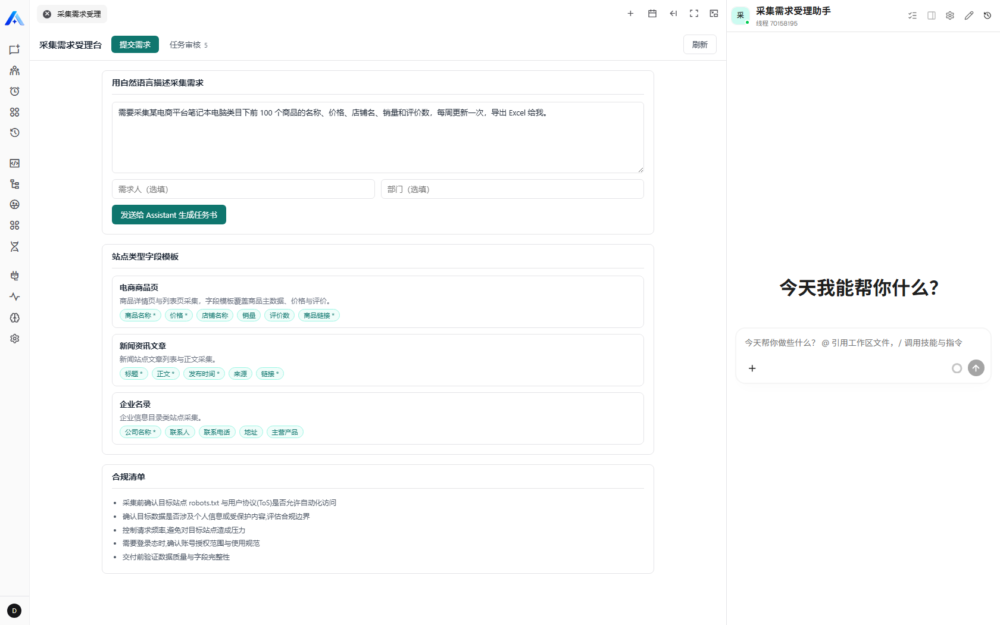
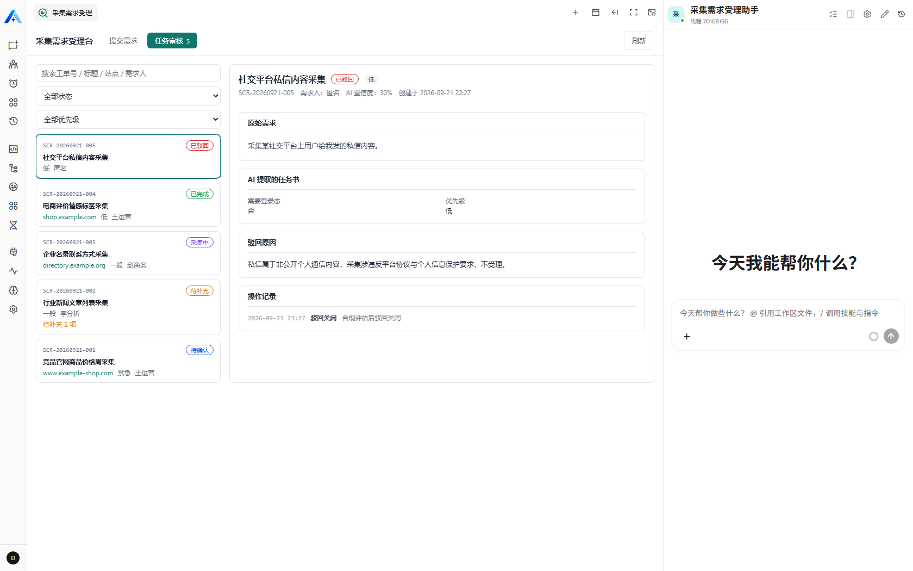
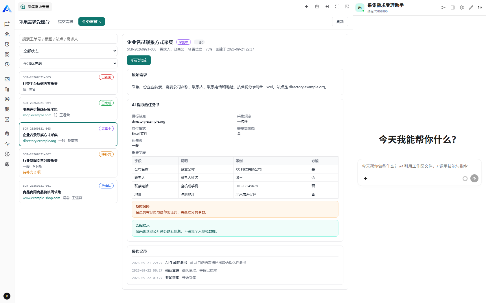

# Scrape Task Intake 插件

把自然语言采集需求变成可审核的结构化任务书:Xpert 业务应用插件(Agentic App),面向采集需求受理、AI 任务书生成、人工审核与状态跟踪的完整闭环。

- Agent middleware 暴露面向业务动作的采集需求工具。
- View provider 暴露「采集需求受理台」Workbench 视图(remote component iframe UI)。
- Service 层负责任务状态机、会话内去重、范围隔离与操作日志。
- Assistant 模板一键创建业务助手。

第一版范围刻意收敛为 Xpert 侧演示闭环,不实现真实采集执行调度、文件上传解析、多智能体协作或权限体系 UI。

## 业务流程

1. 业务方在「提交需求」页用自然语言描述采集需求 → 发送给 Assistant。
2. Assistant 调用 `scrape_intake_get_catalog` 获取站点类型字段模板与合规清单,提取结构化字段后调用 `scrape_intake_save_generated_task` 保存一张待确认任务(缺关键信息则进入待补充)。
3. 数据工程师在「任务审核」页查看 AI 提取的任务书,编辑、补充、确认受理或驳回关闭;确认后可开始采集并标记完成。
4. 任务与操作日志持久化保存,刷新后可恢复;同一会话内重复提交同一需求不会重复建单。

## Agent middleware tools

- `scrape_intake_save_generated_task`:保存 AI 生成的采集任务书(核心,会话内幂等去重)。
- `scrape_intake_get_catalog`:返回站点类型字段模板、频率/格式/页面范围候选与合规清单。
- `scrape_intake_search_tasks`:按状态、优先级、关键字分页查询任务。
- `scrape_intake_get_task_detail`:查询单张任务详情与操作日志。
- `scrape_intake_prepare_supplement_draft`:根据补充内容保存 AI 补充草稿,供审核台一键填入。

确认受理、开始采集、标记完成、驳回关闭只保留为 Workbench view actions,不暴露给 Agent tool。

## 数据存放

业务数据存插件自己的 TypeORM 表:

- `plugin_scrape_task_intake_task`:任务主数据、AI 提取结果、人工确认快照、补充草稿、状态与时间戳。
- `plugin_scrape_task_intake_task_log`:AI 生成、人工修改、补充草稿、确认、开始、完成、驳回与去重跳过日志。

候选站点模板第一版保存在 `ScrapeTaskIntakeMockCatalogService`,暂不建设正式主数据表。

## 状态机

```
pending_confirmation(待确认) ──确认受理──> confirmed(已受理) ──开始采集──> in_progress(采集中) ──标记完成──> completed(已完成)
        │ 补充完善                                   │
        └──> needs_supplement(待补充) ──保存补充──> pending_confirmation
        │ 驳回关闭
        └──> rejected(已驳回)
```

## 复用与来源说明

- 工程结构、插件入口/中间件/视图 provider 模式参考 [smart-maintenance](https://github.com/xpert-ai/xpert-plugins/tree/main/community/apps/smart-maintenance)(同仓库,AGPL-3.0),按其约定改写为采集任务领域:实体、状态机、工具集、视图动作与提示词均为本插件自有实现。
- Remote component 采用与 smart-maintenance / procurement-quote-comparison 相同的单文件 React UMD + 宿主桥接约定(`xpertai.remote_component` v1 协议),未引入构建工具;例外说明见下文「已知限制」。
- 骨架由仓库 `pnpm create:package --scope apps` 生成后替换。

## 运行说明

### 环境要求

- Xpert 开源版 main(本 PR 基线 SHA:平台 `c9b29f554`,插件仓库 `03de3fefa`)
- Node.js ≥ 20、pnpm(Corepack 按仓库 packageManager 解析)
- 平台需配置数据库、Redis 与至少一个模型供应商(本验证使用 DeepSeek,OpenAI 兼容)

### 构建与测试

```bash
# 在插件仓库 community 工作区安装依赖后:
cd community/apps/scrape-task-intake
corepack pnpm build   # tsc + 拷贝 remote component 与 assistant 模板资源
corepack pnpm test    # jest 37 个用例 + spec typecheck
```

### 安装到 Xpert

```bash
# 平台仓库根目录执行(需测试账号凭证):
corepack pnpm plugin:deploy:local \
  --plugin-dir <plugin-repo-root>/community/apps/scrape-task-intake \
  --scope organization --org-id <organization-id> --api-url http://localhost:3000
```

> 注意:`--scope` 传的是 scope 级别(`organization` / `tenant`),组织 ID 走 `--org-id`。Windows 下若脚本内 `corepack` 调用崩溃,可加 `--skip-build --skip-test`(构建与测试在本插件目录单独执行)。

安装后在平台内:创建/初始化组织 → 使用插件提供的「采集需求受理助手」模板创建 Assistant(绑定 `ScrapeTaskIntakeMiddleware` 工具与采集需求受理台视图)→ 在工作台完成一次真实采集需求提交与审核。

### 环境变量示例

```bash
XPERT_USERNAME=<平台测试账号>
XPERT_PASSWORD=<平台测试账号密码>
# 模型凭证配置在平台模型供应商设置中,不通过插件环境变量传递
SCRAPE_TASK_INTAKE_ENABLED=true            # 可选,默认 true
SCRAPE_TASK_INTAKE_DEDUPE_LOOKBACK_DAYS=7  # 可选,去重回溯天数
```

## 运行截图

> 以下截图在 Xpert 开源版 main(平台 SHA `c9b29f554`)本地环境实际运行中截取:插件按 `source: code` 安装到组织 `5a3eea5e…`,通过助手模板创建 Assistant,在「采集需求受理台」工作bench 视图中操作。列表中的任务数据为便于展示多状态而预置的样本数据(未经过真实模型调用生成),界面本身由插件 remote component 经平台 `view-hosts` 桥接实时渲染。

### 提交需求:自然语言表单 + 站点类型字段模板 + 合规清单



### 任务审核:状态筛选 + 任务列表



### 任务详情:AI 提取任务书、字段表、风险与合规提示、操作记录



## 验证结果

| 层级 | 内容 | 结果 |
|------|------|------|
| 单元测试 | `corepack pnpm test`(jest 37 用例 + spec typecheck + build) | ✅ 37/37 通过 |
| 实体命名检查 | `node community/scripts/check-entity-names.mjs` | ✅ 通过 |
| 插件生命周期 | plugin-dev-harness `--workspace ./community --plugin @xpert-ai/plugin-scrape-task-intake` | ✅ 加载/初始化/销毁通过 |
| 平台安装与加载 | `plugin:deploy:local --scope organization`(source: code,强制安装) | ✅ 安装并注册成功 |
| 平台视图注册 | `GET /view-hosts/agent/{xpertId}/slots/agent.workbench.main/views` | ✅ 返回 manifest(修复前返回空数组) |
| 平台视图数据 | `GET /view-hosts/.../views/scrape_task_intake__workbench/data` | ✅ 返回任务列表、状态统计与字段模板目录 |
| Remote component | `GET /view-hosts/.../remote-component/entry` + 浏览器渲染 | ✅ 200,iframe 内经桥接渲染出受理台 |
| 平台状态机 | 经 `POST /view-hosts/.../actions/{actionKey}` 驱动 确认受理 → 开始采集 → 标记完成 | ✅ 14/14 断言通过(状态落库、字段快照、操作日志、刷新恢复、非法流转被拒) |
| 平台真实模型调用 | 安装后由 Assistant 触发 `scrape_intake_*` 工具并生成任务 | ⏳ 未验证——本地环境未配置模型供应商凭证,`POST /api/chat` 返回 "The Assistant Primary model is not configured" |

平台侧两项本地适配(均为 Windows 下平台仓库 main 自身问题,不影响插件代码):`deploy-local-plugin.mjs` 在无 shell 启动 `corepack` 时崩溃(与已修复的 `npm.cmd` 同类问题),本次以 `--skip-build --skip-test` 绕过;`organization-plugin.store.ts` 的 `npm.cmd` 修复已在平台仓库 `7d28a4727` 合入。

## AI 协作说明

本插件使用 Claude Code(Claude 系列模型)辅助开发,包括:

- 把产品想法与面试要求翻译为结构化任务清单与工程结构(基于 smart-maintenance 参考实现)。
- AI 生成代码后人工校验每一处边界:zod 模式、TypeORM 实体、桥接协议、去重与范围隔离逻辑。
- 与 AI 一起定位问题的代表性过程:
  1. **corepack 版本解析**(平台仓库 `packageManager` 与全局 pnpm 版本冲突):与 AI 逐步排查「脚本内裸 pnpm 调用」命中的是全局 pnpm 11,最终以 corepack shim 优先的 PATH 修复,并顺带修复 Windows 下 `.cmd` 需 shell 的启动问题。
  2. **harness DI 失败**(`DataSource` 在 TypeOrmModule 上下文不可解析):与 AI 一起确认 smart-maintenance 同样复现,定位为 workspace 内多份 typeorm 副本导致 token 身份不一致,本地修复 harness 解析顺序后通过。
  3. **remote component 桥接**:参考示例逐段核对 `init`/`requestData`/`executeAction`/`hostEvent` 消息形状后实现,并用 spec 断言防回归(无 localStorage、高度上报、轮询上限等)。
  4. **受理台视图不显示**(平台实测才发现):`GET /view-hosts/.../slots/agent.workbench.main/views` 返回空数组。与 AI 一起追到平台 `isManifestActiveForContext`——`agent.workbench.main` 槽带了 `manifestPolicy.requireFeatureActivation`,而 manifest 没声明 `requiredFeatures` 就被直接过滤;原先只有 `agent.workbench.fixed` 变体声明了。补上后视图立即可见。
  5. **点击任务行详情为空**(同一次实测):行高亮了但右侧详情变空。与 AI 一起读 `loadData`,发现点击时虽传了 `taskId`,却没把它放进 `requestData` 的查询参数,平台于是按第一条任务返回 `item`,与点击行不相等 → `nextItem` 为 null → 详情被清空。修正后任意行都能打开自己的详情。
- 主要收获:平台插件的「骨架便宜、边界贵」——插件入口与 CRUD 很快,但去重语义、状态机守卫、iframe 沙箱约束、平台侧 manifest 激活策略与跨 iframe 的状态同步这类边界问题占用了大部分调试时间。第 4、5 两个问题单元测试全绿也照样存在,只有把插件真正装进平台跑一遍才会暴露。

## 已知限制

- 未实现真实采集执行调度、文件上传解析、多智能体协作、权限体系 UI;候选站点模板为内置 mock 数据。
- 未做过平台内真实模型调用验收:本地环境没有配置模型供应商凭证,`POST /api/chat` 直接返回 "The Assistant Primary model is not configured",因此「自然语言 → AI 提取 → 保存任务」这一跳只能由单元测试覆盖,未经端到端验证。界面截图中列表数据为预置样本。
- Remote component 为单文件 `app.js`(无构建、React UMD 手写),这是对 smart-maintenance 既有约定的延续;若后续界面复杂化,应迁移到 TSX + esbuild + shadcn 方案。
- 去重仅覆盖同一会话 + 相同原始文本 + 可编辑状态;跨会话重复提交不拦截。
- 未在多个租户/组织间做过数据隔离的浏览器级验证(单元测试覆盖了服务层范围过滤)。
- 平台侧在 Windows 本机的一处本地问题未随 PR 提交:`deploy-local-plugin.mjs` 无 shell 启动 `corepack` 时崩溃(与平台已修复的 `npm.cmd` 问题同类),本次用 `--skip-build --skip-test` 绕过;不影响插件代码本身。

## 平台 Agent 提示词建议

```text
你是智能采集需求受理助手,负责把用户的自然语言采集需求转成可复核的结构化任务书,并辅助查询、解释和补充任务。

当用户明确描述采集需求(目标站点、字段、频率、交付格式)时,先调用 scrape_intake_get_catalog 获取站点类型字段模板与合规清单,再提取结构化字段,调用 scrape_intake_save_generated_task 保存一张待确认任务。一次需求只保存一张任务;不要把一个需求拆成多个任务。

字段不完整时不要编造目标链接、字段名或凭证;把缺失项写入 completenessTips。反爬风险(antiBotNotes)与合规提示(complianceNotes)只描述工程师需要注意的事项,不要声称已经绕过任何防护或已获授权。

需要规范字段模板时调用 scrape_intake_get_catalog。用户查询任务列表时调用 scrape_intake_search_tasks;查看某张任务时调用 scrape_intake_get_task_detail;用户补充待补充任务信息时调用 scrape_intake_prepare_supplement_draft,并提醒用户到采集需求受理台一键填入后人工保存。

不要承诺采集已经开始、数据已交付或任务已关闭。确认受理、开始采集、标记完成、驳回关闭必须由人工在采集需求受理台完成。
```
