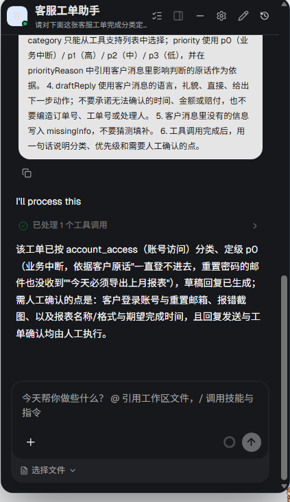
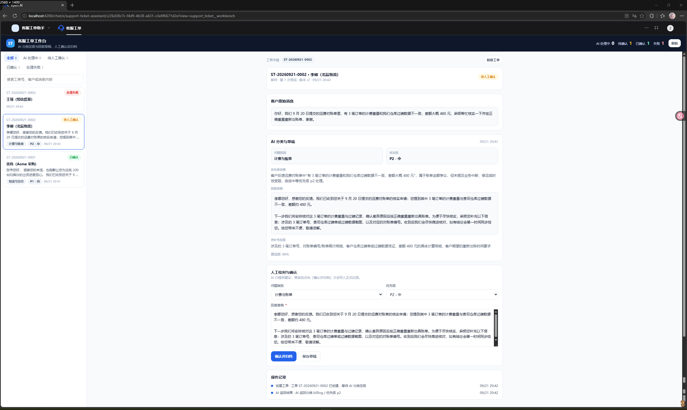
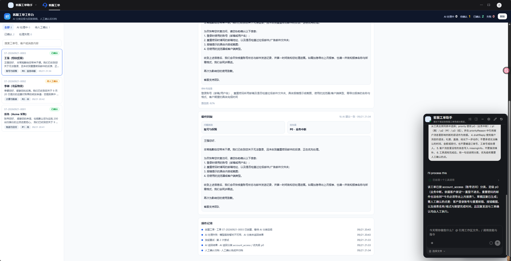
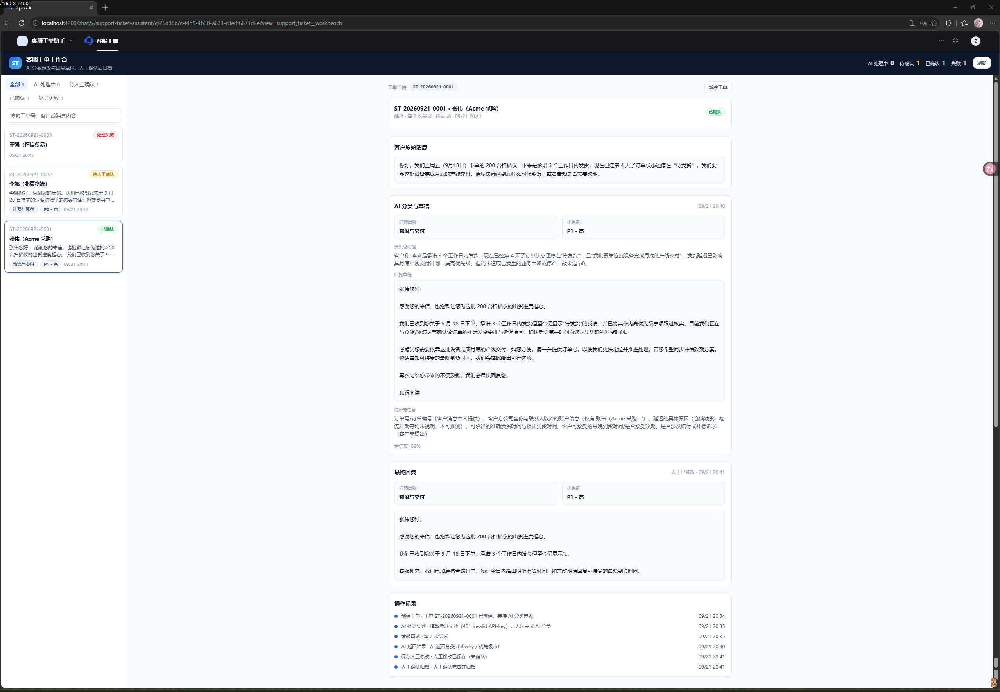
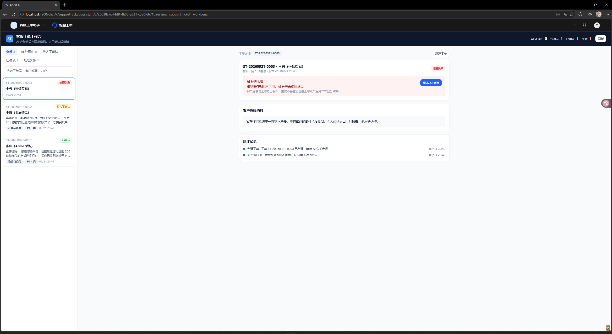

# Support Ticket Workbench (`@xpert-ai/plugin-support-ticket`)

面向中小型 B2B 客服与售后团队的业务应用插件：把客服「逐条读客户消息、凭经验判断类别与紧急度、从零手打回复」的工作方式，改成 **提交客户消息 → AI 分类定级并生成回复草稿 → 人工校对确认 → 归档可查** 的固定流程。AI 只提供建议，任何人看到的正式记录都必须经过人工确认。

> English summary: an Xpert Agentic App plugin that turns raw customer messages into classified, prioritized and archived support tickets with a human-confirmed reply draft.

## 1. 产品说明

| 项 | 内容 |
| --- | --- |
| 目标用户 | B2B 客服/售后团队的一线客服专员及其主管 |
| 原有工作方式 | 在邮件与 IM 之间逐条阅读客户消息，靠个人经验判断类别与紧急程度，再从零手打回复 |
| 痛点 | 分类口径不一致、紧急工单被埋、同类问题重复处理、事后无法回溯「当时是怎么判的、改了什么」 |
| AI 的作用 | 一次真实模型调用完成两件事：把非结构化客户消息映射到统一类别与优先级（附可核对的定级依据），并生成可直接使用的回复草稿 |
| 人的作用 | 校对并修改类别、优先级与草稿，「确认并归档」是唯一把 AI 建议变成正式记录的路径；系统不会自动发送任何内容 |
| 明确不做 | 不做真实发送渠道集成、不做多智能体编排、不做复杂 RBAC、不做多端适配（题目中均为按需选用项） |

**业务流程**

```
客服专员                      Xpert 工作台                       助手（模型 + 插件工具）
   │  粘贴客户消息 ─────────▶ 新建工单（幂等键 requestId）
   │                          状态 processing ──── 发送提示词 ──▶ 读取消息，调用工具
   │                                                              support_ticket_save_triage
   │                          状态 pending_review ◀── 工具落库 ───┘
   │  校对类别/优先级/草稿 ──▶ 保存草稿（乐观锁 revision）
   │  点击确认并归档 ────────▶ 状态 confirmed，写入最终回复与操作记录
   │
   └─ 失败时：状态 failed + 可读原因 + 「重试」按钮，重试复用同一张工单
```

**状态机**：`processing`（已提交/AI 处理中）→ `pending_review`（待人工确认）→ `confirmed`（已确认归档）；任一步失败落 `failed`，可重试。

**关键业务规则**（均有单测覆盖）

- `requestId` 幂等：重复提交返回同一张工单，不产生第二条业务记录。
- `revision` 乐观锁：保存草稿/确认时若工单已被他人修改，返回 `revision_conflict`，页面保留当前修改不静默覆盖。
- 已确认的工单不可改写：AI 结果、失败标记、重试一律返回 `already_confirmed`。
- 失败重试不重复产生业务结果：同一 `ticketId` 重新进入处理，`attemptCount` 递增，事件时间线保留完整过程。
- 范围隔离：所有查询按 `tenantId + organizationId` 过滤，幂等键复用同样受范围校验。

## 2. 目录结构

```
community/apps/support-ticket/
├── package.json / index.cjs / tsconfig*.json     # 包元信息（exports 保留 default）、编译与测试配置
├── .env.example                                  # 本地安装所需环境变量占位（不含任何真实密钥）
├── scripts/build-remote-components.mjs           # esbuild 打包远程界面为单文件 IIFE
├── scripts/copy-assets.mjs                       # 拷贝助手模板与远程界面产物到 dist
├── src/index.ts                                  # 插件入口：meta / config / templates / register / onStart / onStop
├── src/xpert-support-ticket-assistant.yaml       # 助手模板 DSL（挂载中间件工具）
└── src/lib/
    ├── constants.ts                              # 名称、feature、视图与工具 key、动作与结果码、选项列表、图标
    ├── types.ts                                  # 状态、动作、入参出参等业务类型
    ├── support-ticket.config.ts                  # zod 配置 schema + 表单 schema + 环境变量默认值 + DI 令牌
    ├── support-ticket.plugin.ts                  # @XpertServerPlugin：TypeORM 实体与 provider 注册
    ├── entities/support-ticket.entity.ts         # plugin_support_ticket 表
    ├── support-ticket.service.ts                 # 业务服务：状态机、幂等、乐观锁、范围隔离、视图数据
    ├── support-ticket.middleware.ts              # 助手中间件工具：保存分类结果 / 检索 / 详情
    ├── support-ticket-view.provider.ts           # 视图清单、远程组件入口、动作分发、助手提示词构造
    ├── support-ticket.templates.ts               # 助手模板贡献
    └── remote-components/support-ticket/         # 工作台界面（隔离 iframe）
        ├── app.js / app.css                      # 构建产物与空样式（预览宿主需要 app.css）
        ├── preview.config.mjs                    # 本地预览宿主配置（含 mock 数据与失败开关）
        └── src/{main.tsx,bridge.ts,utils.ts,i18n.ts,styles.ts,types.ts,components/*}
tests/                                            # 25 项单元测试（node:test）
```

## 3. 环境要求与本地验证

```bash
# 依赖（在 community 工作区安装；本插件不发布 npm 包）
corepack pnpm install --filter "@xpert-ai/plugin-support-ticket..."

cd community/apps/support-ticket
corepack pnpm run typecheck          # 服务端类型检查
corepack pnpm run remote:typecheck   # 远程界面类型检查
corepack pnpm run test               # 25 项单元测试
corepack pnpm run build              # 远程界面打包 + 服务端编译 + 资源拷贝
corepack pnpm run verify             # 上述四步串行执行

# 插件生命周期验证（在插件仓库根目录，需先构建 plugin-dev-harness）
# 本机 Node 为 v22+ 时用 node@20 运行，避免依赖包解析差异
npx -y node@20 plugin-dev-harness/dist/index.js \
  --workspace ./community \
  --plugin @xpert-ai/plugin-support-ticket
# 需要校验插件配置时追加 --config <config.json>，例如 {"aiTimeoutSeconds":120}

# 远程界面本地预览（需先 build）
corepack pnpm remote-view:preview \
  --config community/apps/support-ticket/src/lib/remote-components/support-ticket/preview.config.mjs
# 打开输出的地址即可看到工作台；在客户消息中输入「模拟失败」可复现失败与重试路径
```

## 4. 安装到 Xpert

1. 准备 `community/.env`（模板见 `community/env.example`），填入 `XPERT_API_URL`、`XPERT_ORG_ID`、`XPERT_TOKEN`；本插件 `meta.level` 为 `organization`，安装范围需与之一致。
2. 在宿主根目录执行部署：

   ```bash
   corepack pnpm plugin:deploy:local \
     --plugin-dir <plugin-repo-root>/community/apps/support-ticket \
     --scope organization --api-url "$XPERT_API_URL"
   ```

   或按宿主提供的帮助脚本 `pnpm plugin:install:local --workspace-path <plugin-dir> --org-id "$XPERT_ORG_ID" --token "$XPERT_TOKEN" --api-url "$XPERT_API_URL"`。
3. 确认安装回执为 loaded（若返回 `restartRequired`，重启测试 API 后再验证）。
4. 在助手模板入口创建「客服工单助手」，选择本实例可用的模型并发布。
5. 打开客服工单工作台，确认助手与工作台已关联（模板的 `defaultConfig.viewProvider` 指向本插件的视图提供者）。
6. 走一遍真实流程：录入客户消息 → 提交 → 等待 AI 结果 → 校对 → 确认并归档 → 刷新后仍可查到该工单与最终回复。

模型凭证通过平台配置或环境变量提供，插件代码内不含任何密钥。可选的插件配置项 `aiTimeoutSeconds`（默认 90 秒，亦可用环境变量 `SUPPORT_TICKET_AI_TIMEOUT_SECONDS` 覆盖）决定工作台等待助手返回结果的看门狗时长，超时会把工单标记为失败并开放重试。

## 5. 验证结果

| 层次 | 命令 | 结果 |
| --- | --- | --- |
| 单元测试与类型检查 | `corepack pnpm run test` / `typecheck` / `remote:typecheck` | 通过：25 项测试全部成功（业务规则、输入校验、状态流转、幂等、乐观锁、范围隔离、数据库侧查询与分页、桥接契约） |
| 构建 | `corepack pnpm run build` | 通过：`dist/index.js`、`dist/xpert-support-ticket-assistant.yaml`、`dist/lib/remote-components/support-ticket/app.js` 齐全 |
| 仓库约束 | `node community/scripts/check-entity-names.mjs` 与 `node scripts/check-plugin-entity-tables.mjs` | 通过：实体表名以 `plugin_` 开头，表名检查通过 |
| 插件生命周期 | `npx -y node@20 plugin-dev-harness/dist/index.js --workspace ./community --plugin @xpert-ai/plugin-support-ticket` | 通过：入口解析到 `dist/index.js`，`register`/`onStart`/`onPluginBootstrap`/`onPluginDestroy`/`onStop` 全部完成，`Plugin loaded successfully` |
| 插件配置校验 | 同上命令追加 `--config ./community/apps/support-ticket/dist/harness-config.json` | 通过：`{"aiTimeoutSeconds":120}` 被接受；`{"aiTimeoutSeconds":5}` 返回 `Config schema validation failed: aiTimeoutSeconds: Number must be greater than or equal to 15` 且退出码为 1 |
| 界面资源与桥接 | `corepack pnpm remote-view:preview --config .../preview.config.mjs` | 通过：预览宿主用构建产物生成 iframe HTML（`GET /` 与 `GET /__xpert/component` 均 HTTP 200 且含工作台 bundle），桥接 `requestData` 返回 `items/total/item/summary/meta`（种子数据 2 条） |
| 平台安装 | `corepack pnpm plugin:deploy:local --plugin-dir .../community/apps/support-ticket --scope organization --api-url http://localhost:3000/ --org-id <org-id>` | 通过：平台 `plugin_instance` 写入 `@xpert-ai/plugin-support-ticket@0.1.0`，`source=code`、`level=organization`、`configurationStatus=valid` |
| 平台加载 | 重启测试宿主后检查 API 启动日志 | 通过：`register support-ticket plugin` → `SupportTicketPlugin is being bootstrapped...` → `Bootstrapped Plugin [SupportTicketPlugin]` → `SupportTicketPlugin dependencies initialized` |
| 平台内业务流程 | 在工作台录入客户消息 → 触发处理 → 人工确认归档 | 通过（以持久化记录为证）：`plugin_support_ticket` 中工单 `ST-20260921-0001` 的完整时间线 `submitted → ai_failed → retry_requested（第 2 次尝试）→ ai_completed → draft_saved → confirmed`，`attemptCount=2`、`revision=6`，说明工作台视图渲染、动作桥接、状态机、失败重试复用同一工单、人工确认归档都已在真实平台内落库 |
| 平台内真实模型调用 | 平台内配置 OpenAI-API-compatible 模型凭证，经 `POST /api/xpert/:id/chat` 触发助手处理工单 | 通过：助手调用中间件工具 `support_ticket_save_triage`，`aiCategory=delivery`、`aiPriority=p1`、`aiPriorityReason` 引用客户原话作为定级依据、`aiDraftReply` 为完整中文草稿（未承诺发货时间、主动索要订单号）、`aiMissingInfo` 列出 6 项未获取信息（未编造）；事件时间线记录 `ai_completed: AI 返回分类 delivery / 优先级 p1` |
| 助手模板创建与绑定 | `POST /api/xpert-template/@xpert-ai/plugin-support-ticket:support-ticket-assistant/install` 创建，`POST /api/xpert/:id/publish` 发布 | 通过：助手 `support-ticket-assistant` 已绑定 LLM（`copilotModelId`）、工作台（`options.workbench.defaultViewKey=support_ticket__workbench`）与中间件节点（`provider=SupportTicketMiddleware`），发布后 `version=2`（同步双栏布局后重新发布）、`graph` 含 2 个节点 |

**复现基线**：平台 `xpert-ai/xpert` main `d24ca81`；插件仓库 `xpert-ai/xpert-plugins` main `ceb57e6f`，本分支基于该提交。实际测试版本：本分支 `e09fc81f`（第 5 节全部平台内验证与第 6 节截图均基于该版本的插件产物；其后仅 README 文档有增量提交）。

**Windows 平台兼容说明（复现必需）**：在 Windows 上，`@xpert-ai/plugin-sdk` 的 `AIModelProviderStrategy` 装饰器通过调用栈推断 provider YAML 目录时，剥离 `file://` 前缀后残留前导斜杠（`file:///c:/...` → `/c:/...`），`path.join` 生成非法路径，导致所有模型插件读不到自身的 `<provider>.yaml`，平台「模型提供商」列表退化为空（接口返回 `[{}]`）；可在剥离前缀后去掉盘符前的多余斜杠（`/c:/...` → `c:/...`）修复。另需处理 `tools/scripts/deploy-local-plugin.mjs` 中 `spawnSync('corepack', ..., { shell: false })` 在 Windows 下无法执行 `.cmd` 的问题（本地通过 `XPERT_PLUGIN_BUILD_COMMAND` / `XPERT_PLUGIN_TEST_COMMAND` 环境变量走 `shell: true` 分支绕过）。以上均为平台侧问题，与插件产物无关。

**尚未验证的部分**：真实模型调用目前只覆盖 2 个用例（`delivery/p1` 与 `billing/p2`）；多用户/多组织隔离仍仅由单元测试覆盖，尚未在真实多账号下复验；无浏览器自动化环境，界面层结论来自平台内实际操作与截图，未做像素级回归。

### 5.1 真实使用中发现并修复的插件缺陷

在平台内实际操作（而非仅接口调用）后定位并修复了 3 处缺陷，均已重新构建、部署并复验（`typecheck` 通过、25 项测试通过）：

1. **点击工单列表，右侧详情不切换**
   `src/lib/remote-components/support-ticket/src/components/workbench.tsx` 中拉取详情的 `useEffect` 依赖数组为 `[fetchData]`，**缺少 `selectedId`**：点击只更新选中态而不触发重新请求，`data.item` 始终停在初始请求返回的第一条工单（无 `ticketId` 时服务端默认返回列表首条）。
   修复：依赖补上 `selectedId`，并新增 `selectedIdRef` 修正 `hostEventTick` 事件里的同类 stale closure（否则 AI 完成后会刷错工单）。
   复验：依次选中三张工单，服务端均返回对应 `item`（`ST-...0001/0002/0003` 各匹配 OK）。

2. **工作台最大化后无法回到对话 / 控制台**
   模板 `options.workbench.initialLayout` 原为 `workbench-maximized`，工作台占满界面并把助手对话收成悬浮球（`chatkitHiddenFromWorkspace`），用户被困在工作台内。
   修复：改为 `two-columns`（对话与工作台并排），贴合"对话里让 AI 分类 → 工作台人工确认"的业务闭环，演示与截图也能同时体现两侧。

3. **无法从模板手动创建助手**
   模板 `xpertName` 原为中文「客服工单助手」；平台 `convertToUrlPath` 只保留 `a-z0-9-`，中文名会得到**空 slug**，`validateName` 判定"名称无效"，导致任何人从模板创建助手都必然失败。
   修复：`xpertName` 改为 `support-ticket-assistant`（与 `team.name` 一致），中文「客服工单助手」继续由 `title` 展示。

> 附注：Xpert 3.0 的助手工作台路由（`/chat` 下）是独立沉浸式页面，不渲染主应用侧栏——这是平台架构设计，插件无法改变；侧栏「客服工单」菜单项的作用是快捷进入该工作台（URL 带 `?view=support_ticket__workbench`）。仓库内其他使用中文 `xpertName` 的示例插件存在与第 3 项相同的问题。

## 6. 运行截图

以下截图均在本地 Xpert 实例（平台 `xpert-ai/xpert` main `d24ca81`）中采集，图片随代码提交并以相对路径引用，可在 GitHub 中直接显示。

### 6.1 AI 处理过程

在助手对话中发起工单处理，助手调用中间件工具 `support_ticket_save_triage` 完成分类定级与回复草稿。



### 6.2 AI 结果：待人工审核

工单落入 `pending_review`，工作台展示 AI 给出的类别、优先级、引用客户原话的定级依据，以及可直接使用的回复草稿。



### 6.3 人工重新审核（校对与修改）

人工在工具支持的枚举内核对并调整类别/优先级、修改回复草稿；保存走乐观锁 `revision`，冲突时保留页面修改而不静默覆盖。



### 6.4 确认并归档

人工确认后工单变为 `confirmed`，写入最终回复与审核记录；已确认的工单不再被 AI 结果、失败标记或重试改写。



### 6.5 处理失败与重试

失败工单呈现可读的失败原因并开放「重试 AI 处理」；重试复用同一张工单（`attemptCount` 递增、事件时间线保留完整过程），不重复产生业务结果。



> 本地预览可先用第 3 节的 `remote-view:preview` 命令查看界面，但它不是平台运行截图。

## 7. 已知限制

- 列表与状态计数都已下推到数据库（作用域过滤 + `skip`/`take` + 索引），但筛选维度按 OR 组合展开：类别、优先级与关键词同时使用时最坏会拼出 16 组 `where`。真实工单量级下的查询耗时尚未压测。
- 未接入真实发送渠道：确认归档后的回复仍需人工复制到邮件或 IM 中发送。
- 分类与优先级取固定枚举；如需自定义类别体系，需要扩展 `src/lib/constants.ts` 与服务端校验。
- 多人协作只通过 `revision` 乐观锁保证不静默覆盖，没有实时推送；他人修改后需要手动刷新。
- 单实例租户级配置；未实现按组织自定义提示词模板。

## 8. AI 协作说明

- 工具与模型：CodeBuddy（DeepSeek-V4.1-Flash）+ 仓库内既有示例代码作为上下文。
- 有代表性的过程：
  1. **先摸清约定再动手**：用代码检索子代理通读 `community/apps` 下 9 个示例，确认「包名统一 `@xpert-ai/plugin-<name>`、实体表名必须 `plugin_` 开头、注册六环节必须逐一对齐」等硬约束后才开始写代码，避免自创结构。
  2. **纠正了一处会导致 AI 流程失效的误判**：最初按 `smart-maintenance` 的写法让视图动作直接返回 `commandKey/payload`，随后在 `img2threejs` 中找到真正生效的实现——动作返回 `data.clientCommand`，由远程组件显式调用 `invokeClientCommand`，且动作结果封装在桥接响应的 `result.data` 内。据此改写了客户端解析，并补了桥接契约测试锁死这一协议。
  3. **主动做了减法**：计划里包含独立的操作日志实体与保存队列类，评估后认为单表 JSONB 时间线 + 直接读取 `revision` 已能覆盖同样的业务保证，于是合并了状态机的重叠状态、去掉未使用的配置项与重复工具函数。
  4. **接口跑通不等于用户能用**：部署后先用 API 走通流程并直接查库取证，确认 `aiCategory` / `aiPriority` / `aiDraftReply` 真实落库；随后在浏览器里手动操作，才暴露出「点击工单列表右侧详情不切换」「工作台最大化后被困住」「从模板创建助手必然失败」三处缺陷（详见 5.1）。这三处单元测试、harness 与接口调用都发现不了，只有真实操作才会暴露，是本次收益最大的一步。
  5. **先分清是谁的问题再动手**：模型 Provider 列表为空时没有盲目重启，而是先用带 token 的 API 判定属于 registry 层而非认证层，再追踪到 Windows 下 `AIModelProviderStrategy` 装饰器从调用栈推断 YAML 目录时把 `file:///c:/...` 剥成 `/c:/...`，`path.join` 生成非法路径（见第 5 节 Windows 兼容说明）。结论是平台侧问题，因此只记录复现方式，不改动插件去绕过。
- 遇到过的限制：本地 pnpm 因依赖构建脚本策略无法安装 `plugin-dev-harness` 依赖，改用 npm 完成安装；`plugin:deploy:local` 在 Windows 下 `spawnSync('corepack', ..., { shell: false })` 无法执行 `.cmd`，改用环境变量走 `shell: true` 分支绕过；无浏览器自动化环境，界面层结论来自平台内手动操作与截图，未做像素级回归。

## 9. 复用来源与许可

- 插件骨架、注册方式、中间件工具写法参照同仓库 `community/apps/smart-maintenance`；远程组件构建脚本与 iframe 桥接参照 `community/apps/crm` 与 `community/apps/img2threejs`；`invokeClientCommand` 协议以 `img2threejs` 的可运行实现为准。
- 复用范围为工程模式与少量工具函数（shim、桥接、构建脚本），业务逻辑、数据模型、界面与文案为本插件自行实现。
- 本包遵循仓库根许可 AGPL-3.0。
