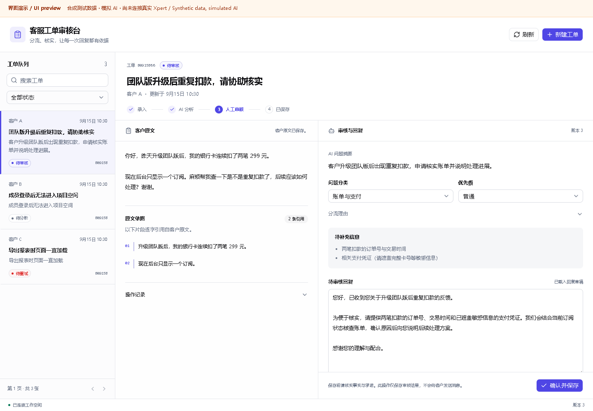
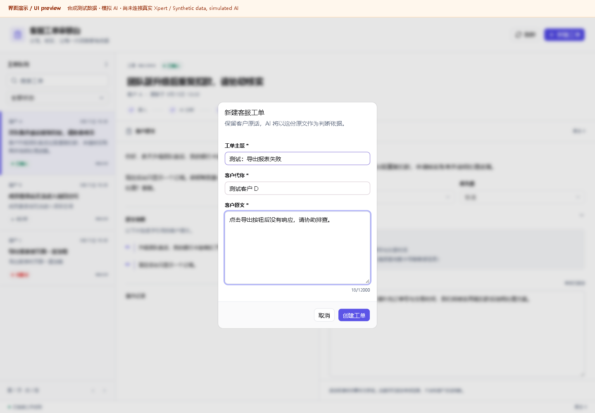
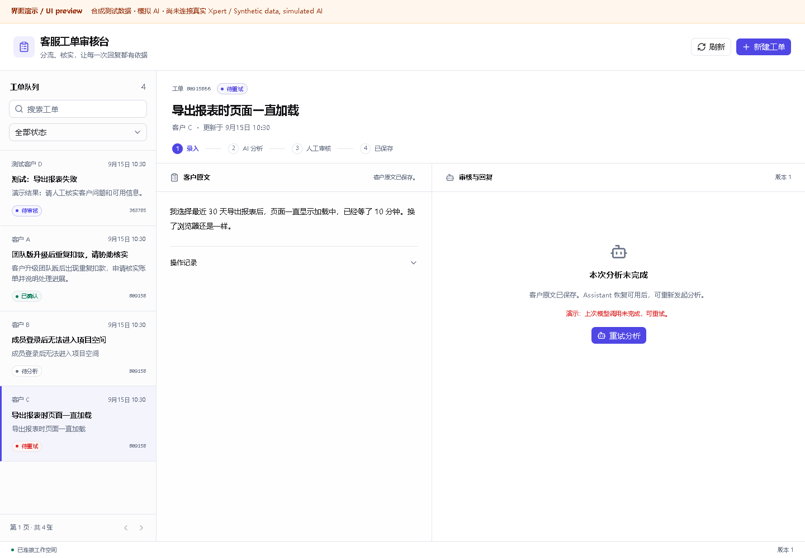

# 客服工单分流与回复审核台

运行于 Xpert 的独立 Agentic App 插件。面向小型 SaaS 团队的一线客服，将客户问题整理为可核对的摘要、分类、优先级和回复草稿，再由客服修改确认并保存。

**交付状态：核心实现已完成，本地构建、21 项后端测试和官方加载测试通过。真实 Xpert 安装、真实模型调用和平台截图尚待完成；完整分层结果见验证记录。**

## 核心流程

新建工单 → AI 分析 → 核对原文证据和待补信息 → 编辑回复并确认 → 保存 → 刷新恢复。模型或宿主命令失败后可结束当前尝试，再创建新的分析尝试；旧回调不能覆盖新任务。

应用提供实际表单、分页列表、搜索、状态筛选、原文与分析对照、回复编辑、确认状态和活动记录。结果保存到服务端 TypeORM 数据表；人工确认不向客户发送消息。

## 文档

- [产品说明与页面设计](docs/product.md)
- [架构和状态模型](docs/architecture.md)
- [安装及助手初始化](docs/plugin-runbook.md)
- [验证记录及当前缺口](docs/validation.md)
- [五分钟演示与面试讲解](docs/demo.md)
- [AI 协作记录](docs/ai-collaboration.md)
- [开源来源与许可](THIRD_PARTY_NOTICES.md)

## 开发基线

| 项目 | main 基线 |
| --- | --- |
| xpert-ai/xpert | `01aa0f76eb96ef88e8a435d7d99832c7b7138560` |
| xpert-ai/xpert-plugins | `f96b94c3f0915261fc3ff4835572ec8c0c61de4f` |
| Xpert SDK / contracts | `3.18.4` |
| 插件包 | `@community/apps-support-triage@0.1.0` |
| 插件级别与命名空间 | `tenant` / `support_triage` |

源码位于插件仓库 `community/apps/support-triage`；使用上游 `main` 派生的独立功能分支。平台与插件采用开源版接口，无需发布 npm 包。

## 构建与测试

先从 `xpert-plugins` 仓库根目录执行：

```sh
cd community
corepack pnpm --filter '@community/apps-support-triage...' install
corepack pnpm --filter '@xpert-ai/plugin-shadcn-ui' build
corepack pnpm --filter '@community/apps-support-triage' typecheck
corepack pnpm --filter '@community/apps-support-triage' build
corepack pnpm --filter '@community/apps-support-triage' test
corepack pnpm --filter '@community/apps-support-triage' verify:dist
```

`community/package.json` 指定 `pnpm@8.15.8`。源代码测试采用实际 SQL.js / TypeORM，外部 Xpert 运行能力由单独的生命周期和平台验收负责。共享 UI 来自同一仓库的 `packages/shadcn-ui`，构建后由本插件打包进 iframe 资源。

Windows 的受限执行环境若使原生 esbuild 无法读取父目录，可设置 `$env:TRIAGE_ESBUILD_WASM='1'`，使用同版本 WASM 构建器。共享 UI 可使用 `vite build --configLoader runner` 后执行 `tsc -p tsconfig.lib.json --emitDeclarationOnly`。这些是构建环境适配，不改变产品运行逻辑。

### 界面预览与浏览器测试

在本插件目录执行 `corepack pnpm preview`，打开终端给出的地址。该预览使用仓库的官方 Remote View Preview Host，并由外层横幅明确标记模拟环境；合成工单保存在预览服务器内存中，重启预览会重置。

```sh
corepack pnpm exec playwright install chromium
corepack pnpm test:ui
```

已有浏览器时，可通过 `PLAYWRIGHT_CHROMIUM_EXECUTABLE` 指定 Chrome/Edge 可执行文件。`WORKBENCH_E2E_SCREENSHOTS` 指定可选截图目录。测试通过真实构建资源和桥接消息操作界面，并禁用 localStorage/sessionStorage；模拟 AI 结果与真实模型调用分开验收。

## 界面截图（模拟宿主与合成 AI 结果）

以下是实际运行的界面代码，但宿主和 AI 数据均为测试夹具，**不是 Xpert 平台验收截图**。

### 原文、分析证据与人工审核



### 工单输入



### 失败后保留原文并提供重试



## 真实 Xpert 运行截图（待补齐）

平台安装与真实模型验收后，在本节补齐工单输入、真实 AI 结果、人工确认后刷新恢复，以及模型失败与成功重试。图片随代码提交并使用相对路径引用。当前本地预览图片不能替代这些证据。

## 数据和模型边界

- 模型通过 Xpert 助手及三个受限工具处理工单；本插件不保存模型 API Key。
- 身份来自宿主上下文，每条查询按租户、组织、工作区、用户和助手隔离。
- 服务端检查逐字原文证据、状态、修订号和分析尝试标识。
- Agent 没有确认工具。只有人工 View 动作能保存最终回复和确认记录。
- iframe 使用宿主桥接，不使用浏览器本地存储、不接收凭证、不直接访问业务 API。

## 已知限制

当前按单客服使用设计，不支持跨用户共享工单、自动外发、附件和外部客服系统。三分钟分析超时由读取工单或刷新列表触发恢复，暂不提供后台定时回收任务。AI 建议仍需人工检查，引用存在不保证推断正确。

提交前必须完成 [验证记录](docs/validation.md) 中列出的真实平台项目；未完成的项目应继续明确标注。
