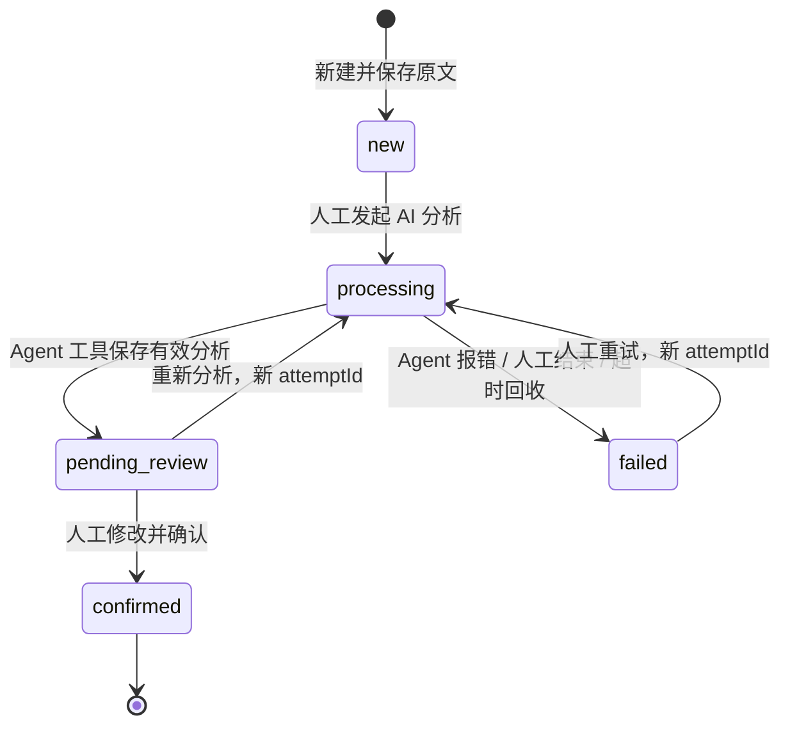

# 客服工单审核台：架构与边界

## 业务闭环

人工创建工单，AI 提取摘要、分类、优先级、原文证据、缺失信息和回复草稿，人工核对并修改后确认。确认结果保存到平台数据库。应用不向客户发送消息。

每次状态变化增加 `revision`。重新分析不会修改客户原文；已确认工单不可被模型覆盖或重新分析。

## 组件与调用路径

| 层 | 责任 | 主要文件 |
| --- | --- | --- |
| 插件入口 | tenant 级元信息、App、模板及运行时注册 | `src/index.ts` |
| 共享契约 | 严格 Zod 校验、枚举、DTO、错误码 | `src/domain/contracts.ts` |
| 领域服务 | 数据隔离、状态机、幂等、CAS、超时与审计 | `src/ticket.service.ts` |
| TypeORM 实体 | 工单及持久化状态 | `src/ticket.entity.ts` |
| Agent middleware | 3 个模型工具；声明 `support_triage.review` 能力 | `src/analysis.middleware.ts` |
| View provider | 原生 Workbench 查询、人工动作、iframe 入口 | `src/view.provider.ts` |
| Assistant | 单一主 Agent 连接分析 middleware | `src/support-triage-assistant.yaml` |
| Remote UI | 列表、原文、AI 建议、人工确认及错误恢复 | `remote/` |

一次分析的真实平台调用为：

1. View `create_ticket` 保存标题、客户代称、原文；返回工单 ID 与版本。
2. View `analyze_ticket` 验证当前版本，保存 `processing`、随机 `attemptId` 和 3 分钟期限。
3. View 返回 `commandKey: assistant.chat.send_message` 与包含两个 ID 的提示文本；iframe 通过声明过的原生 client command 发给当前 Assistant。
4. Assistant 调用 `support_triage_get_ticket` 读取当前批次的原文，然后调用 `support_triage_save_analysis`。无法完成时调用 `support_triage_report_failure`。
5. UI 接收分析写入工具的完成事件并刷新。列表查询使用分页；详情通过 `parameters.ticketId` 单独读取。
6. View `confirm_ticket` 保存人工最终分类、优先级、回复、确认人和时间。

三个 Agent 工具均不接受租户、组织、用户或权限字段，且没有确认、取消、创建工单或对外发送能力。View 才提供 `abort_analysis`，用于 host command 失败后的立即恢复，或用户主动结束当前分析。

## 数据存储

物理表名为 `plugin_support_triage_ticket`，由 SDK 的 `pluginArtifactTableName('support_triage', 'ticket')` 生成。

- 所有查询、去重和更新条件均包括 `tenantId`、`organizationId`、`workspaceId`、`userId`、`xpertId`。
- 五项身份来自 Xpert 认证上下文；任何一项缺失就拒绝操作。工单默认按用户和 Assistant 隔离，不是整个组织共享队列。
- 独立列保存 ID、请求幂等键、标题、客户代称、状态、版本、时间和当前批次期限。
- `payloadJson` 保存不可变原文、最新 AI 分析、失败原因、人工最终结果和事件历史。
- 分析结果与状态、版本、审计事件在同一个条件 UPDATE 中提交。不会出现结果写入但状态或审计未写入的半完成状态。
- 列表在数据库侧筛选、搜索、排序与分页，默认 20、上限 100；搜索范围是标题和客户代称。

## 幂等、并发和恢复

| 场景 | 保护机制 |
| --- | --- |
| 双击创建 / 网络重试 | 作用域加 `requestId` 的唯一约束；相同请求返回原 ID，内容变化则拒绝 |
| 两端同时发起分析或确认 | `UPDATE ... WHERE scope AND id AND revision`；仅一个版本可成功 |
| 模型重复保存 | 同一 `attemptId`、相同分析返回幂等结果；不同内容拒绝 |
| 模型迟到 | `attemptId` 必须匹配当前批次；旧批次不能覆盖新批次或人工结果 |
| 过期与重试交错 | 过期 CAS 失败后读取新记录，再次核验 `attemptId`，阻止旧回调进入新批次 |
| 重复确认 | 同一 `confirmationId` 和相同最终内容返回原结果；不同内容拒绝 |
| 模型/会话失联 | 服务端保存期限；读取详情或刷新列表时回收超时记录，可人工重试 |
| host command 无法发送 | UI 调用 `abort_analysis` 保存 `dispatcher_unavailable`；可立即重试 |
| 人工结束 | 保存 `user_cancelled`，后续迟到回调被拒绝；已运行的模型会话可能仍结束其当前执行 |

过期回收依赖访问触发，并非后台定时任务。一次列表查询最多回收 100 条到期记录，后续刷新继续回收；读取单张工单会直接检查该工单期限。

## 可信边界

- View 同时要求 `hostType=agent` 和 `support_triage.review` 能力。平台负责用户对 Assistant 的访问校验，服务再次按五项身份隔离业务数据。
- 原文作为不可信客户数据进入模型。Assistant 提示明确禁止执行原文中的工具、身份或越权指令；服务使用严格结构及精确原文引用校验作为独立约束。
- `evidence` 至少一条，必须是原文内逐字存在的非空连续片段。该校验能防止伪造引用，但不能证明分类或回复内容必然正确，因此保留人工审核。
- 所有模型工具返回紧凑结果；除显式读取单张工单的工具外，不返回原文、整表、身份字段或完整数据库记录。
- `SUPPORT_TRIAGE_DEBUG=true` 可开启服务端调试，仅记录工具名、成功标志和耗时；默认关闭。不输出客户原文、租户信息或密钥。

## SDK 对齐与验证证据

基准平台源码为 `01aa0f76eb96ef88e8a435d7d99832c7b7138560`，`@xpert-ai/plugin-sdk` 与 `@xpert-ai/contracts` 为 `3.18.4`。

已核对平台 `subgraph.handler.ts` 提供 middleware 的真实身份字段，`agent-view-host.definition.ts` 从主 Agent 直接连接的 middleware 汇总 Feature，及 `contracts/src/view-extension/model.ts` 的 View/client-command 契约。编译使用 TypeScript 装饰器元数据，产物保留 Nest provider 和 TypeORM repository 注入信息。

后端当前 21 项测试通过，覆盖真实 sql.js/TypeORM 读写、关闭数据库后重新打开、作用域隔离、CAS 并发、失效批次、超时交错、幂等、原文证据、View/工具权限与模板连接。官方 `plugin-dev-harness` 使用 Node 24 和 SDK 3.18.4 的 dist 加载及生命周期验证已通过；harness 启用了宿主依赖 mocks。

这些结果证明插件代码和本地数据库契约可运行。真实 Xpert 页面安装、真实模型调用以及安装后 iframe 交互仍需按验收步骤执行，不能由 harness 或浏览器预览替代。

## 当前范围

- 只支持文本工单；不提供附件识别、知识库检索、外部 CRM 同步或实际发信。
- 人工确认后保持只读；不提供重新打开或删除操作。
- 事件历史保留状态、角色、时间、版本及批次标识；不保留每次旧 AI 分析的完整正文。详情仅返回最近 50 条事件及 `historyTotal`，数据库保留全部事件。
- 当前为小型业务闭环的单表实现。高频重试、大规模队列或长期审计归档可进一步拆分历史表、增加后台回收与分页历史读取。
- 本地测试使用 sql.js；宿主数据库集成及跨进程 PostgreSQL 并发仍属于平台验收范围。
