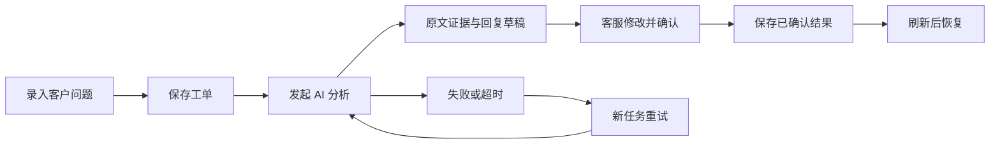

# 客服工单分流与回复审核台

## 用户与问题

目标用户是小型 SaaS 团队的一线客服。客服通常从邮件或聊天记录复制客户问题，自己提炼摘要、判断归属和紧急程度，再撰写回复；信息不足时来回追问，交接时又需要重新阅读原文。重复整理耗时，直接采用 AI 回复则容易遗漏前提或作出未经批准的承诺。

本应用把一条工单作为操作对象，让 AI 准备可核对的建议，客服作出最终决定。成功标准是完成一条“录入 → AI 分析 → 人工修改确认 → 保存 → 刷新恢复”的流程，并证明失败可重试、重试不会重复创建工单或覆盖已确认结果。

## 核心流程

## 关键页面与交互

工作台左侧是可搜索、筛选和分页的工单列表；主区域呈现客户原文、AI 摘要、原文证据和待补信息；审核区域提供分类、优先级和回复编辑框。创建工单使用有必填校验的表单。空列表给出创建入口，处理中显示状态，失败时保留原文并提供重试。

“确认并保存”是一次业务操作：保存客服最终采纳的分类、优先级和回复，同时记录确认时间。应用不连接邮箱或客服系统，也不向客户发送消息；复制后如何发送由现有客服流程负责。

## AI 的具体作用

- 将长问题压缩为可扫读摘要，并给出分类和优先级建议。
- 每次分析保留至少一条逐字出现在原文中的证据，服务端检查引用真实性。
- 列出当前尚缺的信息，并草拟能推动问题解决的回复。
- 对原文中的指令保持数据边界；不允许模型自行确认工单或擅自承诺退款。

原文证据校验只能证明引用确实存在，不能证明分类和回复一定正确，因此保留人工审核环节。

## 范围取舍

只实现一位客服的一条核心流程。暂不包含自动回复、邮件导入、附件 OCR、复杂 SLA、团队分派、多智能体、知识库检索和外部工单同步。这样可以集中验证持久化、模型与界面协作、失败恢复和人工决策边界。

记录按宿主提供的租户、组织、工作区、用户及助手上下文隔离。标识从可信宿主取得，不接受模型或 iframe 自行提供身份字段。

## 状态与恢复

| 状态 | 含义 | 允许的主要操作 |
| --- | --- | --- |
| new | 已录入且已保存 | 发起分析 |
| processing | 已创建分析任务 | 等待、刷新、失败恢复 |
| pending_review | AI 结果已保存 | 编辑审核、确认 |
| confirmed | 人工结果已保存 | 查看与恢复 |
| failed | 本次分析失败或超时 | 重试 |

每次分析分配独立 attemptId。旧任务回调不能覆盖新任务；修订号用于检测陈旧页面的写入；重复创建和确认使用请求标识保证幂等。平台或网络中断时保留业务记录，不把当前浏览器内存当作唯一存储。

## 评价方式

功能验收看流程是否闭合，而非功能数量。真实业务价值可在后续试用中测量：对同类合成工单比较人工整理时间、采纳前修改次数和遗漏信息数量。当前不宣称未经测量的效率提升百分比。
