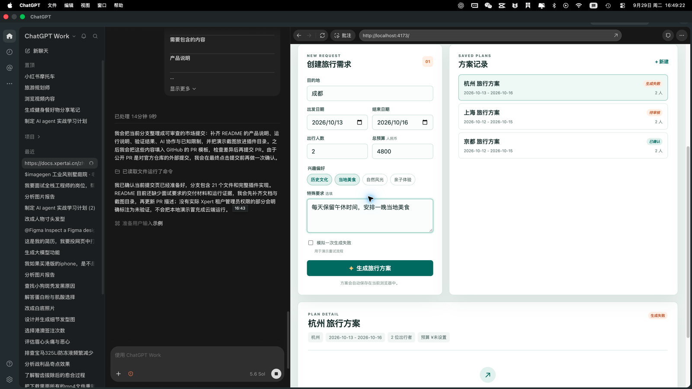
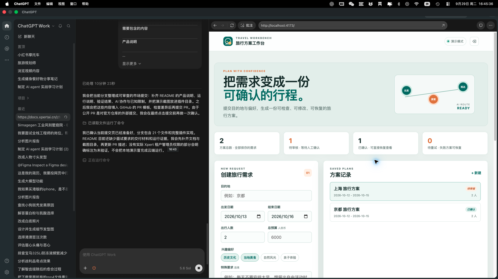
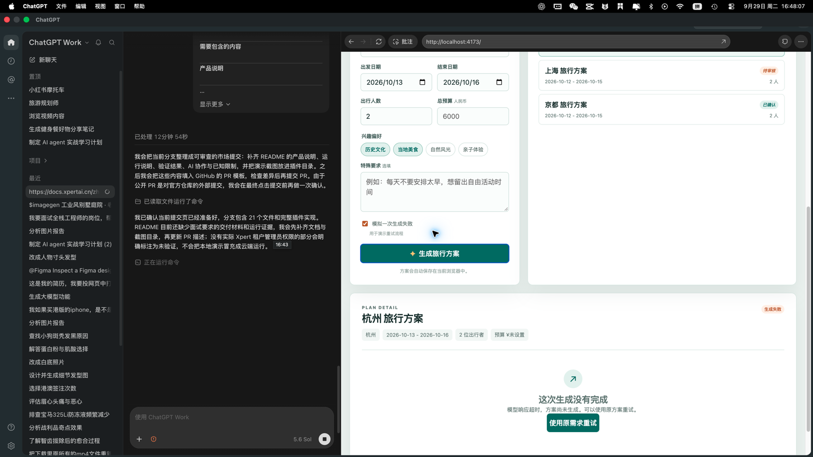

# 旅行方案工作台

旅行方案工作台是一个面向旅行顾问、差旅协调人员和业务用户的 Xpert 业务应用插件。它把旅行需求收集、AI 行程生成、人工审核、确认保存和失败重试串成一条可恢复的业务流程。

## 产品说明

### 用户与痛点

目标用户通常在聊天、表格和网页收藏之间来回整理旅行计划：需求容易遗漏，AI 输出难以审核，失败后也很难复用原始上下文。插件提供一个稳定的方案记录和工作台，让用户能看到当前状态、修改活动、确认结果，并在刷新或重新进入助手后继续工作。

### 业务流程

1. 用户向“旅行方案助手”说明目的地、日期、人数、预算、兴趣和特殊要求。
2. Assistant 调用 `travel_create_plan` 保存需求，返回稳定的 `planId`。
3. Assistant 生成结构化每日行程，调用 `travel_validate_itinerary` 检查日期、时间冲突和预算。
4. 校验通过后调用 `travel_generate_itinerary`，工作台进入“待审核”。
5. 用户在 Travel Planner Workbench 中编辑活动，明确确认后调用 `travel_confirm_plan`。
6. 生成失败时保留原 `planId`，用户可以重试，不会重复创建业务记录。

### AI 的作用与取舍

AI 负责把自然语言需求转换为结构化行程，并根据校验结果修改输出。插件不伪造实时价格、营业时间、交通状态或预订结果；这些信息需要用户在出发前再次核实。第一版聚焦“需求到可确认方案”的闭环，不接入机票、酒店、支付和外部景点 API，以控制隐私、凭证和实时数据风险。

## 应用插件源码

- `src/lib/travel-itinerary.middleware.ts`：Agent 工具和参数校验。
- `src/lib/travel-itinerary.service.ts`：方案状态流转、租户/组织范围查询和持久化。
- `src/lib/entities/travel-plan.entity.ts`：TypeORM 业务实体。
- `src/lib/travel-itinerary.view.provider.ts`：Workbench 清单、数据查询和操作。
- `src/lib/remote/travel-workbench.*`：Remote Component 工作台。
- `src/travel-planner-assistant.yaml`：助手模板、提示词和 starter prompts。

插件声明为 `tenant` level，并使用 `travel_itinerary` artifact namespace，因为它注册了 TypeORM Entity。这样方案数据按租户和组织范围隔离。安装或更新后按 Xpert 平台提示重启 API。

结构参考官方仓库 `community/apps/crm` 的 Workbench、Agent middleware、Assistant template 和 TypeORM 组织隔离模式；旅行业务对象、工具、状态机和界面为本插件新增。

## 运行说明

### 环境要求

- Xpert Community Edition 或 Xpert Cloud。
- Node.js 20+、pnpm 9+。
- Xpert 中可用的对话模型；插件本身不保存模型密钥。
- 公开市场提交不要求发布 npm 包。

### 构建与测试

在仓库根目录执行：

```bash
pnpm install
pnpm nx build travel-itinerary
pnpm nx test travel-itinerary
```

### 安装与配置

1. 由目标租户的 Super Admin 在 Xpert 插件管理中选择“安装插件 → 压缩包”。
2. 上传构建出的 `.tgz`、`.zip` 或 `.tar.gz`，安装后按平台提示重启 API。
3. 从应用模板创建“旅行方案助手”，绑定 `travel-itinerary` middleware 和 Travel Planner Workbench。
4. 选择一个真实模型，使用下方 starter prompt 验证创建、生成、审核、确认和重试流程。

插件没有必填的外部环境变量。宿主上下文提供租户、组织、用户、Assistant 和会话标识；如需本地宿主联调，可复制 `.env.example`，但不要提交真实凭证。

数据处理和凭证边界见 [隐私与数据处理说明](./PRIVACY.md)。

## 运行截图与演示

以下截图来自同一套 Remote Workbench 交互的本地可复现演示，用于展示产品流程和异常处理；它们不是云端安装成功的替代证明。云端真实流程需要 Super Admin 安装后按“验证结果”执行。

### 用户输入

用户填写目的地、日期、人数、预算、兴趣和特殊要求后提交需求。



### AI 结果与人工审核

生成后方案进入“待审核”，用户可以逐项修改、保存并确认；工作台同时展示预算提醒和预计总费用。



### 异常与重试

生成失败时保留原方案和 `planId`，用户可以使用原需求重试，避免重复业务记录。



### Starter prompts

- 帮我规划一个京都 4 天游，预算 6000 元，偏好历史和美食。
- 我有 3 天时间去上海，带一个孩子，请先帮我收集规划所需信息。
- 请检查我的旅行方案是否有时间冲突或超出预算。
- 我确认这个方案，请保存为已确认状态。

## 验证结果

已执行：

- 独立 TypeScript 构建：通过，生成 `dist/index.js`、声明文件、助手模板和 Remote Component 资源。
- 远程视图和工具参数类型检查：通过，补齐 `dataSource` 和 Zod 解析边界。
- 本地演示流程：通过，覆盖需求输入、生成后审核、编辑保存、确认保存、失败重试和浏览器持久化。
- 插件包结构检查：通过，`.tgz` 包含唯一 `package.json`、`index.cjs`、`dist/` 和助手模板。
- GitHub 分支检查：通过，分支可自动合并到 `xpert-ai/xpert-plugins:main`。

尚未验证：

- 当前登录账号不是目标租户 Super Admin，无法在 Xpert Cloud 中完成 tenant-level 插件安装和 API 重启。
- 因此尚未声称云端真实模型调用、TypeORM 表初始化和正式环境 Workbench 加载已经通过。
- 官方审核前应由 Super Admin 完成一次真实创建、生成、确认和失败重试，并把云端截图补充到本 README。

## AI 协作说明

本次实现使用 Codex 进行代码检索、Xpert 插件结构对照、TypeScript 类型修复、构建检查、浏览器演示和 GitHub 协作。关键选择包括：

- 参考官方 CRM 插件的 middleware、view provider、assistant template 和 TypeORM 组织隔离方式。
- 发现 Entity 会改变安装级别后，将插件从全局级调整为 tenant 级，并固定 `travel_itinerary` namespace。
- 通过 Zod 运行时解析限制 AI 工具输入，通过独立状态机避免重复创建和越权确认。
- 遇到当前账号缺少 Super Admin 权限时保留真实失败证据，不将本地 UI 截图冒充云端验证。

## 已知限制与后续方向

- 不包含机票、酒店、支付、景点实时 API 和预订能力。
- 不包含多人协同编辑、复杂 RBAC 和跨租户共享。
- 第一版使用结构化行程和平台模型，后续可增加实时数据连接器、预算优化、交通约束和可审计的模型输出版本。
- 正式发布前需要 Super Admin 完成云端生命周期验证，并将云端真实运行截图替换或补充到本 README。

## 许可证

AGPL-3.0，遵循仓库贡献协议和 Xpert Plugin Developer Agreement。
