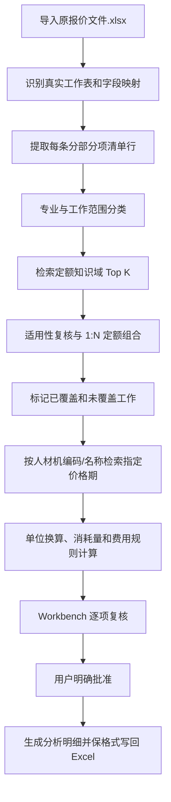
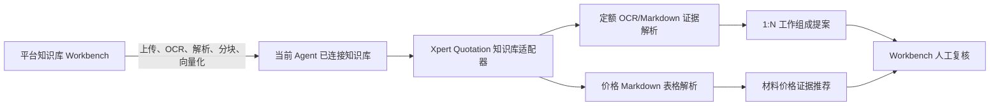

# Xpert Quotation 综合单价知识库检索与拆分方案

更新日期：2026-08-10

## 1. 结论

现有 Xpert Plugin SDK 架构同时支持知识检索和受控知识摄取。当前开发依赖的 SDK 中，`KnowledgebaseRuntimeCapability` 提供知识库列表、检索、写入 chunk 和删除 chunk；`KnowledgebaseDocumentsRuntimeCapability` 提供文件上传、归档导入、创建文档、启动处理、查询处理状态和删除文档。因此，从插件实现 PDF/Word 上传、处理和后续检索在架构上可行，但调用方仍必须具备宿主授权并遵守租户、组织和知识库范围。

`xpert-quotation` 当前只消费 `KnowledgebaseRuntimeCapability.search`，尚未把 chunk 写入或文档摄取能力暴露为报价工具。本项目按用户当前选择继续由 Xpert 原生知识库工作台完成人工上传、解析和复核；这是一项实施策略，不是 SDK 限制。插件 iframe 仍不应持有宿主知识库凭据，未来若增加上传入口，应由服务端 Agent middleware 或受控 Workbench 文件动作调用运行时能力。

要把“分部分项工程项目清单计价表”中的每一行拆成工作组成和报价，必须在已有材料价格检索之外新增一条独立的定额检索与组价链路。不能把材料价格片段直接当作清单综合单价，也不能让模型仅凭语义相似度选择一个定额后直接写入 Excel。

## 2. 本次资料基线

`docs/原报价文件.xlsx` 是一个包含 34 个工作表的工程量清单。与本方案直接相关的工作表如下：

| 专业 | 工作表 | 使用范围 | 关键列 |
| --- | --- | --- | --- |
| 建筑 | `3.2E.2.1 分部分项工程项目清单计价表` | `A1:K152` | B 项目编码、C 项目名称、D-F 项目特征、G 单位、H 工程量、I 综合单价、J 合价、K 材料暂估价 |
| 安装 | `4.2E.2.1 分部分项工程项目清单计价表` | `A1:K44` | 同上 |

建筑表第 8 行的“墙面乳胶漆修补”不是一个单一定额工作：项目特征同时包含铲除旧涂层、刷墙固、腻子找平、满批腻子和两遍乳胶漆。新建建筑与装饰消耗量可以覆盖界面剂、腻子和乳胶漆等部分，但不能替代修缮工程中的铲除、拆换和零星修补依据。

现有本地资料状态：

| 资料 | 状态 | 用途 |
| --- | --- | --- |
| 江苏省建筑与装饰工程消耗量（2026） | 已规范化，待人工复核/上传 | 建筑与装饰定额工作内容及人材机消耗量 |
| 南京市 2026 年 6 月建设工程市场信息价格 | PDF 已存在，尚未规范化 | 材料、机械租赁、周转材料和人工日工资价格期依据 |
| 江苏省房屋修缮工程计价表（2009） | 缺失 | 铲除、拆除、拆换和零星修补 |
| 江苏省通用安装工程消耗量（2026） | 缺失 | 安装专业清单拆分 |
| 管理费、利润、风险费计价规则 | 缺失 | 从人材机费用形成综合单价 |

机器可读状态见 `docs/knowledgebase/source-inventory.json`。

## 3. 现有插件能力与边界

### 3.1 已有能力

1. 导入和保管原报价 XLSX，读取工作表目录与有限单元格样本。
2. 由 Agent 根据实际工作表名称和表头形成 `sheetMappings`，不是依赖固定表名。
3. 将项目名称、完整项目特征、单位和编码保存为报价行。
4. 只检索当前 Agent 已连接的知识库，服务端构造查询并限制 `topK`。
5. 保留 `knowledgebaseId`、`documentId`、`chunkId`、相关度和原文片段。
6. 推荐、人工接受和 Excel 写回相互分离；写回只允许空白目标单元格，并要求明确用户确认。
7. 定额 PDF 已可从“知识资料”页上传到 Workspace Files，并经 Managed Queue 解析到 PostgreSQL；页面可跟踪进度、取消、重试和查看原页证据。
8. 定额知识库同步已通过 Managed Queue 后台写入 chunk，并记录逐片段哈希、状态、失败原因和整体进度。
9. 定额检索与材料价格检索使用独立契约；报价行可以保存一个或多个定额子目组成、未覆盖工作和审核状态。

### 3.2 尚未具备

1. Word 定额资料摄取；当前结构化入口只接受 PDF。
2. 计价规则知识库的专用结构化模型和检索工具。
3. 将定额人材机编码与指定价格期单价确定性连接。
4. 执行单位换算、消耗量计算、系数调整、管理费/利润/风险费计算。
5. 在 Workbench 展示和复核完整综合单价组成。
6. 将经批准的完整组价结果写入独立分析表或综合单价目标列。

因此，SDK 与当前插件已经支持“PDF 摄取、数据库事实、后台同步、检索和定额组成审核”的闭环；完整组价仍不是当前能力。后续应沿用宿主运行时能力，不应在插件中复制向量库或绕过 Agent 的知识库授权。

## 4. 目标知识架构

建议至少区分三个逻辑知识域。可以使用多个知识库，也可以将资料放在同一个平台知识库中。插件不再要求平台原生文档携带私有 metadata，也不会用 `documentType` 过滤作为召回前置条件；资料类型 metadata 仅作为旧结构化 chunk 的兼容信息和后续排序优化信号。

| 知识域 | 可选结构化信息 | 检索用途 |
| --- | --- | --- |
| 定额 | 地区、版本、专业、定额编号、定额单位、审核状态；旧 chunk 可含 `documentType=quota_item` | 找到适用工作内容与人材机消耗量 |
| 价格 | 地区、价格期、资源编码/名称、规格、单位、税口径、审核状态 | 为人工、材料和机械资源匹配单价 |
| 规则 | 地区、版本、专业、费用类型、适用条件、审核状态 | 系数、管理费、利润、风险费及税费规则 |

定额规范化产物已采用“一条定额子目一个知识记录”，稳定键格式为：

```text
quota:jiangsu:building-decoration:2026:<quotaCode>
```

每条记录同时包含面向语义检索的 `text`、结构化 `data`、可过滤 `metadata`、源文件 SHA-256、PDF 页码、原文摘录和内容哈希。`reviewStatus=unreviewed` 的记录可以进入检索候选池，但不能直接驱动自动计价。

## 5. 端到端流程



流程必须先定额、后价格。直接使用清单文本检索一个“看起来相似的价格”无法解释工程工作组成，也无法证明综合单价完整。

## 6. 清单行检索与拆分规则

### 6.1 查询事实

定额查询由服务端使用已持久化的事实构造，模型不能替换这些字段：

```text
项目编码：011404001001
项目名称：墙面乳胶漆修补
项目特征：部位；铲除旧乳胶漆及腻子；刷墙固；腻子找平；满批两遍；内墙乳胶漆两遍
清单单位：m2
专业：building
目标地区：江苏省/南京市
```

查询可以分成多个工作动作检索，例如“铲除旧涂层”“刷界面剂”“满批成品腻子二遍”“内墙乳胶漆二遍”。这样允许一个清单行映射多个定额子目，并显式发现缺少修缮依据的部分。

### 6.2 候选硬门槛

候选定额只有同时满足以下条件才可进入组合：

1. 专业、地区和版本符合本项目计价口径。
2. 定额工作内容覆盖一个明确的项目特征动作。
3. 定额单位可确定地换算到清单单位。
4. 适用部位、材料规格、施工方法和遍数没有实质冲突。
5. 调整说明已经应用或明确列为待人工处理。
6. 来源页和原文证据完整。
7. `reviewStatus=approved` 才允许自动组价；`unreviewed` 只能生成复核建议。

语义相关度只能排序，不能替代这些门槛。

### 6.3 1:N 组合与未覆盖项

以“墙面乳胶漆修补”为例，候选组合可能包括：

| 工作动作 | 定额候选 | 当前可用性 |
| --- | --- | --- |
| 铲除旧乳胶漆及腻子 | 修缮工程定额 | 资料缺失，必须标记未覆盖 |
| 刷墙固/界面处理 | `13-47 刷界面剂 混凝土墙面` 等候选 | 需按基层类型复核 |
| 满批腻子两遍 | `15-152 满批成品腻子 抹灰面 二遍` | 可作为候选，材料描述“白水泥腻子”存在差异 |
| 内墙乳胶漆两遍 | `15-161 内墙面乳胶漆 二遍` | 可作为候选 |

只要“铲除”仍未覆盖，该清单行就不能标记为完整组价。系统应返回 `partial`，而不是用后三项费用冒充完整综合单价。

### 6.4 定额单位换算

对每个定额子目，先解析定额基数。例如 `10m2` 的基数是 10，清单行单位 `m2` 的基数是 1：

```text
清单单位消耗量 = 定额资源消耗量 / 定额基数 × 清单单位基数
整行资源数量 = 清单单位消耗量 × 清单工程量
```

任何无法确定的单位换算必须停止自动计算，不允许模型猜测换算系数。

## 7. 价格连接与综合单价计算

价格检索顺序：资源编码精确匹配、名称和规格匹配、单位一致、地区和价格期一致。没有资源编码时才退化为名称/规格语义匹配。价格片段必须明确包含价格和单位，并保留原文证据。

基础费用：

```text
人工费 = Σ(人工消耗量 × 人工单价)
材料费 = Σ(材料消耗量 × 材料单价)
机械费 = Σ(机械消耗量 × 机械台班单价)
直接费 = 人工费 + 材料费 + 机械费
综合单价 = 直接费 + 管理费 + 利润 + 风险费
```

百分比型“其他材料费”“其他机械费”必须按定额或规则明确的计取基数计算，不能当作数量乘市场单价。税前市场信息价也不能直接用于税后口径，必须记录价格税口径和项目计价税口径。

在管理费、利润和风险费规则缺失时，只能输出“人材机直接费试算”，不得把它命名为“综合单价”。

## 8. 建议的拆分结果契约

后续服务应保存结构化结果，而不是只保存一段模型回答：

```json
{
  "quotationId": "...",
  "lineId": "...",
  "sheetName": "3.2E.2.1 分部分项工程项目清单计价表",
  "rowNumber": 8,
  "bill": {
    "code": "011404001001",
    "name": "墙面乳胶漆修补",
    "unit": "m2",
    "quantity": "1200"
  },
  "coverageStatus": "partial",
  "components": [
    {
      "workScope": "内墙乳胶漆两遍",
      "quotaWriteKey": "quota:jiangsu:building-decoration:2026:15-161",
      "quotaCode": "15-161",
      "quotaUnit": "10m2",
      "unitFactor": "0.1",
      "resources": [],
      "adjustments": [],
      "evidence": {
        "knowledgebaseId": "...",
        "documentId": "...",
        "chunkId": "...",
        "sourcePage": 617
      },
      "reviewStatus": "proposed"
    }
  ],
  "uncoveredWork": ["铲除旧乳胶漆及腻子"],
  "pricing": {
    "pricePeriod": "2026-06",
    "directCostPerBillUnit": null,
    "comprehensiveUnitPrice": null,
    "currency": "CNY"
  },
  "blockingReasons": ["missing_repair_quota", "missing_fee_rules"]
}
```

`components`、`uncoveredWork`、价格证据和计算过程都应持久化。模型只负责提出候选和解释差异；单位换算、乘法、汇总和状态门槛应由确定性代码执行。

## 9. 后续实施顺序

当前实施状态：阶段 1 由用户在 Xpert 知识库中手动完成；阶段 2 的“检索 + 1:N 提案 + 人工批准/拒绝”闭环已经实现；0.9.0 又完成了定额资源提取、资源级知识库查价、人工价格审批、单位与工日小时口径换算、确定性综合单价计算和计算轨迹展示。逐组件替换、版本化费用规则库、Workbench 内资源价格审批控件和 Excel 综合单价分析表仍未完成。

### 阶段 1：知识资料准备

本方案按用户指示由 Xpert 平台知识库完成人工上传、OCR/解析、分块、向量化和文档状态管理，并把目标知识库连接到报价 Agent。平台原生 PDF/Word 分块可以是 Markdown 表格或普通 OCR 文本，不要求先转换成插件专用的一条定额一个 chunk 格式；专用结构化格式仍可作为更高质量的兼容输入。

### 阶段 2：定额检索与拆分

1. 已实现 `xpert_quotation_search_quota_components` Agent middleware 工具，只允许处理未解决的 `kind=bill` 行。
2. 已实现服务端查询构造器、工作范围提取、规范化定额候选解析和候选完整性检查。
3. 已持久化候选快照、知识库/文档/chunk/源页证据、工作范围和检索时间。
4. 已实现 `xpert_quotation_propose_quota_breakdown`，要求候选覆盖范围与 `uncoveredWorkScopes` 对全部已持久化工作范围做严格且无重复的分区。
5. 已将未审核来源、结构不完整、专业不匹配、修缮/安装资料缺失和未覆盖工作固化为阻塞原因，且始终禁止自动计价和 Excel 写回。
6. 已实现 `xpert_quotation_review_quota_breakdown` 和 Workbench 专用确认对话框；用户可将当前提案标记为 `approved` 或 `rejected`，决定进入撤回历史，但不会清除阻塞、改变清单价格或写 Excel。
7. 待实现逐组件替换和重新选取候选；当前修改方案需要重新检索并生成替代提案。

### 阶段 3：价格连接与确定性组价

1. 已支持从平台知识库召回的 Markdown 价格表和扁平工资文本中提取结构化价格项；完整价格 PDF 的离线规范化索引仍可继续补充。
2. 已为每个人材机资源保存独立查询、候选快照、名称别名、单位校验、价格证据、推荐和人工审批状态。
3. 已实现定额基数、资源单位、消耗量、工日小时口径和百分比费用的确定性计算；当前不自动推断调整系数。
4. 已支持用户明确提交的有序管理费、利润和风险费规则；版本化费用规则库仍待建设。
5. 任一定额范围、来源审核、资源价格、单位口径或费用规则不完整时，计算工具会拒绝形成综合单价并保留阻塞原因。

### 阶段 4：Workbench 复核

已在每条清单的审核项下展示定额编号、覆盖工作范围、定额单位、置信度、来源审核状态、源页、差异、未覆盖工作和计价阻塞，并支持对整份组成批准或拒绝、保留历史和撤回。0.9.0 增加人材机用量、资源价格状态、批准价格和综合单价计算摘要。资源价格审批与计算目前通过严格 middleware 工具完成；后续仍需补充 Workbench 内逐资源审批、逐组件接受/替换和完整费用明细交互。

### 阶段 5：Excel 输出

优先新增独立的“综合单价分析表”输出，不改变原清单结构；原表 I 列综合单价和 J 列合价只在用户明确批准后写入。K 列材料暂估价保持原业务语义，不能写入普通材料费。所有写回继续复用现有空单元格保护、版本校验、幂等键和撤销机制。

## 10. 验收门槛

1. 每个结果可追溯到报价工作表/行、知识库/文档/chunk、原 PDF 页和源文件哈希。
2. 同一输入、知识库版本和规则版本产生一致的确定性计算结果。
3. 1:N 定额组合不会丢失项目特征动作；未覆盖项显式阻止完整组价。
4. 定额单位、清单单位和价格单位均通过白名单换算。
5. 定额、价格或规则任一来源为 `unreviewed` 时不得自动写入综合单价。
6. 缺少修缮或安装依据的行不会错误套用建筑与装饰定额。
7. 模型不能提供任意知识库 ID、候选 ID、价格、单位或 Excel 地址绕过服务端事实。
8. Excel 写回只发生在用户明确确认后，不覆盖已有值，不破坏格式。

## 11. 当前可执行结论

阶段 2 和阶段 3 的核心链路已经落地：连接已准备的定额及价格知识库后，Assistant 会检索并持久化 1:N 定额组成，再从已选定额逐个人材机资源查价。现有材料暂估价工具继续作为独立流程，不能复用其“材料价格即推荐单价”的语义给清单行定价。

只有当定额组成、来源状态、全部工作范围、全部资源价格、工日口径和费用规则均经确认时，确定性引擎才会生成综合单价及合价。批准组成不代表批准价格，计算完成也不代表批准写回；插件仍不能在资料不完整时为所有清单行自动定价。

## 12. 2026-08-11 数据库摄取实施结果

本轮已将原先依赖人工上传知识库的阶段 1 纳入插件：原始 PDF 保存到 Workspace Files，Managed Queue 异步解析，PostgreSQL 插件表保存版本化定额事实，Workbench 新增“知识资料”页处理上传、进度、筛选、分页、证据复核、发布和知识库同步。批量知识库同步同样通过 Managed Queue 执行，记录逐片段状态与整体进度，支持取消、失败重试和幂等跳过。

该实现曾采用“数据库精确/结构化检索 -> 可选知识库语义召回 -> 数据库回填验证”的契约，并要求同步片段携带 `quotaItemId`、`sourceVersionId`、`contentHash`。从 0.8.0 起，此路径降级为 legacy compatibility：只有平台已从当前 Agent 连接的知识库召回旧同步片段后，插件才可按这些字段回填既有数据库事实；插件数据库不再是在线检索前置条件，也不能绕过 Agent 的知识库连接授权。

生产数据库迁移见 `docs/migrations/0.7.0-quota-knowledge.sql`；升级到 0.9.0 还需执行 `docs/migrations/0.9.0-resource-pricing.sql`。南京价格信息 PDF 尚未生成完整的离线结构化价格索引，修缮/安装定额和版本化费用规则库也仍需补充；但平台召回片段的资源级价格解析和最终综合单价计算已经实现。

## 13. 2026-08-11 平台知识库适配实施结果（0.8.0）

本轮将平台内部知识库确定为报价插件唯一的在线检索入口，职责边界如下：



已实施的适配规则：

1. 中间件只能把 `context.knowledgebaseIds` 传给适配器，模型和 iframe 均不能指定未连接知识库。
2. 适配器逐个检索已连接知识库，不传 `documentType`、`sourceVersionId` 等插件私有 filter。这样既兼容平台原生文档，也能为平台未返回 `knowledgebaseId` 的 chunk 补上可信来源。
3. 多知识库检索允许部分失败；成功结果继续返回，并同时记录失败的知识库 ID。全部失败才返回稳定错误。
4. 价格片段支持平台原生 Markdown 表格，解析“名称及规格、单位、价格”行，同时保留原始行作为可逐字引用的 `evidenceQuote`。
5. 定额片段支持旧结构化文本、Markdown 表格和普通 OCR。无法完整提取时仍返回 `raw_evidence` 或 `partial` 候选，不再静默丢弃，但 `ingestionReady=false` 或未知审核状态会继续阻止自动计价。
6. 每个候选保留 `knowledgebaseId`、`documentId`、`chunkId`、文档名、页码、原文、相关度和检索时间。旧数据库事实仅在其同步 chunk 已被平台授权检索返回后进行回填增强。

平台侧仍需完成一项配置：把目标知识库连接到 `xpert-quotation-assistant` 对应 Agent。若未连接，插件会明确返回 `knowledgebase_not_connected`/“current Agent is not connected”状态，而不会查询插件自有数据库作为替代。

0.9.0 已在平台知识库适配之上增加资源级价格匹配和确定性综合单价引擎。修缮定额、安装定额、完整价格期索引、版本化管理费/利润/风险费规则和综合单价分析表仍按阶段 3-5 推进；在每条清单所需条件齐备并逐级审批前，系统仍会阻止计算或 Excel 写回。

## 14. 2026-08-11 资源计价实施结果（0.9.0）

1. 工程尺寸、管径和运距不再单独触发材料识别；只有出现明确材料名称时才进入材料参考流程。
2. 定额拆分提案会固化每个组件的人材机资源，并为资源生成稳定 ID、类别、编码、名称、别名、单位和消耗量快照。
3. 新增资源级搜索、推荐、审批和综合单价计算四个 middleware 工具。搜索只能访问当前 Agent 已连接的知识库，候选 ID 只对该资源的最新搜索有效。
4. 扁平人工工资文本可解析为结构化工日价格；来源声明每日小时数时，必须由用户确认定额工日小时口径后才能换算。
5. 价格单位必须与定额资源单位兼容，定额基数单位必须与清单单位兼容。计算使用十进制定点运算并保存人材机费用、每项费率、综合单价和合价的完整轨迹。
6. 自动 AI 审核只能搜索和推荐，不能批准定额、批准资源价格、执行综合单价计算或写回 Excel。

## 15. 2026-08-12 工程分流与单位换算修正（0.10.0）

1. `kind=material` 是唯一允许进入材料价格搜索的行类型。所有 `kind=bill` 行都按工程项目处理，即使名称或项目特征包含砂石、钢管、管径、厚度等材料词，也必须先检索定额、工作内容、公式/调整说明，再提取人材机资源并进行资源级查价。
2. 旧版本 `materialReferenceOnly=true` 的 bill 数据不再作为在线事实；DTO、重新匹配和写回路径均以当前行类型为准，避免历史误标导致“平整场地”进入材料价格工具或阻止已确认综合单价写回。
3. 单位换算采用白名单和物理维度校验：支持 mm/cm/m/km、mm2/cm2/m2、cm3/L/m3、g/kg/t、个/件/套等同维度单位；不允许把质量与体积直接换算，也不自动猜测密度、包装、损耗或覆盖率。
4. 材料价格推荐保存来源单价、换算后清单单位单价、换算系数和公式；例如 `4200 元/t` 到 `4.2 元/kg`。定额 `10m2` 到清单 `m2` 的基数换算也由计价引擎确定性执行。
5. 定额调整说明中包含“按百分比计算、乘以、换算、调整系数、掺入比”等表达时，解析为 `formulas` 提示并展示给人工复核；插件不会仅凭自然语言自动套用未审核公式。

## 16. 2026-08-12 资源价格匹配修正

本轮修正了“定额消耗量被当成材料价格、资源价格搜索返回 no-match”的问题：

1. `materialReferenceOnly=true` 不再决定 bill 行的价格流程。`kind=bill` 永远先走定额拆分；只有定额拆分产生的人材机资源才逐项查价。升级迁移会清理历史 bill 行上的旧误标。
2. 资源查价查询会带上资源类别、资源编码、名称、别名、资源单位、南京地区和价格期资料类型。人工资源明确加入“建筑工种劳务市场人工信息价格、日工资、元/工日、普工/建筑工/一般技工”等召回词；材料和机械分别加入“税前综合价格/材料单价”和“机械租赁信息价格/台班单价”。
3. 每个资源执行一次主查询和一次价格资料回查，并合并去重结果。这样同一知识库同时包含定额 PDF 和价格 PDF 时，定额片段不会挤掉价格片段。
4. 平台 OCR 将 PDF 表格压成一行时，解析器支持三种价格形态：Markdown 价格表、扁平人工工资表、扁平材料/机械价格表。南京 2026 年 6 月价格资料中的“建筑、装饰工程普工 254 元/日”“粗砂 177.03 元/t”“履带式推土机 60kW 408.16 元/台班”等均可生成带证据的结构化 `priceItem`。
5. 资源价格候选仍必须通过名称/别名、资源类别和可确定单位换算校验；定额消耗量、人工工日消耗量、机械台班消耗量没有明确“价格 + 单位”时不会进入 `matchedPriceItemIds`。泛化资源如“普工/一般技工”允许返回人工工资候选供 AI 按工程特征选择，但不能把候选自动批准。
6. 推荐后仍必须由用户审批资源价格和工日小时口径，随后计价引擎按 `消耗量 × 资源单价`、定额基数换算和明确费用规则计算综合单价。资料缺失时系统保留阻塞，不伪造价格或把 bill 行送入材料价格工具。
