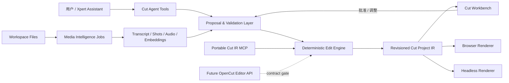

# Cut AI 产品路线图

> 状态：执行基线  
> 调研日期：2026-07-16  
> 适用范围：`@xpert-ai/plugin-cut` 及其 Xpert Assistant、Workbench、服务端模块与后续 Headless/MCP 适配层

## 1. 产品结论

Cut 不应只复刻一个带聊天框的视频编辑器，而应成为 Xpert 平台上的**可审阅 Agentic 视频制作应用**：Agent 理解素材和用户意图，生成可解释的编辑提案；用户在 Workbench 中预览、修改和批准；系统再用确定性的原子操作写入版本化时间线，并由浏览器或 Headless 渲染器导出。

核心闭环固定为：

```text
素材理解 -> 编辑提案 -> 人工审阅 -> 确定性原子应用 -> 浏览器/Headless 渲染
```

相较 OpenCut Classic，Cut 已经领先于 Agent 接入、租户级持久化、版本冲突保护、操作日志和 Xpert Workbench 协同；M1–M8 已补齐共享项目 Schema、原子编辑、服务端可审阅字幕、浏览器本地 Whisper、可定位到媒体时间片段的基础内容理解、证据化粗剪提案审阅闭环、revision-bound 的无人值守生产导出，以及复用相同 IR/编辑内核的可移植 MCP 文档工具。OpenCut Rewrite 尚未发布 Editor API/MCP/Headless 契约，因此真实 OpenCut adapter 继续受证据门禁约束；当前最明显的产品短板转为更高级的多模态理解/创作能力与生产部署矩阵。

因此按以下顺序建设：

1. 先补安全编辑内核，确保 Agent 能完整但受控地编辑项目。
2. 再交付自动字幕，补齐 OpenCut Classic 已经具备的 AI 基线。
3. 在字幕/分析数据之上交付内容搜索、粗剪提案和可视化审阅。
4. 最后扩展 Headless、批处理和 MCP/Editor API 适配，不让外部协议侵入核心领域模型。

## 2. OpenCut AI 能力基线

### 2.1 OpenCut Classic 已交付能力

以插件当前固定的 OpenCut [`pre-rewrite`](https://github.com/OpenCut-app/OpenCut/tree/pre-rewrite) 版本为可验证基线。它的实际 AI 能力主要是**浏览器本地自动字幕**：

- 使用 Transformers.js/Whisper 在浏览器内转录，不要求将音频发送到服务端。
- 提供多种 Whisper 模型和转录语言选择。
- 从活动时间线提取音频，并利用时间戳生成字幕片段。
- 将识别结果整理为较短的字幕块，并直接创建到文本轨道。
- 支持 SRT/ASS 字幕导入，补充人工或外部字幕工作流。

Classic 没有可验证的通用 AI 对话剪辑、语义素材搜索、自动粗剪、静音删除、说话人分离、翻译、AI 抠像/修复/超分、生成式素材、Agent 工具协议或服务端 Headless AI 工作流。它的 AI 更接近“单点字幕功能”，不是完整 Agentic 应用。

### 2.2 OpenCut Rewrite 的方向

OpenCut 主线重写公开规划包括 Editor API、插件、MCP Server、Headless 和脚本化能力。这些方向值得兼容，但在形成稳定、已发布且可验证的契约前，只作为上游观察项，不作为 Cut 运行时依赖。接入条件见 [EDITOR-API-ROADMAP.md](./EDITOR-API-ROADMAP.md)。

### 2.3 对 Cut 的启示

- 本地 Whisper 是隐私友好且低门槛的字幕路径，应保留为一种执行模式。
- Agent 能力必须建立在稳定编辑 API 上，不能依赖模拟鼠标操作编辑器。
- MCP/Headless 是外部入口和运行模式，不应该取代版本化项目 IR、权限、事务和审阅模型。
- “AI 自动执行”不能等于“无差别写时间线”；高影响编辑必须先生成提案并允许预览差异。

## 3. Cut 当前能力与差距

| 能力 | OpenCut Classic | Cut 当前 | 结论 |
| --- | --- | --- | --- |
| 非线性时间线与浏览器预览 | 有 | 有 | 已达到基线 |
| 视频导出 | 浏览器 | 浏览器与 Managed Queue + Sandbox Job 均支持 MP4/H.264/AAC、WebM/VP9/Opus、四档质量和可选音频 | Cut 已超过基线；自定义字体、透明通道与更广编解码矩阵待扩展 |
| 本地 Whisper 自动字幕 | 有 | 有，浏览器 Worker、模型缓存、分块进度、取消并进入审阅草稿 | 已达到并超过基线 |
| Server STT | 无 | 有，使用 Xpert 平台模型与 Managed Queue | Cut 领先 |
| SRT/VTT/ASS 导入导出 | SRT/ASS 导入 | 有，进入可审阅草稿 | Cut 已超过基线 |
| Agent 对话入口 | 无 | 有 Xpert Assistant | Cut 领先 |
| Agent 时间线操作 | 无标准接口 | 11 个窄原子工具、batch validate/apply 与 revision CAS | Cut 领先 |
| 项目持久化与并发冲突 | 本地项目为主 | 租户/组织隔离、内部 edit revision CAS、显式版本快照、日志 | Cut 领先；内部序号不作为用户版本展示 |
| 人机协同 Workbench | 无 Agent 审阅闭环 | 有目标化宿主事件、脏编辑保护、提案 diff/预览/逐项审阅 | Cut 领先 |
| 内容理解/片段搜索 | 无 | 有 transcript、音频活动/静音、镜头证据及精确片段检索 | Cut 已形成基础差异化；OCR/embedding 待扩展 |
| 自动粗剪提案 | 无 | 有证据绑定、风险下限、版本 CAS、原子应用和安全回滚 | Cut 已形成核心差异化 |
| Headless/MCP | Rewrite 主线仍列为 “What’s coming” | Headless 已交付；Cut IR MCP 已交付；OpenCut adapter 因无上游契约暂缓 | Cut 已有可验证外部 MCP 入口，不虚构 OpenCut 兼容 |

当前剩余风险：

1. 平台共享 STT 模型契约当前只统一返回文本，Cut 会生成并明确标注“估算时间”的 cue；词级时间戳、置信度与 speaker 仍需 timestamp-capable Provider 契约。
2. 字幕草稿的 `sourceRevision` 只保留为来源审计，不再因无关项目编辑而阻止草稿编辑或提交；项目写入仍使用当前内部 edit revision CAS，草稿自身仍使用 draft revision CAS。项目保存与草稿最终状态更新尚未放入同一数据库事务，后续仍需消除极小的中断窗口。
3. 本地 Whisper 的确定性 WASM 路径已交付；WebGPU/JSEP 仍是实验性兼容项，待独立浏览器矩阵验证后再开放。
4. Whisper 权重首次使用仍需从 Hugging Face 下载；后续由浏览器 Cache API 复用。完全隔离网络的私有模型镜像/预置权重尚未提供。
5. M5 的音频和镜头分析仍在用户可见的 Workbench 中本地执行；M7 交付的是生产渲染 Sandbox Action，不包含服务端后台视频理解。后者如建设也必须复用 Managed Queue + Sandbox Job，不能在插件进程中直接启动 ffmpeg 或任意子进程。
6. 当前片段搜索采用有界词法/CJK 匹配和类型、时间过滤，不是向量语义检索；OCR、画面描述、多模态 embedding 与人物/对象识别尚未生成。
7. M7 已支持受限后台生产导出，但自定义字体、透明通道、更多输入编解码器、硬件差异矩阵和长视频压力基线尚未建立；当前固定使用 Browser Runtime 的 H.264/AAC 与系统字体。
8. M6 已建立确定性的提案执行与审阅基础设施，但粗剪质量仍取决于 Agent 对搜索证据和原子操作的规划；尚未建立离线评测集、目标时长达成率、信息保留率和人工接受率等质量指标。
9. Headless 的项目快照、Action 版本、Runtime Profile、媒体 checksum 和幂等产物都已固定；不同 Provider/浏览器构建之间的逐字节编码一致性仍需部署矩阵证明，当前不宣称跨运行时 bit-exact。
10. M8 MCP 是显式传入文档的纯转换接口，不具备 tenant-scoped 项目发现/持久化能力；这是一条安全边界。持久化编辑仍必须使用 Cut native Agent tools 的 `baseRevision`/CAS/审阅链路。生产环境还需管理员显式启用 `XPERT_MCP_STDIO_RUNTIME_ENABLED=true`。
11. OpenCut `main@bab8af831b354a0b5a98a4a6e818ab7d633b94df` 尚无可发布的 Editor API、MCP、Headless 或版本化项目交换实现；因此 OpenCut adapter 状态为 `deferred-upstream-contract`，不能按内部 IndexedDB 类型进行伪兼容。

### 3.0 Revision 与版本决策（2026-07-18）

- `CutProject.revision` 保留，但定义为**内部乐观并发序号**，用于防止 Agent、Workbench 和后台回写互相覆盖；它不是用户版本，不在 Workbench 顶部展示。
- 只有时间线文档发生实质变化时才递增内部 revision；相同文档的重复保存、转录任务、任务查询、素材元数据和字幕草稿编辑都不创建用户版本，也不会因为重复保存产生无意义 revision。
- `CutProjectVersion` 只由用户或 Agent 显式调用“创建版本”产生，作为可审阅里程碑。它不取代复制项目/草稿的产品能力；后续如采用剪映式“复制草稿”，可把版本入口降级或移除，但不能删除内部并发控制。
- `CutCaptionDraft.sourceRevision` 仅表示草稿生成时的来源证据。编辑和提交草稿不再要求它等于当前项目 revision；提交只校验当前项目 baseRevision 和草稿自身 draft revision，因此无关编辑不会再要求重新创建字幕草稿。

### 3.1 M1–M8 实机收口

2026-07-16 已在真实 `http://localhost:4300` 宿主完成插件重载、Workbench、外部 `cut-ir` MCP Toolset 四工具和 Managed Queue/Sandbox Job 后台 MP4 闭环。最终任务一次执行成功并在 Workbench 显示 `complete · 100%`；Sandbox 临时目录清理后，MP4、报告和输入媒体仍可通过 Workspace Files 读取。

实机调试同时固化了平台契约：Managed Queue `scopeKey` 表示插件安装 scope，不承载业务资源键；异步 job 的 tenant/org/user/project 通过独立 envelope 字段恢复；本地热重装会使旧 Sandbox Action 缓存失效；即使采用扁平开发 Volume，`runtime-jobs/<jobId>` 也必须与 durable catalogs 物理隔离。完整证据见 [GOAL-COMPLETION-AUDIT.zh-CN.md](./GOAL-COMPLETION-AUDIT.zh-CN.md)。

### 3.2 画幅、方向与渲染一致性（2026-07-16 落地）

- Workbench 画布按容器与项目真实宽高比动态 Fit，不再使用硬编码 `16:9`，竖屏项目不会被压成方形。
- 媒体资产持久化 `codedWidth/codedHeight`、`displayWidth/displayHeight` 与容器 `rotationDegrees`；这些是源素材事实。
- `clip.transform.rotation` 只表示时间线中的构图变换。Agent 不得用它反推源文件方向，也不得在修改项目尺寸时擅自清零。
- 新增内部 middleware tool `cut_update_project_settings`；默认 `preserve` 原样保留所有 clip transform，也可由用户明确选择 `contain`、`cover` 或 `stretch` 重排整个构图。
- 视频/图片 clip 显式记录 `mediaFit`。Workbench 预览与浏览器/Headless MP4 导出共享 `contain/cover/stretch` 几何语义，避免预览是裁切、导出却被拉伸。

### 3.3 M9 正式口播成片闭环（2026-07-16 实现）

- 新增 `ripple_delete_ranges` 编辑原语与 `cut_ripple_delete_ranges` middleware tool：一次操作跨所有轨道删除多个时间区间，自动拆分媒体片段、更新 `trimIn/trimOut`、压缩时间线与标记，保持画面和声音同步。
- `智能剪口播` 已形成可审阅闭环：Workbench 可选择转写文本与保守/均衡/激进强度，独立控制长停顿、语气词、重复表达和词级口吃检测，并可直接勾选完整转写片段作为人工删除意图。`cut_create_speech_cleanup_proposal` 将所有来源时间映射到当前时间线，从后向前生成最多 50 个音画同步 `ripple_delete_ranges`；提案带 `speech_cleanup` 显式类型、类别计数、预计删除/保留时长和精确 transcript/analysis evidence。默认均衡模式最多删除成片 35%，没有媒体分析证据时只使用真实转写间隙，不伪造音频静音。
- `cut_create_caption_draft` 新增 `timelineCuts` 与 `timelineOffsetSeconds`，可把原始转写时间重映射到完成剪口并插入片头后的最终时间线，避免字幕漂移。
- 新增 `cut_create_translated_caption_draft`：由 Agent 对每个源 cue 提供目标语言文本，服务端强制 cue id 一一对应并保留原时间；源草稿不会被覆盖。
- 新增 `cut_commit_caption_drafts`：一次原子提交 1–4 个语言草稿为独立字幕轨；各草稿可以来自不同来源 revision，写入时只校验当前项目 edit revision 和各自 draft revision，支持双语/多语言字幕同时烧录。
- 新增 `add_cover` 编辑原语与 `cut_add_cover` middleware tool：生成全画布背景、主标题和可选副标题轨，把原正片整体后移并扩展项目时长，浏览器与 Headless 渲染器按现有 color/text clip 语义直接输出。
- 正式成片顺序固定为：转写与媒体分析 → 审阅并应用口播清理 → 添加封面 → 按剪口/封面偏移生成字幕 → 翻译并批量提交语言轨 → finalize → 选择导出通道 → 容器元数据与抽帧验收。Headless MP4 的 Workspace 媒体使用 Job 级 `read-only-seekable` 输入：平台校验 Portable Reference 后，由 Runtime Provider 只把精确文件映射到 `/workspace/input`，Cut Runner 再通过本地 HTTP Range 按需提供给 Chromium，不再把完整媒体读入 API 内存。当前 Action 仍保留 4 GiB 的总媒体安全上限，超过时 Workbench 明确提示改用浏览器导出或拆分渲染任务。

## 4. 目标架构



架构边界：

- **项目 IR 是唯一编辑事实源**：所有入口最终转换为同一组领域操作。
- **内部工具固定使用 middleware tools**：Cut Assistant 对项目发现/持久化、时间线编辑、字幕、媒体分析、提案和后台导出的调用，必须通过 Xpert middleware 获得 tenant/org 上下文、revision CAS、审阅规则和目标化宿主事件。
- **MCP tools 只面向外部服务**：`cut-ir` MCP 仅处理调用方显式传入的可移植文档，不作为 Cut Assistant 的内部工具源，也不得访问 Xpert 项目、数据库、Workspace Files 或平台身份。
- **工具输入严格验证**：使用共享 Zod Schema、`verboseParsingErrors`、显式判别联合类型和有界数组。
- **项目读取渐进披露**：`cut_get_project` 只返回概要、revision、资源计数和后续读取提示；轨道、片段、素材及项目资源通过严格分页/过滤工具按需展开，不向 Agent 暴露完整 IR、Workspace Reference、预览 URL、快照或渲染报告。
- **每次变更带 `baseRevision`**：先验证再事务应用，冲突不进行隐式覆盖。
- **提案与项目分离**：分析和 LLM 先产生 proposal；只有批准后才生成确定性 operations。
- **紧凑返回**：变更工具仅返回 `projectId`、`revision`、`changedClipIds`、`changeSummary` 等定位信息。
- **Workbench 通过宿主桥接刷新**：`ON_TOOL_MESSAGE` 事件携带目标 ID，不依赖解析自然语言。
- **长任务异步化**：转录、分析、渲染进入受管理的 job/queue，支持进度、取消、重试和幂等。
- **租户与组织隔离**：所有项目、任务、分析结果、提案和产物查询都使用服务端上下文限定作用域。

## 5. 分阶段路线图

### R1 / P0：安全编辑内核

目标：Agent 可以覆盖编辑器的常用确定性操作，同时不破坏未知字段、不制造 revision 冲突，也不把完整时间线塞回聊天消息。

首批工作：

- 统一领域层和工具层的 `CutProjectDocument` Schema，删除重复结构。
- 为所有变更工具强制 `baseRevision`，支持 `validate` 与 `apply` 模式。
- 建立批处理事务：整批验证、全成功提交、失败回滚。
- 变更结果统一为紧凑 DTO，并发布带目标 ID 的 `ON_TOOL_MESSAGE` 数据。

计划工具：

- `cut_get_project`（概要）
- `cut_list_tracks`
- `cut_list_clips`
- `cut_get_clip`
- `cut_list_media_assets`
- `cut_get_media_asset`
- `cut_list_project_resources`
- `cut_add_clip`
- `cut_delete_clips`
- `cut_duplicate_clips`
- `cut_update_clip_timing`
- `cut_update_transform`
- `cut_update_text`
- `cut_update_audio`
- `cut_update_effects`
- `cut_update_mask`
- `cut_update_transition`
- `cut_manage_track`
- `cut_apply_batch`

验收：

- Workbench 完整项目加载/保存保持无损；Agent 只通过概要、按需读取和原子/批量 mutation 操作项目，不提供整文档替换工具。
- 缺失或过期 revision 的变更被明确拒绝。
- 批处理中任一操作失败时项目和 revision 均不改变。
- 单次工具结果大小不随完整时间线线性增长。
- Workbench 只刷新目标项目，并继续保护未保存的本地改动。

### R2 / P0：AI 自动字幕

目标：达到并超过 OpenCut Classic 的字幕体验，同时适配 Xpert 的异步任务、Workspace Files 和 Agent/Workbench 协同。

执行模式：

- `browser`（数据模型仍记为 `local`）：Workbench 浏览器内 Whisper，强调隐私和零服务端配置；它是需要已打开 Workbench 的交互流程，不由后台工具伪装成可无人值守任务。
- `platform`（数据模型记为 `server`）：当前 Xpert 的 STT Provider，适合在线模型、长视频和平台统一权限/计费。
- `sandbox_whisper`（数据模型记为 `server`，引擎写入 job metadata）：Managed Queue 在 `sandbox-browser` execution pool 中运行随插件固定发布的 Q4 `Xenova/whisper-tiny`，媒体通过 Workspace Portable Reference 以 `read-only-seekable` 输入，不需要公开在线文件 URL，也不需要平台 STT principal。

`cut_start_transcription.mode` 首期接受 `platform | sandbox_whisper`；浏览器模式仍由 Workbench 的“在浏览器转录”入口启动。Sandbox Whisper Action 固定模型提交和逐文件 SHA-256，运行时禁止远程模型下载；结果保留模型时间戳并进入同一 transcript/caption draft 审阅链路。

计划工具：

- `cut_start_transcription`
- `cut_cancel_analysis_job`
- `cut_get_analysis_job`
- `cut_list_transcript_segments`
- `cut_create_caption_draft`
- `cut_get_caption_draft`
- `cut_update_caption_draft`
- `cut_commit_caption_draft`
- `cut_import_subtitle`
- `cut_export_subtitle`

数据模型：

- `CutAnalysisJob`：类型、执行模式、状态、进度、错误、输入版本与幂等键。
- `CutTranscript`：媒体、语言、模型、时长和生成信息。
- `CutTranscriptSegment`：起止时间、文本、词级时间戳、置信度和可选 speaker。
- `CutCaptionDraft`：排版规则、目标轨道、基准 revision 和可审阅变更。

Workbench 流程固定为三步：选择来源 -> 转录与进度 -> 校对/预览/提交。默认不把未经审阅的字幕直接写入正式时间线。

验收：

- 支持自动语言/指定语言、任务取消/重试和断点式状态查询。当前 `und` 表示让 Provider 自动识别语言。
- 支持 SRT/VTT/ASS 的导入与至少 SRT/VTT 导出。
- 字幕草稿可以编辑、合并、拆分、整体偏移和安全提交。
- 提交时检测 `baseRevision`；冲突时保留草稿并提示重新基准化。

### R3 / P1：媒体内容理解

目标：把素材从“文件列表”升级为可检索、可引用的时间片段知识库。

分析能力：

- transcript 与说话人；
- 静音区间、音频能量和语音区间；
- 镜头边界、关键帧和缩略图；
- 可选画面描述、OCR、人物/对象标签；
- 文本与多模态 embedding。

计划工具：

- `cut_start_media_analysis`
- `cut_get_analysis_job`
- `cut_search_media_segments`
- `cut_get_media_segment`

搜索结果必须返回 `mediaId`、时间范围、证据类型、相关度和缩略图引用；不允许只返回无法定位到素材的自然语言总结。

### R4 / P1：Agentic 粗剪与提案审阅

目标：用户可以说“剪成 60 秒产品介绍，去掉停顿，保留所有定价信息”，Agent 先给出基于证据的可视化剪辑方案，再由用户批准应用。

计划工具：

- `cut_create_edit_proposal`
- `cut_get_edit_proposal`
- `cut_apply_edit_proposal`
- `cut_reject_edit_proposal`

`CutEditProposal` 至少包含：

- `projectId`、`sourceRevision`、目标/约束；
- 有序 operations 与受影响 clip/track；
- 每项操作的 transcript/shot/audio 证据；
- 置信度、风险等级、预估成片时长；
- 预览状态、审阅意见和最终处置。

高风险操作（删除大量片段、覆盖重要轨道、改变画幅、替换媒体）必须进入 Workbench diff 审阅；低风险格式化操作可以在用户明确授权后自动应用。

验收：

- 提案可以逐项启用/禁用、预览前后差异并显示依据。
- 提案只针对 `sourceRevision` 应用；过期提案不能静默执行。
- 同一提案重复提交保持幂等。
- 失败不留下半应用时间线。

### R5 / P2：Headless 导出、模板与批处理

目标：让 Agent 在用户离开 Workbench 后仍能可靠完成渲染交付。

- 在受限 Sandbox Job/Managed Queue 中运行渲染任务。
- 强化多音轨混流，并补齐字幕烧录、字体/媒体预检和确定性导出清单。
- 支持模板变量、批量素材映射、多比例变体和可恢复任务。
- 输出写入 Workspace Files，并通过 job/tool event 返回文件定位信息。

验收：相同项目版本和渲染配置产生可复现结果；任务支持进度、取消、超时、重试、资源上限和失败诊断。

当前交付（M7）：

- 注册 `cut.render-mp4@1.1.5` Sandbox Action，固定 `browser/playwright-1.61/v1` Runtime Profile；Action 名为兼容已有队列保持不变，但契约已支持 MP4/H.264/AAC 与 WebM/VP9/Opus、`low/medium/high/very_high` 四档质量和可选音频。Action Bundle 使用确定性 tree SHA-256，`playwright-core` 由平台 Browser Runtime 提供而不重复打包。
- Runner 只接收结构化项目快照与 `/workspace/input/media` 中经 size/SHA-256 校验的 portable files；本地 loopback server 支持视频 range request，拒绝目录穿越、非规则文件和越界媒体引用。`1.1.5` 会在素材开头的有限窗口内把相机 MOV 因 edit-list/组合时间戳偏移产生的首个可解码帧冻结回时间线零点，在尾部窄窗口冻结最后可解码帧；Chromium 遇到中间损坏视频包时则用全新解码器回退到前一个可解码帧，并冻结跨过疑似损坏 GOP 后恢复正常逐帧渲染。Runner 只输出平台标准 `XPERT_SANDBOX_PROGRESS`；进度事件不会再进入用户错误摘要。局部恢复仍失败时，任务区分帧时间戳不匹配与真正解码失败，并保存精简的素材和失败时间证据，避免把整段 Runner 日志写入界面。
- 资源上限为最多 5 个变体、3840×2160/4K 像素、60 fps、600 秒、18,000 帧、64 轨、2,000 clips、4 GiB staged media；输出检查 `ftyp`/`moov` 并产生 `report.json`。
- `cut_start_headless_export` 强制当前 `baseRevision`，支持每变体尺寸、`{{variable}}` 文本变量与显式 `mediaAssetMap`。所有变体先完成验证；后续入队失败会补偿取消本次已入队任务。
- 队列只保存 tenant/org/project/job 标识，不保存媒体 bytes；处理器在 `sandbox-browser` execution pool 中恢复 scoped 实体，调用 Sandbox Jobs，再将 `cut.mp4` 与报告写回 Workspace Files。
- `CutAnalysisJob` 暴露 stage/progress/failureCode/sandboxJobId/resultExportId 与导出配置；可取消 Managed Queue 与活动 Sandbox Job，支持三次指数退避、可重试错误判定、幂等 Sandbox 复用和中断后结果对账。
- `CutExport` 保存 format、source revision、analysis job、checksum、renderer、runtime/action evidence 与报告文件引用；Workbench 顶部只保留一个统一导出入口，在配置 Dialog 内选择当前浏览器或后台 Sandbox。后台导出、STT、媒体分析和最近文件集中到左侧独立“任务”Tab，字幕 Tab 只保留转录配置、字幕草稿和审阅，避免同一任务在多个入口重复出现。任务下载通过 Workspace View File Access 的 `download` purpose 获取私有短期 URL，Remote Component 不接触 Workspace Reference 或 JWT。
- 真实 4300 Provider 已完成一次 1920×1080、revision `r3` 的后台 MP4：Managed Queue 一次成功，Action/Runtime evidence、MP4 与 report 均写回 Workspace Files，并在 job cleanup 后保持可读。

当前边界：自定义字体预检、透明通道、更广输入编解码器和生产 Provider 长视频压力矩阵尚未完成；浏览器时间线中的文本字幕会随其他 text clip 一起烧录，但没有独立字幕样式/字体打包协议。

### R6 / P2：Editor API 与 MCP 适配

目标：为外部 Agent、脚本和未来 OpenCut API 提供薄适配层，而不是建立第二套编辑逻辑。

- MCP tools 复用 Cut 的共享 Schema 和确定性编辑内核；不复制项目模型。
- OpenCut Editor API 仅通过显式 adapter 映射到 `CutProjectDocument` 和 operations。
- 任何接入先通过无损映射 fixture、权限隔离、五项 Workbench gate 和版本迁移验证。

当前交付（M8）：

- 注册 `${PLUGIN_ROOT}/dist/mcp-server.js` 的平台托管 stdio MCP Server，提供 `cut_ir_create_project`、`cut_ir_validate_project`、`cut_ir_apply_operations`、`cut_ir_compare_projects` 四个工具。
- MCP 只接收调用方显式提供的 `CutProjectDocument v1`，复用同一 Zod Schema 与 `applyCutEdit`；批处理在内存中全成或全败，返回新文档、summary 和 changed clip/track diff。
- 边界固定为最多 2 MiB JSON、2,000 clips、100 operations；无数据库、tenant API、Workspace Files、文件系统或网络访问，不会绕过 Xpert native tools 的 revision CAS 与 proposal 审阅。
- manifest 使用 `${PLUGIN_ROOT}`、明确 enabled tools、受控 local-process runtime 和启动/空闲/总寿命上限；生产默认关闭，需平台管理员显式启用托管 stdio runtime。
- 2026-07-16 对 OpenCut `main@bab8af8` 复核确认 Editor API、MCP、Headless 仍只存在于 “What’s coming”，代码树无稳定实现或发布契约；故不创建 OpenCut runtime adapter。证据与激活门槛见 [EDITOR-API-ROADMAP.md](./EDITOR-API-ROADMAP.md)。

当前边界：MCP 适用于外部客户端对显式文档做可移植转换，不负责持久化 Xpert 项目；OpenCut adapter 只有在上游发布可固定版本和无损 fixture 的契约后才激活。

内部/外部工具面不可互换：Cut Assistant 的项目操作继续注册为 middleware tools；MCP Toolset 只供外部 Agent、脚本或其他平台按显式文档调用，不挂接到 Cut Assistant，也不允许借 MCP 绕过 tenant scope、`baseRevision` CAS、proposal 审阅或目标化 Workbench 刷新。

### R7 / P3：高级 AI 创作

在 R1-R6 稳定后按 Provider 能力逐项引入：AI 遮罩/抠像、画质修复与超分、翻译配音/TTS、生成式补帧/素材/B-roll。每项能力仍遵循 job、artifact、proposal 和人工审阅边界，不把供应商模型响应直接写入项目 IR。

## 6. 建议里程碑

| 里程碑 | 交付物 | 完成定义 |
| --- | --- | --- |
| M1 Schema Safety | 共享项目 Schema、往返 fixture、紧凑变更 DTO | 高级字段零丢失，现有测试/构建/生命周期通过 |
| M2 Atomic Editing | 常用原子工具、batch transaction、目标化 host event | Agent 可完成一条完整基础剪辑任务 |
| M3 Caption MVP | Server STT、字幕草稿、SRT/VTT、审阅 UI | 从素材到可提交字幕形成闭环 |
| M4 Local Caption | 浏览器 Whisper worker、模型缓存与进度 | 无服务端模型也可生成字幕 |
| M5 Intelligence | transcript/静音/镜头分析与片段搜索 | Agent 可用证据定位内容 |
| M6 Rough Cut | proposal/diff/preview/apply | 复杂自然语言剪辑可审阅且可回滚 |
| M7 Production | Headless 音视频导出、模板批处理 | 无人值守任务可靠产出 Workspace File |
| M8 Ecosystem | Cut IR MCP + OpenCut contract gate | MCP 外部入口与核心行为一致；无稳定上游 API 时明确拒绝伪适配 |

## 7. 实施与验证规则

- 每个里程碑都先扩展共享契约和测试，再接工具、服务和 UI。
- 数据库实体包含 tenant/org 作用域、创建/更新者和必要索引；查询不得依赖客户端传入作用域。
- Agent tool 使用严格 Zod 校验与 `verboseParsingErrors`，mutation 参数保持紧凑且有上限。
- 所有 mutation 写操作日志，结果 `changeSummary` 有长度上限，不返回完整 IR。
- 远程组件不直接调用内部 API；通过宿主 actions、context 与 `ON_TOOL_MESSAGE` 协议交互。
- 每个改动至少运行相关单测、插件 build、prepack 和 `plugin-dev-harness` 生命周期验证。
- 影响 Workbench 的改动额外运行 [GATE-VERIFICATION.md](./GATE-VERIFICATION.md) 中的浏览器 gate。
- 本地安装使用仓库规定的 API/JWT 流程；不直接修补数据库，不提交 token 或本地配置。

## 8. 实施进度

- **M1 Schema Safety（2026-07-18 更新）**：Workbench 完整加载/保存继续复用领域层 `CutProjectDocument` Schema；Agent middleware 已移除整文档 `cut_save_project`，`cut_get_project` 改为概要读取，并新增轨道、片段、素材和项目资源的严格分页/单项读取工具。所有读取都保持 tenant/org scope，可携带 `expectedRevision` 防止陈旧规划，且不会暴露 Workspace Reference、预览 URL 或完整 IR；现有 mutation 继续只返回紧凑定位结果。
- **M2 Atomic Editing（2026-07-16 完成）**：`baseRevision` 已成为所有项目 mutation 的必填参数，并通过数据库 compare-and-swap 防止并发双写；已增加最多 100 项、支持 `validate`/`apply` 的原子 batch，以及 add/delete/duplicate/timing/transform/text/audio/effects/mask/transition/track 窄工具；成功事件携带 `projectId`、`revision`、`changedClipIds` 和 `changedTrackIds`，Workbench 会忽略其他项目的事件。
- **M3 Caption MVP（2026-07-16 完成）**：已建立 tenant/org scoped 的 analysis job、transcript、segment 和 caption draft 实体；SRT/VTT/ASS 可无损导入、导出并进入草稿；草稿支持分页读取、编辑、拆分、合并、删除、整体偏移、草稿 CAS 和项目 revision 安全提交。Server STT 使用当前 Xpert 的 Speech-to-Text 模型配置，通过平台 Managed Queue 异步执行，保存可移植 Workspace 文件引用，支持 3 次指数退避重试、幂等启动、排队取消和活动任务协作取消；结果自动生成可审阅草稿，不直接污染正式时间线。Workbench 已显示任务状态、错误、取消入口和字幕审阅 UI。
- **M3 时间戳边界**：当前平台统一 STT 响应为纯文本，Cut 按媒体/项目时长进行有界估算并记录 `timingSource=estimated`；不会宣称为模型词级时间戳。后续 Provider 扩展出 timestamps/words/speaker 后再无损升级。
- **M4 Local Caption（2026-07-16 完成）**：Workbench 已提供音视频来源、Whisper Tiny/Tiny English/Base 和自动/指定语言选择；浏览器通过 Web Audio 解码、下混并重采样为 16 kHz mono，在隔离 Blob Worker 中使用 Transformers.js 与随插件打包的 ONNX Runtime WASM 运行 Q4 Whisper。30 秒窗口带 2 秒重叠，提供模型下载与逐块进度；取消会终止 Worker。模型时间戳经有界校验、tenant/org scope、项目 revision 和内容哈希幂等保护后，复用 M3 transcript/caption draft 审阅链路，不直接写正式时间线。模型权重由用户首次启动时下载并进入浏览器 Cache API，媒体不上传到 Xpert 服务端；WebGPU 暂不默认开放。
- **M5 Intelligence（2026-07-16 完成）**：新增 tenant/org scoped 的媒体证据实体和本地分析落库服务。Workbench 可对真实媒体做浏览器本地分析：音频以 100 ms 窗口提取能量，形成有最小时长保护的活动/静音区间；视频通过受限采样、低分辨率亮度直方图差异形成镜头区间及 `thumbnailTime`。完成结果经项目 revision、媒体时长边界、数量上限和内容哈希幂等保护后保存为成功的 `media_analysis` job，不直接修改时间线。`cut_search_media_segments` 和 `cut_get_media_segment` 使用严格 Schema，合并 transcript 与分析证据，并返回精确 `mediaId`、时间范围、证据类型、相关度及可跳转的预览 URL/缩略图时间。当前交付不包含 OCR、画面描述、embedding，也不宣称服务端后台分析。
- **M6 Rough Cut（2026-07-16 完成）**：新增 tenant/org scoped 的 `CutEditProposal`，保存精确 `sourceRevision` 与源项目快照；每个有界 operation 必须引用由 M5 服务重新解析的 transcript/audio/shot 证据，系统会根据实际操作把风险提升到最低安全等级，Agent 不能降低破坏性操作风险。创建、读取、逐项启停、应用、拒绝和回滚工具均使用严格 Schema。Workbench 提供提案列表、风险/证据时间、changed clip/track diff、只读时间线画面预览和逐项复选。应用通过 `draft -> applying -> applied` CAS 状态机调用同一原子 batch 内核；中断重试以源快照计算预期文档并对账。回滚通过 `applied -> reverting -> reverted` 恢复源快照，只允许项目仍处于该提案的 `appliedRevision`，不会覆盖后续编辑；应用和回滚重复调用均幂等。
- **M7 Production（2026-07-18 更新）**：`cut.render-mp4@1.1.5`、浏览器导出与 `CutExport` 已共享显式导出配置，完整支持 MP4/WebM、四档质量和可选音频。后台导出冻结 source revision、导出配置和渲染文档 checksum，媒体只通过 tenant-scoped portable Workspace Files 引用进入沙箱；支持最多 5 个画幅/文本变量/媒体映射变体、整批预校验与入队失败补偿、Sandbox/Queue 双层取消、瞬态容量/启动/OOM 三次指数退避、结构化 Sandbox 进度持久化、相机 MOV 首帧时间戳偏移兼容、确定性媒体失败不做整任务重跑、资源上限、报告和可追踪 `CutExport`。Workbench 顶部只保留统一导出按钮，全部持久化后台工作进入独立任务 Tab；缺失 Workspace 媒体会给出重新上传修复入口，同 checksum 素材会更新原 Media Asset Reference 而不重复添加片段。Agent prompt/skill 使用 `cut_start_headless_export` + `cut_get_analysis_job` 的无人值守流程。
- **M8 Ecosystem（2026-07-16 完成）**：新增可直接运行且由 Xpert manifest 托管的 `xpert-cut-ir` stdio MCP Server；四个 `cut_ir_*` 工具通过 SDK 协议发现/调用，严格复用 `CutProjectDocument v1` 和原子编辑内核，提供有界的创建、校验、批量转换和差异比较。MCP 不访问持久化或平台身份数据。OpenCut 主线按不可变 commit 重新取证，确认尚无可适配契约；兼容状态与八项激活 gate 已文档化，未创建第二套模型或虚假 adapter。
- 全量验证：24 个测试套件、103 项测试、正式 build、MCP 协议级 package smoke、插件生命周期加载/卸载，以及既有 19 项 Workbench 浏览器 gate。Sandbox Action 的真实本地 Chrome 双格式冒烟生成 18 帧、12,618 字节且包含 video/audio track 的 MP4，以及 5,515 字节、明确关闭音频的 WebM；两者容器结构、配置报告、Bundle hash/结构验证均通过。额外以原失败项目快照完成 1920×1980、30 fps、140.759 秒、4,223 帧的带音频 MP4 回归，产物 189,232,957 字节且 `moov` 有效；真实网络烟测也已使用 Hugging Face JFK 样本、`Xenova/whisper-tiny` Q4 与内置 WASM 成功生成字幕草稿。
- 本地重装待办：当前仓库缺少 `community/.env`，进程环境也没有 `XPERT_API_URL`/`XPERT_TOKEN`；按仓库安全规则保留已验证构建，凭据补齐后再安装到 4300 宿主，不生成临时 JWT、不直接修改数据库。

M1–M8 路线图实现已完成。下一阶段进入 **R7 Advanced AI** 的独立产品评估：优先建立粗剪质量离线评测集，再按证据价值选择 OCR/画面描述/embedding/说话人/翻译等能力；不在没有评测指标时堆叠生成式功能。OpenCut adapter 继续按 [EDITOR-API-ROADMAP.md](./EDITOR-API-ROADMAP.md) 监控，只有上游形成稳定版本、许可和无损 fixture 后才新增。4300 宿主安装与真实平台 Sandbox Provider E2E 仍等待安全的 `community/.env` 凭据和运行时补齐。
